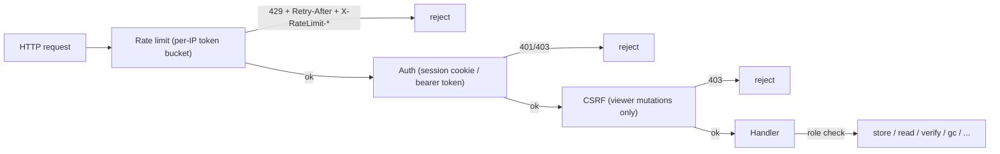

# API Design — go-cask

> This document defines the **common API design conventions** for every HTTP
> endpoint in go-cask. The per-API specs define the concrete routes:
> `.github/instructions/cas-api.instructions.md` (the JSON data API) and
> `.github/instructions/viewer-api.instructions.md` (the viewer's hypermedia
> surface). **This document defines HOW new endpoints are designed** so all
> surfaces stay consistent.
>
> Related: `.github/instructions/viewer-security.instructions.md`
> (authn/authz), `.github/instructions/performance.instructions.md` (rate
> limiting), `.github/instructions/library-design.instructions.md` (sentinel
> errors), `.github/instructions/coding-guidelines.instructions.md` (Go
> implementation style).

---

## 1. Purpose & Scope

- Applies to **all HTTP surfaces**: the viewer (`/viewer/*`, `text/html`) and
  the CAS API (`/api/cas/v1/*`, JSON/octet-stream).
- Governs: URL naming, HTTP methods, status codes, error shapes,
  authentication/authorization, rate limiting, validation, pagination,
  streaming, versioning, and OpenAPI documentation.
- A new endpoint MUST follow these conventions unless a per-API spec
  explicitly overrides them.

---

## 2. Two Surfaces, One Style

| Surface   | Prefix         | Content types                       | Auth            | Consumers          |
| --------- | -------------- | ----------------------------------- | --------------- | ------------------ |
| Viewer    | `/viewer/`     | `text/html` (pages + fragments)     | session cookie  | browser only       |
| CAS API   | `/api/cas/v1/` | `application/json`, `application/octet-stream` | bearer token | viewer backend, CLI, SDK, services |

Rules:

- A route's prefix decides its contract; never mix prefixes, never mix
  content types across surfaces.
- The same design grammar (naming, errors, status codes, middleware) applies
  to both — only the content type and auth mechanism differ.

---

## 3. Naming & URL Conventions

- **Plural resource nouns** for collections: `/objects`, `/stats`.
- **Sub-resources by nesting**: `/objects/{hash}/meta`, `/objects/{hash}/raw`,
  `/objects/{hash}/verify` — one level of nesting for metadata/actions on a
  resource.
- **Actions are POST sub-resources** (`/verify`, `/gc`) — never GET with side
  effects, never bare verbs as top-level paths.
- **Path segments**: lowercase; hyphen-separated when multi-word.
- **Query parameters**: short, lowercase (`q`, `algo`, `limit`, `offset`);
  documented defaults and bounds.
- **Hash parameters** are always named `{hash}`, formatted
  `algo:hexdigest`, and validated with `ParseHash`
  (pattern `^[a-z0-9]+:[0-9a-f]+$`).

---

## 4. HTTP Methods & Semantics

| Method | Use                                            | Request body | Success  |
| ------ | ---------------------------------------------- | ------------ | -------- |
| GET    | read; MUST be side-effect free                 | —            | 200      |
| POST   | create (server-computed identity) or action    | yes          | 201 (create) / 200 (action result) |
| DELETE | delete; idempotent (missing object = no-op)    | —            | 204      |

- `POST` is used for creates when the identity is **server-computed** (the
  CAS API computes the hash) — there is no `PUT` in v1 (objects are
  immutable; a changed object is a new hash).
- Actions with side effects (`verify`, `gc`, login) are `POST`; `verify` is
  read-only in effect but is a POST because it runs a check and is
  role-gated.
- `PUT`/`PATCH` are reserved for a future mutable resource; if one appears it
  must follow full-replace semantics.

---

## 5. Status Codes

| Status | Viewer                                     | CAS API                                |
| ------ | ------------------------------------------ | -------------------------------------- |
| 200    | HTML page or fragment                      | JSON body / octet-stream bytes         |
| 201    | —                                          | object created (`POST /objects`)       |
| 204    | —                                          | deleted / verified OK                  |
| 303    | login redirect                             | —                                      |
| 400    | minimal error page (malformed input)       | `{"error":"..."}`                      |
| 401    | **empty body**                             | `{"error":"unauthorized"}`             |
| 403    | **empty body**                             | `{"error":"forbidden"}`                |
| 404    | minimal error page (missing object)        | `{"error":"not found"}`                |
| 429    | minimal error page (rate limited)          | `{"error":"rate limited"}` + `Retry-After` |

Consistency rules:

- 401/403 **never disclose** whether the target object exists (both surfaces).
- Mutations that succeed without a useful body return 204; creates return 201
  with the created resource (the hash).
- 429 is produced by the shared rate-limit middleware before any handler
  runs.

---

## 6. Error Contract

- **CAS API**: every error is JSON `{"error": "<concise message>"}`. No stack
  traces, no internal paths, no secrets, no object bytes.
- **Viewer**: errors are minimal HTML pages/fragments; 401/403 are empty
  bodies per the security spec.
- Messages are actionable ("unknown hash algorithm: md4") but never disclose
  internals or existence in the 401/403 cases.
- The library's sentinel errors (`ErrNotFound`, `ErrHashMismatch`,
  `ErrInvalidHash`, `ErrUnknownAlgorithm`) map to HTTP statuses: 404, 409/500
  on verify mismatch, 400, 400 — the mapping is defined per surface.

---

## 7. Authentication & Authorization

- **Viewer**: session cookie (`HttpOnly`, `SameSite=Strict`, `Secure` over
  HTTPS); the startup token is accepted **only** by `POST /viewer/login`;
  every other endpoint requires a valid session.
- **CAS API**: `Authorization: Bearer <token>` with configured per-role
  tokens.
- **Roles** (both surfaces): `viewer` (reads) → `operator` (+ store, verify) →
  `admin` (+ delete, GC, maintenance).
- **CSRF**: every viewer mutation is a POST with a CSRF token validated
  server-side.
- **Audit**: every mutation is audit-logged; tokens/secrets are never logged.
- **Rate limiting**: the shared IP-based middleware (below) applies to both
  surfaces before authentication; the viewer login endpoint keeps its own
  stricter throttle (5 failures/IP/min with backoff).

---

## 8. Middleware Pipeline (shared)

Ordering is fixed: rate limit → auth → CSRF → handler. The same middleware
stack wraps both surfaces; only the auth mechanism and CSRF applicability
differ. Configuration: `rate_limit` block (2 req/s per IP, burst 20, loopback
exempt, `trusted_proxies` only for `X-Forwarded-For`).

---

## 9. Validation

- Every `{hash}` parameter: `ParseHash` first → 400 on malformed.
- Query parameters: reject out-of-range values with 400 (do not silently
  clamp); `limit` bounded (e.g. 1–1000), `offset` ≥ 0.
- Request bodies: strict decoding; unknown fields are rejected for CAS API
  JSON bodies (fail loudly, `json.Decoder.DisallowUnknownFields` where
  sensible).
- Never trust client input: header, query, and body are all validated
  (viewer-security defensive programming).

---

## 10. Pagination & Filtering

- **Cursor-free, offset-based** pagination for lists:
  `?limit=<1..max>&offset=<0..>` with documented defaults.
- Response envelope: `{"total": <int>, "<items>": [...]}` where `<items>` is
  the plural resource name (`objects`). `total` is the unfiltered count of
  the filtered set (document per endpoint).
- Filters are query parameters (`algo`); filters never change the item shape,
  only the set.

---

## 11. Streaming & Binary Payloads

- Binary bodies use `application/octet-stream` — **never base64 inside
  JSON**.
- Metadata for a binary response travels in `X-CAS-*` headers
  (`X-CAS-Algorithm`, `X-CAS-Size`, `X-CAS-Type`).
- Large payloads stream (`io.Reader`/`io.ReadCloser`); handlers never buffer
  whole objects (performance spec P-05).

---

## 12. Versioning

- The data API carries its major version in the prefix: `/api/cas/v1`.
  Breaking changes (removed/renamed fields, changed semantics) require `v2`;
  additive changes are allowed within `v1`.
- The viewer surface is unversioned — it is an application surface whose htmx
  fragments evolve with the UI.
- Versioning is expressed in the URL, never in headers, for both surfaces.

---

## 13. Documentation & OpenAPI

- Every endpoint MUST be documented in its surface's OpenAPI document,
  served at `GET /viewer/openapi.yaml` and `GET /api/cas/v1/openapi.yaml`.
- The documents MUST match the implemented routes exactly; a CI check
  regenerates/compares them on route changes.
- The in-browser Swagger UI explorer (`GET /swagger/`) is the single
  documented no-JS deviation: vendored, pinned, disabled by default,
  explicitly enabled, authenticated.

---

## 14. Designing a New Endpoint (procedure)

1. **Pick the surface** — browser-facing (HTML/htmx) → `/viewer/`;
   programmatic (JSON) → `/api/cas/v1/`. Never both.
2. **Model the resource** — plural noun path, sub-resources by nesting,
   action as POST sub-resource.
3. **Define the contract** — method, request body, response shape/content
   type, status codes (200/201/204 + 400/401/403/404/429 as applicable).
4. **Define the errors** — JSON `{"error": ...}` (CAS) or minimal HTML
   (viewer); 401/403 never disclose existence.
5. **Apply the middleware** — rate limit, auth, CSRF (viewer mutations),
   role check; add audit logging for mutations.
6. **Validate** — `ParseHash` for hashes, strict query/body validation.
7. **Document** — add the path to the surface's OpenAPI document.
8. **Test** — `httptest` for status/roles/429/streaming; fuzz where the
   input is complex.

---

## 15. Checklist

- [ ] Route lives under the correct prefix; content type matches the surface
- [ ] Naming follows §3 (plural nouns, nesting, `{hash}` with `ParseHash`)
- [ ] Method semantics follow §4 (GET side-effect free, POST for
      create/action, DELETE idempotent)
- [ ] Status codes + error shapes match §5/§6
- [ ] Auth, CSRF, role check, rate limiting, and audit applied per §7/§8
- [ ] Validation per §9; pagination envelope per §10 where listing
- [ ] Binary payloads stream as octet-stream with `X-CAS-*` headers (§11)
- [ ] Versioned correctly (§12); documented in OpenAPI (§13)
- [ ] `httptest` coverage added; docs regenerated
