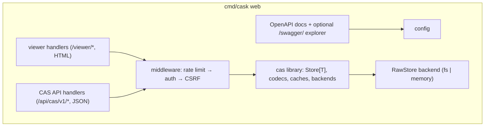

# Backend Architecture — go-cask

> This file governs the **server-side architecture**: how the `cas` library is
> composed into a runnable system (binary layout, HTTP layer, middleware,
> config, startup/shutdown, observability, deployment). The library *internals*
> are defined by `cas-core.instructions.md`; this file is about the
> process around them.
>
> Related: `.github/instructions/api-design.instructions.md` (HTTP
> conventions), `.github/instructions/cas-api.instructions.md` and
> `.github/instructions/viewer-api.instructions.md` (the two surfaces),
> `.github/instructions/viewer-security.instructions.md` (authn/authz),
> `.github/instructions/operations.instructions.md` (running it),
> `.github/instructions/performance.instructions.md` (rate limiting,
> streaming), `.github/instructions/coding-guidelines.instructions.md`
> (implementation style).

---

## 1. Purpose & Scope

- The backend is everything that runs server-side: the binaries, the HTTP
  layer, the wiring of `cas`/`gitlike` into handlers, configuration, and
  lifecycle.
- Handlers are **thin**: all logic lives in the library (cas-core);
  the backend composes it and adds HTTP concerns (auth, rate limiting,
  validation, streaming, OpenAPI).
- One codebase serves all shapes: the server via `cask web`, the CLI, or
  library embedding — never separate forks.

---

## 2. Process & Binary Layout

```text
go-cask/
├── cas/          # public core library (package cas) — the stable surface
├── client/       # public CAS API client SDK (package client)
├── internal/     # implementation detail — Go forbids imports from outside
│   │             # this module
│   ├── api/      #   CAS API handlers (/api/cas/v1/*)
│   ├── web/      #   the viewer: handlers + templates (/viewer/*)
│   ├── auth/     #   authn/authz: tokens, sessions, roles, CSRF
│   ├── storage/  #   backend wiring (config → RawStore)
│   └── index/    #   object listing/meta/stats helpers
├── cmd/cask/     # thin main: CLI store ops + `cask web` (the server)
└── examples/     # runnable examples
```

- `cmd/cask` is the only binary, and it is a **thin main**: all server logic
  lives in `internal/` (api, web, auth, storage, index); `cask web` wires the
  internal packages together (cli §2). `internal/` packages MUST NOT be
  imported from outside this module — Go enforces this at compile time.
- `cas/` and `client/` are the **public surface**: `cas` is the embedded
  library; `client` is the remote CAS API SDK. Everything else is private.
- The non-`web` subcommands of `cmd/cask` are the thin CLI over the same
  library (and over the client in remote mode) — the library is the single
  source of behavior.

---

## 3. Server Composition



Rules:

- One `net/http` server, one mux (Go 1.22+ pattern routing); the two surface
  prefixes (`/viewer`, `/api/cas/v1`) are registered on it and MUST NOT be
  mixed (api-design §2).
- Middleware order is fixed: rate limit → auth → CSRF (viewer mutations) →
  handler (api-design §8); the same stack wraps both surfaces.
- The backend NEVER talks to storage directly from handlers — it goes through
  the `RawStore`/`Store[T]` layer, so backend selection is a configuration
  decision, not a code change.
- The handler sets live in `internal/`: `internal/api` (CAS API),
  `internal/web` (the viewer); middleware and config in `internal/auth` /
  `internal/storage`. `cmd/cask web` only wires them (§2).

---

## 4. HTTP Layer

- Content types per surface: `text/html` for the viewer, JSON/octet-stream
  for the CAS API (api-design §2).
- Binary payloads stream (`io.Reader`/`io.ReadCloser`) with `X-CAS-*`
  metadata headers; never buffered (performance P-05, api-design §11).
- Errors per api-design §5/§6: JSON `{"error": …}` on the CAS API, minimal
  HTML / empty bodies on the viewer (401/403 never disclose existence).
- OpenAPI documents served at `/viewer/openapi.yaml` and
  `/api/cas/v1/openapi.yaml`; the in-browser explorer (`/swagger/`) is the
  single documented no-JS deviation, disabled by default (api-design §13).

---

## 5. Storage Backend Selection

- Config selects the backend: filesystem (`FSRawStore`, fan-out layout) or
  memory (`MemoryRawStore`, tests/ephemeral) — see cas-core §4.4–4.5.
- **The in-process/remote seam**: handlers depend on the `RawStore` (or, in
  remote mode, on the CAS API client interface) — never on a concrete
  backend. Two implementations:
  1. **in-process** — handlers call the library directly;
  2. **remote** — handlers call the public CAS API client SDK
     (`client/`), which speaks the documented HTTP contract.
- The seam keeps the viewer backend identical whether the store is local or a
  remote CAS API server (viewer-api §1).

---

## 6. Configuration

```yaml
storage:
  type: fs            # fs | memory
  path: ./objects
  fan_out: 2          # Git-like fan-out (cas-core §4.4)
  fan_levels: 1
viewer:
  enabled: false      # secure by default (viewer-security)
  bind: 127.0.0.1:8080
rate_limit:
  enabled: true
  requests_per_second: 2
  burst: 20
  exempt_loopback: true
  trusted_proxies: [] # X-Forwarded-For only via trusted proxies
swagger_ui:
  enabled: false      # optional, explicitly enabled, authenticated
auth:
  tokens: {}          # per-role tokens; admin token generated at startup
```

Lifecycle:

- **Startup**: validate config → construct the store (create directories,
  validate fan-out bounds) → generate the admin token (printed once, never
  stored in plaintext config) → start serving.
- **Shutdown**: graceful — `signal.NotifyContext`, stop accepting requests,
  drain in-flight, close the store; no mid-write corruption (atomic rename
  contract).

---

## 7. Observability & Audit

- `log/slog` structured logging: mutations (store/delete/verify/gc), 429s
  with caller IP, slow operations, GC runs (operations §3).
- Audit logging per viewer-security: every administrative action logged;
  tokens/secrets never logged.
- Metrics counters (objects/bytes/cache/429) exposed read-only via the CAS
  API `/stats` and structured logs — no external metrics dependency unless
  required (coding-guidelines §3).

---

## 8. Deployment Shapes

1. **Single binary** — library + CAS API + viewer in `cmd/cask`, started with
   `cask web` (default shape).
2. **Split** — a viewer-fronting `cask web` consuming a remote CAS API
   server over HTTP (the remote client seam of §5); both sides speak the same
   documented contract and may both be `cask web` instances with different
   config.
3. **CLI / embedding** — the non-`web` `cmd/cask` subcommands and library
   consumers.

All shapes share the config contract and the middleware/security model; the
HTTP API versioning (`/api/cas/v1`) is the compatibility boundary for remote
deployments (api-design §12).

---

## 9. Security

- The backend enforces, in order: IP-based rate limiting, authentication
  (session cookie / bearer token), CSRF (viewer mutations), role checks
  (viewer/operator/admin), and strict input validation (`ParseHash`, bounded
  query params, strict JSON decoding) — viewer-security + api-design §7–§9.
- 401/403 never disclose object existence; error messages never leak
  internals (api-design §6).

---

## 10. Checklist

- [ ] One mux; `/viewer` and `/api/cas/v1` registered but never mixed
- [ ] Middleware order fixed: rate limit → auth → CSRF → handler
- [ ] Handlers thin; all logic in the library; backend selection via config
- [ ] Binary payloads stream; `X-CAS-*` headers; no full buffering
- [ ] Errors per api-design §5/§6; 401/403 empty (viewer) / JSON (CAS API)
- [ ] Config shape per §6; startup/shutdown lifecycle implemented
- [ ] slog + audit logging; metrics via `/stats` and logs
- [ ] In-process and remote (client SDK) seams supported behind one interface
- [ ] OpenAPI docs served and matching routes; `/swagger/` disabled by default
