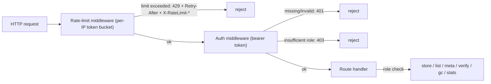

# CAS API — go-cask

> This document is the **canonical Swagger/OpenAPI contract and requirements**
> for the CAS HTTP API — the programmatic, JSON data API of the
> content-addressed object store.
>
> - Prefix: **`/api/cas/v1/`** (versioned; breaking changes bump to `v2`)
> - Content types: `application/json` and `application/octet-stream`
> - Consumers: the **viewer backend** (in-process or over HTTP) **and other
>   clients** — CLI, SDKs, services, integrations. The viewer is one client
>   among many.
> - The CAS API is a **separate namespace** from the viewer's hypermedia
>   surface (`/viewer/`, HTML) — the two MUST NOT be mixed
>   (see `.github/instructions/viewer-api.instructions.md`).
>
> Related specs: `.github/instructions/viewer-security.instructions.md`
> (authentication/authorization model), `.github/instructions/
> cas-core.instructions.md` (the object model this API exposes:
> `Hash`, `RawStore`, `Object[T]`, `References()`, `Stats`, `Verify`, `GC`).

---

## 1. Purpose & Scope

The CAS API exposes the object store to programs:

- **store** raw bytes, addressed by the **hash of their content**
  (`algo:digest`, e.g. `sha256:a1b2...`) — immutable and deduplicated
- **retrieve** objects by hash (raw bytes or metadata)
- **list** objects (paginated, algorithm-filtered)
- **verify** integrity, get **statistics**, run **garbage collection**
- serve its own **OpenAPI document** for tooling (Swagger UI, codegen)

Out of scope: HTML/htmx (that is the viewer surface), authentication UI
(login lives on the viewer), object *typing* (objects are raw bytes; typed
serialization is a client-side codec concern, with type metadata provided
best-effort).

---

## 2. API Prefix & Routing Rules

- All routes live under **`/api/cas/v1/`**. No CAS API route may be registered
  under `/viewer/`, and no viewer route under `/api/cas/` (never mix
  surfaces).
- **Versioning**: the prefix carries the major version. Additive changes are
  allowed within `v1`; breaking changes (removed/renamed fields, changed
  semantics) require `v2`.
- **Content types**: responses are `application/json`, except
  `GET /objects/{hash}` which streams `application/octet-stream`. The CAS API
  never returns HTML.
- **Hash validation**: every `{hash}` parameter is validated with `ParseHash`
  (pattern `^[a-z0-9]+:[0-9a-f]+$`) before any storage access; malformed →
  400.
- **Self-documenting**: `GET /api/cas/v1/openapi.yaml` serves this OpenAPI
  document; it MUST match the implemented routes exactly. The served
  document lives in a **separate embedded file** (`openapi.yaml` via
  `//go:embed`, per api-design §13) — never an inline Go string.

---

## 3. Authentication & Authorization

Per `.github/instructions/viewer-security.instructions.md` (roles: viewer /
operator / admin; per-role tokens):

| Role     | Allowed CAS API operations                                          |
| -------- | ------------------------------------------------------------------- |
| viewer   | `GET /objects`, `GET /objects/{hash}`, `GET /objects/{hash}/meta`, `GET /stats`, `GET /openapi.yaml` |
| operator | viewer + `POST /objects` (store), `POST /objects/{hash}/verify`     |
| admin    | operator + `DELETE /objects/{hash}`, `POST /gc`                     |

Rules:

- Authentication: `Authorization: Bearer <token>` with a configured per-role
  token. The startup admin token is accepted **only** by `POST /viewer/login`
  and never by the CAS API.
- Missing/invalid token → **401** `{"error":"unauthorized"}`; insufficient
  role → **403** `{"error":"forbidden"}`; both MUST NOT disclose whether the
  target object exists.
- Every mutation (`POST`, `DELETE`) is audit-logged; tokens and secrets are
  never logged.
- Requests are rate-limited per caller IP by the IP-based middleware (below);
  the viewer's login throttle (max 5 failures/IP/min with backoff, per
  `viewer-security.instructions.md`) is a separate, stricter limit on the
  viewer surface.

### Rate limiting (IP-based middleware)

All `/api/cas/v1/*` requests pass through an **IP-based rate-limiting
middleware** before any handler runs:

- **Algorithm & defaults.** Token bucket per caller IP, implemented with the
  standard library only (`sync.Mutex`/`atomic` + `time` — no external
  rate-limit package, per coding-guidelines §3). Defaults: sustained
  **2 requests/second per IP** with a **burst of 20**; both configurable:

  ```yaml
  rate_limit:
    enabled: true
    requests_per_second: 2     # sustained refill rate per IP
    burst: 20                  # token-bucket capacity per IP
    exempt_loopback: true      # 127.0.0.1 / ::1 exempt by default
    trusted_proxies: []        # only these peers may supply X-Forwarded-For
  ```

- **Client IP determination.** The caller IP is the host part of
  `r.RemoteAddr` by default. `X-Forwarded-For` / `X-Real-IP` are honored
  **only** when the direct peer is listed in `trusted_proxies` — never trust
  client-supplied headers by default, or the limit is trivially bypassed by
  spoofing.
- **Ordering.** The middleware wraps the whole CAS API mux and runs **before
  authentication**: a rate-limited request returns 429 regardless of token
  validity (a cheap rejection protects auth and storage paths alike).
- **Response.** `429 Too Many Requests` with `Retry-After: <seconds>`,
  `X-RateLimit-Limit`, `X-RateLimit-Remaining`, `X-RateLimit-Reset` headers,
  and JSON body `{"error":"rate limited"}` (error contract R-10).
- **Memory hygiene.** Per-IP state is evicted when idle beyond a window (lazy
  expiry + periodic sweep) and a max-entries guard bounds growth from many
  distinct IPs.
- **Scope.** Applies to every request, authenticated or not; a valid token
  does not bypass the limit. Loopback is exempt by default (local dev and
  operator tooling).

**Request pipeline (Mermaid):**



---

## 4. Requirements

| ID    | Requirement                                                                 |
| ----- | --------------------------------------------------------------------------- |
| R-01  | **Content addressing.** The server computes the hash from the request body   |
|       | using the algorithm from `?algo` (registered algorithms only; default        |
|       | `sha256`). Unknown algorithm or empty body → 400.                            |
| R-02  | **Deduplication.** Identical bytes ⇒ identical hash ⇒ stored once.           |
|       | `POST /objects` returns 201 with `{"hash": ..., "deduplicated": bool}`;      |
|       | `deduplicated: true` when the object already existed (idempotent).           |
| R-03  | **Immutability.** Stored bytes are never modified in place. Same hash ⇒      |
|       | same bytes; a repeat store of identical bytes is a no-op.                    |
| R-04  | **Streaming.** Uploads and downloads stream (`io.Reader` / `io.ReadCloser`); |
|       | the server MUST NOT buffer entire large objects in memory (see the          |
|       | architecture doc's streaming-I/O principle).                                 |
| R-05  | **List & pagination.** `GET /objects` supports `algo` filter, `limit`        |
|       | (1–1000, default 100), `offset` (≥ 0). Response:                           |
|       | `{"total": int, "objects": [{"hash","algorithm","size"}]}`.                  |
| R-06  | **Metadata.** `GET /objects/{hash}/meta` returns `size` always; `type`       |
|       | best-effort (from the self-describing envelope, cas-core §8 decision 1);    |
|       | `references` (array of hashes) when the object decodes.           |
| R-07  | **Integrity.** `POST /objects/{hash}/verify` recomputes the hash and returns |
|       | `{"hash","valid","recomputed"}`; operator role.                              |
| R-08  | **GC.** `POST /gc` performs mark-and-sweep: body `{"reachable":[hash,...]}`; |
|       | every object not in the reachable set is deleted; returns `{"deleted": n}`;  |
|       | admin role; audit-logged.                                                    |
| R-09  | **Statistics.** `GET /stats` returns `{"object_count","total_size",          |
|       | "algorithm_counts": {algo: count}}`.                                         |
| R-10  | **Error contract.** All errors are JSON `{"error":"message"}` with proper    |
|       | status codes (400/401/403/404/429); 401/403 never disclose existence.        |
| R-11  | **Authentication.** Bearer token per role (§3); tokens never logged;         |
|       | consistent with the viewer-security principal model.                         |
| R-12  | **Concurrency.** The API is safe under concurrent access; the backend        |
|       | honors the architecture's locking model (RWMutex / atomic writes).           |
| R-13  | **Versioning & self-doc.** `/api/cas/v1` prefix; breaking changes → `v2`;    |
|       | `GET /openapi.yaml` matches the implementation.                              |
| R-14  | **Rate limiting.** Every `/api/cas/v1/*` request is rate-limited per caller |
|       | IP (token bucket; defaults 2 req/s sustained, burst 20; configurable).      |
|       | Exceeded → 429 `{"error":"rate limited"}` + `Retry-After` + `X-RateLimit-*` |
|       | headers. Client IP from `RemoteAddr`, or `X-Forwarded-For` only via a       |
|       | trusted proxy; loopback exempt by default; per-IP state is evicted.        |

---

## 5. CAS API — OpenAPI 3.0 (Swagger)

> Served at `GET /api/cas/v1/openapi.yaml`. All paths are relative to the
> `/api/cas/v1` prefix. This is the canonical document — the viewer API doc
> summarizes, this file defines.

```yaml
openapi: 3.0.3
info:
  title: CASK CAS API
  description: >
    JSON data API of the content-addressed object store. Objects are raw bytes
    addressed by the hash of their content (algo:digest), immutable and
    deduplicated. Consumed by the viewer backend and by other programmatic
    clients (CLI, SDK, services). All endpoints are rate-limited per caller
    IP and MAY return 429 Too Many Requests (see R-14).
  version: 1.0.0
servers:
  - url: /api/cas/v1
    description: CAS object-store data API
tags:
  - name: Objects
  - name: Stats
  - name: Maintenance
paths:
  /objects:
    post:
      tags: [Objects]
      summary: Store an object
      description: >
        Body is the raw bytes to store (application/octet-stream) or a JSON
        envelope stored as-is. The server computes the hash with ?algo
        (default sha256). Same content => same hash => deduplicated.
      parameters:
        - name: algo
          in: query
          schema: { type: string, default: sha256 }
          description: Registered hash algorithm
      requestBody:
        required: true
        content:
          application/octet-stream:
            schema: { type: string, format: binary }
          application/json:
            schema: { type: object }
      responses:
        '201':
          description: Object stored
          content:
            application/json:
              schema:
                type: object
                properties:
                  hash:
                    type: string
                    example: sha256:9f86d081884c7d659a2feaa0c55ad015a3bf4f1b2b0b822cd15d6c15b0f00a08
                  deduplicated:
                    type: boolean
                    example: false
        '400':
          description: Unknown algorithm or empty body
          content:
            application/json:
              schema: { $ref: '#/components/schemas/Error' }
        '429':
          $ref: '#/components/responses/RateLimited'
    get:
      tags: [Objects]
      summary: List objects
      parameters:
        - name: algo
          in: query
          schema: { type: string }
          description: Filter by hash algorithm
        - name: limit
          in: query
          schema: { type: integer, default: 100, minimum: 1, maximum: 1000 }
        - name: offset
          in: query
          schema: { type: integer, default: 0, minimum: 0 }
      responses:
        '200':
          description: Object list
          content:
            application/json:
              schema:
                type: object
                properties:
                  total:
                    type: integer
                    example: 1234
                  objects:
                    type: array
                    items:
                      type: object
                      properties:
                        hash: { type: string, example: sha256:9f86d081... }
                        algorithm: { type: string, example: sha256 }
                        size: { type: integer, example: 11 }
  /objects/{hash}:
    parameters:
      - name: hash
        in: path
        required: true
        schema:
          type: string
          pattern: '^[a-z0-9]+:[0-9a-f]+$'
          example: sha256:9f86d081884c7d659a2feaa0c55ad015a3bf4f1b2b0b822cd15d6c15b0f00a08
    get:
      tags: [Objects]
      summary: Retrieve object bytes
      description: >
        Streams the raw stored bytes. Metadata in response headers:
        X-CAS-Algorithm, X-CAS-Size, X-CAS-Type (type is best effort).
      responses:
        '200':
          description: Stored bytes
          headers:
            X-CAS-Algorithm:
              schema: { type: string, example: sha256 }
            X-CAS-Size:
              schema: { type: integer, example: 11 }
            X-CAS-Type:
              schema: { type: string, example: blob }
          content:
            application/octet-stream:
              schema: { type: string, format: binary }
        '400':
          description: Malformed hash
          content:
            application/json:
              schema: { $ref: '#/components/schemas/Error' }
        '404':
          description: Object not found
          content:
            application/json:
              schema: { $ref: '#/components/schemas/Error' }
        '429':
          $ref: '#/components/responses/RateLimited'
    delete:
      tags: [Objects]
      summary: Delete object
      description: 'Role: admin. Deleting a missing object is a no-op.'
      responses:
        '204':
          description: Deleted
        '400':
          description: Malformed hash
          content:
            application/json:
              schema: { $ref: '#/components/schemas/Error' }
        '403':
          description: Forbidden (insufficient role)
          content:
            application/json:
              schema: { $ref: '#/components/schemas/Error' }
  /objects/{hash}/meta:
    parameters:
      - name: hash
        in: path
        required: true
        schema:
          type: string
          pattern: '^[a-z0-9]+:[0-9a-f]+$'
    get:
      tags: [Objects]
      summary: Object metadata and references
      description: >
        size, type (best effort via the self-describing envelope, cas-core
        §8 decision 1), and the
        object's References() when decodable.
      responses:
        '200':
          description: Metadata
          content:
            application/json:
              schema:
                type: object
                properties:
                  hash: { type: string }
                  algorithm: { type: string }
                  size: { type: integer }
                  type: { type: string }
                  references:
                    type: array
                    items: { type: string }
        '400':
          description: Malformed hash
          content:
            application/json:
              schema: { $ref: '#/components/schemas/Error' }
        '404':
          description: Object not found
          content:
            application/json:
              schema: { $ref: '#/components/schemas/Error' }
  /objects/{hash}/verify:
    parameters:
      - name: hash
        in: path
        required: true
        schema:
          type: string
          pattern: '^[a-z0-9]+:[0-9a-f]+$'
    post:
      tags: [Maintenance]
      summary: Verify object integrity
      description: 'Role: operator. Recomputed hash must equal the stored address.'
      responses:
        '200':
          description: Verification result
          content:
            application/json:
              schema:
                type: object
                properties:
                  hash: { type: string }
                  valid: { type: boolean, example: true }
                  recomputed: { type: string }
        '400':
          description: Malformed hash
          content:
            application/json:
              schema: { $ref: '#/components/schemas/Error' }
        '404':
          description: Object not found
          content:
            application/json:
              schema: { $ref: '#/components/schemas/Error' }
  /stats:
    get:
      tags: [Stats]
      summary: Storage statistics
      responses:
        '200':
          description: Statistics
          content:
            application/json:
              schema:
                type: object
                properties:
                  object_count:
                    type: integer
                    example: 1234
                  total_size:
                    type: integer
                    example: 47390000
                  algorithm_counts:
                    type: object
                    additionalProperties: { type: integer }
                    example: { sha256: 1198, sha1: 36 }
  /gc:
    post:
      tags: [Maintenance]
      summary: Run mark-and-sweep garbage collection
      description: >
        Role: admin. Body lists the reachable hashes; everything else is
        deleted. Audit-logged.
      requestBody:
        required: true
        content:
          application/json:
            schema:
              type: object
              properties:
                reachable:
                  type: array
                  items: { type: string }
      responses:
        '200':
          description: GC result
          content:
            application/json:
              schema:
                type: object
                properties:
                  deleted: { type: integer, example: 42 }
        '400':
          description: Invalid reachable set
          content:
            application/json:
              schema: { $ref: '#/components/schemas/Error' }
        '403':
          description: Forbidden (insufficient role)
          content:
            application/json:
              schema: { $ref: '#/components/schemas/Error' }
  /openapi.yaml:
    get:
      tags: [Stats]
      summary: This OpenAPI document
      responses:
        '200':
          description: CAS API OpenAPI 3.0 document (text/yaml)
components:
  securitySchemes:
    bearerAuth:
      type: http
      scheme: bearer
      description: Per-role API token (viewer/operator/admin)
  responses:
    RateLimited:
      description: Rate limited — too many requests from this IP (R-14)
      headers:
        Retry-After:
          schema: { type: integer }
        X-RateLimit-Limit:
          schema: { type: integer }
        X-RateLimit-Remaining:
          schema: { type: integer }
        X-RateLimit-Reset:
          schema: { type: integer }
      content:
        application/json:
          schema: { $ref: '#/components/schemas/Error' }
  schemas:
    Error:
      type: object
      properties:
        error: { type: string, example: not found }
security:
  - bearerAuth: []
```

---

## 6. Swagger UI Serving & In-Browser API Explorer

- The OpenAPI document is served by the server itself at
  `GET /api/cas/v1/openapi.yaml` — the YAML is the contract and can be opened
  in any Swagger UI instance or the [Swagger Editor](https://editor.swagger.io/).
- **In-browser API explorer (required).** The Swagger UI JavaScript bundle
  SHALL be embedded in the viewer runtime (vendored, one pinned version,
  compiled into the binary via `embed.FS`).
  - Served at `GET /swagger/`; `?url=/api/cas/v1/openapi.yaml` selects the CAS
    API document, `?url=/viewer/openapi.yaml` the viewer document.
  - The explorer is **disabled by default** and SHALL only be reachable when
    explicitly enabled (config, e.g. `swagger_ui: {enabled: true}`).
  - It is a **separate, explicitly enabled endpoint** — never part of the
    default viewer surface — and SHALL require an authenticated session like
    the viewer (never publicly exposed).
- **Documented deviation.** Embedding the Swagger UI JS bundle deviates from
  the no-JS rule (`.github/instructions/coding-guidelines.instructions.md`
  §4). This is the single documented exception: a vendored, pinned developer
  tool that ships only when explicitly enabled, never in the default viewer.

---

## 7. Compliance Checklist

- [ ] All routes live under `/api/cas/v1/`; no CAS route under `/viewer/` and
      no viewer route under `/api/cas/`
- [ ] Responses are JSON or `application/octet-stream` only; never HTML
- [ ] Bearer-token auth; per-role matrix enforced (viewer/operator/admin);
      401/403 JSON errors that never disclose existence
- [ ] Every `{hash}` validated with `ParseHash` (pattern
      `^[a-z0-9]+:[0-9a-f]+$`) → 400 on malformed
- [ ] R-01…R-14 implemented: content addressing, dedup, immutability,
      streaming, pagination, metadata, verify, GC, stats, error contract,
      auth, concurrency, versioning/self-doc, rate limiting
- [ ] IP-based rate-limiting middleware enforced on all `/api/cas/v1/*`
      routes (429 + `Retry-After` + `X-RateLimit-*` headers; std-lib token
      bucket; trusted-proxy `X-Forwarded-For` only; loopback exempt by
      default; per-IP state evicted)
- [ ] Every mutation (POST/DELETE) is audit-logged; no secrets in logs
- [ ] `GET /api/cas/v1/openapi.yaml` matches the implemented routes exactly;
      regenerated when routes change
- [ ] The viewer backend and other clients (CLI, SDK) consume this same
      contract
