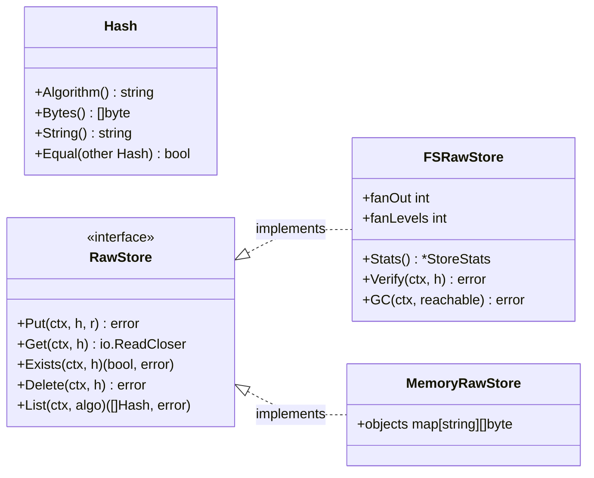
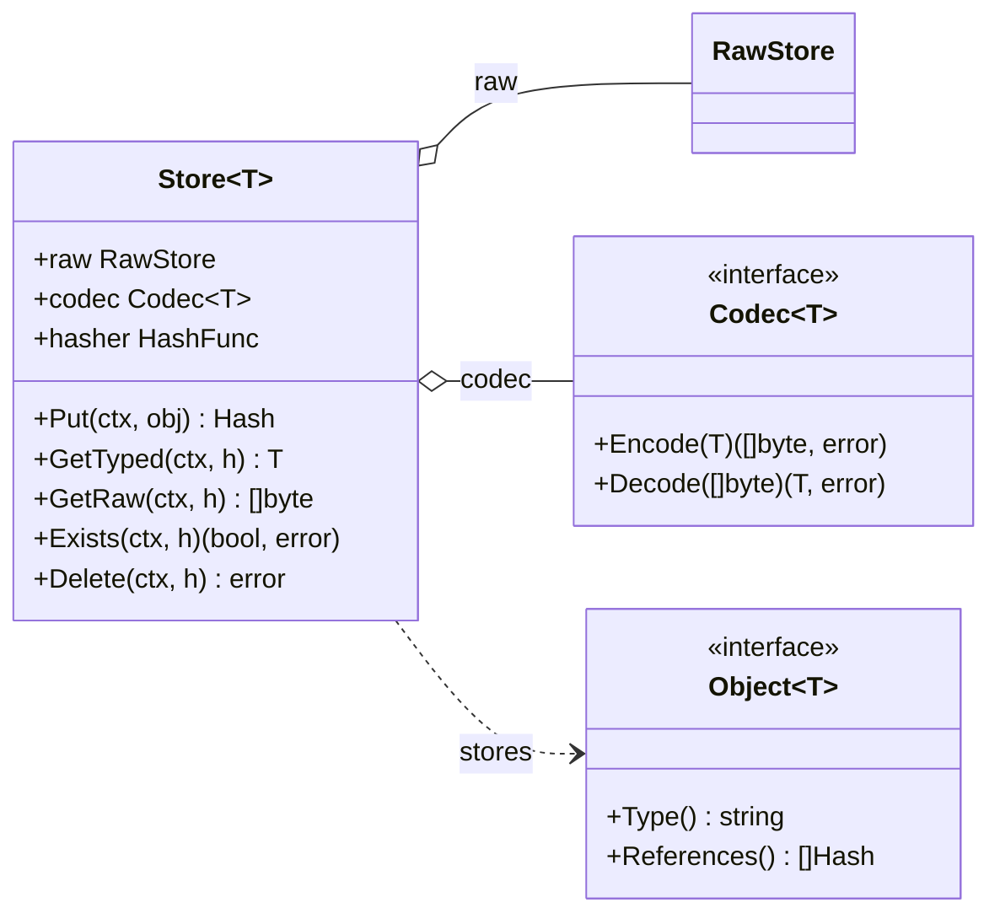
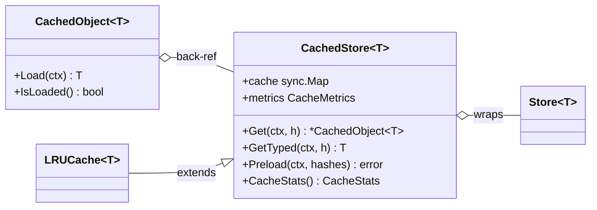
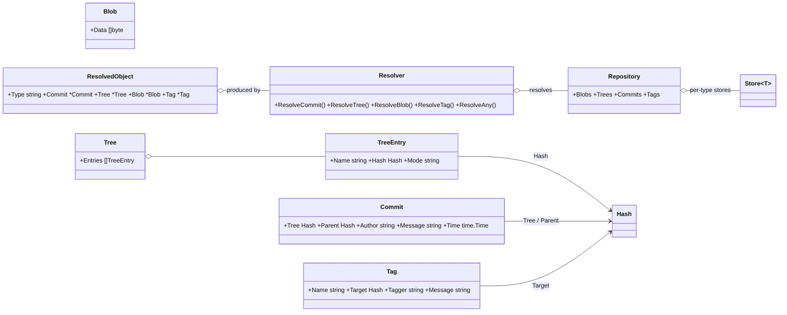
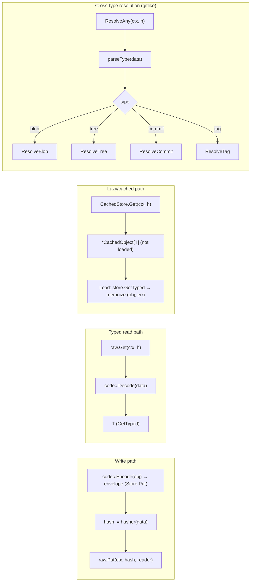

# CAS Core — go-cask

> This is the authoritative specification of the **`cas` core library** — the
> foundation every adjacent extension, client, example, and the HTTP/API layer
> builds on. If you are extending the core (new backend, object type, codec,
> hash algorithm) or consuming it (client, service, app), read this document.
>
> **Origin:** extracted from the DeepSeek design conversation at
> <https://chat.deepseek.com/share/p7jkdjl1gbyhjipf6r> (final converged
> state). This document is the canonical core spec; `.github/copilot-
> instructions.md` is the aggregator that points here.
>
> Related: `.github/instructions/library-design.instructions.md` (lean-core
> contract, sentinel errors, compatibility), `.github/instructions/
> performance.instructions.md` (lock-free reads, allocations),
> `.github/instructions/testing-strategy.instructions.md` (the CAS laws),
> `.github/instructions/examples.instructions.md` (runnable demonstrations),
> `.github/instructions/backend-architecture.instructions.md` (server
> composition).

---

## 1. Purpose & Scope

CASK is a reusable Go component for **content-addressed storage**: binary
blobs are stored once, under the hash of their content, as immutable objects
that reference each other by hash. It is Git-like (blob / tree / commit / tag
model) but **generic across apps and domains**: the storage core knows nothing
about application object types; each app layers its own typed objects on top
and can share the same physical store.

Scope of this document:

- the layered architecture (byte layer / typed layer / application layer)
- every core component with its complete contract
- data flows (write, read, lazy, cross-type resolution)
- the concurrency model
- the extension contract for adjacent extensions and clients

The `cas` package is **generic only**. Application models (like the `gitlike`
example) live outside it (§4.12).

---

## 2. Core Concepts & Invariants

1. **Hash-addressed.** The storage key is the hash of the content. There is no
   mutable addressing; to "change" an object you store a new one (new hash).
2. **Immutability.** Stored objects are never mutated in place.
3. **Automatic deduplication.** Identical content ⇒ identical hash ⇒ stored once.
4. **Self-describing hashes — the hash type is part of every reference.** A
   `Hash` is `"algo:hexdigest"` (e.g. `sha256:a1b2...`). Every reference
   (object field, `References()` result, root/pin) holds a FULL `Hash` —
   algorithm AND digest — never a bare digest. Consequences:
   - the algorithm travels with every reference, so one object graph may mix
     algorithms freely (`sha1` tree, `sha256` blobs, `blake3` tags);
   - a store can read any object whose algorithm is registered — the store's
     configured algorithm is only the default for NEW writes;
   - **changing the hash type never makes the system useless**: existing
     objects stay addressable under their own algorithm, and migration is
     optional (§4.2, `operations.instructions.md` §5).
5. **Layering.** The byte layer is **non-generic** (`Hash` + `io.Reader` only).
   All generics live in the typed layer above it.
6. **No `any` in the public API.** Every object type has its own `Store[T]`;
   mixing types is a compile-time error. The typed layer holds no type
   assertions: reads return the concrete `T` via `GetTyped` (there is no
   `Store[T].Get` returning `Object[T]`, §4.8).
7. **Streaming I/O.** The byte layer moves `io.Reader`/`io.ReadCloser`; large
   objects are never fully buffered by the backend.
8. **Thread safety by default.** Backends have lock-free reads (atomic
   rename; see `performance.instructions.md` §2), one `sync.Mutex` for
   `Put`/`Delete`; caches use `sync.Map`/`atomic`; writes are atomic (temp
   file + `Sync()` + rename).

These invariants are testable and tested — see the CAS laws in
`testing-strategy.instructions.md` §1.

---

## 3. Architecture Overview

### 3.1 Layers

```text
┌──────────────────────────────────────────────────────────────────┐
│ Application / domain layer (per app, NOT part of the core)       │
│   Example package examples/gitlike/: Blob, Tree, Commit, Tag,    │
│     Repository, Resolver, ResolvedObject, WalkGraph,             │
│     CachedRepository, Preloader                                  │
│   Other apps: Note, Job, Document, ... (same pattern)            │
├──────────────────────────────────────────────────────────────────┤
│ Typed layer — GENERIC CORE (package cas, type-safe, no any)      │
│                                                                  │
│   Object[T]  — self-describing, reference-aware objects          │
│   Codec[T]   — serialization (JSONCodec[T] default)              │
│   Store[T]   — Put / GetTyped / GetRaw / Exists / Delete         │
│   Walker[T]  — generic graph traversal over References()         │
│                                                                  │
│   Caching / lazy loading layer (generic over T):                 │
│   CachedObject[T] → CachedStore[T] → LRUCache[T]                │
├──────────────────────────────────────────────────────────────────┤
│ Byte layer (non-generic, package cas)                            │
│   Hash (algo:digest) · HashFunc registry · ParseHash             │
│   RawStore interface                                             │
│   Backends: FSRawStore (reference), MemoryRawStore (tests),      │
│             S3, BadgerDB, PostgreSQL                             │
└──────────────────────────────────────────────────────────────────┘
```

Dependency rule: the byte layer depends on nothing; the typed layer depends on
the byte layer; the application layer depends on the typed layer. Caching
wraps the typed layer without changing either.

**Generic core vs. example layer.** The `cas` package contains only generic
primitives. The git-like model is a **specific example** in a separate package
(`examples/gitlike/`); apps build their own object types and their own
repository/resolver combinations from `Store[T]` — they MUST NOT be added to
the generic core (§4.12).

### 3.2 How the core fits together (walkthrough)

Read this first; it explains the whole design in one pass.

**Storing an object.** An application defines a type `Note` implementing
`Object[Note]` (it knows its versioned type name and which hashes it
references). It creates a `Store[Note]` over a `RawStore` backend with a
`Codec[Note]` and a hash algorithm. `Store.Put(ctx, note)`:

1. **Serializes** the note via `Codec.Encode` and wraps the payload in the
   self-describing envelope `{"type": "<type>@<major>", "data": …}` built by
   `Store.Put` itself — the codec is the single serialization authority
   (objects never serialize themselves);
2. **Hashes** the bytes with the store's `HashFunc` — producing the content
   address `sha256:…`;
3. **Streams** the bytes into the byte layer via `RawStore.Put(ctx, h, r)` —
   the backend decides where they live (filesystem with fan-out, memory,
   S3, …);
4. Returns the `Hash` — the caller stores it inside other objects to build a
   graph. Identical bytes always produce the identical hash, so the same
   content is stored once (dedup).

**Reading an object.** `Store.GetTyped(ctx, h)` reverses the path:
`RawStore.Get` streams the bytes, `Codec.Decode` reconstructs the value, and
the decoded object's `Type()` must match the envelope's type name
(`ErrUnknownType` on mismatch). The result is the concrete `T` — no casts,
no `Object[T]` intermediate (the former `Store.Get`, which returned an
`Object[T]` the caller had to cast, is retired).

**Why three layers.** The byte layer is non-generic so ANY backend can be
swapped in without touching application code. The typed layer is generic so
ANY application type works without touching the core. The application layer
owns the domain model (which types exist, how they serialize, what they
reference). Extensions and clients interact mostly with the typed layer
(`Store[T]`) and the stable surface (§7.1).

**References & graphs.** Objects reference each other by plain `Hash` values
(`Commit.Tree`, `TreeEntry.Hash`, …). The core never interprets them — it
only knows, via `Object[T].References()`, which hashes an object points to.
That single method powers generic traversal (`Walker[T]`), cache preloading,
and (in application code) reachability for GC.

### 3.3 Aspect diagrams

The architecture shown as four focused diagrams (one aspect each).

**Byte layer — addressing and storage:**



**Typed layer — the generic store:**



**Cache layer — lazy loading wrappers:**



**Example layer — gitlike (application code, not core):**



---

## 4. Component Specifications

### 4.1 `Hash` — content address

```go
type Hash interface {
    Algorithm() string   // "sha1", "sha256", "blake3", ...
    Bytes() []byte       // raw digest bytes
    String() string      // "algo:hexdigest"
    Equal(other Hash) bool
}
```

- Concrete implementation is the unexported `hash{algo string; bytes []byte}`;
  equality is algorithm AND digest comparison.
- `String()` format: `"<algo>:<lowercase-hex digest>"` (Git's `sha1:...`,
  IPFS-style `sha256:...`).
- `ParseHash("algo:hex")` reconstructs a `Hash`; it MUST reject unknown
  algorithms (`ErrUnknownAlgorithm`) and malformed hex (`ErrInvalidHash`).
- Hashes are immutable value carriers AND the **universal reference type**:
  any field that points to another object holds a full `Hash`
  (`algo:digest`), so the hash type (algorithm) is always part of the
  reference — a bare digest is never a valid reference.

### 4.2 `HashFunc` and the algorithm registry

```go
type HashFunc func(data []byte) Hash

func RegisterHash(algo string, fn HashFunc) // runtime pluggable
func ParseHash(s string) (Hash, error)
func NewHasher(algo string) (hash.Hash, error) // streaming, built-ins only
func HashBytes(algo string, data []byte) (Hash, error) // any registered algo
```

- Built-in algorithms: `sha1`, `sha256` (others registered at runtime, e.g.
  `blake3`).
- `NewStore(raw, codec, algo)` resolves the algorithm at construction;
  `Store[T]` holds a concrete `HashFunc` — no global dependence in the hot
  path (library-design §3).
- `NewHasher` returns a streaming hasher for a registered algorithm (the
  built-ins, which register `hash.Hash` constructors); algorithms registered
  only as one-shot `HashFunc` cannot stream — use `HashBytes` for those.
  `HashBytes` uses the streaming hasher when available and falls back to the
  one-shot `HashFunc` otherwise. These helpers serve the HTTP layer and CLI
  (hash-on-write uploads, verify recomputation) without duplicating the
  algorithm switch.
- The registry is populated at init; guard with a mutex once registration can
  occur after startup.

**Algorithm coexistence & migration:**

- **Several algorithms at once (supported):** the byte layer namespaces
  objects per algorithm (`<base>/<algo>/...`, §4.4), so one store holds many
  algorithms concurrently; `List(algo)` filters and `Stats` reports
  per-algorithm counts. Different `Store[T]` instances over the same
  `RawStore` may write with different algorithms.
- **Changing the hash type:** a store's algorithm is a write-default, not a
  constraint on reads. `Store[T].GetTyped`/`GetRaw`, `RawStore.Get`, and
  `ParseHash` resolve ANY registered algorithm; objects written with an
  earlier algorithm remain readable forever — re-hashing is never required
  to read.
- **Unknown algorithm on read** → `ErrUnknownAlgorithm` (graceful): the
  object is detectable as unreadable rather than crashing the system.
- **Migration is optional**: `MigrateStore` re-hashes content under a target
  algorithm (list → read → re-hash → write → VERIFY each target → delete
  source only after verification) — full procedure in
  `operations.instructions.md` §5. Both algorithms coexist during the
  transition.

### 4.3 `RawStore` — the byte storage contract (non-generic)

```go
type RawStore interface {
    Put(ctx context.Context, h Hash, r io.Reader) error
    Get(ctx context.Context, h Hash) (io.ReadCloser, error)
    Exists(ctx context.Context, h Hash) (bool, error)
    Delete(ctx context.Context, h Hash) error
    List(ctx context.Context, algo string) ([]Hash, error)
}
```

Per-method contracts (every backend MUST honor these):

| Method    | Contract                                                              |
| --------- | --------------------------------------------------------------------- |
| `Put`     | Idempotent: same hash ⇒ same bytes; may overwrite with identical bytes |
| `Get`     | Returns a stream the caller MUST close; missing → `ErrNotFound`        |
| `Exists`  | Boolean presence check                                                 |
| `Delete`  | Missing object ⇒ no-op, no error                                       |
| `List`    | All stored hashes; `algo != ""` filters by algorithm                   |

This interface is the **backend extension point**: any storage system (S3,
BadgerDB, PostgreSQL, IPFS blockstore, …) can be plugged in by implementing
these five methods (recipe in §7.2).

### 4.4 `FSRawStore` — filesystem backend

**On-disk layout (fan-out, Git-like by default):**

Objects are stored under
`<base>/<algorithm>/<fan-out directories>/<full-hex-digest>`. The file name
is always the **full hex digest** (Git loose-object style); fan-out
directories are successive chunks of the digest, controlled by two
parameters:

| Parameter   | Meaning                                    | Default |
| ----------- | ------------------------------------------ | ------- |
| `FanOut`    | hex characters per directory level         | 2       |
| `FanLevels` | number of directory levels                 | 1       |

Examples (sha256 digest `a1b2c3d4…`):

```text
flat (0/0):              <base>/sha256/a1b2c3d4...e0
Git-like default (2,1):  <base>/sha256/a1/a1b2c3d4...e0
deep 2/2 (2,2):          <base>/sha256/a1/b2/a1b2c3d4...e0
wide (4,1):              <base>/sha256/a1b2/a1b2c3d4...e0
```

- The default (2, 1) is Git-like: `objects/<algo>/aa/<full-hex>` — the same
  shape as Git loose objects (`objects/aa/<40-hex>`), i.e. 256 directories.
- Any n-way / n-level fan-out layout is allowed:
  `NewFSRawStore(basePath, opts ...FSOption)` accepts `WithFanOut(n)` and
  `WithFanLevels(n)`, as long as `FanLevels × FanOut` ≤ the hex digest length
  (64 for SHA-256, 40 for SHA-1); over-deep configurations are rejected at
  construction.
- `hashPath(h)` builds the path from the configured layout;
  `pathToHash(path)` rebuilds the `Hash` from the relative path — first part
  = algorithm, last part = full hex digest (fan-out directories in between
  are not needed for reconstruction); unrecognized files are skipped.

**Write path (atomic):**

```text
MkdirAll(dir) → Create(<path>.tmp) → io.Copy(f, r) → f.Sync() → os.Rename(tmp, path)
```

- On any failure the temp file is removed; readers never observe partial files.
- `.tmp` files are ignored by `List`/`Stats`.

**Concurrency (lock-free reads):** writes are atomic (temp file →
`f.Sync()` → `os.Rename`), so `Get`/`Exists`/`List`/`Stats` take **no lock** —
a reader observes either the old or the new file, never a partial one (see
`performance.instructions.md` §2). `Put` is idempotent (same hash ⇒ same
bytes), so concurrent writers of the same hash are safe. At most a single
`sync.Mutex` coordinates `Put`/`Delete`; reads are wait-free.

**Maintenance methods** (see 4.11): `Stats`, `Verify`, `GC`, `Clean`;
`Size(h)` returns an object's size in bytes (`ErrNotFound` when missing);
`Clean(ctx, olderThan)` sweeps leftover `<path>.tmp` files from crashed
writes (always safe — `.tmp` files are never valid objects, operations §2).

### 4.5 `MemoryRawStore` — in-memory backend

A `RawStore` implementation that keeps objects in a `map[string][]byte`
(keyed by `h.String()`), guarded by a `sync.RWMutex`:

- **Purpose.** Fast, dependency-free, deterministic storage for unit,
  property, and fuzz tests (testing-strategy §4.8) and for benchmarks that
  isolate store logic from disk noise (performance §5). **Not persistent.**
- **Contracts.** Same `RawStore` semantics as `FSRawStore`: idempotent
  `Put`, `Get` returns a reader the caller MUST close (missing →
  `ErrNotFound`), `Delete` is a no-op on missing objects, `List(algo)`
  filters by algorithm.
- **Buffering.** `Put` buffers the whole stream (`io.ReadAll`) — appropriate
  for tests and small objects; `Get` returns `io.NopCloser(bytes.NewReader)`
  over the stored slice, which is never mutated after `Put`.
- **Concurrency.** Uses an `RWMutex` (map access) — the lock-free rename
  trick of `FSRawStore` does not apply, but it is still orders of magnitude
  faster than disk, which is the point.
- **Construction:** `NewMemoryRawStore()`; swap-in compatible with any
  `Store[T]`, `gitlike` repository, or HTTP handler that takes a `RawStore`.

### 4.6 `Codec[T]` — serialization contract

```go
type Codec[T any] interface {
    Encode(v T) ([]byte, error)
    Decode(data []byte) (T, error)
}
```

- Default: `JSONCodec[T]` (`json.Marshal` / `json.Unmarshal`).
- Compression/encryption/protobuf are additional `Codec[T]` implementations;
  they never change the byte layer.
- Contract: `Decode(Encode(v)) == v` (round-trip) for all storable values.

### 4.7 `Object[T]` — self-describing typed object

```go
type Object[T any] interface {
    Type() string        // versioned "<type>@<major>", e.g. "commit@1"
    References() []Hash  // hashes this object points to (may be nil)
}
```

- `Type()` makes objects self-describing without an external schema. It
  returns a **versioned type name** `<type>@<major>` (e.g. `commit@1`) — the
  object model is semantically versioned and several majors coexist in one
  store (`.github/instructions/object-versioning.instructions.md`).
- `References()` is the single source of truth for graph traversal, preloading,
  and GC reachability.
- Serialization is NOT an object concern: `Store.Put` encodes the value with
  the store's `Codec[T]` and builds the envelope (§8 decision 1) — the codec
  is the single serialization authority on write AND read (`GetTyped`).

### 4.8 `Store[T]` — the generic typed store

```go
type Store[T Object[T]] struct {
    raw    RawStore
    codec  Codec[T]
    hasher HashFunc
}

func NewStore[T Object[T]](raw RawStore, codec Codec[T], algo string) (*Store[T], error)
```

| Method        | Behavior                                                          |
| ------------- | ----------------------------------------------------------------- |
| `Put`         | `Put(ctx, obj T)` → `codec.Encode(obj)` → envelope`{"type","data"}` → `hasher(data)` → `raw.Put` → h |
| `PutDedup`    | `raw.Exists` first; returns `(h, alreadyStored, err)`             |
| `GetTyped`    | `raw.Get` → `codec.Decode` → the concrete `T`; the decoded `Type()` must match the envelope type name (else `ErrUnknownType`) |
| `GetRaw`      | returns the serialized bytes for inspection/tooling               |
| `Exists`      | delegates to `raw`                                                |
| `Delete`      | delegates to `raw`                                                |

Design notes:

- Type safety comes from one store per type: `Store[Blob]` and
  `Store[Commit]` are distinct, so passing a commit hash to a blob store is a
  **compile-time error**.
- There is deliberately **no `Get` returning `Object[T]`** — it forced every
  caller to type-assert. Reads go through `GetTyped` (concrete `T`, type
  name verified) or `GetRaw` (bytes); the constraint `Store[T Object[T]]`
  keeps the typed layer free of `any` and type assertions (coding-guidelines
  §8).
- `Store[T]` is safe for concurrent use if its `RawStore` is.

### 4.9 `Walker[T]` — generic graph traversal

```go
// Walker traverses any single-type object graph via References().
func NewWalker[T Object[T]](store *Store[T], visit func(T) error) *Walker[T]
func (w *Walker[T]) Walk(ctx context.Context, h Hash) error
```

- `visit` receives every reached object as the concrete `T` (no casts); the
  walker reads via `Store[T].GetTyped`.
- Recurses over `obj.References()`; works for any object type — no knowledge
  of the domain model.
- Content addressing makes cycles impossible, so no visited set is needed.
- Application-level traversal of *mixed* types is the app's job (see the
  `gitlike` resolver in §4.12).

### 4.10 Caching & lazy loading

**`CachedObject[T]`** — lazy proxy for one hash:

- Fields: `hash`, back-pointer to its `CachedStore[T]`, `sync.RWMutex`,
  `obj`, `loaded`, `err`.
- `Load(ctx)` uses **double-checked locking**; loads from the underlying
  `Store[T]` exactly once, then memoizes (object AND error).
- `IsLoaded()` reports state without loading.

**`CachedStore[T]`** — wraps `Store[T]`:

- Cache: `sync.Map` keyed by `h.String()` → `*CachedObject[T]`.
- Metrics: `CacheMetrics{Hits, Misses, Loads, Evicts}` (atomic counters).
- `Get(ctx, h)` returns a **not-yet-loaded** `*CachedObject[T]` reference
  (verifies existence first); `GetTyped` = `Get` + `Load`, returning the
  concrete `T`.
- `Preload(ctx, hashes)` loads many objects in parallel (worker goroutines +
  error channel); `PreloadRecursive(ctx, h, depth)` preloads the object graph.
- `CacheStats()` (hit rate, size, loads, evicts), `Evict(h)`, `Clear()`,
  `Warmup(ctx, hashes)`.

**`LRUCache[T]`** — size-bounded cache:

- Embeds `CachedStore[T]`; adds an LRU with `maxSize` (in-tree std-lib
  implementation per coding-guidelines §3 — see §8, decision 3);
  overrides `Get` to track LRU and promote existing entries.
- `NewLRUCache(store, maxSize)` rejects `maxSize <= 0`.

Prefetch-on-access (`SmartCache`) and periodic cache observability
(`CacheMonitor`) are **example recipes, not part of `cas`**: `examples/notes`
demonstrates prefetch-on-access over `CachedStore[T]`, and `examples/artifacts`
demonstrates a cache monitor emitting snapshots — see their READMEs.

### 4.11 Maintenance

- **`FSRawStore.Stats(ctx)`** → `StoreStats{AlgorithmCounts, TotalSize,
  ObjectCount}` with a `String()` summary; walks the tree, ignores `.tmp`.
- **`FSRawStore.Verify(ctx, h)`** — integrity: re-reads the object, recomputes
  the hash with the algorithm from the address, and reports mismatch
  (`ErrHashMismatch`).
- **`FSRawStore.GC(ctx, reachable map[string]bool)`** — mark-and-sweep:
  deletes every object whose `h.String()` is not in `reachable`. The caller
  computes the reachable set (e.g. by walking from all roots).
- **`FSRawStore.Prune(ctx, roots []Hash, minAge time.Duration, dryRun bool)`**
  — age-based retention: deletes objects that are unreachable from `roots`
  AND older than `minAge` (age = file mtime ≈ first-`Put` time); `dryRun`
  returns the would-be-deleted set. Detection of broken/dangling objects and
  the full consistency model are defined in
  `.github/instructions/consistency.instructions.md`.

### 4.12 Example layer: `gitlike` (NOT generic core)

The git-like model is a **specific example** in its own package (`examples/gitlike/`,
`package gitlike`), demonstrating how apps layer typed objects on the generic
core. It is not part of `cas`. Applications define their own `Object[T]`
types; this set is the reference example:

| Type      | Fields                                        | References()                    |
| --------- | --------------------------------------------- | ------------------------------- |
| `Blob`    | `Data []byte`                                 | nil (leaf)                      |
| `Tree`    | `Entries []TreeEntry`                         | hashes of all entries           |
| `TreeEntry` | `Name string`, `Hash Hash`, `Mode string`   | (entry, not an object)          |
| `Commit`  | `Tree Hash`, `Parent Hash`, `Author`, `Message`, `Time` | tree + parent (if any) |
| `Tag`     | `Name`, `Target Hash`, `Tagger`, `Message`    | target                         |

- All four types are **versioned from the start**: `blob@1`, `tree@1`,
  `commit@1`, `tag@1` (object-versioning.instructions.md §6) — a future
  incompatible change becomes `type@2` with the old deserializer registered.
- `Parent`/`Target` are `nil`-able (`Hash` interface) — nil marks root/leaf.
- Cross-type references are plain `Hash` values; the type of the target is
  discovered at resolution time, not baked into the reference.

**`Repository` and `Resolver` — cross-type access without `any`:**

```go
type Repository struct {
    Blobs   *Store[Blob]
    Trees   *Store[Tree]
    Commits *Store[Commit]
    Tags    *Store[Tag]
}

type Resolver struct{ repo *Repository }
```

- `Repository` bundles per-type stores over one `RawStore` and one algorithm;
  `NewRepository(raw, algo)`.
- `Resolver` exposes dedicated methods — `ResolveCommit`, `ResolveTree`,
  `ResolveBlob`, `ResolveTag` — each calling the matching store's `GetTyped`.
  Calling the wrong one is a compile-time error.
- **Resolve anything** (type not known in advance): `ResolveAny(ctx, h)`
  returns a typed union instead of `any`:

```go
type ResolvedObject struct {
    Type   string
    Commit *Commit
    Tree   *Tree
    Blob   *Blob
    Tag    *Tag
}
```

- `ResolveAny` determines the type from the serialized bytes via `parseType`
  on the **self-describing envelope** `{"type": "<type>@<major>", "data":
  ...}` (decision 1 in §8); it then dispatches to the matching `Resolve*`
  method.
- `PrintObject(*ResolvedObject) string` renders any resolved object with a type
  switch — no reflection.
- **`WalkGraph`** — whole-graph traversal with unknown types:
  `WalkGraph(ctx, resolver, h, visit func(*ResolvedObject) error)`; its
  type-switch dispatch makes it specific to the example's object set, not
  generic (the generic alternative is `Walker[T]`, §4.9).
- **`CachedRepository`** — per-type `LRUCache` wrappers plus an internal
  `Resolver`; convenience `GetCommit`/`GetTree`/`GetBlob`.
- **`Preloader`** — background worker pool consuming a `chan Hash`, running
  `Commits.PreloadRecursive(ctx, h, 2)`; non-blocking `Preload`, `Stop()`
  cancels and drains.

---

## 5. Data Flows

### 5.1 Write path

```text
codec.Encode(obj) → envelope{"type","data"}   # built by Store.Put
        │
        ▼
hash := hasher(data)              # algorithm from store config
        │
        ▼
raw.Put(ctx, hash, reader)        # atomic in FSRawStore; idempotent
        │
        ▼
return hash                       # callers store it inside other objects
```

Optional `PutDedup`: check `raw.Exists(hash)` first and skip the write.

### 5.2 Typed read path

```text
raw.Get(ctx, h) ──► io.ReadAll ──► codec.Decode(data) ──► T (GetTyped)
                                       │
                                       └─► Type() matches envelope type
```

### 5.3 Lazy/cached read path

```text
CachedStore.Get(ctx, h) ──► *CachedObject[T] (not loaded)
        │
        ▼ (first access)
CachedObject.Load(ctx) ──► store.GetTyped ──► memoize (obj, err)
        │
        ▼ (later access)
return memoized value      # double-checked locking
```

### 5.4 Cross-type resolution path (example layer)

This path belongs to the `gitlike` example's `Resolver`; the generic core
does not know object types and has no equivalent — apps build their own
resolver for their own object set.

```text
ResolveAny(ctx, h) ──► raw bytes ──► parseType(data) ──► switch type
        │
        ├─ "blob"   → ResolveBlob   → ResolvedObject{Blob: ...}
        ├─ "tree"   → ResolveTree   → ResolvedObject{Tree: ...}
        ├─ "commit" → ResolveCommit → ResolvedObject{Commit: ...}
        └─ "tag"    → ResolveTag    → ResolvedObject{Tag: ...}
```

**Data flows (Mermaid):**



---

## 6. Concurrency Model

| Concern                     | Mechanism                                                       |
| --------------------------- | --------------------------------------------------------------- |
| Backend file access         | lock-free reads (atomic rename); one `sync.Mutex` for `Put`/`Delete` |
| Atomic visibility           | temp file → `f.Sync()` → `os.Rename`                            |
| Object-level lazy load      | `sync.RWMutex` + double-checked locking in `CachedObject`       |
| Cache index                 | `sync.Map` keyed by `h.String()`                                |
| Metrics                     | `atomic.Uint64` counters                                        |
| Parallel preload            | worker goroutines + buffered error channel + `WaitGroup`        |
| Background preloader        | worker pool with `context.WithCancel`; non-blocking enqueue     |
| Hash registry               | map + mutex (registration expected once at startup)             |
| Smart prefetch              | detached goroutine with 5 s `context.WithTimeout`               |

Rules:

- `Store[T]` is safe for concurrent use if its `RawStore` is.
- Callers must close every `io.ReadCloser` from the byte layer's
  `RawStore.Get` (the typed layer returns bytes or concrete values, never a
  stream the caller must close).
- Prefetchers must never block the hot path (queue full → skip; prefetch in a
  goroutine with a timeout).

---

## 7. Consuming & Extending the Core

This section is the contract for **adjacent extensions** (new backends,
codecs, caches) and **clients** (apps, services, the HTTP layer).

### 7.1 Stable public surface

The stable API the core promises (library-design §1):

| Area          | Exported identifiers                                              |
| ------------- | ----------------------------------------------------------------- |
| Addressing    | `Hash`, `HashFunc`, `RegisterHash`, `ParseHash`, `NewHasher`, `HashBytes` |
| Storage       | `RawStore`, `FSRawStore` (+ `FSOption`, `WithFanOut`, `WithFanLevels`), `MemoryRawStore`, `StoreStats` |
| Typed layer   | `Object[T]`, `Codec[T]`, `JSONCodec[T]`, `Store[T]`, `Walker[T]`  |
| Caching       | `CachedObject[T]`, `CachedStore[T]`, `LRUCache[T]`, `CacheMetrics`, `CacheStats` |
| Errors        | `ErrNotFound`, `ErrHashMismatch`, `ErrUnknownAlgorithm`, `ErrInvalidHash`, `ErrUnknownType`, `ErrCorrupt` (library-design §2) |

Everything else is internal and MUST NOT be relied upon. The surface stays
additive-compatible (library-design §5).

### 7.2 Extension recipes

**Add a storage backend** (S3, BadgerDB, PostgreSQL, …):
1. Implement the five `RawStore` methods (`Put`/`Get`/`Exists`/`Delete`/
   `List`) — idempotent `Put`, `Delete` no-op on missing, `List(algo)`
   filter, `Get` → `ErrNotFound` on missing (library-design §2).
2. Keep the byte layer non-generic; everything above works unchanged.
3. `MemoryRawStore` (§4.5) is the minimal reference implementation.
4. Add durability/atomicity per `operations.instructions.md` §1 where the
   backend is persistent.

**Add an object type** (e.g. `Document`):
1. Implement `Object[Document]` (`Type()`/`References()`) — `References()`
   is the contract for traversal and GC.
2. Create your own `*Store[Document]` with `JSONCodec[Document]{}` — the
   generic core stays untouched (serialization is the codec's job, §4.6).
3. If you need a repository/resolver for your types, copy the `gitlike`
   pattern (§4.12) into your own package — do NOT extend `cas` or `gitlike`.
4. Never add `any` or reflection — add explicit typed methods.

**Add a hash algorithm** (e.g. `blake3`):
```go
cas.RegisterHash("blake3", func(data []byte) cas.Hash { ... })
```
Then `NewStore(raw, codec, "blake3")` works; existing objects under other
algorithms remain readable (the algorithm lives in the address).

**Add a codec** (gzip, protobuf, msgpack, encrypted):
Implement `Codec[T]` (e.g. wrap `JSONCodec[T]` with compression/encryption)
and pass it to `NewStore`. Do not change the byte layer.

**Add a cache policy**: wrap or extend `CachedStore[T]`; keep the
`CachedObject[T]` lazy-load contract and the metrics counters.

**Add maintenance ops**: add methods on `FSRawStore` (or a backend-specific
type); keep `Stats`/`Verify`/`GC` semantics from §4.11.

### 7.3 Compatibility & contracts

- The core is the base: **never** break the stable surface within a major
  version (library-design §5); the HTTP API versioning is independent
  (api-design §12).
- Sentinel errors are the wire between core and clients: map them to HTTP
  statuses in the API layer (api-design §6), never string-compare.
- Performance contracts (lock-free reads, one-pass hashing, bounded
  allocations) are part of the design — see `performance.instructions.md`.
- The CAS laws are the correctness contract — see
  `testing-strategy.instructions.md` §1.

---

## 8. Decisions & Follow-ups

Resolved decisions (recorded here so implementation never re-litigates them):

1. **Serialization format — RESOLVED: self-describing envelope.** Objects are
   stored as `{"type": "<type>@<major>", "data": <codec bytes>}` (JSON
   envelope). This makes `parseType`/`ResolveAny` work without a side
   registry, carries the object-model version with the bytes
   (object-versioning §2), and works for any `Codec[T]` (the `data` payload
   is codec output, JSON for the envelope itself). Applies everywhere:
   gitlike objects, app objects, `parseType` (§4.12), `ResolveAny`.
2. **`hashRegistry` synchronization — RESOLVED**: populated at init only;
   reads are lock-free after startup. If runtime registration is ever
   required, guard the registry with a `sync.RWMutex`.
3. **LRU dependency — RESOLVED: in-tree std-lib implementation**
   (`container/list` + map, or an equivalent) per coding-guidelines §3 — no
   vendored/golang-lru dependency.
6. **GC reachability — RESOLVED**: mark-and-sweep from application roots,
   with age-based pruning for retention — see `consistency.instructions.md`
   §4–§5 (reference counting rejected).
7. **Large-file streaming — RESOLVED**: hash computation streams via
   `io.TeeReader` (performance contract for `Store.Put`).

Open follow-ups (future extensions, not blocking):

4. **Packfiles** — Git-style packing (group small objects into
   `pack-<ts>.pack` files); design and acceptance criteria in
   `performance.instructions.md` §9.
5. **Compression layer** — `CompressedStore` wrapping `RawStore` with gzip via
   `io.Pipe`; deferred until a real need appears.
8. **Encryption layer** — `EncryptedCodec[T]` wrapping `Codec[T]` with
   authenticated encryption (AES-256-GCM, std-lib `crypto/aes` +
   `crypto/cipher`); the key is supplied by the application and never
   generated or stored by the core; transparent to the byte layer (the
   envelope's base64 payload carries ciphertext unchanged); deferred until a
   real need appears.

---

## 9. Related Documents

- `.github/copilot-instructions.md` — aggregator: project context,
  conversation history, principles, extension guide, constraints.
- `.github/instructions/library-design.instructions.md` — lean-core budget,
  sentinel errors, API shape, compatibility policy.
- `.github/instructions/performance.instructions.md` — lock-free reads,
  one-pass hashing, allocations, benchmarks.
- `.github/instructions/testing-strategy.instructions.md` — the CAS laws and
  how the core is proven.
- `.github/instructions/backend-architecture.instructions.md` — how the core
  is composed into the server.
- `.github/instructions/examples.instructions.md` — runnable demonstrations
  of the core.
- `.github/instructions/consistency.instructions.md` — broken/dangling
  detection, GC from roots, age-based pruning (the maintenance model of
  §4.11).
- `.github/instructions/AGENT.md` — the folder's meta-guide.
