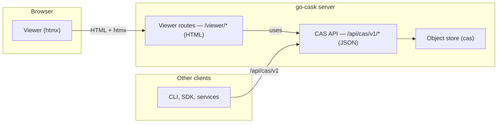

# Viewer API & CAS API — go-cask

> This document is the **Swagger/OpenAPI contract** for the two HTTP surfaces of
> go-cask:
>
> 1. **Viewer API** — the hypermedia (HTML) surface of the embedded technical
>    viewer under `/viewer/`. The browser talks only to this API. It never
>    returns JSON.
> 2. **CAS API** — the JSON data API of the content-addressed object store
>    under `/api/cas/v1/`. The **viewer backend uses this API**, and **other
>    clients use it too** (CLI, SDKs, services, integrations).
>
> The two APIs MUST NOT be mixed: they have distinct prefixes, distinct content
> types, distinct authentication, and distinct OpenAPI documents (below).
>
> Related specs: `.github/instructions/viewer-security.instructions.md`
> (authentication/authorization for the viewer), `.github/instructions/
> cas-core.instructions.md` (the object model both APIs expose),
> `.github/instructions/viewer-design.instructions.md` (viewer pages/htmx
> design), `.github/instructions/cas-api.instructions.md` (canonical CAS API
> spec).

---

## 1. Architecture: Two APIs, One Store

```text
                          ┌────────────────────────────┐
   Browser                │  go-cask server            │
 ┌──────────┐   HTML/htmx │  ┌──────────────────────┐  │
 │  Viewer  │ ───────────►│  │  Viewer routes       │  │
 └──────────┘  /viewer/*  │  │  /viewer/... (HTML)  │  │
                          │  └──────────┬───────────┘  │
                          │             │ uses         │
   Other clients          │  ┌──────────▼───────────┐  │
 ┌────────────┐           │  │  CAS API             │  │
 │ CLI, SDK,  │ ─────────►│  │  /api/cas/v1 (JSON)  │  │
 │ services   │  /api/cas │  └──────────┬───────────┘  │
 └────────────┘           │             │              │
                          │  ┌──────────▼───────────┐  │
                          │  │  Object store (cas)  │  │
                          │  └──────────────────────┘  │
                          └────────────────────────────┘
```



- **Viewer routes** (`/viewer/*`) render HTML pages and htmx fragments for a
  browser session (see `.github/instructions/viewer-design.instructions.md`).
- **CAS API** (`/api/cas/v1/*`) is the programmatic, JSON data API of the
  store. The viewer backend calls it (in-process by default; over HTTP when
  the store is remote). CLI tools, SDKs, and other services call the same API
  directly.
- The viewer surface MUST NOT expose JSON endpoints, and the CAS API MUST NOT
  return HTML. A route's prefix determines its contract.

---

## 2. API Prefixes & Routing Rules

| Surface      | Prefix            | Content types                       | Auth                    | Consumers                        |
| ------------ | ----------------- | ----------------------------------- | ----------------------- | -------------------------------- |
| Viewer API   | `/viewer/`        | `text/html` (pages + fragments)     | session cookie          | browser only                     |
| CAS API      | `/api/cas/v1/`    | `application/json`, `application/octet-stream` | bearer token | viewer backend, CLI, SDK, services |

Rules (MUST):

1. **Never mix prefixes.** No viewer route may live under `/api/cas/`, and no
   CAS API route may live under `/viewer/`. A handler that serves one surface
   SHALL NOT be registered on the other.
2. **Content-type isolation.** Viewer responses are always `text/html`;
   CAS API responses are always `application/json` (or
   `application/octet-stream` for raw object bytes). Returning the wrong type
   for a prefix is a defect.
3. **Versioning.** The CAS API is versioned (`/api/cas/v1/`); breaking changes
   bump the version (`v2`). The viewer prefix is unversioned — it is an
   application surface whose htmx fragments evolve with the UI.
4. **One OpenAPI document per surface** (§5, §6). The viewer document contains
   only `/viewer/*` paths; the CAS document contains only `/api/cas/v1/*`
   paths.
5. **Path validation.** Every `{hash}` parameter is validated with `ParseHash`
   (pattern `^[a-z0-9]+:[0-9a-f]+$`) before any storage access; malformed
   input → 400.

---

## 3. Authentication & Authorization

Per `.github/instructions/viewer-security.instructions.md` (roles: viewer /
operator / admin; startup token; sessions):

| Surface   | Auth mechanism                                   | Role enforcement                              |
| --------- | ------------------------------------------------ | --------------------------------------------- |
| Viewer    | `session` cookie (HttpOnly, SameSite=Strict)     | viewer: GETs; operator: + verify; admin: + delete/GC |
| CAS API   | `Authorization: Bearer <token>` (per-role tokens)| same role matrix as the viewer                |

- Viewer: missing/expired session → **401 empty body**; insufficient role →
  **403 empty body** (never disclose whether an object exists).
- CAS API: missing/invalid token → **401** `{"error":"unauthorized"}`;
  insufficient role → **403** `{"error":"forbidden"}`.
- Every mutation (POST/DELETE on both surfaces) is audit-logged; tokens and
  secrets are never logged.
- The startup admin token is accepted only by `POST /viewer/login`. The CAS
  API accepts only configured per-role tokens.

---

## 4. Error & Content-Type Contracts

The shared status-code and error conventions are defined once in
`.github/instructions/api-design.instructions.md` §5–§6 — this file does not
duplicate them. Viewer-specific consequences:

- Viewer errors are HTML pages/fragments (or empty bodies for 401/403, per
  the security spec); the CAS API returns JSON `{"error": "..."}`.
- 401/403 never disclose whether the target object exists.
- Both surfaces may be wrapped by the shared **IP-based rate-limiting
  middleware** (per `.github/instructions/cas-api.instructions.md` §3,
  R-14): client IP from `RemoteAddr` (or `X-Forwarded-For` only via a trusted
  proxy), loopback exempt by default. The viewer's login endpoint keeps its
  own stricter throttle (max 5 failures/IP/min with backoff, per
  `viewer-security.instructions.md`).

---

## 5. Viewer API — OpenAPI 3.0 (Swagger)

> Served at `GET /viewer/openapi.yaml`. All paths are relative to the
> `/viewer` prefix. Responses are `text/html`.

```yaml
openapi: 3.0.3
info:
  title: CASK Viewer API
  description: >
    Hypermedia (HTML) API of the embedded technical viewer. Serves full pages
    and htmx fragments. The browser talks ONLY to this API. Never returns JSON.
  version: 1.0.0
servers:
  - url: /viewer
    description: Viewer hypermedia surface (browser only)
tags:
  - name: Auth
  - name: Dashboard
  - name: Objects
  - name: Integrity
paths:
  /login:
    get:
      tags: [Auth]
      summary: Login form
      description: HTML form for the startup admin token.
      responses:
        '200':
          description: Login form (text/html)
    post:
      tags: [Auth]
      summary: Submit startup token, establish session
      description: >
        Accepts the startup token and issues a session cookie.
        The startup token is accepted ONLY by this endpoint.
      requestBody:
        required: true
        content:
          application/x-www-form-urlencoded:
            schema:
              type: object
              properties:
                token:
                  type: string
              required: [token]
      responses:
        '303':
          description: Redirect to the dashboard
        '401':
          description: Empty body (bad token)
  /:
    get:
      tags: [Dashboard]
      summary: Dashboard landing page
      description: >
        Stat cards (objects, total size, algorithms), per-algorithm table,
        sample objects, search box, quick navigation.
      responses:
        '200':
          description: Dashboard (text/html)
        '401':
          description: Empty body
        '403':
          description: Empty body
  /dashboard:
    get:
      tags: [Dashboard]
      summary: Dashboard panels fragment (htmx refresh)
      description: stats-panel + sample-table fragments for hx-get refreshes.
      responses:
        '200':
          description: Dashboard fragments (text/html)
  /objects:
    get:
      tags: [Objects]
      summary: Object list (page or search fragment)
      parameters:
        - name: q
          in: query
          schema: { type: string }
          description: Active-search filter (hash/type substring)
        - name: algo
          in: query
          schema: { type: string }
          description: Filter by hash algorithm
        - name: limit
          in: query
          schema: { type: integer, default: 50, minimum: 1, maximum: 500 }
        - name: offset
          in: query
          schema: { type: integer, default: 0, minimum: 0 }
      responses:
        '200':
          description: Object table (text/html; full page or htmx fragment)
        '401':
          description: Empty body
  /objects/{hash}:
    parameters:
      - name: hash
        in: path
        required: true
        schema:
          type: string
          pattern: '^[a-z0-9]+:[0-9a-f]+$'
    get:
      tags: [Objects]
      summary: Object detail page
      description: Meta (dl), references table, role-based actions, lazy hexdump link.
      responses:
        '200':
          description: Object detail (text/html)
        '400':
          description: Malformed hash (minimal error page)
        '404':
          description: Object not found (minimal error page)
  /objects/{hash}/raw:
    parameters:
      - name: hash
        in: path
        required: true
        schema:
          type: string
          pattern: '^[a-z0-9]+:[0-9a-f]+$'
    get:
      tags: [Objects]
      summary: Raw bytes + hexdump view
      description: Hexdump in a <pre>, lazy-loaded via hx-trigger="revealed".
      responses:
        '200':
          description: Raw bytes view (text/html)
        '400':
          description: Malformed hash
        '404':
          description: Object not found
  /objects/{hash}/verify:
    parameters:
      - name: hash
        in: path
        required: true
        schema:
          type: string
          pattern: '^[a-z0-9]+:[0-9a-f]+$'
    post:
      tags: [Integrity]
      summary: Verify object integrity (recompute hash)
      description: 'Role: operator. CSRF-protected htmx form.'
      responses:
        '200':
          description: Result fragment (text/html)
        '400':
          description: Malformed hash
        '403':
          description: Empty body (insufficient role)
        '404':
          description: Object not found
  /objects/{hash}/delete:
    parameters:
      - name: hash
        in: path
        required: true
        schema:
          type: string
          pattern: '^[a-z0-9]+:[0-9a-f]+$'
    post:
      tags: [Integrity]
      summary: Delete object
      description: 'Role: admin. hx-confirm + CSRF; audit-logged.'
      responses:
        '200':
          description: Updated list fragment (text/html)
        '400':
          description: Malformed hash
        '403':
          description: Empty body (insufficient role)
  /graph/{hash}:
    parameters:
      - name: hash
        in: path
        required: true
        schema:
          type: string
          pattern: '^[a-z0-9]+:[0-9a-f]+$'
    get:
      tags: [Objects]
      summary: Reachable object graph
      description: Nodes (type + hash) and reference edges as nested HTML links.
      responses:
        '200':
          description: Graph (text/html)
        '400':
          description: Malformed hash
        '404':
          description: Root object not found
  /stats:
    get:
      tags: [Dashboard]
      summary: Full statistics page
      description: Per-algorithm counts and sizes ("see all" from the dashboard).
      responses:
        '200':
          description: Statistics (text/html)
  /gc:
    post:
      tags: [Integrity]
      summary: Run mark-and-sweep garbage collection
      description: 'Role: admin. CSRF-protected; progress via hx-trigger="every 2s".'
      responses:
        '200':
          description: Progress/completion fragment (text/html)
        '403':
          description: Empty body (insufficient role)
  /openapi.yaml:
    get:
      tags: [Auth]
      summary: This OpenAPI document
      responses:
        '200':
          description: Viewer API OpenAPI 3.0 document (text/yaml)
        '401':
          description: Empty body
components:
  securitySchemes:
    cookieAuth:
      type: apiKey
      in: cookie
      name: session
security:
  - cookieAuth: []
```

---

## 6. CAS API — OpenAPI 3.0 (Swagger)

> The CAS API is documented in its own **canonical** spec:
> `.github/instructions/cas-api.instructions.md` (OpenAPI 3.0 YAML + numbered
> requirements). Served at `GET /api/cas/v1/openapi.yaml`.

Summary of CAS API endpoints (details in the canonical spec):

| Method | Path (under `/api/cas/v1`) | Purpose                   | Role     |
| ------ | -------------------------- | ------------------------- | -------- |
| POST   | `/objects`                 | Store bytes, compute hash | operator |
| GET    | `/objects`                 | List (limit/offset/algo)  | viewer   |
| GET    | `/objects/{hash}`          | Retrieve raw bytes        | viewer   |
| GET    | `/objects/{hash}/meta`     | Metadata + references     | viewer   |
| DELETE | `/objects/{hash}`          | Delete object             | admin    |
| POST   | `/objects/{hash}/verify`   | Integrity check           | operator |
| GET    | `/stats`                   | Storage statistics        | viewer   |
| POST   | `/gc`                      | Mark-and-sweep GC         | admin    |
| GET    | `/openapi.yaml`            | This OpenAPI document     | viewer   |

The OpenAPI YAML in the canonical spec is authoritative; this summary must
stay in sync with it.

---

## 7. Swagger UI Serving & In-Browser API Explorer

- The two OpenAPI documents are served from the server itself:
  `GET /viewer/openapi.yaml` and `GET /api/cas/v1/openapi.yaml` — the YAML
  documents are the contract and can be opened in any Swagger UI instance or
  the [Swagger Editor](https://editor.swagger.io/).
- **In-browser API explorer (required).** The Swagger UI JavaScript bundle
  SHALL be embedded in the viewer runtime (vendored, one pinned version,
  compiled into the binary via `embed.FS`).
  - Served at `GET /swagger/`; `?url=/viewer/openapi.yaml` or
    `?url=/api/cas/v1/openapi.yaml` selects the document to explore.
  - The explorer is a **separate, explicitly enabled endpoint**: disabled by
    default (config, e.g. `swagger_ui: {enabled: true}`), never part of the
    default viewer surface, and SHALL require an authenticated session like
    the viewer.
- **Documented deviation.** Embedding the Swagger UI JS bundle deviates from
  the no-JS rule (`.github/instructions/coding-guidelines.instructions.md`
  §4). This is the single documented exception: an optional developer tool,
  never enabled by default.

---

## 8. Compliance Checklist

- [ ] Viewer routes exist only under `/viewer/`; CAS API routes only under
      `/api/cas/v1/`; no cross-registration
- [ ] Viewer responses are `text/html` only; CAS API responses are JSON or
      octet-stream only
- [ ] `POST /viewer/login` is the only endpoint that accepts the startup token
- [ ] Viewer uses session-cookie auth (401/403 empty bodies); CAS API uses
      bearer tokens (JSON errors)
- [ ] Role matrix enforced on both surfaces: GET=viewer, verify=operator,
      delete/GC=admin
- [ ] Every mutation (POST/DELETE) is audit-logged; no secrets in logs
- [ ] Every `{hash}` validated with `ParseHash` (pattern
      `^[a-z0-9]+:[0-9a-f]+$`) → 400 on malformed
- [ ] The two OpenAPI documents match the implemented routes exactly; docs are
      regenerated when routes change
- [ ] Viewer backend consumes the CAS API contract (in-process or HTTP), and
      other clients (CLI, SDK) consume the same contract
