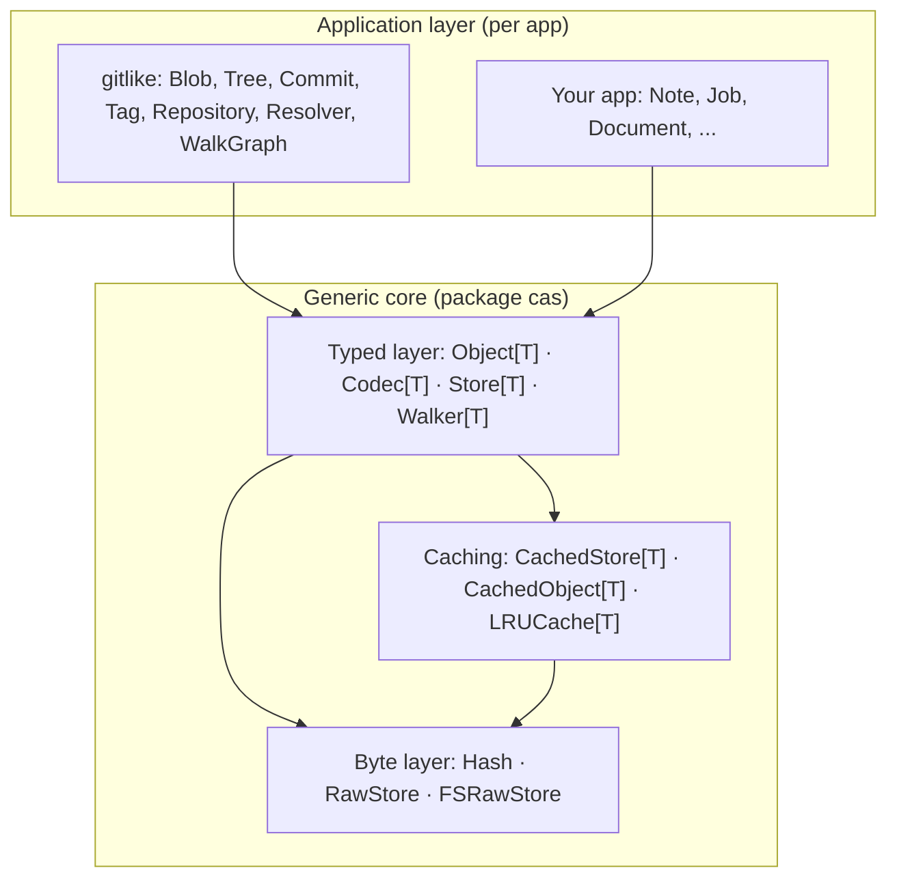

# Agent Instructions — go-cask (CASK: Content Addressable Store Kit)

> **Origin:** This specification is generated from the DeepSeek design conversation
> at <https://chat.deepseek.com/share/p7jkdjl1gbyhjipf6r>. It captures the **final
> implementation** the conversation converged on: a generic, Git-like,
> content-addressable object store component written in Go, fully type-safe via
> generics (no `any` in the public API), with pluggable hash algorithms, a
> filesystem backend, typed object layers, lazy loading and caching.
>
> Use this file as the authoritative design contract for all agent-assisted
> changes to the core `cas` package — any tool that honors `AGENTS.md`
> (GitHub Copilot, OpenAI Codex, Claude Code, …). Code produced for this repo
> MUST follow the architecture and conventions below unless the user
> explicitly overrides them.

---

## Project Context

CASK is a reusable Go component implementing a **content-addressable store**: any
binary blob is stored once under the hash of its content; identical content
deduplicates automatically, objects are immutable, and objects reference each
other by hash (a Git-like blob/tree/commit/tag model). The storage layer knows
**nothing** about application object types — different apps and domains reuse
the same physical store by layering their own typed objects on top.

The repo layout is:

```text
cas/       core library (package cas) — generic only; this spec defines it
internal/  implementation detail (web — the viewer —, storage, index);
           not importable outside this module
examples/gitlike/ example package (package gitlike) — Git-like object model
                 on top of cas: Blob/Tree/Commit/Tag, Repository, Resolver,
                 WalkGraph
examples/  runnable example programs (per examples.md)
cmd/       command-line entry points
docs/instructions/  the specification set (20 files: 19 specs + AGENT.md)
docs/design/  non-normative design docs (core-overview pointer, viewer-brief)
AGENTS.md  this file — the repo-root agent aggregator; points at the
           specs in docs/instructions/
```

Related specs that also constrain work in this repo:

- `docs/instructions/cas-core.md` — the canonical core
  library specification (layers, every component contract with code, data
  flows, concurrency, and the extension contract); the reference
  implementation of this repo.
- `docs/instructions/coding-guidelines.md` — idiomatic Go,
  standard-library-only, no CSS/JS, `html/template` + htmx, raw HTML,
  doc-comment rules, Go 1.27, latest generics.
- `docs/instructions/viewer-security.md` — security
  requirements for the embedded viewer (secure-by-default, authn/authz,
  session management, audit logging). Any viewer code MUST comply with it.
- `docs/instructions/viewer-design.md` — design of the
  embedded technical viewer (simple/elegant/usable, dashboard-first,
  hypermedia-driven, nested Go templates + htmx only, no JS/CSS, low-level
  object/reference/blob inspection).
- `docs/design/viewer-brief.md` — the design brief for the viewer's next
  iteration (OpenDesign input, not a normative spec): structure-only step 1,
  no JS/CSS; pages, components, and the htmx interaction map aligned to the
  cas model.
- `docs/instructions/examples.md` — how example programs are
  generated plus five proposed non-trivial examples covering all aspects of
  the implementation (gitlike, custom codecs/hashes, caching, HTTP-exposure pattern, viewer).
- `docs/instructions/extensions.md` — the simple requirements
  every future extension or client of the cas core must satisfy (extend don't
  modify, stable surface only, recipes, compatibility), plus the catalog of
  designed-but-deferred possible extensions (packfiles, compression layer,
  encryption layer, chunking).
- `docs/instructions/consistency.md` — the consistency model:
  broken/dangling object detection, mark-and-sweep GC from roots,
  age-based pruning (retention), informed by Git/IPFS/restic without
  over-engineering.
- `docs/instructions/defaults.md` — the canonical reference
  for default behavior and every default value/constant (hash algo, fan-out,
  rate limits, sessions, performance baselines, Go/project defaults).
- `docs/instructions/versioning.md` — library Git versioning:
  semver tags, Go module v2+ path-suffix rules, branches, changelog, release
  process; distinct from HTTP API and doc versions.
- `docs/instructions/branch-naming.md` — the simple Git
  branch concept: one permanent `main`, short-lived `<type>/<kebab>` branches,
  on-demand `release/vX.Y`; patterns, examples, lifecycle.
- `docs/instructions/cli.md` — the `cmd/cask` CLI contract:
  subcommands, flags, output format, exit codes, local (`-store`) ops and the `web` viewer subcommand.
- `docs/instructions/object-versioning.md` — object-model
  semver: versioned type names (`type@major`), coexisting model versions in
  one store, compatibility rules and migration.
- `docs/instructions/performance.md` — lock-free reads,
  one-pass streaming hashing, allocation budgets, benchmark suite + CI
  gates, profiling workflow.
- `docs/instructions/library-design.md` — lean-core contract:
  exported-surface budget, sentinel errors, no mutable globals, API shape,
  compatibility policy.
- `docs/instructions/testing-strategy.md` — the CAS laws and
  the unit/property/fuzz/race/corruption/golden tests that prove them.
- `docs/instructions/operations.md` — durability, crash
  recovery, observability, integrity cadence, hash/layout migration, backup.
- `docs/instructions/api-design.md` — shared HTTP API design
  conventions: naming, methods, status codes, errors, authn/authz, rate
  limiting, validation, pagination, streaming, versioning, OpenAPI docs —
  applied consistently to the viewer surface and to example HTTP surfaces.
- `docs/instructions/AGENT.md` — the meta-guide for the instruction folder:
  file naming, frontmatter, document structure, terminology, precedence, and
  the maintenance checklist that keeps every instruction file consistent.
- `docs/instructions/backend-architecture.md` — server-side
  architecture: the single `cmd/cask` binary and its `cask web` server, HTTP
  wiring, middleware pipeline, storage backend selection, config, lifecycle,
  deployment shapes.
- `docs/instructions/frontend-architecture.md` — browser-facing
  architecture: hypermedia-driven rendering, nested templates, htmx
  interaction model, URL-as-state, embedding.

---

## Conversation Summary (how the design evolved)

The chat history moved through these stages; the **final state** is the fully
type-safe, registry-free design:

1. Generic store + `Codec[T]` wrapper over a byte `RawStore`.
2. Git-like object store: objects are `[]byte` addressed by `Hash`, with typed
   objects (`blob`, `tree`, `commit`) on top.
3. Objects can reference each other by hash with types **not known in advance**;
   a runtime registry handles unknown types.
4. Go generics (1.18+/latest): `Store[T]`, `Object[T]`, `Codec[T]`.
5. **Pluggable hash functions; the hash type carries the algorithm**:
   `Hash` is `algo:digest` (e.g. `sha256:a1b2...`), so references are
   self-describing and algorithms can be mixed/migrated.
6. **`RawStore` for the filesystem** (`FSRawStore`): Git-like fan-out
   directories (configurable n-way/n-level), atomic temp-file writes,
   lock-free reads, stats, verify, GC.
7. **Remove `any`**: fully generic `Object[T]`, `Store[T]`, `JSONCodec[T]`,
   separate per-type stores, no runtime type assertions in the public API.
8. **Cross-type references without `any`**: references are plain `Hash` values;
   resolution is type-safe via per-type stores, a `Repository`, and a
   `Resolver` (with a typed `ResolvedObject` union for "resolve anything").
9. **Lazy loading + caching**: `CachedObject[T]` (lazy proxy), `CachedStore[T]`,
   LRU eviction, `CachedRepository`, background `Preloader` (prefetch-on-
   access and cache-monitor metrics later became example recipes in
   `examples/notes` and `examples/artifacts`).
10. **Generic core vs. example layer**: the git-like model (`Blob`/`Tree`/
    `Commit`/`Tag`, `Repository`, `Resolver`, `ResolvedObject`, `WalkGraph`,
    `CachedRepository`, `Preloader`) is a **specific example** in a separate
    `examples/gitlike/` package — the `cas` core stays app-agnostic and generic only.

The final user turn ("I want a repo from your code with all the latest changes
and features") is not answered inside the share, so the reference implementation
below is consolidated from the last converged state of the conversation.

---

## Architecture

```text
┌─────────────────────────────────────────────────────────────┐
│ Apps / domains (define their own Object[T] types on top)    │
│   NoteStore, JobStore, DocumentStore, Git-like, ...         │
├─────────────────────────────────────────────────────────────┤
│ Typed layer (generic, no any)                               │
│   Object[T] · Codec[T] · Store[T] · Walker[T]               │
│   CachedStore[T] / CachedObject[T] / LRUCache[T]            │
├─────────────────────────────────────────────────────────────┤
│ Byte layer (non-generic)                                    │
│   Hash (algo:digest) · RawStore interface                   │
│   Backends: FSRawStore (reference), MemoryRawStore (tests) │
└─────────────────────────────────────────────────────────────┘
```



| Concept          | Responsibility                                              |
| ---------------- | ----------------------------------------------------------- |
| `Hash`           | Content address; carries algorithm + digest (`sha256:ab..`) |
| `HashFunc`       | Computes a `Hash` from bytes; runtime-registerable          |
| `RawStore`       | Raw byte storage interface (non-generic)                    |
| `FSRawStore`     | Filesystem backend: n-way fan-out paths (Git-like default), atomic writes, locking |
| `MemoryRawStore` | In-memory backend for tests/benchmarks (no disk I/O, not persistent) |
| `Codec[T]`       | Serialization contract for a type `T`                       |
| `Object[T]`      | Self-describing, typed object with `References()`           |
| `Store[T]`       | Generic store: Put/PutDedup/Get/GetRaw/Exists/Delete          |
| `Walker[T]`      | Generic graph traversal over `References()`                 |
| `CachedStore[T]` | Lazy loading + caching wrapper around `Store[T]`            |
| `LRUCache[T]`    | Size-bounded cache with LRU eviction                        |
| *(gitlike)* `Blob`/`Tree`/`Commit`/`Tag` | Example `Object[T]` types (application layer)   |
| *(gitlike)* `Repository`/`Resolver`/`ResolvedObject`/`WalkGraph` | Example per-type stores + type-safe resolution (application layer) |
| *(gitlike)* `CachedRepository`/`Preloader` | Example repository-bound caches (application layer) |

The `cas` package is **generic only**. Everything marked *(gitlike)* lives in
the separate example package `examples/gitlike/` and is NOT part of the core — apps
build their own equivalents for their own types.

---

## Design Principles (Non-Negotiables)

1. **Hash-addressed & immutable.** The key is the hash of the content; objects
   are never mutated in place. Same content ⇒ same hash ⇒ stored once
   (deduplication is automatic).
2. **Hash carries its algorithm.** `Hash` is `"algo:hexdigest"`. References are
   self-describing, algorithms can be mixed in one object graph, and stores can
   read objects hashed with any registered algorithm.
3. **Core storage is non-generic.** `RawStore` deals in `Hash` + `io.Reader`
   only. All generics live in the typed layer on top.
4. **Fully type-safe — no `any` in the public API.** No `interface{}` in
   exported signatures, no reflection-based dispatch. Each object type gets its
   own `Store[T]`, so mixing types is a compile-time error.
5. **Objects are self-describing and pluggable.** Every `Object[T]` declares
   `Type()` and `References()`; apps register/define new types without touching
   the storage core.
6. **Streaming I/O.** `RawStore` moves `io.Reader`/`io.ReadCloser` so large
   objects never need to be fully buffered by the byte layer.
7. **Thread-safe by default.** Backend reads are lock-free (atomic rename);
   one `sync.Mutex` coordinates `Put`/`Delete`; caches use `sync.Map`/
   `atomic`; writes are atomic (temp file + rename + `Sync()`).
8. **Errors are wrapped** (`fmt.Errorf("...: %w", err)`) and `context.Context`
   is propagated through every public method.
9. **Maintainability features included:** `Stats`, `Verify` (integrity check),
   mark-and-sweep `GC`, and cache metrics.

---

## Reference Implementation

> The full reference implementation (signatures, behaviors, and code) lives in
> **`docs/instructions/cas-core.md`** — section 4 (component
> specifications with code) and section 5 (data flows). This aggregator does
> not duplicate it: keep implementations and docs in sync with cas-core.

> Quick map: `errors.go` → cas-core §4.1–4.3 (sentinel errors, `Hash`,
> `RawStore`); `fsstore.go`/`memstore.go` → cas-core §4.4–4.5;
> `codec.go`/`object.go`/`store.go` → cas-core §4.6–4.8; `walker` → §4.9;
> `cache.go` → §4.10; `maintenance.go` → §4.11; `examples/gitlike/*` → §4.12.

## Usage Example

```go
package main

import (
    "context"
    "fmt"
    "time"

    "github.com/dmundt/go-cask/cas"
    "github.com/dmundt/go-cask/examples/gitlike"
)

func main() {
    ctx := context.Background()

    // 1. Backend from the generic core + git-like example repository on top.
    raw, _ := cas.NewFSRawStore("./repo")
    repo, _ := gitlike.NewRepository(raw, "sha256")
    resolver := gitlike.NewResolver(repo)

    // 2. Build a Git-like object graph: blob → tree → commit → tag.
    blobHash, _ := repo.Blobs.Put(ctx, &gitlike.Blob{Data: []byte("Hello, World!")})
    treeHash, _ := repo.Trees.Put(ctx, &gitlike.Tree{Entries: []gitlike.TreeEntry{
        {Name: "hello.txt", Hash: blobHash, Mode: "file"},
    }})
    commitHash, _ := repo.Commits.Put(ctx, &gitlike.Commit{
        Tree: treeHash, Parent: nil, Author: "Alice",
        Message: "Initial commit", Time: time.Now(),
    })
    tagHash, _ := repo.Tags.Put(ctx, &gitlike.Tag{Name: "v1.0", Target: commitHash, Tagger: "Bob", Message: "Release"})

    // 3. Type-safe reads — no casts, no any.
    commit, _ := resolver.ResolveCommit(ctx, tagHash)
    tree, _ := resolver.ResolveTree(ctx, commit.Tree)
    blob, _ := resolver.ResolveBlob(ctx, tree.Entries[0].Hash)
    fmt.Println(string(blob.Data)) // "Hello, World!"

    // 4. Lazy + cached access (gitlike example caches).
    cachedRepo, _ := gitlike.NewCachedRepository(raw, "sha256", 1000)
    ref, _ := cachedRepo.GetCommit(ctx, commitHash)
    fmt.Println("loaded:", ref.IsLoaded()) // false
    obj, _ := ref.Load(ctx)
    fmt.Println("message:", obj.(*gitlike.Commit).Message)

    // 5. Traverse the whole graph.
    _ = gitlike.WalkGraph(ctx, resolver, tagHash, func(o *gitlike.ResolvedObject) error {
        fmt.Println("visited:", o.Type)
        return nil
    })
}
```

For tests and ephemeral use, swap the backend — everything above works
unchanged:

```go
raw := cas.NewMemoryRawStore() // in-memory: fast, deterministic, not persistent
```

---

## Extension Guide (how an agent should extend this library)

**Add a new storage backend** (S3, BadgerDB, PostgreSQL, ...):
1. Implement `RawStore` exactly (`Put/Get/Exists/Delete/List`), honoring
   context propagation, error wrapping, and atomic/durable writes.
2. Keep the byte layer non-generic; everything above it works unchanged.
3. Mirror `FSRawStore`'s guarantees: idempotent `Put`, `Delete` no-op on
   missing objects, `List(algo)` filtering. `MemoryRawStore` (section 3b) is
   the minimal reference implementation.

**Add a new object type** (e.g. `Document`):
1. Implement `Object[Document]` (`Type/References/Serialize/Deserialize`).
2. Create your own `*Store[Document]` with `JSONCodec[Document]{}` — the
   generic core stays untouched.
3. If you need a repository/resolver for your types (per-type stores,
   `Resolve*` methods, `ResolvedObject` union, `WalkGraph`), copy the
   `gitlike` example package into your own package; do NOT add your types to
   `cas` or extend `gitlike`.
4. Never add `any` or reflection to do this — add explicit typed methods.

**Add a hash algorithm** (e.g. `blake3`):
```go
cas.RegisterHash("blake3", func(data []byte) cas.Hash { ... })
```
Then `NewStore(raw, codec, "blake3")` works; existing objects under other
algorithms remain readable (the algorithm lives in the address).

**Add a codec** (gzip, protobuf, msgpack, encrypted):
Implement `Codec[T]` (e.g. wrap `JSONCodec[T]` with compression/encryption)
and pass it to `NewStore`. Do not change `RawStore`.

**Add cache policy**: extend `CachedStore[T]` or add a new wrapper; keep the
`CachedObject[T]` lazy-load contract and metrics counters.

**Build/verify commands**:
```text
go build ./...
go vet ./...
go test ./...
gofmt -l .
```

---

## Constraints & Conventions

- Go **1.21+** required (generics); repo toolchain is 1.27. Module: the repo
  root; core library lives in `cas/` as `package cas`.
- The git-like model (`Blob`/`Tree`/`Commit`/`Tag`, `Repository`, `Resolver`,
  `ResolvedObject`, `WalkGraph`, `CachedRepository`, `Preloader`) lives in the
  example package `examples/gitlike/` — it is NOT part of the generic `cas` core; the
  core stays app-agnostic.
- **No `any`/`interface{}` in exported API.** The typed layer is constrained
  (`Store[T Object[T]]`); reads return the concrete `T` via `Store[T].Get` —
  no type assertions anywhere.
- Defaults: hash algorithm `sha256`, codec `JSONCodec[T]`, Git-like fan-out
  (`FanOut=2`, `FanLevels=1` → `<algo>/aa/<full-hex>`; any n-way/n-level
  layout via `WithFanOut`/`WithFanLevels`), directory permissions `0o755`,
  files `0o644`.
- Every exported function takes `context.Context` first and wraps errors with
  `%w`. Never swallow context cancellation.
- Immutability: never mutate stored objects in place; always re-`Put` to
  change content (which yields a new hash).
- Concurrency: backend reads are lock-free (atomic rename; see
  `performance.md` §2); one `sync.Mutex` coordinates
  `Put`/`Delete`; caches use `sync.Map` + `atomic` counters; `hashRegistry`
  must be guarded by a `sync.RWMutex` once hash registration can happen after
  startup.
- Serialization format: RESOLVED and implemented — self-describing envelope
  `{"type": "...@major", "data": <base64 payload>}` (cas-core §8 decision 1),
  enabling `parseType`/`ResolveAny` without a side registry.
- Follow the sibling spec `docs/instructions/viewer-security.md`
  for anything touching the embedded viewer (`internal/web/`).
