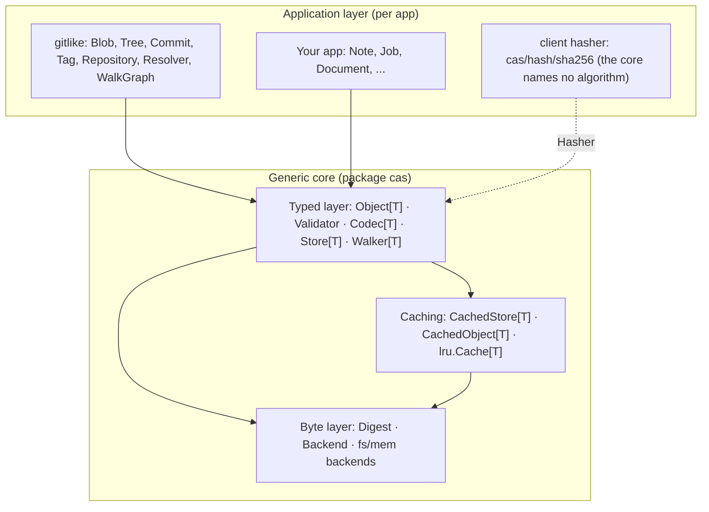

# Agent Instructions — go-cask (CASK: Content-Addressable Store Kit)

## Markdown policy

Raw HTML is strictly forbidden in every Markdown file in this repository.
Documentation MUST use valid Markdown syntax only; do not add HTML tags,
comments, layout wrappers, or embedded HTML blocks.

## Changelog and release-note policy

`CHANGELOG.md` is a lean, user-facing record, not a development diary.
Maintain one `Unreleased` section and one section per tagged release. Record
only notable changes that affect library consumers, CLI users, operators, or
the viewer's behavior and security.

- Combine related changes into one clear bullet when they form one user-facing
  capability.
- Omit test-only work, coverage changes, routine CI or dependency maintenance,
  internal refactors with no observable behavior change, formatting, release
  preparation, and temporary fixes.
- Keep entries concise: describe outcome and user impact, not implementation
  history, review discussion, or individual commits.
- Use `Added`, `Changed`, `Deprecated`, `Removed`, `Fixed`, and `Security`
  headings only when they contain a notable entry. Do not create empty
  headings.
- Update `CHANGELOG.md` for every notable user-visible change before commit.
  Do not add entries for changes that are purely internal or temporary.
- Before a release, move its finalized entries from `Unreleased` into the
  versioned section and preserve the existing compare-link format.
- GitHub release notes MUST mirror the corresponding user-facing changelog
  section, use the same concise scope, and end with a `Full Changelog:` link
  to the tag comparison. Correct older published notes when they contain
  temporary or trivial material.

## Content-addressable terminology

Use **content-addressable store** for CASK, go-cask, the `cas` package, a
`Backend`, or any concrete implementation. Use **content-addressable storage**
for the general technique, architecture pattern, or conceptual explanation.
Expand `CAS` as **Content-Addressable Store** and `CASK` as **Content-Addressable
Store Kit**. Do not replace one phrase with the other mechanically when context
requires a different scope.

## Signed pull-request workflow

For repositories requiring signed commits, agents MUST never use GitHub's
server-side rebase or update-branch operation. Rebuild each PR branch locally
from current `main`, apply changes with `git cherry-pick -S`, verify every
resulting head commit with `git verify-commit`, and push with
`git push --force-with-lease`. Before every PR creation or update, run
`./scripts/verify.sh` and confirm all configured coverage thresholds pass.
Enable auto-merge or merge only after signature verification, required checks,
and coverage checks pass.

On Windows, run `./scripts/verify.sh` under WSL with a Linux Go toolchain: the
race and coverage gate needs cgo and a C compiler, which the Windows toolchain
cannot take from WSL's `gcc`, and coverage measured on Windows does not predict
the gate. Never duplicate the gate's steps in PowerShell. The rootless WSL setup
and the exact command are in [`scripts/AGENT.md`](scripts/AGENT.md), section
"Running the scripts on Windows".

On any platform, a gate run is green only when it ends with `verification
passed`; a run that stops earlier failed even if nothing was echoed about it.
## Serialized landing, worktrees and gates (STRICT)

Parallel sessions on one repository invalidate each other's branches: every merge
makes the others "behind", each rebuild costs a gate run, and the rebuild window
is long enough for the next merge to arrive first. The landing lane is therefore
serialized **mechanically**, not by intention.

- **One worktree per task, created by `scripts/worktree.sh add <task> <type>/<NNN>-<kebab>`** and removed with `scripts/worktree.sh remove <task>` once the PR merges. The wrapper writes the worktree's `.git` in the relative form: a worktree created by the other toolchain records an absolute path, which makes `git` walk up to the primary checkout — and `verify.sh` refuses to run when it detects that, because the gate would silently test the wrong tree. The wrapper also locks the worktree: the reverse link in the shared git dir holds one toolchain's path form, so **never run `git worktree prune`** — the other toolchain sees a live worktree as prunable and a prune deletes its registration together with its index. `verify.sh` locks any registration it finds unprotected before it gates, and `scripts/worktree.sh prune` refuses outright: git has no pre-command hook and no alias can shadow a built-in, so git's own `locked` file is the whole protection. Never edit the primary checkout while another session may be using it.
- **Never `git add -A` and never `git commit -a`.** Stage the paths you touched: a shared tree otherwise sweeps another session's untracked files into your commit.
- **Claim before you start.** Comment on the issue ("taking #NNN"), then check `gh issue view NNN --json state` and `gh pr list --state all --limit 15`: a closed issue or an open PR means stop. Re-read the owning spec immediately before asking a question — parallel PRs make premises stale within minutes.
- **Hold the land lane for the whole landing.** `./scripts/land-lane.sh acquire <issue>` before the first push and `release` after the merge; `status` names the holder (exit 0 yours, 1 free, 2 someone else). One slot in the shared git dir; an abandoned lock older than 90 minutes is taken over automatically, `--force` overrides deliberately.
- **Gate once per commit, at the right scope.** `./scripts/verify.sh` detects a documentation-only change and runs the documentation gate — the scope CI applies (`VERIFY_SCOPE=full` forces the whole gate, `VERIFY_SCOPE=docs` asserts the documentation scope). A green run stamps the commit in the shared git dir.
- **Install the hook once per clone:** `git config core.hooksPath .githooks`. `.githooks/pre-push` refuses a push that holds no land lane or has no green stamp for that exact commit, so re-pushing an unchanged commit costs no compute.
- **The gate runs in the worktree, under WSL, once per commit.** Do not look for a faster path: this host's WSL has no Linux `python3`, so a WSL-native clone on ext4 would push the documentation steps onto the Windows interpreter, which cannot read a non-Windows path, and the gate would fail after spending the whole Go suite. `./scripts/verify.sh` on `/mnt/d` is the one supported route.
- **One decision or area per PR; append, don't rewrite.** Prefer adding a spec row or bullet over rewriting an existing line, and keep a documentation PR to one file where possible: additions auto-merge, rewrites conflict and cost a rebuild.
- **Merge queue over `strict`.** `main` requires an up-to-date branch. When a merge queue is available, enable it — GitHub then rebases and re-tests once per PR at merge time. The repository currently runs `required_status_checks.strict=false`, which lets a green, non-conflicting PR merge while behind; that is safe only because the land lane is held, so keep the lane discipline. A merge queue is not GitHub's "update branch" button and is allowed.
- **Website changes take the lane too.** A branch that touches `website/**` is a landing like any other: hold the lane for the whole landing, and finish one website decision before starting the next. The site footer was redesigned five times in three hours (`#203` → `#220` → `#224` → `#236` → `#239`, six PRs) by sessions that could not see each other's merge, and every step cost an issue, a branch, a PR and a review. Nothing about the gate changes: a `website/**`-only change is still documentation scope, so this orders the work without making it slower.

> **Origin:** This specification is generated from the DeepSeek design conversation
> at <https://chat.deepseek.com/share/p7jkdjl1gbyhjipf6r>. It captures the **final
> implementation** the conversation converged on: a generic, Git-like,
> content-addressable object store component written in Go, fully type-safe via
> generics (no `any` in an exported value position), a hash-agnostic core whose clients own
> the algorithm (`sha256` ships as the default), a
> filesystem backend, typed object layers, lazy loading and caching.
>
> Use this file as the authoritative design contract for all agent-assisted
> changes to the core `cas` package — any tool that honors `AGENTS.md`
> (GitHub Copilot, OpenAI Codex, Claude Code, …). Code produced for this repo
> MUST follow the architecture and conventions below unless the user
> explicitly overrides them.
>
> **Before every change, read `docs/index.md` first.** It maps the path you
> are working on to the corresponding spec file. The detailed convention
> enters context a few lines later by reading that spec file. This ensures
> you never miss a rule that applies to your change.
>
> **Before the first push of a branch, and again after any change to its tree, complete the repo preflight checklist.**
> Keep the repo in a releasable state and match the actual CI gates in
> `.github/workflows/ci.yml`: update `CHANGELOG.md` for any user-visible change,
> run `./scripts/verify.sh` and do not
> push until it passes — one green run covers every commit it contains, so a
> multi-commit branch needs the gate re-run after each change to the tree, not
> once per commit. `main` is protected and changes only through a pull request,
> whose required checks (`verify`, `security`, `platforms`, CodeQL) are the
> merge gate: the `CI` workflow runs on `pull_request` and `workflow_dispatch`,
> so a merge to `main` does not re-run it. Merge a green PR with `--squash`
> (linear history is required); GitHub signs the squash commit, while the key
> that signed the branch head is verified locally with `git verify-commit`.
> Before every GitHub release,
> mirror the user-facing `CHANGELOG.md` entries into the release notes by
> running `./scripts/release-notes.sh <new-tag> <previous-tag>`, include the
> full changelog link used by prior releases (`Full Changelog:` + compare URL),
> and keep the release body aligned with the shipped changelog sections. The
> workflow uses `actions/checkout@v7` and `actions/setup-go@v7`, then runs the
> `verify` gate via `./scripts/verify.sh`; Go-relevant pull requests also run
> native Linux arm64 and Windows amd64 matrix jobs. Treat this as a required
> operational step for all follow-up work, not an optional cleanup.

## Table of contents

- [Project context](#project-context)
- [Architecture](#architecture)
- [Design principles](#design-principles)
- [Reference implementation](#reference-implementation)
- [Usage example](#usage-example)
- [Extension guide](#extension-guide)
- [Constraints and conventions](#constraints-and-conventions)

---

## Project Context

CASK is a reusable Go component implementing a **content-addressable store**: any
binary blob is stored once under the hash of its content; identical content
deduplicates automatically, objects are immutable, and objects reference each
other by hash (a Git-like blob/tree/commit/tag model). The storage layer knows
**nothing** about application object types — different apps and domains reuse
the same physical store by layering their own typed objects on top.

The repo layout is:

```text
cas/       core library (package cas) — generic only; this spec defines it.
           Subpackages are routed row by row in docs/index.md, not listed
           here: backend/* (fs, mem, packfs), bloom, cache, codec, hash,
           pack, refs, repo, verify
internal/  implementation detail (web — the viewer —, index, store, test,
           website, design — the repo-wide design-rule checks);
           not importable outside this module
gitlike/  shared reference library (package gitlike) — Git-like object model
           on top of cas: Blob/Tree/Commit/Tag, Repository, Resolver,
           WalkGraph
examples/  runnable example programs (per examples.md)
cmd/       command-line entry points
benchmarks/  benchmark suite and operator docs (benchmarks/AGENT.md)
scripts/   gate, landing and release tooling (scripts/AGENT.md)
docs/specs/  the specification set (21 files: 19 specs + AGENT.md + index.md)
docs/design/  non-normative design docs — briefs, audits, mockups and
           implementation plans (docs/design/index.md)
docs/index.md  rule file index — read this first, then the matching spec
website/   public site sources, built with MkDocs Material (policy below)
.github/   CI configuration and automation only; no product code
AGENTS.md  this file — the repo-root agent aggregator; points at the
           specs in docs/specs/
.agents/skills/  agent skills discovered at the project root, one directory
           bundle per skill (cask-change: the change playbook)
```

This block stays top-level on purpose: the per-package routing is
[`docs/index.md`](docs/index.md) (longest path match wins) and the
one-line-per-tree list in [README.md](README.md) "Repository layout". Route
through those instead of growing the block again.

Website and docs policy: the public site lives under `website/` and is built with
MkDocs Material. It is a companion documentation layer, not the source of truth
for the implementation; the normative design remains in `docs/specs/` and
`AGENTS.md`. Prefer clear concept diagrams over ASCII-heavy pages, using Mermaid
for architecture and flow diagrams and small SVG/PNG artwork only where it adds
signal. Keep the pages developer-focused: architecture, stores, hashes, codecs,
backends, recipes, and the public changelog. The generated `site/` directory is
not committed and must remain ignored.

Architecture boundary rule: keep the layer boundaries boringly obvious and
stable. The core stays generic (`cas/`), concrete storage backends live under
`cas/backend/*`, helper/manifest logic stays in `cas/pack` or similar app-facing
helpers, and repository/object-model packages such as `gitlike/` remain layered
on top rather than inside the core. If a package boundary becomes subtle,
clarify it in package names, docs, and README text before touching behavior; do
not silently blur the distinction and then rely on one-off exceptions.

Related specs that also constrain work in this repo:

- `docs/specs/cas-core.md` — the canonical core
  library specification (layers, every component contract with code, data
  flows, concurrency, and the extension contract); the reference
  implementation of this repo.
- `docs/specs/coding-guidelines.md` — idiomatic Go,
  minimal-dependency policy, one scoped viewer stylesheet and no custom
  JavaScript, `html/template` + htmx, raw HTML,
  doc-comment rules, Go 1.27, latest generics.
- `docs/specs/viewer-security.md` — security
  requirements for the embedded viewer (secure-by-default, authn/authz,
  session management, audit logging). Any viewer code MUST comply with it.
- `docs/specs/viewer-design.md` — design of the
  embedded technical viewer (simple/elegant/usable, dashboard-first,
  hypermedia-driven, nested Go templates + htmx, one scoped stylesheet,
  low-level object/blob inspection); defines the four reference states
  (`Resolved`/`Root`/`Orphaned`/`Detached`, also explained for the operator in
  [cmd/cask/README.md](cmd/cask/README.md)).
- `docs/design/viewer-brief.md` — the design brief for the viewer's next
  iteration (OpenDesign input, not a normative spec): extracted visual system,
  component map, and htmx interaction map aligned to the cas model.
- `docs/specs/examples.md` — how example programs are
  generated plus five proposed non-trivial examples covering all aspects of
  the implementation (gitlike, custom codecs, caching, HTTP-exposure pattern, viewer).
- `docs/specs/extensions.md` — the simple requirements
  every future extension or client of the cas core must satisfy (extend don't
  modify, stable surface only, recipes, compatibility), plus the catalog of
  implemented and designed-but-deferred possible extensions (packfiles —
  shipped as `cas/backend/packfs` —, compression layer, encryption layer,
  chunking).
- `docs/specs/consistency.md` — the consistency model:
  broken/dangling object detection, mark-and-sweep GC from roots,
  age-based pruning (retention), informed by Git/IPFS/restic without
  over-engineering.
- `docs/specs/defaults.md` — the canonical reference
  for default behavior and every default value/constant (hash algo, fan-out,
  rate limits, sessions, performance baselines, Go/project defaults).
- `docs/specs/versioning.md` — library Git versioning:
  semver tags, Go module v2+ path-suffix rules, branches, changelog, release
  process; distinct from HTTP API and doc versions.
- `docs/specs/branch-naming.md` — the simple Git
  branch concept: one permanent `main`, short-lived `<type>/<NNN>-<kebab>` branches,
  on-demand `release/vX.Y`; patterns, examples, lifecycle.
- `docs/specs/cli.md` — the `cmd/cask` CLI contract:
  subcommands, flags, output format, exit codes, local (`-store`) ops and the `web` viewer subcommand.
- `docs/specs/object-versioning.md` — object-model
  semver: versioned type names (`type@major`), coexisting model versions in
  one store, compatibility rules and migration.
- `docs/specs/performance.md` — lock-free reads,
  one-pass streaming hashing, allocation budgets, benchmark suite (manual; no
  CI gate) and profiling workflow.
- `docs/specs/library-design.md` — lean-core contract:
  exported-surface budget, sentinel errors, no mutable globals, API shape,
  compatibility policy.
- `docs/specs/testing-strategy.md` — the CAS laws and
  the unit/property/fuzz/race/corruption/golden tests that prove them.
- `docs/specs/operations.md` — durability, crash
  recovery, observability, integrity cadence, hash/layout migration, backup.
- `docs/specs/api-design.md` — shared HTTP API design
  conventions: naming, methods, status codes, errors, authn/authz, rate
  limiting, validation, pagination, streaming, versioning, OpenAPI docs —
  applied consistently to the viewer surface and to example HTTP surfaces.
- `docs/specs/AGENT.md` — the meta-guide for the instruction folder:
  file naming, frontmatter, document structure, terminology, precedence, and
  the maintenance checklist that keeps every instruction file consistent.
- `docs/specs/backend-architecture.md` — server-side
  architecture: the single `cmd/cask` binary and its `cask web` server, HTTP
  wiring, middleware pipeline, storage backend selection, config, lifecycle,
  deployment shapes.
- `docs/specs/frontend-architecture.md` — browser-facing
  architecture: hypermedia-driven rendering, nested templates, htmx
  interaction model, URL-as-state, embedding.

---

## Conversation Summary (how the design evolved)

The chat history moved through these stages; the **final state** is the fully
type-safe, registry-free design:

1. Generic store + `Codec[T]` wrapper over a byte `Backend`.
2. Git-like object store: objects are `[]byte` addressed by `Hash`, with typed
   objects (`blob`, `tree`, `commit`) on top.
3. Objects can reference each other by hash with types **not known in advance**;
   a runtime registry handles unknown types.
4. Go generics (1.18+/latest): `Store[T]`, `Object[T]`, `Codec[T]`.
5. **Pluggable hash functions; the hash type carries the algorithm**:
   `Hash` is `algo:digest` (e.g. `sha256:a1b2...`), so references are
   self-describing and algorithms can be mixed/migrated.
6. **`Backend` for the filesystem** (`FSBackend`): Git-like fan-out
   directories (configurable n-way/n-level), atomic temp-file writes,
   lock-free reads, stats, verify, GC.
7. **Remove `any`**: fully generic `Object[T]`, `Store[T]`, `JSONCodec[T]`,
   separate per-type stores, no runtime type assertions in the public API.
8. **Cross-type references without `any`**: references are plain `Hash` values;
   resolution is type-safe via per-type stores, a `Repository`, and a
   `Resolver` (with a typed `ResolvedObject` union for "resolve anything").
9. **Lazy loading + caching**: `CachedObject[T]` (lazy proxy), `CachedStore[T]`,
   LRU eviction, `CachedRepository`, background `Preloader` (prefetch-on-
   access and cache-monitor metrics later became example recipes in
   `examples/notes` and `examples/artifacts`).
10. **Generic core vs. example layer**: the git-like model (`Blob`/`Tree`/
    `Commit`/`Tag`, `Repository`, `Resolver`, `ResolvedObject`, `WalkGraph`,
    `CachedRepository`, `Preloader`) is a shared reference object model in a separate
    `gitlike/` package — the `cas` core stays app-agnostic and generic only.

The final user turn ("I want a repo from your code with all the latest changes
and features") is not answered inside the share, so the reference implementation
below is consolidated from the last converged state of the conversation.

---

## Architecture

```text
┌─────────────────────────────────────────────────────────────┐
│ Apps / domains (define their own Object[T] types on top)    │
│   NoteStore, JobStore, DocumentStore, Git-like, ...         │
├─────────────────────────────────────────────────────────────┤
│ Typed layer (generic, no any)                               │
│   Object[T] · Validator · Codec[T] · Store[T] · Walker[T]   │
│   CachedStore[T] / CachedObject[T] / lru.Cache[T]           │
├─────────────────────────────────────────────────────────────┤
│ Byte layer (non-generic)                                    │
│   Digest (raw bytes) · Backend interface                    │
│   Backends: fs (reference), mem (tests) subpackages       │
└─────────────────────────────────────────────────────────────┘
```



| Concept          | Responsibility                                              |
| ---------------- | ----------------------------------------------------------- |
| `Digest`         | Content address: raw digest bytes, rendered as one hex string |
| `Hasher`         | The client's algorithm: `Digest(io.Reader)` + `Validate(Digest)`; `cas/hash/sha256` ships the default |
| `Validator`      | Optional object invariant (`Validate() error`): the store calls it on `Put` and `Get`, so it holds under any codec |
| `Backend`       | Raw byte storage interface (non-generic)                    |
| `fs` backend    | Filesystem backend (`cas/backend/fs`, `fs.New`): n-way fan-out paths (Git-like default), atomic writes, locking |
| `mem` backend   | In-memory backend (`cas/backend/mem`, `mem.New`) for tests/benchmarks (no disk I/O, not persistent) |
| `packfs` backend | Opt-in packfile backend (`cas/backend/packfs`, `packfs.New` + `packfs.WithEnabled`): the loose tree plus append-only packs and a JSON index, selected by `cask -backend packfs`. Shipped, but no pack compaction — a sweep reclaims correctness, not space (cas-core §4.14) |
| `Codec[T]`       | Serialization contract for a type `T`                       |
| `Object[T]`      | Self-describing, typed object with `References()`           |
| `Store[T]`       | Generic store: Put/PutDedup/Get/GetRaw/Exists/Delete          |
| `Walker[T]`      | Generic graph traversal over `References()`                 |
| `CachedStore[T]` | Lazy loading + caching wrapper around `Store[T]`            |
| `lru.Cache[T]`   | Size-bounded cache with LRU eviction                        |
| *(gitlike)* `Blob`/`Tree`/`Commit`/`Tag` | Reference `Object[T]` types (application layer)   |
| *(gitlike)* `Repository`/`Resolver`/`ResolvedObject`/`WalkGraph` | Reference per-type stores + type-safe resolution (application layer) |
| *(gitlike)* `CachedRepository`/`Preloader` | Reference repository-bound caches (application layer) |

The `cas` package is **generic only**. Everything marked *(gitlike)* lives in
the separate `gitlike/` reference library and is NOT part of the core — apps
build their own equivalents for their own types.

---

## Design Principles (Non-Negotiables)

1. **Hash-addressed and immutable.** The key is the digest of the stored bytes;
   objects are never mutated in place. Same bytes ⇒ same digest ⇒ stored once
   (deduplication is automatic). The address covers the whole envelope — the
   frame version, the writing codec's identity tag and the type name, not just
   the payload (cas-core §8 decision 1) — so dedup is deliberately **per type and
   per codec**: identical logical content encoded with another codec, or written
   under a later frame version, takes a different address and is stored a second
   time.
2. **References are content digests; the client owns the algorithm.** `Digest` is
   raw digest bytes (rendered as one lowercase-hex string), and the core names no
   algorithm: the client injects a `Hasher` (go-cask's own clients use
   `cas/hash/sha256`). A store is therefore effectively single-format, like a Git
   repository, and changing the algorithm is a client-side re-digest and rewrite.
3. **Core storage is non-generic.** `Backend` deals in `Digest` + `io.Reader`
   only. All generics live in the typed layer on top.
4. **Fully type-safe — no `any` in an exported value position.** No exported
   value, parameter or result type is `any` or `interface{}`, and there is no
   reflection-based dispatch. That is narrower than it sounds: an unconstrained
   type parameter (`Codec[T any]`, `Object[T any]`) is Go's constraint syntax,
   not a value type, so it is allowed — and it is the correct constraint for the
   codec seam, which must serialize arbitrary caller types. The one recorded
   exception is `cas/codec/cbor`'s dynamic value codec (library-design §5).
   Each object type gets its own `Store[T]`, so mixing types is a compile-time
   error, and `internal/design` enforces all of this in the gate: a new exported
   `any` fails `go test ./...` until its symbol is ratified in that check's
   allow-list.
5. **Objects are self-describing and pluggable.** Every `Object[T]` declares
   `Type()` and `References()`; apps register/define new types without touching
   the storage core.
6. **Streaming I/O.** `Backend` moves `io.Reader`/`io.ReadCloser` so large
   objects never need to be fully buffered by the byte layer.
7. **Thread-safe by default.** Backend reads are lock-free (atomic rename;
   the packfile backend is the stated exception — it reads its in-memory pack
   index under the mutex that serializes writes, cas-core §4.14);
   one `sync.Mutex` coordinates `Put`/`Delete`; caches use `sync.Map`/
   `atomic`; writes are atomic (temp file + rename + `Sync()`).
8. **Errors are wrapped** (`fmt.Errorf("...: %w", err)`) and `context.Context`
   is propagated through every public method.
9. **Maintainability features included:** `Stats`, `Verify` (integrity check),
   mark-and-sweep `GC`, and cache metrics.

---

## Reference Implementation

> The full reference implementation (signatures, behaviors, and code) lives in
> **`docs/specs/cas-core.md`** — section 4 (component
> specifications with code) and section 5 (data flows). This aggregator does
> not duplicate it: keep implementations and docs in sync with cas-core.

> Quick map: `errors.go` → cas-core §4.1–4.3 (sentinel errors, `Digest`,
> `Backend`); `backend/fs`/`backend/mem` → cas-core §4.4–4.5;
> `backend/packfs` → cas-core §4.14;
> `codec.go`/`object.go`/`store.go` → cas-core §4.6–4.8; `walker` → §4.9;
> `cas/cache/{mem,lru,prefetch}` → §4.10; backend `Stats`/`Verify`/`GC`/
> `Prune` → §4.11; `gitlike/*` → §4.12; `cas/hash/sha256` is the shipped client
> hasher (not part of the core's contract).

## Usage Example

```go
package main

import (
    "context"
    "fmt"
    "time"

    "github.com/dmundt/go-cask/cas/backend/fs"
    jsoncodec "github.com/dmundt/go-cask/cas/codec/json"
    sha256 "github.com/dmundt/go-cask/cas/hash/sha256"
    "github.com/dmundt/go-cask/gitlike"
)

func main() {
    ctx := context.Background()

    // 1. Filesystem backend + git-like example repository on top. gitlike names
    //    neither the algorithm nor the wire format, so the client supplies both:
    //    the sha256 hasher and one JSON codec per object type.
    backend, _ := fs.New("./repo")
    repo := gitlike.NewRepository(backend, sha256.New(), gitlike.Codecs{
        Blob:   jsoncodec.New[*gitlike.Blob](),
        Tree:   jsoncodec.New[*gitlike.Tree](),
        Commit: jsoncodec.New[*gitlike.Commit](),
        Tag:    jsoncodec.New[*gitlike.Tag](),
    })
    resolver := gitlike.NewResolver(repo)

    // 2. Build a Git-like object graph: blob → tree → commit → tag.
    //    A reference field is a plain cas.Digest: the zero value is "absent",
    //    it renders itself as one hex string, and a field tagged omitzero is
    //    left out of the encoding when absent.
    blobHash, _ := repo.Blobs.Put(ctx, &gitlike.Blob{Data: []byte("Hello, World!")})
    treeHash, _ := repo.Trees.Put(ctx, &gitlike.Tree{Entries: []gitlike.TreeEntry{
        {Name: "hello.txt", Hash: blobHash, Mode: "file"},
    }})
    commitHash, _ := repo.Commits.Put(ctx, &gitlike.Commit{
        Tree: treeHash, Author: "Alice",
        Message: "Initial commit", Time: time.Now(),
    })
    tagHash, _ := repo.Tags.Put(ctx, &gitlike.Tag{Name: "v1.0", Target: commitHash, Tagger: "Bob", Message: "Release"})

    // 3. Type-safe reads — no casts, no any: the fields ARE the addresses
    //    (IsZero reports an absent one). Each step uses the resolver method
    //    matching the digest's stored type: resolving a TAG digest through
    //    ResolveCommit fails (stored type "tag@1" != "commit@1"), so walk the
    //    chain — tag -> Target -> Tree -> entry Hash.
    tag, _ := resolver.ResolveTag(ctx, tagHash)
    commit, _ := resolver.ResolveCommit(ctx, tag.Target)
    tree, _ := resolver.ResolveTree(ctx, commit.Tree)
    blob, _ := resolver.ResolveBlob(ctx, tree.Entries[0].Hash)
    fmt.Println(string(blob.Data)) // "Hello, World!"

    // 4. Cached access (gitlike per-type LRU caches over the repository).
    cachedRepo, _ := gitlike.NewCachedRepository(repo, 1000)
    cachedCommit, _ := cachedRepo.GetCommit(ctx, commitHash)
    fmt.Println("message:", cachedCommit.Message)

    // 5. Traverse the whole graph.
    _ = gitlike.WalkGraph(ctx, resolver, tagHash, func(o *gitlike.ResolvedObject) error {
        fmt.Println("visited:", o.Type)
        return nil
    })
}
```

For tests and ephemeral use, swap the backend — everything above works
unchanged:

```go
import mem "github.com/dmundt/go-cask/cas/backend/mem" // declares package memory

backend := mem.New() // in-memory: fast, deterministic, not persistent
```

---

## Extension Guide (how an agent should extend this library)

**Add a new storage backend** (S3, BadgerDB, PostgreSQL, ...):
1. Implement `Backend` exactly (`Put/Get/Exists/Delete/List/Stats`), honoring
   context propagation, error wrapping, and atomic/durable writes.
2. Keep the byte layer non-generic; everything above it works unchanged.
3. Mirror the `fs` backend's guarantees: idempotent `Put`, `Delete` no-op on
   missing objects, `List(ctx)` returning every digest, and a `Stats` summary.
   The `mem` backend (`cas/backend/mem`) is the minimal reference implementation.

**Add a new object type** (e.g. `Document`):
1. Implement `Object[Document]` (`Type/References`) — serialization is the
   codec's job, not the object's.
2. Create your own `*Store[Document]` with the JSON codec `json.New[Document]()`
   (package `cas/codec/json`) and the client's hasher —
   `cas.New(backend, json.New[Document](), sha256.New())`.
3. Reference other objects with plain `cas.Digest` fields — the field IS the
   address on the wire (one hex string, no codec wrapper). Tag a field
   `json:"…,omitzero"` when an absent reference should be left out of the
   encoding (a field that is always present needs no option, and keeps the
   historical `""`), and skip `IsZero()` entries in `References()`. Never
   hand-roll `MarshalJSON`/`UnmarshalJSON` for references: `Digest` renders
   itself through `encoding.TextMarshaler` (cas-core §4.2, §4.6).
4. If the type has an invariant (a required field, two fields that must agree),
   declare `Validate() error` — the store calls it before encoding on `Put` and
   after decoding on `Get`, so it holds under any codec (`cas.Validator`,
   cas-core §4.7/§4.8). Never express an invariant as codec-specific JSON
   methods: those stop applying the moment a client picks another codec.
5. If you need cross-type resolution or a repository for your types (per-type
   stores, `Resolve*` methods, a `ResolvedObject` union), use the supported
   `cas/repo` package: `repo.NewRegistry` + `repo.RegisterStore[T]` for the
   dispatch, `repo.LookupStore[T]` to get a store back typed, and `repo.Walk` /
   `repo.Reachable` for traversal and the GC root set. Copy the `gitlike`
   reference pattern into your own package only when you need something
   `cas/repo` does not express; do NOT add your types to `cas`, and do NOT
   extend `gitlike` (it is a reference library, and it now delegates its own
   traversal to `cas/repo`). `gitlike.NewRepository` takes the caller's `Codecs`
   set (`gitlike.Codecs{...}`), so any copied pattern must inject its codec too
   rather than hardcoding one.
6. Never add `any` or reflection to do this — add explicit typed methods.

**Change the hash algorithm:** the core names no algorithm — it stores whatever
`Digest` the injected `Hasher` returns. Implement `cas.Hasher`
(`Digest(io.Reader) (cas.Digest, error)` + `Validate(cas.Digest) error`), pass it
to `cas.New`, and use it for `Verify`. Because a digest carries no algorithm
name, a store is effectively single-format (Git's model: one object format per
repository): switching algorithms means re-digesting and rewriting every object
(verify each, then delete the source — operations.md §5). Keeping
`cas/hash/sha256` for go-cask's own clients is the default, not a core rule.

**Add a codec** (gzip, protobuf, msgpack, encrypted):
Implement `Codec[T]` as a stack wrapper: the codec keeps an optional inner codec, serializes through it first, and then performs the outer representation transform (compression/encryption). The stack shape is a policy: wrappers MUST be cascadeable by design, and callers SHOULD compose them as `outer.New(inner)` or `binary.New(inner, wrap, unwrap)`. Do not change `Backend`.

**Add cache policy**: extend `CachedStore[T]` or add a new wrapper; keep the
`CachedObject[T]` lazy-load contract and metrics counters.

**Build/verify commands**:
```text
go build ./...
go vet ./...
go test ./...
gofmt -l .
```

---

## Constraints and Conventions

- Go **1.24+** required (generics, enhanced routing, `omitzero` JSON tags); repo toolchain is 1.27. The approved `golang.org/x/sys` dependency supports portable mmap flushing in `cas/bloom/persistent`; every other dependency requires the coding-guidelines §3 exception process. Module: the repo
  root; core library lives in `cas/` as `package cas`.
- The git-like model (`Blob`/`Tree`/`Commit`/`Tag`, `Repository`, `Resolver`,
  `ResolvedObject`, `WalkGraph`, `CachedRepository`, `Preloader`) lives in the
  reference library `gitlike/` — it is NOT part of the generic `cas` core; the
  core stays app-agnostic.
- **No `any`/`interface{}` in an exported value position** (library-design §5):
  no exported value, parameter or result type may be `any`. Constraint syntax is
  not a value type, so `Codec[T any]`/`Object[T any]` are fine;
  `cas/codec/cbor`'s `NewValue`/`NewMap` are the one recorded exception, and a
  new one needs the same explicit ratification — which is mechanical: the symbol
  must be named in `internal/design`'s allow-list, or the check fails. Unexported
  fields and methods, `package main`, and test files are outside the rule. The
  typed layer is constrained (`Store[T Object[T]]`); reads return the concrete
  `T` via `Store[T].Get` — no type assertions anywhere.
- **Constructors:** use plain `New()` when a package exposes one primary type
  (`fs.New`, `mem.New`, `json.New[T]`, `sha256.New`); use `NewType()` when it
  exposes several important types or the type isn't the package's primary one
  (`cas.NewWalker`, `prefetch.NewSmartCache`) — coding-guidelines
  §1 "Constructors".
- Defaults: the core names no algorithm — go-cask's own clients wire
  `cas/hash/sha256`; codec the JSON codec (`cas/codec/json`), Git-like fan-out
  (`FanOut=2`, `FanLevels=1` → `aa/<full-hex>`; any n-way/n-level
  layout via `WithFanOut`/`WithFanLevels`), directory permissions `0o755`,
  files `0o644`.
- Every exported function takes `context.Context` first and wraps errors with
  `%w`. Never swallow context cancellation.
- Immutability: never mutate stored objects in place; always re-`Put` to
  change content (which yields a new digest).
- Concurrency: backend reads are lock-free (atomic rename; see
  `performance.md` §2) — the packfile backend reads its in-memory index under
  the mutex that serializes writes instead (cas-core §4.14); one `sync.Mutex`
  coordinates `Put`/`Delete`; caches use `sync.Map` + `atomic` counters. The
  core has no registry and no other mutable global.
- **The store base belongs to exactly one store** (cas-core §4.4): `List`/`Stats`
  report any digest-named file beneath it at any depth, and `Clean` reclaims any
  `*.tmp` beneath it. So never nest one store inside another's base or its parent
  (an old `<base>/<algo>/…` tree included), and keep no application state there
  at all — not scratch `*.tmp` files, and no refs under a careful name either.
  The one sanctioned resident is `cas/verify/sidecar`'s record directory,
  `<base>/.meta/<hex>.json` with the `<hex>.<n>.tmp` scratch its atomic writes
  leave behind (operations §6): those files are neither digest-named nor free
  `*.tmp`, the layer is a maintenance view of the store's own bytes rather than
  another store's state, and the backend's `Clean` reclaims its scratch. That is
  a recorded exception, not a precedent — a package that wants files under a base
  needs the same decision written here first.
  App refs live **outside** the base: the examples use `<root>/objects` as the
  `fs.Backend` base and `<root>/refs` as the refs directory (`examples/files`,
  `examples/artifacts`), because `refs.Store` writes `<name>.tmp` temp files next
  to each ref, so refs inside the base would have those temps reclaimed under
  them and a digest-shaped ref name would be listed and swept as an object.
  Several stores under one root are separate
  base directories, `fs.New(filepath.Join(root, name))`; there is no
  `fs.WithNamespace` option (extensions §3). `fs.New` (and `packfs.New`) runs
  `fs.ValidateBase` before creating the base, so an empty path, `.`, a
  filesystem or volume root, or a parent-traversal path is rejected up front;
  the check is pure path arithmetic and does no I/O, so the nesting half of the
  rule is still the caller's to keep. `fs.ValidateBase`, `fs.EnsureBase` and
  `fs.CleanupTemp` are the exported pre-flight for a caller that owns the base
  path before a backend exists (cas-core §4.4).
- Serialization format: RESOLVED and implemented — the TLV envelope
  `[version u8 = 2][uvarint codecLen][codec][uvarint typeLen][type][uvarint payloadLen][payload]`
  (cas-core §8 decision 1, `cas/envelope.go`), enabling type-directed resolution
  (`cas.EnvelopeType`/`PeekType`, `cas/repo.Registry`) without a side
  registry. The codec field is the writing codec's identity tag
  (`cas.CodecNamer`): `Store.Get` compares it and reports `ErrCodecMismatch` for
  a codec change instead of a decode failure, so a codec change needs no type
  major bump. A version 1 envelope has no codec field and still reads (as "codec
  unspecified"). The version this build writes is exported as
  `cas.EnvelopeVersion`, and `cas.PeekVersion` (or `Store.Version`) reports a
  frame's leading version byte verbatim — including a version this build does
  not know — so a reader chooses a header layout from data instead of
  string-matching an error.
- Follow the sibling spec `docs/specs/viewer-security.md`
  for anything touching the embedded viewer (`internal/web/`).
