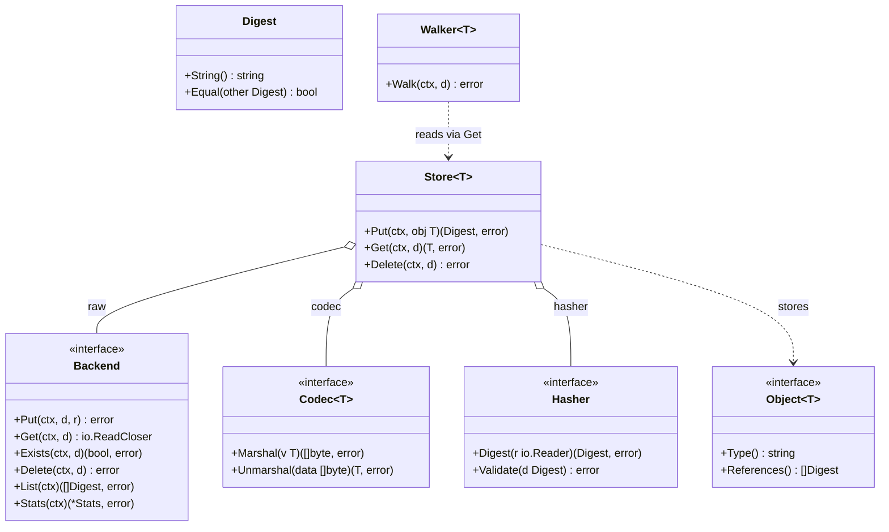

# CASK — Content Addressable Store Kit

[](https://github.com/dmundt/go-cask/actions/workflows/ci.yml)
[](https://pkg.go.dev/github.com/dmundt/go-cask)
[](LICENSE)

A generic, Git-like **content-addressable store** for Go: store any bytes once under the digest of their content, reference them by digest, and build typed object graphs on top — reusable across apps and domains.

- **Content-addressable** — same bytes ⇒ same digest ⇒ stored once (dedup).
- **Immutable and verifiable** — objects never change; `Verify` detects corruption.
- **Generic core, typed apps** — the `cas` core knows nothing about your types; each app layers its own `Object[T]` model on top (the `gitlike` package is the shared reference object model).
- **Composable** — codecs and storage backends (filesystem + memory ship) plug in behind one `Backend` contract, and the client injects its hash algorithm (`cas/hash/sha256` ships as go-cask's default; the core names none).
- **Simple, fast, powerful** — lock-free reads, streaming I/O, multi-process-safe writers, semver-versioned object models, GC from roots with a Git-style grace period.
- **Policy matters** — the core is generic and format-agnostic; the project recommends `SHA-256` + JSON for durable work, `SHA-512/256` as a fast secure alternative, and supports a compact custom binary payload codec (`cas/codec/binary`) for explicit per-type layouts when compactness matters. Legacy/compatibility choices such as `cas/codec/gob`, MD5 and SHA-1 are marked as migration-only or Go-only compatibility options.

## Design decisions

A **single-host content-addressable store kit**. Each named spec is the normative contract:
- **No network surface ships.** Product = `cas` + CLI + embedded viewer; no CAS JSON API, SDK, or server binary. HTTP exposure is an app pattern ([examples/](examples/)) — backend-architecture §1.
- **Viewer is a byte-layer admin tool** — objects/bytes/integrity, never typed references; product code never imports [examples/](examples/) (viewer-design §7, coding-guidelines §9).
- **Dependencies one-directional** — [cas/](cas/), [internal/](internal/), [cmd/](cmd/) never import [examples/](examples/); examples are self-contained except the shared `gitlike` library.
- **Lean generic core** — app-agnostic [cas/](cas/) that names no hash algorithm (the client injects a `cas.Hasher`; `cas/hash/sha256` is go-cask's default), reference `fs`+`mem` backends and a JSON codec; only the cas-core §7.1 surface is stable.
- **Byte layer policy-free** — GC/prune take app roots; no per-object pinned property; the store never interprets typed references (consistency §4).
- **Concurrent by construction** — writes safe across processes (unique temps + atomic rename); sweeps (`gc`/`prune`/`clean`) hold an exclusive lock and reclaim only objects older than `--min-age`, so fresh writes survive (cas-core §6).
- **Examples teach; the `gitlike` package is the shared reference** — the runnable examples teach seams (`artifacts` = compression codec, `api` = HTTP exposure); gitlike is a reference/copy-source object model apps import or copy.

## Repository layout

- [cas/](cas/) — the public core library (package `cas`): generic, app-agnostic, stable surface.
- [internal/](internal/) — implementation details: viewer, index, and local helpers not meant to be imported outside the module.
- [gitlike/](gitlike/) — shared reference object-model library (package `gitlike`): a copyable template for typed object graphs.
- [examples/](examples/) — runnable example programs showing how to use the core and the reference model.
- [benchmarks/](benchmarks/) — benchmark suite and operator docs; see [benchmarks/README.md](benchmarks/README.md) and [benchmarks/AGENT.md](benchmarks/AGENT.md).
- [cmd/](cmd/) — CLI entry point: `cask` store operations and the embedded viewer (`cask web`).
- [docs/specs/](docs/specs/) — the normative specification set; start at [docs/specs/AGENT.md](docs/specs/AGENT.md) and [docs/index.md](docs/index.md).
- [docs/design/](docs/design/) — non-normative design/background material.
- [AGENTS.md](AGENTS.md) — repo-root agent instructions and rule index entry point.
- [.github/](.github/) — CI configuration and automation only.


## Core interfaces at a glance

`cas` layers a non-generic **byte layer** (`Digest`, `Backend` + backends) under a generic **typed layer** (`Object[T]`, `Codec[T]`, `Store[T]`, `Walker[T]`), with caching wrappers on top. A store also carries the client's `Hasher` — the algorithm seam. Apps build their own `Object[T]` models on `Store[T]`.



## Recommended defaults

`cas` stays hash- and codec-agnostic by design, but the repo recommends a safe default for new durable data:

- Recommended hash: `SHA-256` (`cas/hash/sha256`)
- Fast secure alternative: `SHA-512/256` (`cas/hash/sha512_256`)
- Recommended object format: JSON (`cas/codec/json`) for readability and portability
- Compact custom option: binary payloads via `cas/codec/binary` when a stable per-type binary layout is required
- Opt-in compatibility codec: `gob` (`cas/codec/gob`) for Go-only compatibility, not for durable long-term storage

Legacy or compatibility-only hashes should not be used for new content-addressed data: MD5 and SHA-1 are migration-only or compatibility choices, not the default for a CAS.

## Security note

Use cryptographic hashes for object identity and integrity. For new data, prefer `SHA-256` or `SHA-512/256`. Do not use `MD5` or `SHA-1` for new content-addressed data, even when a legacy system still emits them; they are not recommended for new objects or new interoperability contracts.

## Upgrading

Current patch release: `v1.3.1`. This is a maintenance release that adds the compact binary codec docs and resolves the small generic constructor warning in the binary codec tests; it does not change the storage format or object layout.

`v1.3.0` is a **breaking MINOR**: the core is hash-agnostic (`cas.Hash` → `cas.Digest` + a client-injected `cas.Hasher`), `gitlike.NewRepository` takes a `gitlike.Codecs` set, object invariants moved to `cas.Validator`, and the filesystem layout lost its algorithm directory. Read the `[v1.3.0]` section of [CHANGELOG.md](CHANGELOG.md) and [docs/specs/operations.md](docs/specs/operations.md) §5 before pointing this build at an existing store — objects written by `v1.2.0` are not migrated.

## Quick start

```go
import (
    fs "github.com/dmundt/go-cask/cas/backend/fs" // or use the mem backend
    "github.com/dmundt/go-cask/cas"
    jsoncodec "github.com/dmundt/go-cask/cas/codec/json"
    sha256 "github.com/dmundt/go-cask/cas/hash/sha256"
    "github.com/dmundt/go-cask/gitlike"
)

raw, _ := fs.New("./objects")  // backend
// typed layer: the client supplies both the hasher and the codecs, so the
// repository names neither the algorithm nor the wire format.
repo := gitlike.NewRepository(raw, sha256.New(), gitlike.Codecs{
    Blob:   jsoncodec.New[*gitlike.Blob](),
    Tree:   jsoncodec.New[*gitlike.Tree](),
    Commit: jsoncodec.New[*gitlike.Commit](),
    Tag:    jsoncodec.New[*gitlike.Tag](),
})
d, _ := repo.Blobs.Put(ctx, andgitlike.Blob{Data: []byte("hello")})
blob, _ := repo.Blobs.Get(ctx, d)                 // *gitlike.Blob
```

For tests/ephemeral use, swap the backend:

```go
mem "github.com/dmundt/go-cask/cas/backend/mem" // declares package memory
raw := mem.New() // fast, deterministic, not persistent
```

## The specification set

[docs/specs/](docs/specs/) is the complete design contract: core architecture, coding guidelines, library design, performance, testing, consistency (GC/pruning), viewer HTTP surface, viewer design and security, versioning, defaults, examples, and extensions.

Note: the documentation tree under [docs/](docs/) follows the OKF frontmatter layout (`type`, `title`, `description`, `version` for each document, with `docs/index.md` as the top-level rule index).

Key references:
- [docs/index.md](docs/index.md) — path-to-spec lookup and rule mapping
- [docs/design/](docs/design/) — background and design notes
- [benchmarks/README.md](benchmarks/README.md) — benchmark suite guide and results

Use [docs/index.md](docs/index.md) to find the matching spec for a change area.

## Building and testing

```text
go build ./...
go vet ./...
go test -race ./...
gofmt -l .
```

Requires Go 1.27 (toolchain self-managing; library baseline Go 1.24+, needed for the `omitzero` JSON tags used by `cas.Digest` reference fields). See [CONTRIBUTING.md](CONTRIBUTING.md) for the workflow, and [benchmarks/README.md](benchmarks/README.md) for running/reading the benchmarks.

## License

MIT — see [LICENSE](LICENSE). Copyright (c) 2026 Daniel Mundt.
