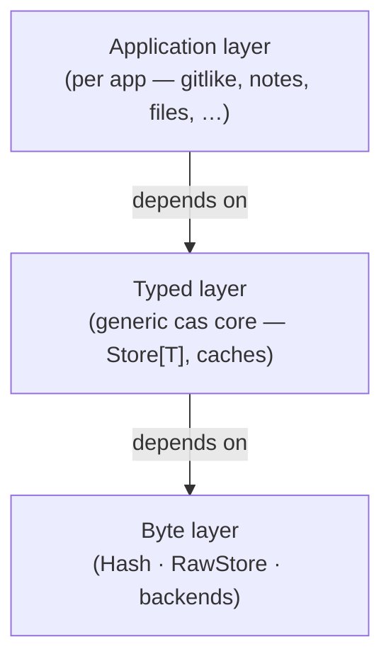
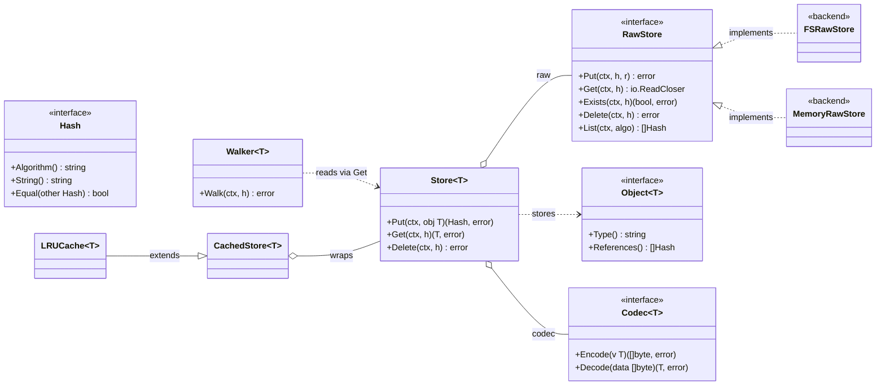

# CASK — Content Addressable Store Kit

[](https://github.com/dmundt/go-cask/actions/workflows/ci.yml)
[](https://github.com/dmundt/go-cask)
[](LICENSE)

A generic, Git-like **content-addressable store** for Go: store any bytes once under the hash of their content, reference them by
hash, and build typed object graphs on top — reusable across apps and
domains.

- **Content-addressable** — same bytes ⇒ same hash ⇒ stored once (dedup).
- **Immutable & verifiable** — objects never change; `Verify` detects any
  corruption.
- **Generic core, typed apps** — the `cas` core knows nothing about your
  types; each app layers its own `Object[T]` model on top (the `gitlike`
  package is the reference example).
- **Pluggable** — hash algorithms, codecs, and storage backends (filesystem
  and memory ship; more plug in behind one `RawStore` contract).
- **Simple, fast, powerful** — lock-free reads, streaming I/O,
  multi-process-safe writers, semver-versioned object models, GC from roots
  with a Git-style grace period — no over-engineering.

## Design principles & grounding

go-cask is a **single-host content-addressable store kit**. The durable
decisions that shape the repo (each named spec is the normative contract):

- **No network surface ships.** The product has no CAS JSON API, no client
  SDK, and no server binary — it is `cas` + the CLI + the embedded viewer.
  HTTP exposure is an app-author pattern, demonstrated by `examples/api`
  (backend-architecture §1).
- **The viewer is a byte-layer admin tool.** It shows objects, bytes, and
  integrity — never typed references or graphs — and product code never
  imports `examples/` (viewer-design §7, coding-guidelines §9).
- **Dependencies are one-directional.** `cas`/`internal`/`cmd` never import
  `examples/`; examples never import `internal/` and are self-contained
  except the `gitlike` shared reference library (examples §2 rule 11).
- **Lean generic core with reference implementations.** `cas` stays
  app-agnostic; each pluggable seam ships one reference (`sha1`/`sha256`,
  `MemoryRawStore`, `JSONCodec`), and only the cas-core §7.1 surface is
  stable — speculative surface is cut, not kept.
- **The byte layer is policy-free.** GC/prune take app-supplied roots;
  roots are pins (there is no per-object pinned property); the store never
  interprets typed references (consistency §4).
- **Concurrent by construction.** Object writes are safe across processes
  (unique per-writer temps + atomic rename); maintenance sweeps
  (`gc`/`prune`/`clean`) take an exclusive lock and reclaim only objects
  older than their `--min-age` grace, so a concurrent writer's fresh
  objects always survive (cas-core §6).
- **Examples teach, never ship.** `gitlike` is the shared reference object
  model; `artifacts` shows the compression-codec seam; `api` shows how an
  app exposes a store over HTTP.

## Repository layout

```text
cas/       core library (package cas) — generic, app-agnostic, public
internal/  implementation detail: web (the viewer), index
examples/  runnable example programs (incl. the gitlike reference object model)
cmd/       entry point: cask (CLI store ops; `cask web` starts the embedded viewer)
docs/instructions/  the specification set (19 specs + AGENT.md)
docs/design/  non-normative design docs (core-overview pointer, viewer-brief)
AGENTS.md  the agent aggregator at the repo root
.github/   CI only
```

## Core interfaces at a glance

`cas` is layered: a non-generic **byte layer** (`Hash`, `RawStore` + backends)
below a generic, constrained **typed layer** (`Object[T]`, `Codec[T]`,
`Store[T]`, `Walker[T]`), with caching wrappers on top. The typed layer
depends only on the byte layer; apps build their own `Object[T]` models on
`Store[T]`.

Architecture layers:



Interface detail:



## Quick start

```go
import (
    "github.com/dmundt/go-cask/cas"
    "github.com/dmundt/go-cask/examples/gitlike"
)

raw, _ := cas.NewFSRawStore("./objects")          // backend
repo, _ := gitlike.NewRepository(raw, "sha256")   // typed layer on top
h, _ := repo.Blobs.Put(ctx, &gitlike.Blob{Data: []byte("hello")})
blob, _ := repo.Blobs.Get(ctx, h)                // *gitlike.Blob
```

For tests and ephemeral use, swap the backend:

```go
raw := cas.NewMemoryRawStore() // fast, deterministic, not persistent
```

## The specification set

This project is specified, not guessed: `docs/instructions/` contains the
complete design contract — core architecture (`cas-core`), coding guidelines,
library design, performance, testing, consistency (GC/pruning), the viewer
HTTP surface, viewer design & security, versioning, defaults, examples,
and extensions. `docs/instructions/AGENT.md` in that folder is the
meta-guide; read it before editing any spec. The full inventory is in
`AGENT.md` §10. Non-normative design material lives in `docs/design/`
(the core-overview pointer and the viewer design brief). AI agents working
in this repo auto-load the repo-root `AGENTS.md`, which points at the full
set.

## Building & testing

```text
go build ./...
go vet ./...
go test -race ./...
gofmt -l .
```

Requires Go 1.27 (toolchain self-managing; library baseline Go 1.22+). See `CONTRIBUTING.md` for the
development workflow, and `docs/benchmarks.md` for how to run and read the
benchmarks (the regular perf suite and the on-demand scale probes).

## License

MIT — see [LICENSE](LICENSE). Copyright (c) 2026 Daniel Mundt.
