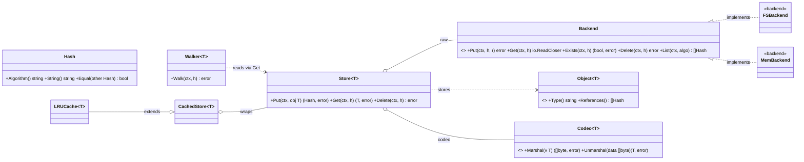

# CASK — Content Addressable Store Kit

[](https://github.com/dmundt/go-cask/actions/workflows/ci.yml)
[](https://pkg.go.dev/github.com/dmundt/go-cask)
[](LICENSE)

A generic, Git-like **content-addressable store** for Go: store any bytes once under the hash of their content, reference them by hash, and build typed object graphs on top — reusable across apps and domains.

- **Content-addressable** — same bytes ⇒ same hash ⇒ stored once (dedup).
- **Immutable & verifiable** — objects never change; `Verify` detects corruption.
- **Generic core, typed apps** — the `cas` core knows nothing about your types; each app layers its own `Object[T]` model on top (the `gitlike` package is the shared reference object model).
- **Pluggable** — hash algorithms, codecs, and storage backends (filesystem + memory ship; more plug in behind one `Backend` contract).
- **Simple, fast, powerful** — lock-free reads, streaming I/O, multi-process-safe writers, semver-versioned object models, GC from roots with a Git-style grace period.

## Design decisions

A **single-host content-addressable store kit**. Each named spec is the normative contract:
- **No network surface ships.** Product = `cas` + CLI + embedded viewer; no CAS JSON API, SDK, or server binary. HTTP exposure is an app pattern (`examples/api`) — backend-architecture §1.
- **Viewer is a byte-layer admin tool** — objects/bytes/integrity, never typed references; product code never imports `examples/` (viewer-design §7, coding-guidelines §9).
- **Dependencies one-directional** — `cas`/`internal`/`cmd` never import `examples/`; examples are self-contained except the shared `gitlike` library.
- **Lean generic core** — app-agnostic `cas` with reference implementations for each pluggable seam (`sha256`; `fs`+`mem` backends; JSON codec); only the cas-core §7.1 surface is stable.
- **Byte layer policy-free** — GC/prune take app roots; no per-object pinned property; the store never interprets typed references (consistency §4).
- **Concurrent by construction** — writes safe across processes (unique temps + atomic rename); sweeps (`gc`/`prune`/`clean`) hold an exclusive lock and reclaim only objects older than `--min-age`, so fresh writes survive (cas-core §6).
- **Examples teach; `gitlike/` is the shared reference** — the runnable examples teach seams (`artifacts` = compression codec, `api` = HTTP exposure); gitlike is a reference/copy-source object model apps import or copy.

## Repository layout

```text
cas/       core library (package cas) — generic, app-agnostic, public
internal/  implementation detail: web (the viewer), index
gitlike/  shared reference object-model library (package gitlike)
examples/  runnable example programs
benchmarks/  benchmark suite (bench_test.go + scale_bench_test.go) + README.md
cmd/       entry point: cask (CLI store ops; `cask web` starts the embedded viewer)
docs/specs/  the specification set (19 specs + AGENT.md)
docs/design/  non-normative design docs (core-overview pointer, viewer-brief)
AGENTS.md  the agent aggregator at the repo root
.github/   CI only
```

## Core interfaces at a glance

`cas` layers a non-generic **byte layer** (`Hash`, `Backend` + backends) under a generic **typed layer** (`Object[T]`, `Codec[T]`, `Store[T]`, `Walker[T]`), with caching wrappers on top. Apps build their own `Object[T]` models on `Store[T]`.



## Quick start

```go
import (
    fs "github.com/dmundt/go-cask/cas/backend/fs" // or use the mem backend
    "github.com/dmundt/go-cask/cas"
    "github.com/dmundt/go-cask/gitlike"
)

raw, _ := fs.New("./objects")                     // backend
repo, _ := gitlike.NewRepository(raw, "sha256")   // typed layer on top
h, _ := repo.Blobs.Put(ctx, &gitlike.Blob{Data: []byte("hello")})
blob, _ := repo.Blobs.Get(ctx, h)                 // *gitlike.Blob
```

For tests/ephemeral use, swap the backend:

```go
mem "github.com/dmundt/go-cask/cas/backend/mem" // declares package memory
raw := mem.New() // fast, deterministic, not persistent
```

## The specification set

`docs/specs/` is the complete design contract: core architecture, coding guidelines, library design, performance, testing, consistency (GC/pruning), viewer HTTP surface, viewer design & security, versioning, defaults, examples, extensions. Read `docs/specs/AGENT.md` (its meta-guide) before editing any spec; the full inventory is in `AGENT.md` §10. Non-normative material lives in `docs/design/`. Agents auto-load the repo-root `AGENTS.md`, which points at the full set.

## Building & testing

```text
go build ./...
go vet ./...
go test -race ./...
gofmt -l .
```

Requires Go 1.27 (toolchain self-managing; library baseline Go 1.22+). See `CONTRIBUTING.md` for the workflow, and `benchmarks/README.md` for running/reading the benchmarks.

## License

MIT — see [LICENSE](LICENSE). Copyright (c) 2026 Daniel Mundt.
