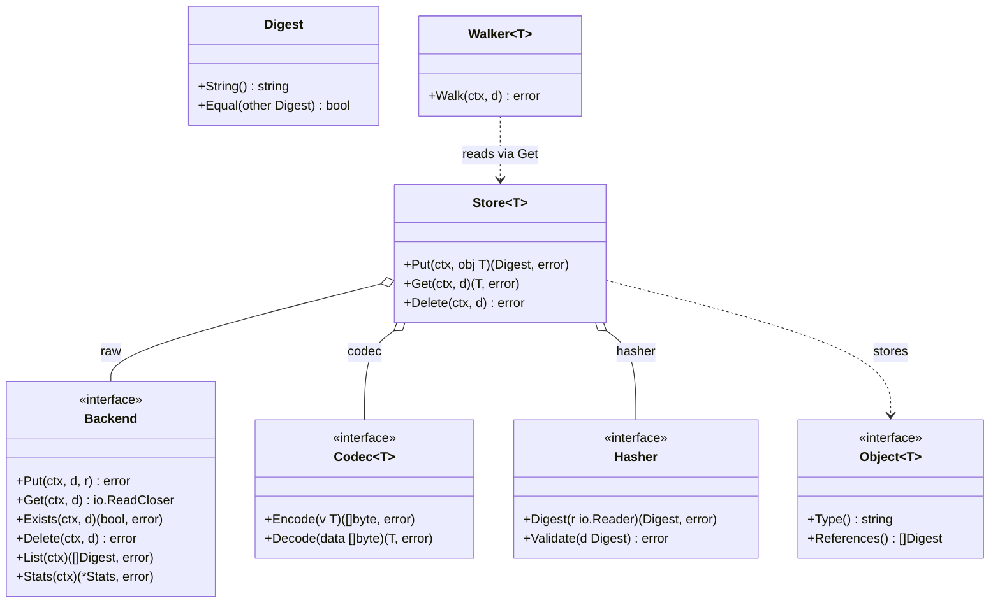

# CASK — Content-Addressable Store Kit

[](https://github.com/dmundt/go-cask/actions/workflows/ci.yml)
[](https://pkg.go.dev/github.com/dmundt/go-cask)
[](LICENSE)

CASK is a Git-like, content-addressable store for Go: bytes are keyed by their content digest, objects stay immutable, and typed application models sit on top of the generic core.

- **Deduplicated by content** — identical bytes map to the same digest and are stored once.
- **Typed on top** — the `cas` core stays generic; each app defines its own `Object[T]` and `Store[T]` model.
- **Composable** — backends and codecs plug in behind the `Backend` and `Codec[T]` contracts; the client supplies the hash algorithm (`sha256` is the default).
- **Fast by default** — lock-free reads, streaming I/O, atomic writes, and GC from roots keep the core simple and efficient.
- **Optional acceleration** — `cas/bloom` adds hot-path absence checks; the stdlib-style `gzip`, `zlib`, and `flate` codec wrappers compress payloads when the workload benefits.
- **Policy-aware** — the project default is `SHA-256` + `flate` for durable data, with `SHA-512/256` as a fast secure alternative; JSON and compact binary remain valid application-level choices.
- **Extensible helpers** — `cas/pack` provides chunking and sidecar metadata workflows without changing the identity model.
- **Layering stays clear** — the project uses one canonical sentence: `cas/backend/fs` is the filesystem backend, `cas/backend/packfs` is the storage backend with a private pack index format, and `cas/pack` is the optional helper used by apps and examples, not by backend internals.
- **Integrity checks are explicit** — `cas.Verify` and `cas.NewVerifier` separate object identity from validation, re-reading the bytes with the caller-supplied `Hasher` while the backend itself stays a storage-only `Digest -> bytes` layer.
- **Compatibility stays explicit** — `gob` remains Go-only, while MD5 and SHA-1 are migration-only choices rather than defaults.

## Table of contents

- [Design decisions](#design-decisions)
- [Repository layout](#repository-layout)
- [Core interfaces at a glance](#core-interfaces-at-a-glance)
- [Recommended defaults](#recommended-defaults)
- [Viewer reference states](#viewer-reference-states)
- [Security note](#security-note)
- [Getting started](#getting-started)
- [Documentation map](#documentation-map)

## Design decisions

A **single-host content-addressable store**. Each named spec is the normative contract:
- **No network surface ships.** Product = `cas` + CLI + embedded viewer; no CAS JSON API, SDK, or server binary. HTTP exposure is an app pattern ([examples/](examples/)) — backend-architecture §1.
- **Viewer is a byte-layer admin tool** — objects/bytes/integrity, never typed references; product code never imports [examples/](examples/) (viewer-design §7, coding-guidelines §9).
- **Dependencies one-directional** — [cas/](cas/), [internal/](internal/), [cmd/](cmd/) never import [examples/](examples/); examples are self-contained except the shared `gitlike` library.
- **Lean generic core** — app-agnostic [cas/](cas/) that names no hash algorithm (the client injects a `cas.Hasher`; `cas/hash/sha256` is go-cask's default), reference `fs`+`mem` backends and a JSON codec; only the cas-core §7.1 surface is stable.
- **Byte layer policy-free** — GC/prune take app roots; no per-object pinned property; the store never interprets typed references (consistency §4).
- **Concurrent by construction** — writes safe across processes (unique temps + atomic rename); sweeps (`gc`/`prune`/`clean`) hold an exclusive lock and reclaim only objects older than `--min-age`, so fresh writes survive (cas-core §6).
- **Examples teach; the `gitlike` package is the shared reference** — the runnable examples teach seams (`artifacts` = compression codec, `api` = HTTP exposure); gitlike is a reference/copy-source object model apps import or copy.

## Repository layout

- [cas/](cas/) — the public core library (package `cas`): generic, app-agnostic, stable surface.
- [internal/](internal/) — implementation details: viewer, index, and local helpers not meant to be imported outside the module.
- [gitlike/](gitlike/) — shared reference object-model library (package `gitlike`): a copyable template for typed object graphs.
- [examples/](examples/) — runnable example programs showing how to use the core and the reference model.
- [benchmarks/](benchmarks/) — benchmark suite and operator docs; see [benchmarks/README.md](benchmarks/README.md) and [benchmarks/AGENT.md](benchmarks/AGENT.md).
- [cmd/](cmd/) — CLI entry point: `cask` store operations and the embedded viewer (`cask web`).
- [docs/specs/](docs/specs/) — the normative specification set; start at [docs/specs/AGENT.md](docs/specs/AGENT.md) and [docs/index.md](docs/index.md).
- [docs/design/](docs/design/) — non-normative design/background material.
- [AGENTS.md](AGENTS.md) — repo-root agent instructions and rule index entry point.
- [.github/](.github/) — CI configuration and automation only.


## Core interfaces at a glance

`cas` layers a non-generic **byte layer** (`Digest`, `Backend` + backends) under a generic **typed layer** (`Object[T]`, `Codec[T]`, `Store[T]`, `Walker[T]`), with caching wrappers on top. A store also carries the client's `Hasher` — the algorithm seam. Apps build their own `Object[T]` models on `Store[T]`.



## Recommended defaults

`cas` stays hash- and codec-agnostic by design, but the repo recommends a practical default policy for new durable data:

- Default hash: `SHA-256` (`cas/hash/sha256`)
- Default compression codec: `flate` (`cas/codec/flate`) for compressed object payloads
- Recommended object format: JSON (`cas/codec/json`) for readability and portability, layered behind the default `flate` compression when size reduction matters
- Fast secure alternative: `SHA-512/256` (`cas/hash/sha512_256`)
- Additional supported compression codecs: `gzip` and `zlib` (`cas/codec/gzip`, `cas/codec/zlib`) for workloads that prefer a different compression profile
- Shared pack helper: `cas/pack` for fixed-size chunking and sidecar metadata workflows in app-level storage patterns
- Compact custom option: binary payloads via `cas/codec/binary` when a stable per-type binary layout is required
- Opt-in compatibility codec: `gob` (`cas/codec/gob`) for Go-only compatibility, not for durable long-term storage

Legacy or compatibility-only hashes should not be used for new content-addressed data: MD5 and SHA-1 are migration-only or compatibility choices, not the default for a CAS.

## Viewer reference states

The embedded viewer (`cask web`) renders two independent axes per object when
a host supplies both a `ReachabilityIndex` and a `ReferenceIndex`: root
reachability (is it reachable from a configured root?) and inbound reference
count (how many other objects point to it?). Crossing those two axes gives
four reference states, shown as the `References` column and matched by the
`reach` filter:

| State | Reachable? | Inbound refs | Pill color | Meaning |
|---|---|---|---|---|
| `Resolved` | yes | > 0 | green | Interior node of a reachable subtree |
| `Root` | yes | 0 | blue | Entry point of a reachable subtree — structurally consistent with being a configured root, but the viewer never sees the host's actual root list, only these two indexes |
| `Orphaned` | no | > 0 | amber | Unreachable but still pointed to by something else |
| `Detached` | no | 0 | violet | Fully isolated — the true garbage-collection candidate |

`Root` and `Detached` require both indexes (`reach=root`/`reach=detached`
return 400 without a `ReferenceIndex`); `Resolved`/`Orphaned` only require a
`ReachabilityIndex`. See [docs/specs/viewer-design.md](docs/specs/viewer-design.md)
for the full normative contract.

## Security note

Use cryptographic hashes for object identity and integrity. For new data, prefer `SHA-256` or `SHA-512/256`. Do not use `MD5` or `SHA-1` for new content-addressed data, even when a legacy system still emits them; they are not recommended for new objects or new interoperability contracts.

## Upgrading

Current patch release: `v1.4.2`. This maintenance release documents the default policy as `SHA-256` + `flate` compression for durable payloads, refreshes the benchmark guidance to keep benchmark winners distinct from the project default, and keeps the canonical benchmark matrix in JSON for review and future analysis.

`v1.3.0` is a **breaking MINOR**: the core is hash-agnostic (`cas.Hash` → `cas.Digest` + a client-injected `cas.Hasher`), `gitlike.NewRepository` takes a `gitlike.Codecs` set, object invariants moved to `cas.Validator`, and the filesystem layout lost its algorithm directory. Read the `[v1.3.0]` section of [CHANGELOG.md](CHANGELOG.md) and [docs/specs/operations.md](docs/specs/operations.md) §5 before pointing this build at an existing store — objects written by `v1.2.0` are not migrated.

## Quick start

```go
import (
    fs "github.com/dmundt/go-cask/cas/backend/fs" // or use the mem backend
    "github.com/dmundt/go-cask/cas"
    jsoncodec "github.com/dmundt/go-cask/cas/codec/json"
    sha256 "github.com/dmundt/go-cask/cas/hash/sha256"
    "github.com/dmundt/go-cask/gitlike"
)

backend, _ := fs.New("./objects")  // backend
// typed layer: the client supplies both the hasher and the codecs, so the
// repository names neither the algorithm nor the wire format.
repo := gitlike.NewRepository(backend, sha256.New(), gitlike.Codecs{
    Blob:   jsoncodec.New[*gitlike.Blob](),
    Tree:   jsoncodec.New[*gitlike.Tree](),
    Commit: jsoncodec.New[*gitlike.Commit](),
    Tag:    jsoncodec.New[*gitlike.Tag](),
})
d, _ := repo.Blobs.Put(ctx, andgitlike.Blob{Data: []byte("hello")})
blob, _ := repo.Blobs.Get(ctx, d)                 // *gitlike.Blob
```

For tests/ephemeral use, swap the backend:

```go
mem "github.com/dmundt/go-cask/cas/backend/mem" // declares package memory
backend := mem.New() // fast, deterministic, not persistent
```

## The specification set

[docs/specs/](docs/specs/) is the complete design contract: core architecture, coding guidelines, library design, performance, testing, consistency (GC/pruning), viewer HTTP surface, viewer design and security, versioning, defaults, examples, and extensions.

Published developer documentation is available at
[dmundt.github.io/go-cask](https://dmundt.github.io/go-cask/).

Note: the documentation tree under [docs/](docs/) follows the OKF frontmatter layout (`type`, `title`, `description`, `version` for each document, with `docs/index.md` as the top-level rule index).

Key references:
- [docs/index.md](docs/index.md) — path-to-spec lookup and rule mapping
- [docs/design/](docs/design/) — background and design notes
- [benchmarks/README.md](benchmarks/README.md) — benchmark suite guide and results

Use [docs/index.md](docs/index.md) to find the matching spec for a change area.

## Building and testing

```text
go build ./...
go vet ./...
go test -race ./...
gofmt -l .
```

Requires Go 1.27 (toolchain self-managing; library baseline Go 1.24+, needed for the `omitzero` JSON tags used by `cas.Digest` reference fields). See [CONTRIBUTING.md](CONTRIBUTING.md) for the workflow, and [benchmarks/README.md](benchmarks/README.md) for running/reading the benchmarks.

## License

MIT — see [LICENSE](LICENSE). Copyright (c) 2026 Daniel Mundt.
