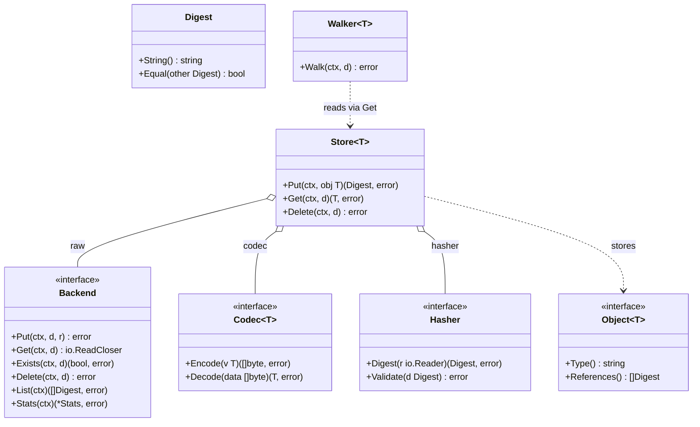

# CASK — Content-Addressable Store Kit

[](https://github.com/dmundt/go-cask/actions/workflows/ci.yml)
[](https://pkg.go.dev/github.com/dmundt/go-cask)
[](LICENSE)

CASK is a Git-like, content-addressable store for Go: bytes keyed by content digest, immutable objects, typed application models on a generic core.

- **Deduplicated by content** — identical bytes share one digest and one stored copy.
- **Typed on top** — the `cas` core stays generic; each app defines its own `Object[T]` and `Store[T]` model.
- **Composable** — backends and codecs plug in behind `Backend` and `Codec[T]`; the client supplies the hash algorithm (`sha256` default).
- **Fast by default** — lock-free reads (`fs`; the opt-in packfile backend serializes its index), streaming I/O, atomic writes, GC from roots.
- **Optional acceleration** — `cas/bloom` adds hot-path absence checks; stdlib-style `gzip`, `zlib` and `flate` wrappers compress payloads when the workload benefits.
- **Policy-aware** — project default is `SHA-256` + `flate` for durable data, `SHA-512/256` as the fast secure alternative; JSON and compact binary remain valid app-level choices.
- **Extensible helpers** — `cas/pack` provides chunking and sidecar metadata workflows without changing the identity model.
- **Layering stays clear** — canonical sentence: `cas/backend/fs` is the filesystem backend, `cas/backend/packfs` is the storage backend with a private pack index format, and `cas/pack` is the optional helper used by apps and examples, not by backend internals.
- **Integrity checks are explicit** — `cas.Verify` and `cas.NewVerifier` separate identity from validation, re-reading bytes with the caller-supplied `Hasher` while the backend stays a storage-only `Digest -> bytes` layer.
- **Cheap checks are opt-in** — `cas/verify/sidecar` records a per-object checksum (`crc32`, `adler32` or `crc64`) at `<base>/.meta/<hex>.json` beside objects still addressed by `SHA-256`, and `cask verify -checksums` checks stored bytes against it; deleting records loses the cheap check, never an object.
- **Compatibility stays explicit** — `gob` remains Go-only, and no MD5 or SHA-1 hasher ships: a legacy algorithm needs a client-supplied `cas.Hasher` (`Digest` + `Validate`), and neither is for new data.

## Table of contents

- [Design decisions](#design-decisions)
- [Repository layout](#repository-layout)
- [Core interfaces at a glance](#core-interfaces-at-a-glance)
- [Recommended defaults](#recommended-defaults)
- [Security note](#security-note)
- [Quick start](#quick-start)
- [The specification set](#the-specification-set)
- [Building and testing](#building-and-testing)
- [License](#license)

## Design decisions

A **single-host content-addressable store**. Each named spec is the normative contract:
- **No network surface ships** — product = `cas` + CLI + embedded viewer; no CAS JSON API, SDK or server binary. HTTP exposure is an app pattern ([examples/](examples/)) — backend-architecture §1.
- **Viewer is a byte-layer admin tool** — objects/bytes/integrity, never typed references; product code never imports [examples/](examples/) (viewer-design §7, coding-guidelines §9).
- **Dependencies one-directional** — [cas/](cas/) → [gitlike/](gitlike/) → [examples/](examples/); [cas/](cas/), [internal/](internal/) and [cmd/](cmd/) never import [examples/](examples/), and the product never imports [gitlike/](gitlike/). Examples may import `cas` and `gitlike`, and nothing else outside themselves.
- **Lean generic core** — app-agnostic [cas/](cas/) that names no hash algorithm (the client injects a `cas.Hasher`; `cas/hash/sha256` is go-cask's default), reference `fs`+`mem` backends plus opt-in `packfs`, and a JSON codec; only the cas-core §7.1 surface is stable.
- **Byte layer policy-free** — GC/prune take app roots; no per-object pinned property; the store never interprets typed references (consistency §4).
- **Concurrent by construction** — writes safe across processes (unique temps + atomic rename); sweeps (`gc`/`prune`/`clean`) hold an exclusive lock and reclaim only objects older than `--min-age`, so fresh writes survive (cas-core §6).
- **Examples teach; the `gitlike` package is the shared reference** — examples teach seams (`artifacts` = compression codec, `api` = HTTP exposure); gitlike is a reference/copy-source object model apps import or copy.

## Repository layout

- [cas/](cas/) — the public core library (package `cas`): generic, app-agnostic, stable surface. Its subpackages are routed row by row in [docs/index.md](docs/index.md), not listed here: `backend/*` (`fs`, `mem`, `packfs`), `bloom`, `cache`, `codec`, `hash`, `pack`, `refs`, `repo`, `verify`.
- [internal/](internal/) — implementation details: viewer, index, store, test, the repo-wide design-rule checks (`internal/design/`), the gate's build decisions (`internal/build/`), and local helpers not meant to be imported outside the module; the viewer package starts at [internal/web/README.md](internal/web/README.md).
- [gitlike/](gitlike/) — shared reference object-model library (package `gitlike`): a copyable template for typed object graphs (`Blob`/`Tree`/`Commit`/`Tag`, `Repository`, `Resolver`, `WalkGraph`).
- [examples/](examples/) — runnable example programs showing how to use the core and the reference model (per [docs/specs/examples.md](docs/specs/examples.md)).
- [benchmarks/](benchmarks/) — benchmark suite and operator docs; see [benchmarks/README.md](benchmarks/README.md) and [benchmarks/AGENT.md](benchmarks/AGENT.md).
- [cmd/](cmd/) — command-line entry points: `cask` store operations and the embedded viewer (`cask web`), documented in [cmd/cask/README.md](cmd/cask/README.md), plus `gate`, the gate's developer tool for the build decisions above.
- [docs/index.md](docs/index.md) — the rule file index: read it first, then the spec it maps your path to.
- [docs/specs/](docs/specs/) — the normative specification set (23 files: 21 specs + `AGENT.md` + `index.md`); start at [docs/specs/AGENT.md](docs/specs/AGENT.md).
- [docs/design/](docs/design/) — non-normative design/background material: briefs, audits, mockups and implementation plans ([docs/design/index.md](docs/design/index.md)).
- [website/](website/) — public site sources, built with MkDocs Material ([website/AGENT.md](website/AGENT.md)).
- [scripts/](scripts/) — gate, landing and release tooling ([scripts/README.md](scripts/README.md), [scripts/AGENT.md](scripts/AGENT.md)).
- [AGENTS.md](AGENTS.md) — repo-root agent router: the rules a session must obey, and the pointer to the spec that owns the path you are editing.
- [.agents/skills/](.agents/skills/) — agent skills discovered at the project root, one directory bundle per skill (`cask-change`, the change playbook; `coordinate`, the multi-lane playbook).
- [.github/](.github/) — CI configuration and automation only; no product code.

## Core interfaces at a glance

`cas` layers a non-generic **byte layer** (`Digest`, `Backend` + backends) under a generic **typed layer** (`Object[T]`, `Codec[T]`, `Store[T]`, `Walker[T]`), with caching wrappers on top. A store also carries the client's `Hasher` — the algorithm seam. Apps build their own `Object[T]` models on `Store[T]`.


```mermaid
classDiagram
    direction TB
    class Digest {
        +String() string
        +Equal(other Digest) bool
    }
    class Hasher {
        <<interface>>
        +Digest(r io.Reader) (Digest, error)
        +Validate(d Digest) error
    }
    class Backend {
        <<interface>>
        +Put(ctx, d, r) error
        +Get(ctx, d) io.ReadCloser
        +Exists(ctx, d) (bool, error)
        +Delete(ctx, d) error
        +List(ctx) ([]Digest, error)
        +Stats(ctx) (*Stats, error)
    }
    class Object~T~ {
        <<interface>>
        +Type() string
        +References() []Digest
    }
    class Codec~T~ {
        <<interface>>
        +Encode(v T) ([]byte, error)
        +Decode(data []byte) (T, error)
    }
    class Store~T~ {
        +Put(ctx, obj T) (Digest, error)
        +Get(ctx, d) (T, error)
        +Delete(ctx, d) error
    }
    class Walker~T~ {
        +Walk(ctx, d) error
    }
    Store~T~ o-- Backend : raw
    Store~T~ o-- Codec~T~ : codec
    Store~T~ o-- Hasher : hasher
    Store~T~ ..> Object~T~ : stores
    Walker~T~ ..> Store~T~ : reads via Get
```

## Recommended defaults

`cas` stays hash- and codec-agnostic by design, but the repo recommends a practical default policy for new durable data:

- Default hash: `SHA-256` (`cas/hash/sha256`)
- Default compression codec: `flate` (`cas/codec/flate`) for compressed object payloads
- Recommended object format: JSON (`cas/codec/json`) for readability and portability, layered behind the default `flate` compression when size reduction matters
- Fast secure alternative: `SHA-512/256` (`cas/hash/sha512_256`)
- Additional supported compression codecs: `gzip` and `zlib` (`cas/codec/gzip`, `cas/codec/zlib`) for a different compression profile
- Shared pack helper: `cas/pack` for fixed-size chunking and sidecar metadata workflows in app-level storage patterns
- Compact custom option: binary payloads via `cas/codec/binary` when a stable per-type binary layout is required
- Opt-in compatibility codec: `gob` (`cas/codec/gob`) for Go-only compatibility, not for durable long-term storage

This module ships `SHA-256`, `SHA-512` and `SHA-512/256` only: neither MD5 nor SHA-1 can address a new store without a client-supplied `cas.Hasher` — a migration bridge for a legacy store, not a supported default.

## Security note

Use cryptographic hashes for object identity and integrity. For new data, prefer `SHA-256` or `SHA-512/256`. Do not use `MD5` or `SHA-1` for new content-addressed data, even when a legacy system still emits them; they are not recommended for new objects or interoperability contracts, and this module ships no hasher for either — a legacy source needs a client-supplied `cas.Hasher`, which does not make the algorithm a default.

## Upgrading

The current release and every notable change before it are recorded in [CHANGELOG.md](CHANGELOG.md), which the website also publishes as [go-cask.dev/changelog](https://go-cask.dev/changelog/): read its newest released section, then the version-specific notes below.

`v1.3.0` is a **breaking MINOR**: the core is hash-agnostic (`cas.Hash` → `cas.Digest` + a client-injected `cas.Hasher`), `gitlike.NewRepository` takes a `gitlike.Codecs` set, object invariants moved to `cas.Validator`, and the filesystem layout lost its algorithm directory. Read the `[v1.3.0]` section of [CHANGELOG.md](CHANGELOG.md) and [docs/specs/operations.md](docs/specs/operations.md) §5 before pointing this build at an existing store — objects written by `v1.2.0` are not migrated.

## Quick start

```go
import (
    fs "github.com/dmundt/go-cask/cas/backend/fs" // or use the mem backend
    "github.com/dmundt/go-cask/cas"
    jsoncodec "github.com/dmundt/go-cask/cas/codec/json"
    sha256 "github.com/dmundt/go-cask/cas/hash/sha256"
    "github.com/dmundt/go-cask/gitlike"
)

backend, _ := fs.New("./objects")  // backend
// typed layer: the client supplies both the hasher and the codecs, so the
// repository names neither the algorithm nor the wire format.
repo := gitlike.NewRepository(backend, sha256.New(), gitlike.Codecs{
    Blob:   jsoncodec.New[*gitlike.Blob](),
    Tree:   jsoncodec.New[*gitlike.Tree](),
    Commit: jsoncodec.New[*gitlike.Commit](),
    Tag:    jsoncodec.New[*gitlike.Tag](),
})
d, _ := repo.Blobs.Put(ctx, &gitlike.Blob{Data: []byte("hello")})
blob, _ := repo.Blobs.Get(ctx, d)                 // *gitlike.Blob
```

For tests/ephemeral use, swap the backend:

```go
backmem "github.com/dmundt/go-cask/cas/backend/mem" // package memory; aliased per cas/AGENT.md
backend := backmem.New() // fast, deterministic, not persistent
```

## The specification set

[docs/specs/](docs/specs/) is the complete design contract: core architecture, coding guidelines, library design, performance, testing, consistency (GC/pruning), viewer HTTP surface, viewer design and security, versioning, defaults, examples, and extensions.

Published developer documentation: [dmundt.github.io/go-cask](https://dmundt.github.io/go-cask/).

The [docs/](docs/) tree follows the OKF frontmatter layout (`type`, `title`, `description`, `version` per document, with `docs/index.md` as the top-level rule index).

Key references:
- [docs/index.md](docs/index.md) — path-to-spec lookup and rule mapping; use it to find the matching spec for a change area
- [docs/design/](docs/design/) — background and design notes
- [benchmarks/README.md](benchmarks/README.md) — benchmark suite guide and results

## Building and testing

```text
go build ./...
go vet ./...
go test -race ./...
gofmt -l .
```

Requires Go 1.24 or newer: the module declares `go 1.24` with a self-managing `toolchain go1.27.1`, and the 1.24 floor is what the `omitzero` JSON tags used by `cas.Digest` reference fields need ([library-design.md](docs/specs/library-design.md) §5, [coding-guidelines.md](docs/specs/coding-guidelines.md) §1). See [CONTRIBUTING.md](CONTRIBUTING.md) for the workflow, and [benchmarks/README.md](benchmarks/README.md) for running/reading the benchmarks.

## License

MIT — see [LICENSE](LICENSE). Copyright (c) 2026 Daniel Mundt.
