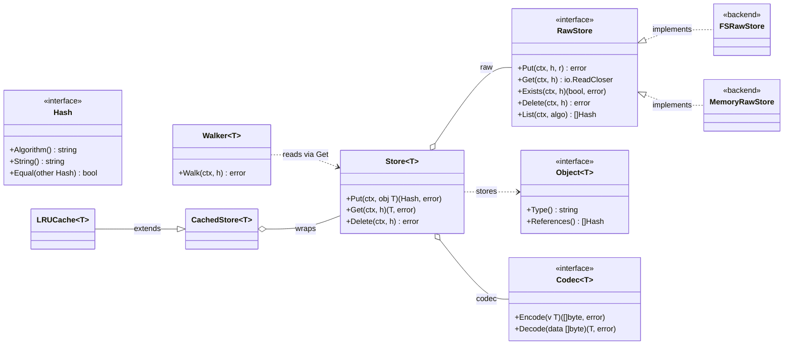

# Core Overview — go-cask

> A single-picture orientation to the `cas` core: the interfaces and how
> they depend on each other. **Not normative** — the authoritative
> architecture, contracts, and aspect diagrams live in
> `.github/instructions/cas-core.instructions.md` §3 (this diagram is the
> same as the §3.3 overview).

Reading the diagram:

- **Byte layer (non-generic).** `RawStore` is the storage contract; the
  backends implement it (`FSRawStore` reference, `MemoryRawStore` tests).
  `Hash` addresses everything.
- **Typed layer (generic, constrained).** `Store[T]` is the hub: it composes
  a `RawStore` (where bytes live) and a `Codec[T]` (how values serialize),
  and by constraint (`Store[T Object[T]]`) every value it handles is an
  `Object[T]`. `Walker[T]` traverses object graphs through a `Store[T]` via
  `Get` — no domain knowledge in the core.
- **Caching.** `CachedStore[T]` wraps `Store[T]` (lazy `CachedObject[T]`
  proxies); `LRUCache[T]` extends `CachedStore[T]` with a size bound.

Apps never touch the byte layer directly; they define `Object[T]` types and
use per-type `Store[T]` instances (the `examples/gitlike` model is the
reference).
