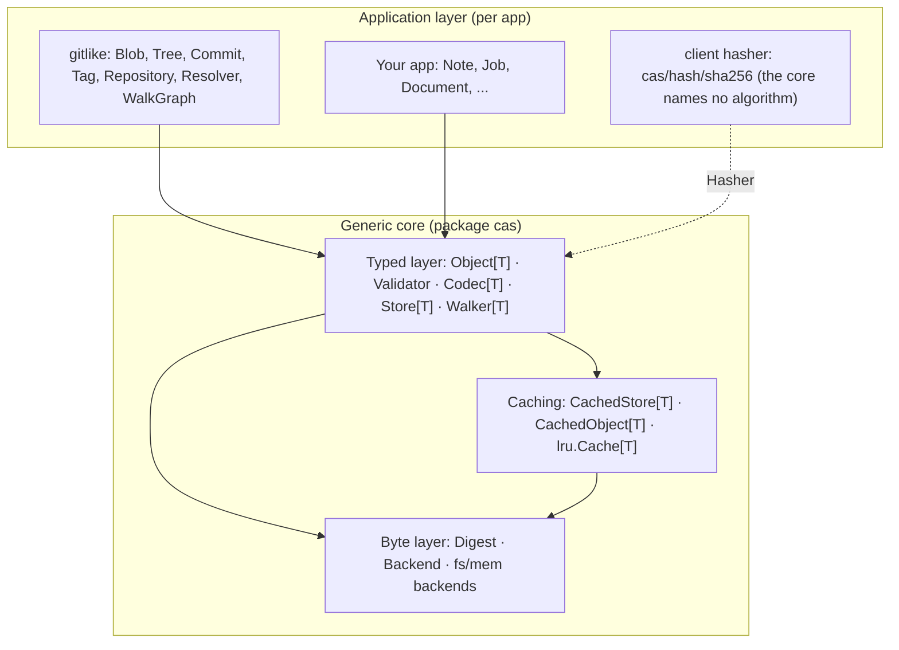

# Core Overview — go-cask

Brief, **non-normative** orientation to the `cas` interfaces. The canonical overview diagram (byte → typed → caching layers) and the four focused aspect diagrams live in [`../specs/cas-core.md`](../specs/cas-core.md) §3.3 — edit there so this pointer and the README cannot drift from the spec. The component contracts are cas-core §4.

## Layers

```text
┌─────────────────────────────────────────────────────────────┐
│ Apps / domains (define their own Object[T] types on top)    │
│   NoteStore, JobStore, DocumentStore, Git-like, ...         │
├─────────────────────────────────────────────────────────────┤
│ Typed layer (generic, no any)                               │
│   Object[T] · Validator · Codec[T] · Store[T] · Walker[T]   │
│   CachedStore[T] / CachedObject[T] / lru.Cache[T]           │
├─────────────────────────────────────────────────────────────┤
│ Byte layer (non-generic)                                    │
│   Digest (raw bytes) · Backend interface                    │
│   Backends: fs (reference), mem (tests) subpackages       │
└─────────────────────────────────────────────────────────────┘
```



## Components

| Concept          | Responsibility                                              |
| ---------------- | ----------------------------------------------------------- |
| `Digest`         | Content address: raw digest bytes, rendered as one hex string |
| `Hasher`         | The client's algorithm: `Digest(io.Reader)` + `Validate(Digest)`; `cas/hash/sha256` ships the default |
| `Validator`      | Optional object invariant (`Validate() error`): the store calls it on `Put` and `Get`, so it holds under any codec |
| `Backend`       | Raw byte storage interface (non-generic)                    |
| `fs` backend    | Filesystem backend (`cas/backend/fs`, `fs.New`): n-way fan-out paths (Git-like default), atomic writes, locking |
| `mem` backend   | In-memory backend (`cas/backend/mem`, imported as `backmem`) for tests/benchmarks (no disk I/O, not persistent) |
| `packfs` backend | Opt-in packfile backend (`cas/backend/packfs`, `packfs.New` + `packfs.WithEnabled`): the loose tree plus append-only packs and a JSON index, selected by `cask -backend packfs`. Shipped, but no pack compaction — a sweep reclaims correctness, not space (cas-core §4.14) |
| `Codec[T]`       | Serialization contract for a type `T`                       |
| `Object[T]`      | Self-describing, typed object with `References()`           |
| `Store[T]`       | Generic store: Put/PutDedup/Get/GetRaw/Exists/Delete          |
| `Walker[T]`      | Generic graph traversal over `References()`                 |
| `CachedStore[T]` | Lazy loading + caching wrapper around `Store[T]`            |
| `lru.Cache[T]`   | Size-bounded cache with LRU eviction                        |
| *(gitlike)* `Blob`/`Tree`/`Commit`/`Tag` | Reference `Object[T]` types (application layer)   |
| *(gitlike)* `Repository`/`Resolver`/`ResolvedObject`/`WalkGraph` | Reference per-type stores + type-safe resolution (application layer) |
| *(gitlike)* `CachedRepository`/`Preloader` | Reference repository-bound caches (application layer) |

The `cas` package is **generic only**. Everything marked *(gitlike)* lives in
the separate `gitlike/` reference library and is NOT part of the core — apps
build their own equivalents for their own types.
