# Package Dependency Graph — go-cask

The local dependency graph of every package in this module, grouped by layer. An
edge points from the importing package to the package it imports, so the
applications sit at the top and `cas` — which imports no local package at all —
sits at the bottom.

The diagram is generated from `go list` by `scripts/dep-graph.sh`; edit that
script, not this file. Only production imports are drawn: imports that appear
solely in `_test.go` files are excluded and the standard library is not drawn, so
this is the consumer-visible build graph. The local package and edge sets do not
vary with `GOOS` or `GOARCH`, so the file is reproducible on any host.

```mermaid
flowchart TD
  subgraph APPS["Applications - cmd/cask, examples, benchmarks"]
    benchmarks["benchmarks"]
    cmd_cask["cmd/cask"]
    examples_api_demo["examples/api/demo"]
    examples_api_server["examples/api/server"]
    examples_artifacts["examples/artifacts"]
    examples_bloom["examples/bloom"]
    examples_files["examples/files"]
    examples_notes["examples/notes"]
    examples_pack["examples/pack"]
  end
  subgraph REFERENCE["Reference library - gitlike"]
    gitlike["gitlike"]
  end
  subgraph INTERNAL["internal - not importable outside the module"]
    internal_design["internal/design"]
    internal_index["internal/index"]
    internal_store["internal/store"]
    internal_test["internal/test"]
    internal_web["internal/web"]
    internal_website["internal/website"]
  end
  subgraph HELP["cas helper and typed layer"]
    cas_bloom["cas/bloom"]
    cas_bloom_counting["cas/bloom/counting"]
    cas_bloom_persistent["cas/bloom/persistent"]
    cas_bloom_standard["cas/bloom/standard"]
    cas_cache["cas/cache"]
    cas_cache_lru["cas/cache/lru"]
    cas_cache_mem["cas/cache/mem"]
    cas_cache_prefetch["cas/cache/prefetch"]
    cas_codec_binary["cas/codec/binary"]
    cas_codec_cbor["cas/codec/cbor"]
    cas_codec_flate["cas/codec/flate"]
    cas_codec_gob["cas/codec/gob"]
    cas_codec_gzip["cas/codec/gzip"]
    cas_codec_internal_bounded["cas/codec/internal/bounded"]
    cas_codec_json["cas/codec/json"]
    cas_codec_zlib["cas/codec/zlib"]
    cas_hash["cas/hash"]
    cas_hash_sha256["cas/hash/sha256"]
    cas_hash_sha512["cas/hash/sha512"]
    cas_hash_sha512_256["cas/hash/sha512_256"]
    cas_pack["cas/pack"]
    cas_refs["cas/refs"]
    cas_repo["cas/repo"]
    cas_verify_adler32["cas/verify/adler32"]
    cas_verify_crc32["cas/verify/crc32"]
    cas_verify_crc64["cas/verify/crc64"]
    cas_verify_sidecar["cas/verify/sidecar"]
  end
  subgraph BYTE["cas/backend - byte layer"]
    cas_backend["cas/backend"]
    cas_backend_fs["cas/backend/fs"]
    cas_backend_mem["cas/backend/mem"]
    cas_backend_packfs["cas/backend/packfs"]
    cas_backend_snapshot["cas/backend/snapshot"]
  end
  subgraph CORE["cas - generic core"]
    cas["cas"]
  end

  cas_backend_fs --> cas
  cas_backend_fs --> cas_backend
  cas_backend_mem --> cas
  cas_backend_mem --> cas_backend
  cas_backend_packfs --> cas
  cas_backend_packfs --> cas_backend
  cas_backend_packfs --> cas_backend_fs
  cas_backend_snapshot --> cas
  cas_backend_snapshot --> cas_backend
  cas_bloom_counting --> cas
  cas_bloom_counting --> cas_bloom
  cas_bloom_persistent --> cas
  cas_bloom_persistent --> cas_bloom
  cas_bloom_standard --> cas
  cas_bloom_standard --> cas_bloom
  cas_bloom --> cas
  cas_cache_lru --> cas
  cas_cache_lru --> cas_cache
  cas_cache_lru --> cas_cache_mem
  cas_cache_mem --> cas
  cas_cache_prefetch --> cas
  cas_cache_prefetch --> cas_cache_mem
  cas_codec_binary --> cas
  cas_codec_cbor --> cas
  cas_codec_flate --> cas
  cas_codec_flate --> cas_codec_internal_bounded
  cas_codec_gob --> cas
  cas_codec_gzip --> cas
  cas_codec_gzip --> cas_codec_internal_bounded
  cas_codec_internal_bounded --> cas
  cas_codec_zlib --> cas
  cas_codec_zlib --> cas_codec_internal_bounded
  cas_hash_sha256 --> cas
  cas_hash_sha256 --> cas_hash
  cas_hash_sha512 --> cas
  cas_hash_sha512 --> cas_hash
  cas_hash_sha512_256 --> cas
  cas_hash_sha512_256 --> cas_hash
  cas_hash --> cas
  cas_pack --> cas
  cas_refs --> cas
  cas_repo --> cas
  cas_verify_adler32 --> cas
  cas_verify_adler32 --> cas_hash
  cas_verify_crc32 --> cas
  cas_verify_crc32 --> cas_hash
  cas_verify_crc64 --> cas
  cas_verify_crc64 --> cas_hash
  cas_verify_sidecar --> cas
  cmd_cask --> cas
  cmd_cask --> cas_hash
  cmd_cask --> cas_hash_sha256
  cmd_cask --> cas_hash_sha512
  cmd_cask --> cas_hash_sha512_256
  cmd_cask --> cas_verify_adler32
  cmd_cask --> cas_verify_crc32
  cmd_cask --> cas_verify_crc64
  cmd_cask --> cas_verify_sidecar
  cmd_cask --> internal_index
  cmd_cask --> internal_store
  cmd_cask --> internal_web
  examples_api_server --> cas
  examples_api_server --> cas_backend_fs
  examples_api_server --> cas_hash_sha256
  examples_artifacts --> cas
  examples_artifacts --> cas_backend_fs
  examples_artifacts --> cas_cache_lru
  examples_artifacts --> cas_cache_mem
  examples_artifacts --> cas_codec_gzip
  examples_artifacts --> cas_codec_json
  examples_artifacts --> cas_hash_sha256
  examples_artifacts --> cas_refs
  examples_bloom --> cas
  examples_bloom --> cas_backend_mem
  examples_bloom --> cas_bloom
  examples_bloom --> cas_bloom_standard
  examples_files --> cas
  examples_files --> cas_backend_fs
  examples_files --> cas_codec_json
  examples_files --> cas_hash_sha256
  examples_files --> cas_refs
  examples_files --> gitlike
  examples_notes --> cas
  examples_notes --> cas_backend_fs
  examples_notes --> cas_cache_mem
  examples_notes --> cas_cache_prefetch
  examples_notes --> cas_codec_json
  examples_notes --> cas_hash_sha256
  examples_notes --> cas_repo
  examples_pack --> cas_codec_json
  examples_pack --> cas_pack
  gitlike --> cas
  gitlike --> cas_cache_lru
  gitlike --> cas_repo
  internal_index --> cas
  internal_store --> cas
  internal_store --> cas_backend_fs
  internal_store --> cas_backend_packfs
  internal_test --> cas
  internal_test --> cas_hash_sha256
  internal_web --> cas
  internal_web --> cas_backend_fs
  internal_web --> cas_hash_sha256
  internal_web --> internal_index

  classDef leaf fill:#eef7ee,stroke:#4a7c59,color:#12321c
  class benchmarks,cas,cas_backend,cas_cache,cas_codec_json,examples_api_demo,internal_design,internal_website leaf
```



## Layers

| Layer | Subgraph | Holds |
|---|---|---|
| Core | `CORE` | The generic `cas` core: `Store[T]`, `Digest`, `Hasher`, `Codec[T]`, the envelope. |
| Byte layer | `BYTE` | `cas/backend` and its `fs`, `mem`, `packfs` and `snapshot` implementations. |
| Helpers | `HELP` | The typed and maintenance layer under `cas/`: codecs, hashers, caches, bloom filters, verification, `pack`, `refs`, `repo`. |
| Reference library | `REFERENCE` | `gitlike`: the reference object model apps and examples build on. A 2nd-class library, not an application. |
| Internal | `INTERNAL` | `internal/*`, not importable outside this module. |
| Applications | `APPS` | `cmd/cask` (the product binary), `examples/*` and `benchmarks`. |

Packages that import no local package are drawn as leaves.

## Regenerating

```bash
./scripts/dep-graph.sh            # rewrite this file from go list
./scripts/dep-graph.sh --check    # report staleness; writes nothing
```

`scripts/verify.sh` runs `--check`, so a change that adds, removes or re-points a
local import must regenerate this file in the same change. Regeneration is
idempotent: when the graph is unchanged the script rewrites nothing and leaves
the frontmatter `version` alone; when the graph changes, it bumps that version by
one.
