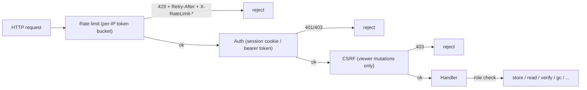

# API Design — go-cask

> This document defines the **common API design conventions** for every HTTP
> endpoint in go-cask. The product's only HTTP surface is the viewer
> (`/viewer/*`, HTML; concrete routes in
> `docs/instructions/viewer-design.md`); the `examples/api`
> pattern demonstrates a JSON surface app authors can copy. **This document
> defines HOW endpoints are designed** so product and example surfaces stay
> consistent.
>
> Related: `docs/instructions/viewer-security.md`
> (authn/authz), `docs/instructions/performance.md` (rate
> limiting), `docs/instructions/library-design.md` (sentinel
> errors), `docs/instructions/coding-guidelines.md` (Go
> implementation style).

---

## 1. Purpose & Scope

- Applies to every HTTP endpoint in the repo: the viewer (`/viewer/*`,
  `text/html`) and any example HTTP surface (the `examples/api` pattern,
  JSON/octet-stream). go-cask the product ships only the viewer — example
  surfaces demonstrate patterns for app authors (backend-architecture §1,
  examples §3.4).
- Governs: URL naming, HTTP methods, status codes, error shapes,
  authentication/authorization, rate limiting, validation, pagination,
  streaming, versioning, and OpenAPI documentation.
- A new endpoint MUST follow these conventions unless its own spec
  explicitly overrides them.

---

## 2. Surfaces, One Style

| Surface          | Prefix             | Content types                             | Auth           | Consumers                  |
| ---------------- | ------------------ | ----------------------------------------- | -------------- | -------------------------- |
| Viewer (product) | `/viewer/`         | `text/html` (pages + fragments)           | session cookie | browser only               |
| Example JSON surface (`examples/api`) | app-chosen (the pattern uses `/api/cas/v1/`) | `application/json`, `application/octet-stream` | bearer token | the example's demo/tests |

Rules:

- A route's prefix decides its contract; never mix prefixes, never mix
  content types across surfaces.
- The same design grammar (naming, errors, status codes, middleware) applies
  to all — only the content type and auth mechanism differ.
- The viewer is the only surface the product ships; example surfaces exist to
  teach the grammar to app authors (backend-architecture §1).

---

## 3. Naming & URL Conventions

- **Plural resource nouns** for collections: `/objects`, `/stats`.
- **Sub-resources by nesting**: `/objects/{hash}/meta`, `/objects/{hash}/raw`,
  `/objects/{hash}/verify` — one level of nesting for metadata/actions on a
  resource.
- **Actions are POST sub-resources** (`/verify`, `/gc`) — never GET with side
  effects, never bare verbs as top-level paths.
- **Path segments**: lowercase; hyphen-separated when multi-word.
- **Query parameters**: short, lowercase (`q`, `algo`, `limit`, `offset`);
  documented defaults and bounds.
- **Hash parameters** are always named `{hash}`, formatted
  `algo:hexdigest`, and validated with `ParseHash`
  (pattern `^[a-z0-9]+:[0-9a-f]+$`).

---

## 4. HTTP Methods & Semantics

| Method | Use                                            | Request body | Success  |
| ------ | ---------------------------------------------- | ------------ | -------- |
| GET    | read; MUST be side-effect free                 | —            | 200      |
| POST   | create (server-computed identity) or action    | yes          | 201 (create) / 200 (action result) |
| DELETE | delete; idempotent (missing object = no-op)    | —            | 204      |

- `POST` is used for creates when the identity is **server-computed** (the
  server computes the hash from the body — e.g. a JSON object store) — there
  is no `PUT` in the example pattern's v1 (objects are immutable; a changed
  object is a new hash).
- Actions with side effects (`verify`, `gc`, login) are `POST`; `verify` is
  read-only in effect but is a POST because it runs a check and is
  role-gated.
- `PUT`/`PATCH` are reserved for a future mutable resource; if one appears it
  must follow full-replace semantics.

---

## 5. Status Codes

| Status | Viewer                                     | JSON surface (example)                  |
| ------ | ------------------------------------------ | --------------------------------------- |
| 200    | HTML page or fragment                      | JSON body / octet-stream bytes          |
| 201    | —                                          | object created (`POST /objects`)        |
| 204    | —                                          | deleted / verified OK                   |
| 303    | login redirect                             | —                                       |
| 400    | minimal error page (malformed input)       | `{"error":"..."}`                       |
| 401    | **empty body**                             | `{"error":"unauthorized"}`              |
| 403    | **empty body**                             | `{"error":"forbidden"}`                 |
| 404    | minimal error page (missing object)        | `{"error":"not found"}`                 |
| 429    | minimal error page (rate limited)          | `{"error":"rate limited"}` + `Retry-After` |

Consistency rules:

- 401/403 **never disclose** whether the target object exists (on every surface).
- Mutations that succeed without a useful body return 204; creates return 201
  with the created resource (the hash).
- 429 is produced by the shared rate-limit middleware before any handler
  runs.

---

## 6. Error Contract

- **JSON surfaces (examples)**: every error is JSON `{"error": "<concise
  message>"}`. No stack traces, no internal paths, no secrets, no object
  bytes.
- **Viewer**: errors are minimal HTML pages/fragments; 401/403 are empty
  bodies per the security spec.
- Messages are actionable ("unknown hash algorithm: md4") but never disclose
  internals or existence in the 401/403 cases.
- The library's sentinel errors (`ErrNotFound`, `ErrHashMismatch`,
  `ErrInvalidHash`, `ErrUnknownAlgorithm`) map to HTTP statuses: 404, 409/500,
  400, 400 — the mapping is defined per surface. Exception: the `verify`
  action is a query that returns a result (`{"valid":true/false}`) on 200, not
  a 409/500 error; `ErrHashMismatch` maps to the error status only on
  mutation paths.

---

## 7. Authentication & Authorization

- **Viewer**: session cookie (`HttpOnly`, `SameSite=Strict`, `Secure` over
  HTTPS); the startup token is accepted **only** by `POST /viewer/login`;
  every other endpoint requires a valid session.
- **Example JSON surfaces**: `Authorization: Bearer <token>` with configured
  per-role tokens (the `examples/api` pattern).
- **Roles** (all surfaces): `viewer` (reads) → `operator` (+ store, verify) →
  `admin` (+ delete, GC, maintenance).
- **CSRF**: every viewer mutation is a POST with a CSRF token validated
  server-side.
- **Audit**: every mutation is audit-logged; tokens/secrets are never logged.
- **Rate limiting**: an IP-based middleware MAY wrap a JSON surface before
  authentication (the `examples/api` pattern: 2 req/s per IP, burst 20,
  429 + `Retry-After` + `X-RateLimit-*`, loopback exempt); the viewer login
  endpoint keeps its own stricter throttle (5 failures/IP/min with backoff,
  viewer-security).

---

## 8. Middleware Pipeline (shared)

Ordering is fixed: rate limit → auth → CSRF → handler. The viewer enforces
it with session auth and CSRF on mutations (plus its login throttle); an
example JSON surface uses bearer auth and no CSRF. Rate-limit configuration
applies to JSON example surfaces (2 req/s per IP, burst 20, loopback exempt,
`trusted_proxies` only for `X-Forwarded-For`); the viewer login throttle is
fixed at 5 failures/IP/min (viewer-security).

---

## 9. Validation

- Every `{hash}` parameter: `ParseHash` first → 400 on malformed.
- Query parameters: reject out-of-range values with 400 (do not silently
  clamp); `limit` bounded (e.g. 1–1000), `offset` ≥ 0.
- Request bodies: strict decoding; unknown fields are rejected for JSON
  surface bodies (fail loudly, `json.Decoder.DisallowUnknownFields` where
  sensible).
- Never trust client input: header, query, and body are all validated
  (viewer-security defensive programming).

---

## 10. Pagination & Filtering

- **Cursor-free, offset-based** pagination for lists:
  `?limit=<1..max>&offset=<0..>` with documented defaults.
- Response envelope: `{"total": <int>, "<items>": [...]}` where `<items>` is
  the plural resource name (`objects`). `total` is the unfiltered count of
  the filtered set (document per endpoint).
- Filters are query parameters (`algo`); filters never change the item shape,
  only the set.

---

## 11. Streaming & Binary Payloads

- Binary bodies use `application/octet-stream` — **never base64 inside
  JSON**.
- Metadata for a binary response travels in `X-CAS-*` headers
  (`X-CAS-Algorithm` and `X-CAS-Size`; the byte layer has no envelope type,
  so `X-CAS-Type` is not emitted — the `meta` endpoint may sniff it
  best-effort from the envelope).
- Large payloads stream (`io.Reader`/`io.ReadCloser`); handlers never buffer
  whole objects (performance spec P-05).

---

## 12. Versioning

- A JSON example surface MAY carry its major version in the URL prefix (the
  `examples/api` pattern uses `/api/cas/v1`): breaking changes (removed/
  renamed fields, changed semantics) require a new major; additive changes
  are allowed within a major.
- The viewer surface is unversioned — it is an application surface whose htmx
  fragments evolve with the UI.
- Versioning is expressed in the URL, never in headers.

---

## 13. Documentation & OpenAPI

- A JSON surface's endpoint set MUST be documented in an OpenAPI document
  served by that surface (the `examples/api` pattern serves its document at
  `/api/cas/v1/openapi.yaml`).
- **The OpenAPI documents MUST live in separate files** — an `openapi.yaml`
  next to the code that serves it (e.g.
  `examples/api/server/openapi.yaml`), embedded into the binary with
  `//go:embed` + `embed.FS`. Never an inline Go string constant: the
  document is data, not code, and must be diffable/lintable in its native
  form.
- The documents MUST match the implemented routes exactly; a CI check
  regenerates/compares them on route changes.
- The HTML viewer needs no OpenAPI document — its surface is hypermedia,
  defined by `viewer-design.md`.

---

## 14. Designing a New Endpoint (procedure)

1. **Pick the surface** — browser-facing (HTML/htmx) → `/viewer/`;
   programmatic (JSON) → the app's own example surface (see `examples/api`).
   Never both on one prefix.
2. **Model the resource** — plural noun path, sub-resources by nesting,
   action as POST sub-resource.
3. **Define the contract** — method, request body, response shape/content
   type, status codes (200/201/204 + 400/401/403/404/429 as applicable).
4. **Define the errors** — JSON `{"error": ...}` (CAS) or minimal HTML
   (viewer); 401/403 never disclose existence.
5. **Apply the middleware** — rate limit, auth, CSRF (viewer mutations),
   role check; add audit logging for mutations.
6. **Validate** — `ParseHash` for hashes, strict query/body validation.
7. **Document** — add the path to the surface's OpenAPI document.
8. **Test** — `httptest` for status/roles/429/streaming; fuzz where the
   input is complex.

---

## 15. Checklist

- [x] Route lives under the correct prefix; content type matches the surface
- [x] Naming follows §3 (plural nouns, nesting, `{hash}` with `ParseHash`)
- [x] Method semantics follow §4 (GET side-effect free, POST for
      create/action, DELETE idempotent)
- [ ] Status codes + error shapes match §5/§6
- [ ] Auth, CSRF, role check, rate limiting, and audit applied per §7/§8
- [ ] Validation per §9; pagination envelope per §10 where listing
- [ ] Binary payloads stream as octet-stream with `X-CAS-*` headers (§11)
- [ ] Versioned correctly (§12); documented in OpenAPI (§13)
- [x] `httptest` coverage added; docs regenerated
