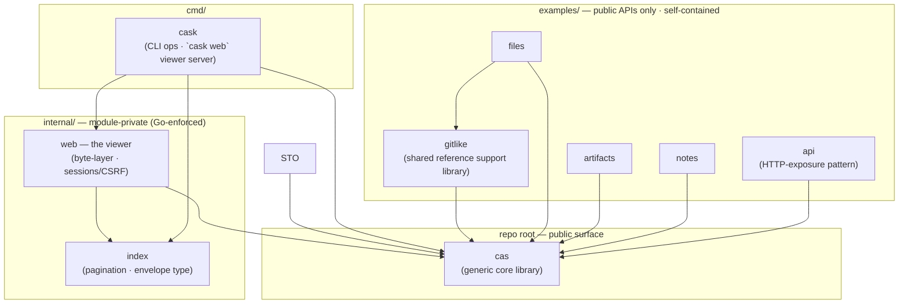
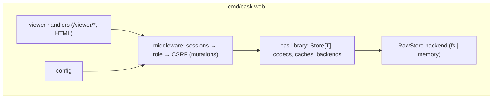

# Backend Architecture — go-cask

> This file governs the **backend architecture**: how the `cas` library is
> composed into a runnable system (binary layout, HTTP layer, middleware,
> config, startup/shutdown, observability, deployment). The library *internals*
> are defined by `cas-core.md`; this file is about the
> process around them.
>
> **No network JSON API ships.** go-cask is a single-host kit: `cas` + CLI +
> the embedded viewer. The viewer (`cask web`) is the product's only HTTP
> surface; exposing a store to other machines is an app-author pattern
> demonstrated by `examples/api` (AGENT §6 "CAS API").
>
> Related: `docs/instructions/viewer-design.md` and
> `docs/instructions/viewer-security.md` (the viewer),
> `docs/instructions/api-design.md` (HTTP conventions),
> `docs/instructions/operations.md` (running it),
> `docs/instructions/coding-guidelines.md`
> (implementation style).

---

## 1. Purpose & Scope

- The backend is everything that runs server-side: the binary, the viewer's
  HTTP layer, the wiring of `cas` into handlers, configuration, and
  lifecycle.
- Handlers are **thin**: all logic lives in the library (cas-core);
  the backend composes it and adds HTTP concerns (authn/authz, CSRF,
  validation, streaming).
- One codebase serves all shapes: the viewer via `cask web`, the CLI, or
  library embedding — never separate forks. A process that must serve a
  store to other machines is an app concern: copy the `examples/api` pattern
  (§5) — the product never ships that server.

---

## 2. Process & Binary Layout

```text
go-cask/
├── cas/          # public core library (package cas) — the stable surface
├── internal/     # implementation detail — Go forbids imports from outside
│   │             # this module
│   ├── web/      #   the viewer: handlers + templates (/viewer/*)
│   └── index/    #   object listing/meta helpers
├── cmd/cask/     # thin main: CLI store ops + `cask web` (the viewer)
└── examples/     # runnable examples (gitlike, files, artifacts, notes, api)
```

- `cmd/cask` is the only binary, and it is a **thin main**: all viewer logic
  lives in `internal/` (web, index); `cask web` wires the internal
  packages together (cli §2). `internal/` packages MUST NOT be imported from
  outside this module — Go enforces this at compile time.
- `cas/` is the **public surface** — the embedded library (plus the
  `examples/gitlike/` example layer). Everything else is private.
- The non-`web` subcommands of `cmd/cask` are the thin CLI over the same
  library — the library is the single source of behavior.
- There is no `internal/api`, no `internal/auth` bearer-token layer, and no
  `client/` SDK: the network JSON API was removed so the kit stays
  single-host (§1). HTTP-exposure patterns live in `examples/api`.
- **No product → example imports.** `cas/`, `internal/` and `cmd/` MUST NOT
  import `examples/` packages — examples are downstream consumers of the
  public surface, never upstream dependencies (coding-guidelines §9).

Dependency map (edge = "imports"; the forbidden edges below are NOT drawn):



- `internal/index` and `examples/api/demo` import nothing from the module.
- Forbidden (not drawn): `cas/`·`internal/`·`cmd/` → `examples/`
  (coding-guidelines §9); `examples/` → `internal/` (examples §2 rule 4);
  example → example except the sanctioned `files → gitlike` shared-support
  dependency (examples §2 rule 11).

---

## 3. The Viewer Server (`cask web`)



Rules:

- One `net/http` server, one mux (Go 1.22+ pattern routing); every route
  lives under `/viewer` — there is no second surface (api-design §2).
- Middleware order is fixed: session auth → role → CSRF (mutations) →
  handler, with the login endpoint behind its own failure throttle
  (viewer-security, api-design §8).
- The viewer NEVER talks to storage directly from handlers — it goes through
  the `RawStore`/`Store[T]` layer, so backend selection is a configuration
  decision, not a code change.
- The handler set lives in `internal/web` (the viewer), over the `cas`
  library and `internal/index` (listing helpers). `cmd/cask web` only wires
  them (§2).

---

## 4. HTTP Layer

- Content type is `text/html` (pages + htmx fragments) for every viewer
  route; the viewer's raw view buffers at most 256 KiB for in-page hexdump
  (a bounded preview, not a streaming download — api-design §11 streaming
  applies to the API surface, not the hexdump UI).
- Errors are minimal HTML pages/fragments; 401/403 are empty bodies and
  never disclose existence (api-design §5/§6, viewer-security).
- OpenAPI: the product serves none. An HTTP surface that needs a documented
  contract (the `examples/api` pattern) MUST keep it in a separate embedded
  `openapi.yaml` file (api-design §13).

---

## 5. Storage Backend Selection

- Config selects the backend: filesystem (`FSRawStore`, fan-out layout) or
  memory (`MemoryRawStore`, tests/ephemeral) — see cas-core §4.4–4.5.
- The viewer and CLI talk to the library **in-process** only — there is no
  remote backend and no client SDK. A process that must serve a store to
  other machines is an app concern: copy the `examples/api` pattern (public
  `cas` surface, its own HTTP layer, its own auth) and run it as that app's
  server. The go-cask product ships no such server (§1).
- **One store directory ↔ one writer-process, grace for sweeps.** Concurrency
  safety in `cas` is per-process (in-process locks, cas-core §6): any number
  of goroutines or HTTP clients may share one store **within** a process.
  Across OS processes, object writes and reads are safe by construction
  (atomic rename, unique temps); what needs care is a maintenance sweep
  racing another process's writes. The `cask` CLI uses the grace model:
  writers and `web` run lock-free; `gc`/`prune`/`clean` take the store's
  exclusive `.cask.lock` (one sweep at a time) and reclaim only objects older
  than `--min-age` (default 24h), so recent writes survive — a forced
  `--min-age 0` sweep is the documented dangerous variant (cli §2, cas-core
  §6). Scale by serving more clients from one process, or shard into separate
  store directories; apps embedding the library provide equivalent
  coordination themselves.

---

## 6. Configuration

```yaml
storage:
  type: fs            # fs | memory
  path: ./objects
  fan_out: 2          # Git-like fan-out (cas-core §4.4)
  fan_levels: 1
viewer:
  bind: 127.0.0.1:8080
  roles: {}           # role=token pairs for viewer login (viewer-security)
  secure_cookies: false  # true when served over HTTPS (behind a proxy)
```

Lifecycle:

- **Startup**: validate config → construct the store (create directories,
  validate fan-out bounds) → generate the viewer startup token (printed
  once, never stored in plaintext config) → start serving.
- **Shutdown**: graceful — `signal.NotifyContext`, stop accepting requests,
  drain in-flight, close the store; no mid-write corruption (atomic rename
  contract).
- Config-file support (`-config`) is deferred — flags only (cli §2).

---

## 7. Observability & Audit

- `log/slog` structured logging: viewer mutations (store/delete/verify/gc),
  slow operations, GC runs (operations §3), login failures.
- Audit logging per viewer-security: every viewer administrative action
  logged; tokens/secrets never logged.
- Metrics counters (objects/bytes/cache) exposed via the viewer stats page
  and structured logs — no external metrics dependency (coding-guidelines
  §3).

---

## 8. Deployment Shapes

1. **Local admin** — `cask web` on the machine holding the store: the viewer
   in-process over the `cas` library (default shape; loopback bind,
   viewer-security §4).
2. **CLI / embedding** — the non-`web` `cmd/cask` subcommands and library
   consumers.
3. **App-served stores** — an application embedding `cas` MAY expose its
   store over HTTP by copying the `examples/api` pattern; that server is the
   app's own (its auth, TLS, and deployment are app concerns). The go-cask
   product ships no such server (§1).

All product shapes share the config contract and the viewer's security
model; an app-served store is outside the product and follows api-design as
an example surface.

---

## 9. Security

- The viewer enforces, in order: session authentication (startup-token
  login behind its own failure throttle), role checks (viewer/operator/
  admin), CSRF on mutations, and strict input validation (`ParseHash`,
  bounded query params) — viewer-security + api-design §7–§9.
- 401/403 never disclose object existence (empty bodies); error messages
  never leak internals (api-design §6).

---

## 10. Checklist

- [x] One mux; every route under `/viewer`; no data-API surface exists
- [x] Middleware order fixed: sessions → role → CSRF → handler
- [ ] Handlers thin; all logic in the library; backend selection via config
- [ ] Raw object views stream; no full buffering
- [ ] Errors per api-design §5/§6; 401/403 empty bodies
- [x] Config shape per §6; startup/shutdown lifecycle implemented
- [ ] slog + audit logging; metrics via the viewer stats page and logs
- [x] No network JSON API ships; `examples/api` is the documented pattern
