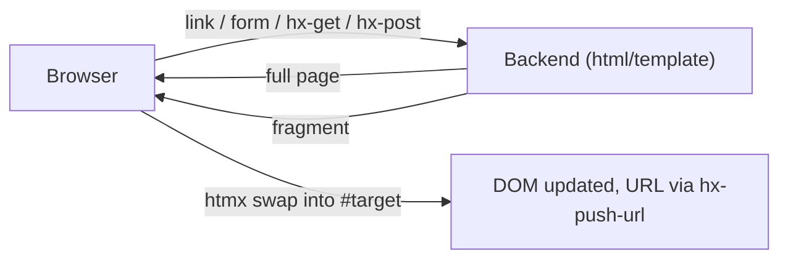

# Frontend Architecture — go-cask

> This file governs the **browser-facing architecture** of go-cask: how pages
> and fragments are rendered and updated. It applies to the viewer (the
> reference frontend) and to any future frontend. The concrete viewer screens,
> routes, and wireframe are defined by `viewer-design.md`; this
> file is the architecture behind them.
>
> Related: `docs/instructions/viewer-design.md` (the viewer's
> screens), `docs/instructions/viewer-security.md` (authn,
> sessions, CSRF), `docs/instructions/coding-guidelines.md`
> (no CSS/JS, templates + htmx), `docs/instructions/api-design.md`
> (HTTP conventions).

---

## 1. Purpose & Scope

- The frontend is everything the browser receives: **HTML pages and htmx
  fragments**, all rendered server-side by `html/template`.
- It is deliberately **not** a single-page application: there is no client
  framework, no client-side state, no JSON between browser and server, no
  JS-generated DOM.
- The browser is a hypermedia client: it follows links, submits forms, and
  lets htmx swap fragments — nothing else.

---

## 2. Rendering Model (hypermedia-driven)

- **HTML is the application** (HATEOAS, per the Hypermedia Systems
  architecture): every state transition is an HTTP request returning HTML —
  a full page for navigation, a fragment for partial updates.
- **Progressive enhancement**: with htmx disabled, the frontend still works —
  navigation via real links, mutations via real forms; htmx only upgrades
  (fragment swaps, active search, lazy loading).
- **One source of truth**: the server renders; the browser displays. No
  duplicated rendering logic client-side.

---

## 3. Template Architecture

- `html/template` only — its contextual auto-escaping is the XSS boundary;
  never `text/template` for HTML, never HTML built by string concatenation in
  Go (coding-guidelines §5–§6).
- Templates are embedded with `embed.FS` + `template.ParseFS` — no runtime
  file I/O, no build step.
- **Nested composition** via `{{define}}` / `{{template}}` / `{{block}}`.
  The concrete template tree (pages and partials) is defined once in
  `viewer-design.md` §4 — this document does not duplicate it;
  any frontend follows the same nesting pattern with its own pages/partials.
- **Fragments are the same partials rendered standalone**: an htmx endpoint
  returns a named template; the identical partial serves full-page
  composition and swaps (one source of truth — viewer-design §4).
- Minimal logic in templates (`{{if}}`/`{{range}}`/`{{with}}` + pipelines);
  all computation happens in Go; a registered `FuncMap` provides pure view
  helpers.

---

## 4. Interaction Architecture (htmx)

| Concern            | Mechanism                                                        |
| ------------------ | ---------------------------------------------------------------- |
| Navigation         | real links + optional `hx-boost`; `hx-push-url` keeps URLs as state |
| Search/filter      | active search: `hx-get`, `hx-trigger="input changed delay:300ms"`, `hx-target="#table"` |
| Partial updates    | `hx-get`/`hx-post` + `hx-target` + `hx-swap` into semantic containers |
| Lazy loading       | `hx-trigger="revealed"` (e.g. hexdump `<pre>`)                   |
| Paging             | click-to-load: next-page button appends rows                      |
| Long-running ops   | polling: `hx-trigger="every 2s"` until a done state               |
| Cross-panel update | out-of-band swaps (`hx-swap-oob`) for the stats panel             |
| Destructive actions| POST forms + `hx-confirm` + CSRF token                            |

Rules:

- GET endpoints are side-effect free; every mutation is a POST form with CSRF
  (viewer-security).
- `hx-target`/`hx-swap` always target a semantic container (`#content`,
  `#object-table`, `#hexdump`, `#stats-panel`) — never whole page unless
  intended.
- No custom events, no `_hyperscript`, no Alpine, no hand-written JS — htmx
  attributes only (coding-guidelines §4).

---

## 5. Navigation & State

- **URLs are the state**: `hx-push-url` keeps navigation in the address bar;
  refresh and back/forward work naturally; there is no client-side state to
  lose or rehydrate.
- Identity comes from the server session cookie (`HttpOnly`,
  `SameSite=Strict`, `Secure` over HTTPS — viewer-security); the browser
  never holds tokens or secrets.
- Fragments are reachable both as standalone htmx responses and as parts of
  full pages — the URL always identifies the resource, not a client-side
  view.

---

## 6. Assets & Embedding

- Single binary: templates and the vendored htmx script are embedded via
  `embed.FS`.
- No npm, no build step, no static asset pipeline (coding-guidelines §10).
- The only script in the runtime is **htmx** (one pinned, vendored file).

---

## 7. Semantics & Accessibility

- Raw, semantic HTML: `<main>`, `<nav>`, `<table>` with `<caption>` and
  `<th scope>`, `<dl>` for metadata, `<pre>` for bytes, `<form>`/`<label>`
  for input — no `
` soup, no inline `style`.
- Accessibility: labels on all inputs, `alt` text, logical heading order,
  keyboard-operable links and forms. htmx keeps native elements native
  (progressive enhancement), so focus and semantics survive.
- Elegance without CSS comes from structure, whitespace, and consistent
  layout (viewer-design §2).

---

## 8. The Viewer (reference frontend)

- The viewer is the reference implementation of this architecture:
  dashboard-first, low-level technical inspection of the object store
  (viewer-design §7 for screens and wireframe).
- Any new frontend MUST follow this document's architecture and reuse the
  template/htmx conventions; concrete screen design lives in
  `viewer-design.md`.

---

## 9. Security

- Nothing sensitive reaches the browser: no tokens, no secrets, no storage
  internals — only rendered HTML (viewer-security).
- Sessions are cookies (`HttpOnly`, `SameSite=Strict`); CSRF tokens protect
  every mutation; 401/403 responses are empty bodies that never disclose
  existence.
- htmx requests carry the same session cookie as full-page navigation — the
  backend cannot distinguish and MUST NOT need to.

---

## 10. Checklist

- [x] All HTML rendered by `html/template`; templates nested via
      `{{define}}`/`{{template}}`/`{{block}}`; embedded with `embed.FS`
- [x] Fragments reuse the same partials as full pages (one source of truth)
- [x] Interactivity via htmx attributes only; no hand-written JS/CSS
- [x] GET side-effect free; mutations = POST + CSRF
- [x] URLs are the state (`hx-push-url`); refresh/back work
- [x] Semantic HTML + accessibility per §7
- [x] Single binary, no build step; htmx vendored and pinned
- [x] Security per §9 (cookies, CSRF, empty-body 401/403)
- [ ] New frontends follow this architecture; viewer screens per
      `viewer-design.md`
