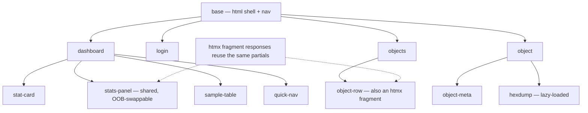

# Viewer Design — go-cask

> The viewer is the embedded technical browser UI, implemented in `internal/web/`. It is built for
> the **developer or admin** who needs to browse the CAS and understand its
> internals. This document defines **how** it is built (hypermedia-driven,
> nested Go templates + htmx only, raw HTML) and **what** it shows: a
> **dashboard** as the hub, and drill-downs into objects, blobs,
> and storage statistics — at a very technical, low level.
>
> The viewer MUST be **simple, elegant, and usable**. Elegance here does not
> come from CSS (there is none) — it comes from clean semantic structure,
> consistent layout, clear information hierarchy, and obvious navigation.
>
> It MUST be read together with:
> - `docs/instructions/viewer-security.md` — every security
>   requirement there applies to this viewer unchanged.
> - `docs/instructions/coding-guidelines.md` — §4 (no
>   CSS/JS), §5 (html/template + htmx), §6 (raw HTML), §10 (viewer boundary).
> - `docs/instructions/cas-core.md` — the data model
>   the viewer displays (`Hash`, `Object[T]`, `RawStore.Stats`, `Verify`,
>   `GC`).
> - Design reference: <https://hypermedia.systems/book/contents/> — the
>   hypermedia-driven application philosophy this viewer implements.
> - `docs/design/viewer-brief.md` — the
>   non-normative design brief for the viewer's planned next iteration
>   (OpenDesign input); it proposes a target grammar but changes nothing
>   here until its outcomes are folded back into this spec (brief §7).

---

## 1. Purpose & Persona

The viewer is the developer/admin's window into the CAS:

- **persona**: a developer or operator who must answer questions like
  *"what is stored here?", "how much space?", "what does this object point
  to?", "is the data intact?", "which algorithms are in use?"*
- **hub**: a **dashboard** (the landing page) that answers the top-level
  questions at a glance — storage stats, algorithm breakdown, a sample of
  objects, and search — with one click to every detail
- **drill-down paths**: dashboard → object list → object detail → raw
  blob / hexdump
- **aesthetic**: simple, elegant, usable — dense but scannable, plain
  semantic HTML, no decoration

Out of scope: object *editing* (objects are immutable — content changes only
via a new hash), JSON/data APIs, client-side state, charting libraries.

---

## 2. Design Principles

### Hypermedia-driven (per Hypermedia Systems)

1. **HTML is the application.** Every state transition is an HTTP request
   (GET for navigation, POST for mutations) that returns HTML — a full page or
   a fragment ("Hypermedia As The Engine of Application State", ch. 2).
2. **Hypermedia-driven application** (Introduction): the server renders all
   HTML; the client is a hypermedia client (browser + htmx) with no
   application logic of its own.
3. **htmx is the only extension** ("Extending HTML As Hypermedia", ch. 4):
   interactivity is expressed purely with htmx attributes (`hx-get`,
   `hx-post`, `hx-target`, `hx-swap`, `hx-trigger`, ...) — "it's all just
   HTML".
4. **Progressive enhancement** (ch. 5): with htmx disabled, the viewer still
   works — navigation via real links, mutations via real forms.
5. **Zero scripting, zero styling** (ch. 9: "Is Scripting Allowed?" — here the
   answer is no): no hand-written JS, no CSS. The htmx script is the single
   vendored exception (coding-guidelines §4).

### Simple, elegant, usable

6. **Dashboard-first.** The landing page is a dashboard: the numbers that
   matter (objects, size, algorithms), a sample of what is stored, and search.
   Every screen answers *"what am I looking at, and where do I go next?"*
7. **Information hierarchy.** Overview → list → detail → raw. Each page has
   one purpose; detail pages start with a short summary block and then go
   deeper (metadata → bytes).
8. **No dead ends.** Every hash is a link; every panel has an obvious
   "see all" target. The user can always get back
   to the dashboard.
9. **Elegance without CSS.** Clean, predictable layout from semantic HTML
   alone: consistent tables with `<caption>`/`<th scope>`, `<dl>` for
   metadata, `<pre>` for bytes, whitespace and grouping instead of styling.
   No `<div>` soup, no inline `style`.
10. **Restraint.** One purpose per page; dense but scannable tables; human-
    readable sizes on the dashboard, exact byte counts in the details.
    Simplicity over decoration (coding-guidelines §5–§6).

---

## 3. Security Alignment

All requirements of `docs/instructions/viewer-security.md`
apply verbatim. The design-relevant consequences:

- **Runs only when invoked**: `cask web` starts the viewer and no other
  subcommand does; there is no `enabled` switch (viewer-security §3).
- **Localhost only** by default; non-loopback bind requires HTTPS or
  `allow_insecure_bind: true` plus a startup warning.
- **Authentication**: startup admin token + session cookie (HttpOnly,
  SameSite=Strict, Secure when HTTPS); idle 30 min / max 8 h.
- **Authorization** (roles: viewer / operator / admin) mapped to viewer
  features:
  - `viewer` — dashboard, list objects, inspect metadata, download raw bytes
    (all GET)
  - `operator` — everything above + run integrity `verify` (POST)
  - `admin` — everything above + destructive actions: `delete` object, run
    `GC`, maintenance (POST)
- **Every mutation is a POST with CSRF protection** (hidden token in the
  form, validated server-side; htmx forms are ordinary HTML forms).
- **Audit logging** of all administrative actions (delete, GC, verify);
  never log tokens/secrets.
- **Minimal error info**: missing/expired session → 401 empty body;
  insufficient role → 403 empty body; never disclose whether an object exists.
- **API architecture**: the browser talks only to the backend API; the backend
  talks to the object store. No direct browser access to storage internals.
- **Defensive programming**: validate every query parameter, header, and hash
  string (`ParseHash`); reject unknown/malformed hashes before touching
  storage.

---

## 4. Rendering Architecture — Nested Go Templates

Rendered exclusively with `html/template` (auto-escaping is the XSS boundary),
embedded via `embed.FS` + `template.ParseFS` (coding-guidelines §5).

### Nested template tree

```text
base                  # <html> shell: <head> (htmx script), <body>, nav
├── dashboard         # landing: stat cards + algorithm table + sample + search
│   ├── stat-card     # partial: one big number + label (an htmx fragment)
│   ├── stats-panel   # partial: per-algorithm breakdown (OOB-swappable)
│   ├── sample-table  # partial: recent/sample objects (also a fragment)
│   └── quick-nav     # partial: Objects · Verify · GC
├── login             # full page, standalone
├── objects           # page: table of all objects + filters
│   └── object-row    # partial: one row per object (also an htmx fragment)
├── object            # page: detail for one hash
│   ├── object-meta   # partial: dl of hash/type/size/algorithm
│   └── hexdump       # partial: raw bytes as hex + ASCII (lazy-loaded)
├── fragments         # htmx fragment responses reuse the same partials
└── _error            # partial: minimal error block (401/403 empty per §3)
```



Composition uses `{{define}}` / `{{template}}` / `{{block}}` (coding-
guidelines §5: the latest template feature set). A **fragment is just a named
template rendered standalone** — the same partial serves both full-page
composition and htmx swaps (e.g. `stats-panel` appears on the dashboard
and as an OOB-swap target).

### Conventions

- one template per view + small reusable partials; templates in
  `internal/web/templates/`, embedded with `embed.FS`
- minimal logic in templates: `{{if}}`, `{{range}}`, `{{with}}`, pipelines;
  all computation in Go handlers, pre-shaped data passed in
- a registered `template.FuncMap` with pure view helpers, e.g.:
  `shortHash` (first 8 hex chars of the digest — the UI display form),
  `hashWithType` (`<shorthash> (<type>)`, e.g. `9f86d081 (blob)` — for
  generic lists), `humanSize` (KB/MB for overviews), `byteSize` (exact bytes
  for details), `hexdump` (format bytes)
- raw HTML: semantic elements (`<table>` with `<caption>`/`<th scope>`,
  `<dl>`, `<pre>`, `<nav>`, `<form>`) — no `<div>` soup, no inline `style`

Example — a nested fragment (object row used by the list page and by search
swaps):

```html
{{define "object-row"}}
<tr id="obj-{{.Hash.String}}">
  <th scope="row"><code><a href="/viewer/objects/{{.Hash.String}}" hx-get="/viewer/objects/{{.Hash.String}}" hx-target="#content" hx-push-url="true">{{shortHash .Hash.String}}</a></code></th>
  <td>{{.Hash.Algorithm}}</td>
  <td>{{.Type}}</td>
  <td>{{byteSize .Size}}</td>
</tr>
{{end}}
```

---

## 5. Hypermedia Interaction Model (htmx)

Patterns from the book, applied to the viewer:

| Pattern (book ch.)            | Viewer use                                                        |
| ----------------------------- | ----------------------------------------------------------------- |
| Plain links + forms (ch. 3)   | Base navigation; every link/button is real HTML first             |
| `hx-boost` (ch. 5)            | Optional whole-page boost for nav so fragments share the shell    |
| Active search (ch. 6)         | Search box (dashboard + list): `hx-get="/viewer/objects?q=…"`, `hx-trigger="input changed delay:300ms"`, `hx-target="#object-table"` |
| Click-to-load (ch. 5)         | Paging: "next page" button `hx-get` appending rows                |
| Lazy loading (ch. 6)          | Hexdump/raw bytes loaded on demand: `hx-trigger="revealed"` on the `<pre>` |
| Mutations as POSTs (ch. 4–5)  | delete / verify / GC via `hx-post` on forms, `hx-confirm` for destructive ops, CSRF token included |
| Polling (ch. 7)               | Long-running GC: progress fragment `hx-trigger="every 2s"` until done |
| Out-of-band swaps (ch. 8)     | Dashboard `stats-panel` refreshes alongside the swapped content (`hx-swap-oob`) |
| 204/errors (ch. 8)            | Successful mutation → 204 or swapped fragment; 401/403 → empty body |

Rules:

- GET endpoints are side-effect free; every state change is a POST form.
- `hx-target`/`hx-swap` always target a semantic container (`#content`,
  `#object-table`, `#hexdump`, `#stats-panel`) — never whole-page unless
  intended.
- Fragments returned by htmx endpoints render the **same partials** as the
  full pages (one source of truth).
- Dashboard panels refresh via a single `hx-get="/viewer/dashboard"` (fragment
  response with OOB swaps); no timers beyond GC progress polling.
- No custom events, no `_hyperscript`, no Alpine — htmx attributes only.

---

## 6. Pages & Routes

All routes live under `/viewer` (configurable via the `viewer:` config block).

| Route                             | Method | View      | Content                                                            | Role    |
| --------------------------------- | ------ | --------- | ------------------------------------------------------------------ | ------- |
| `/viewer/login`                   | GET/POST | login   | startup-token login form → session cookie                          | —       |
| `/viewer/`                        | GET    | dashboard | **landing hub**: stat cards, algorithm table, sample objects, search, quick nav | viewer |
| `/viewer/dashboard`               | GET    | fragment  | dashboard panels (stats + sample) for refresh via htmx             | viewer  |
| `/viewer/objects`                 | GET    | objects   | full object list: filter box + table (also search fragment target) | viewer  |
| `/viewer/objects/{hash}`          | GET    | object    | object detail: meta + actions                                     | viewer  |
| `/viewer/objects/{hash}/raw`      | GET    | object    | raw serialized bytes + `hexdump` (lazy-loaded `<pre>`)             | viewer  |
| `/viewer/objects/{hash}/verify`   | POST   | fragment  | integrity check (recompute hash) → result fragment                 | operator|
| `/viewer/objects/{hash}/delete`   | POST   | fragment  | delete object (hx-confirm) → updated list                          | admin   |
| `/viewer/gc`                      | POST   | fragment  | mark-and-sweep GC with polling progress                            | admin   |

`{hash}` values are validated with `ParseHash` before any storage access.

---

## 7. Data Views — The Dashboard and Low-Level Detail

### The dashboard (landing page)

```text
┌──────────────────────────────────────────────────────────────────┐
│ CASK viewer                                          [search ...] │
├──────────────────────────────────────────────────────────────────┤
│  1,234 objects   45.2 MB total   2 algorithms                    │
├───────────────────────────────┬──────────────────────────────────┤
│ By algorithm                  │ Sample objects                  │
│ sha256   1,198   43.1 MB      │ 9f86d081 (blob)    1.2 KB        │
│ sha1        36    2.1 MB      │ cd34a2f1 (commit)   412 B        │
│                               │ ef56b00c (tree)     204 B        │
│                               │ [see all objects →]             │
├───────────────────────────────┴──────────────────────────────────┤
│ Objects · Verify · GC                                            │
└──────────────────────────────────────────────────────────────────┘
```

- **Stat cards** (`stat-card`): total objects, total size, algorithms in use —
  the three numbers that answer *"what's in this store?"* at a glance.
- **Algorithm breakdown** (`stats-panel`): per-algorithm object counts and
  sizes (from `RawStore.Stats`); the dashboard is the stats view, with the
  panel refreshed out-of-band.
- **Sample objects** (`sample-table`): the first N objects from
  `RawStore.List` (all algorithms), so the dashboard shows real content, not
  just numbers. Rows show `<shorthash> (<type>)`; every row links to its
  detail page via the full hash.
- **Search** (prominent, top-right): active search that swaps the object
  table — the primary entry point for "find this hash".
- **Quick nav**: one line of links — Objects, Verify, GC — so every tool
  is one click from the hub.

### Objects

- **Hash display rule.** Links in the UI ALWAYS show the **8-character short
  hash** (`shortHash` → `9f86d081`); the link target (`href`) always carries
  the full `algo:hexdigest` — the short form is display-only, the identity is
  never lost. The full hash is always shown on the object detail page
  (`object-meta`).
- **Generic lists** render hashes as `<shorthash> (<type>)` (`hashWithType`,
  e.g. `9f86d081 (blob)`) so the object type is visible at a glance; tables
  that already have a dedicated type column (e.g. the objects list) may show
  the plain short hash.
- List columns: hash (short + type), algorithm, `Type()`, size; filter by
  algorithm and by hash/type substring via active search.
- Detail page order (hierarchy): summary (`object-meta` `<dl>`: full hash,
  algorithm, type, exact size) → actions (verify / delete per role) → raw
  bytes (`hexdump`, lazy).

### References are out of scope

- The viewer operates at the **byte layer** and MUST NOT interpret typed
  references: resolving `References()` requires an app object model, and the
  product ships none — `internal/` and `cas/` MUST NOT import `examples/`
  (coding-guidelines §9). Reference graphs belong to app layers
  (`examples/gitlike` demonstrates them); the viewer shows objects, bytes,
  and integrity, not typed structure.

### Blobs

- `raw` view shows the exact serialized bytes: a classic hex dump in a
  `<pre>` — 16-byte rows with byte-offset, hex, and ASCII columns — plus exact
  total size.
- Hexdump is **lazy-loaded** via htmx (`hx-trigger="revealed"`) so large
  objects don't block the detail page (streaming reads; never buffer
  megabytes in memory).
- Type name shown per the object's `Type()`; raw JSON for typed objects is
  visible as-is (technical users want the truth, not a prettified version).

### Integrity & maintenance

- `verify` recomputes the hash of the stored bytes and reports match/mismatch
  (uses the architecture's `Verify` contract).
- `gc` runs mark-and-sweep with a polling progress fragment; only objects not
  in the reachable set are removed; every deletion is audit-logged (admin
  only).

---

## 8. What Is NOT In Scope

- **No JSON/data API** — the viewer is a hypermedia API only (cf. book ch.
  10, "JSON Data APIs" vs "Hypermedia APIs"); no `/api/...` endpoints, no
  JSON responses. The product ships no programmatic data API at all
  (backend-architecture §1); an app that needs one copies the `examples/api`
  pattern.
- **No CSS, no JavaScript** — no stylesheets, no `<style>`, no custom
  `<script>`; htmx is the only script (vendored, pinned). Elegance comes from
  semantic HTML structure, not styling.
- **No charting/dashboard libraries** — the dashboard is plain HTML tables and
  numbers; no chart libs, no CSS frameworks, no build step.
- **No client-side rendering** — no JS-generated DOM, no HTML string
  concatenation in Go (coding-guidelines §6).
- **No object editing** — objects are immutable; the viewer only inspects,
  verifies, and (admin) deletes/GCs.
- **No typed references/graph** — the viewer is a byte-layer tool (§7:
  "References are out of scope").

---

## 9. Acceptance Checklist

- [ ] **Dashboard is the landing page**: stat cards (objects, size,
      algorithms), algorithm breakdown, sample objects, search, quick nav —
      all with drill-down links
- [ ] Simple, elegant, usable: consistent layout, scannable tables
      (`<caption>`/`<th scope>`), one purpose per page, no dead ends
- [ ] Every requirement of `viewer-security.md` implemented
      (secure by default, localhost, authn/authz, sessions, CSRF, audit)
- [ ] No CSS, no hand-written JS anywhere in `internal/web/`
- [ ] HTML rendered only by `html/template`; templates nested via
      `{{define}}`/`{{template}}`/`{{block}}`; embedded with `embed.FS`
- [ ] Full pages and htmx fragments share the same partials (incl.
      `stats-panel` on the dashboard and as OOB swaps)
- [ ] Objects viewable: 8-char short-hash links (full hash on the detail
      page and in link targets), algorithm, type, size; generic lists show
      `<shorthash> (<type>)`
- [ ] No typed references/graph anywhere in `internal/web/` (byte-layer
      viewer; §7)
- [ ] Blobs viewable: raw bytes + hex dump, lazy-loaded for large objects
- [ ] Mutations (verify/delete/GC) are POST + CSRF + role-checked +
      audit-logged; GET endpoints are side-effect free
- [ ] Works with htmx disabled (progressive enhancement): links and forms
      still function
- [ ] `{hash}` parameters validated with `ParseHash`; malformed input → 400,
      missing session → 401 (empty), insufficient role → 403 (empty)
