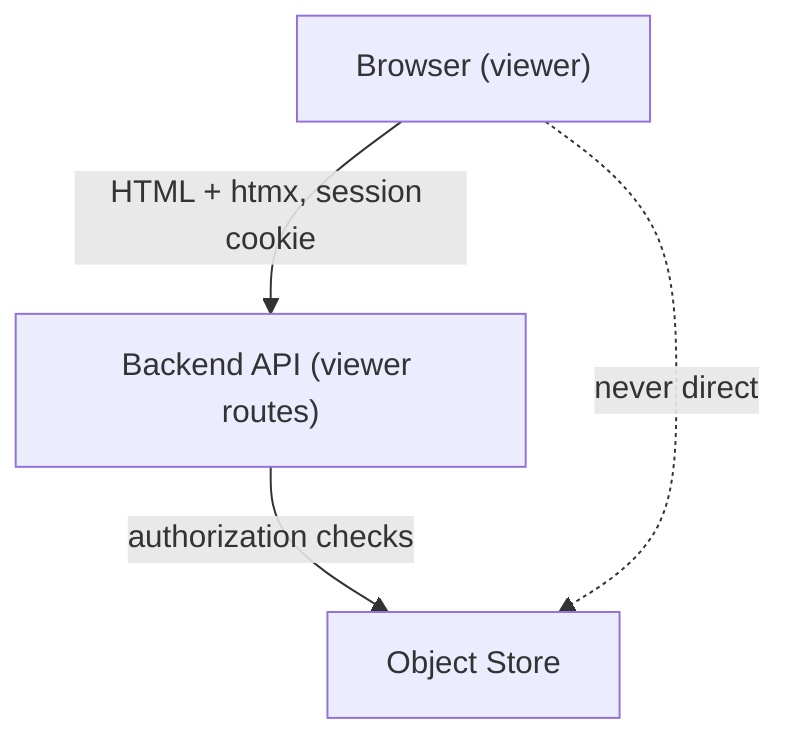

# Viewer Security — go-cask

> Security requirements for the embedded technical viewer. **Nothing may
> weaken this file** (AGENT.md §8 precedence). The viewer design and its
> HTTP surface MUST comply with it.
>
> Related: `docs/instructions/viewer-design.md` (the UI it
> protects), `docs/instructions/api-design.md` (shared HTTP
> conventions).

---

## 1. Project Context

This project implements an object store with an embedded technical viewer.

The viewer is intended for:

- developers
- operators
- troubleshooting
- object inspection
- integrity verification

The viewer is **not intended to be publicly accessible** and must always follow a secure-by-default approach.

---

## 2. Security Requirements (overview)

The requirements that follow are grouped as: access (secure by default,
localhost-only, authentication), sessions (management, cookies),
authorization (roles), operations (audit logging, secret handling, defensive
programming), and deployment (API architecture, production deployments). The
guiding priority is Security > Auditability > Simplicity > Convenience (§14).

---

## 3. Secure By Default

The viewer SHALL run only when explicitly invoked: `cask web` starts it and
no other subcommand does. There is no separate API server it rides along
with and no `enabled` switch (backend-architecture §1) — invoking `cask
web` IS the explicit enablement, and everything else about the viewer stays
off by default (loopback bind §4, no unauthenticated access §5).

---

## 4. Localhost Only

The default bind address SHALL be:

```text
127.0.0.1
```

or

```text
localhost
```

The viewer MUST NOT be exposed on all interfaces by default.

Example:

```yaml
viewer:
  bind: 127.0.0.1:8080
```

Exposing the viewer to the network must require an explicit configuration change.

If bind is set to a non-loopback address, the application MUST log a prominent warning at startup and MUST refuse to start unless HTTPS is enabled or an explicit `allow_insecure_bind: true` flag is set.

---

## 5. Authentication

The viewer SHALL require authentication.

Unauthenticated access is not permitted.

Login attempts MUST be rate limited (e.g. max 5 failures per IP per minute) with exponential backoff, and each failure MUST be audit-logged without recording the submitted token value.

### 5.1 Preferred Mechanism

Use a startup-generated admin token. The startup token grants the admin role. Additional viewer/operator principals are provisioned via the configured identity provider (OIDC) or via configured per-role tokens; sessions MUST carry exactly one role resolved at login.

At application startup:

```text
Admin token:
4D8C-F2F3-6B2E
```

Characteristics:

- cryptographically secure random value
- displayed only on startup
- not stored in plaintext configuration
- regenerated on every application restart

The startup token is accepted only by the POST /login endpoint to establish a session. All other endpoints MUST reject the startup token and require a valid session cookie.

---

## 6. Session Management

After successful authentication:

1. Create a secure session.
2. Issue a session cookie.
3. Do not require the user to re-enter the startup token for every request.

### 6.1 Session Lifetime

Defaults:

```text
Idle timeout:     30 minutes
Maximum lifetime: 8 hours
```

The user must re-authenticate when:

- idle timeout expires
- maximum session lifetime is reached
- application restarts

---

## 7. Cookie Requirements

Session cookies MUST use:

```text
HttpOnly
SameSite=Strict
```

Use:

```text
Secure
```

whenever HTTPS is enabled.

Sensitive data must never be stored in browser-accessible cookies.

---

## 8. Authorization

Authentication and authorization must be separated.

### 8.1 Roles

The system should support:

```text
viewer
operator
admin
```

### 8.2 Viewer

Allowed:

- list buckets
- list objects
- inspect metadata
- download objects

Not allowed:

- upload
- delete
- bucket management

### 8.3 Operator

Allowed:

- viewer permissions
- upload objects

### 8.4 Admin

Allowed:

- operator permissions
- delete objects
- bucket management
- maintenance operations

---

## 9. Audit Logging

All administrative actions MUST be logged.

Examples:

```json
{
  "user": "admin",
  "action": "object.delete",
  "bucket": "media",
  "object": "image.jpg",
  "timestamp": "2026-09-01T10:00:00Z"
}
```

Audit logs should include:

- timestamp
- user/session identifier
- action
- affected resource
- result

Never log:

- passwords
- session cookies
- authentication tokens
- secret keys

---

## 10. API Architecture

The viewer MUST communicate only with the backend API.

Never allow direct browser access to storage internals.

Preferred architecture:

```text
Viewer
     |
     v
Backend API
     |
     v
Object Store
```



All authorization checks must occur in the backend.

---

## 11. Secret Handling

Secrets must never be:

- hardcoded
- committed to source control
- written to logs
- returned in API responses

Examples:

- access keys
- secret keys
- session tokens
- startup tokens
- encryption keys

Use environment variables or dedicated secret providers.

---

## 12. Production Deployments

If remote access is required, the preferred architecture is:

```text
VPN
  +
Reverse Proxy
  +
OIDC / SSO
  +
Viewer
```

Examples:

- Microsoft Entra ID
- Keycloak
- Authentik
- OAuth2 Proxy

Do not expose the viewer directly to the public internet.

When deployed behind an OIDC/SSO proxy, the backend MUST derive the role from a configurable claim (default: `groups`), mapping configured group names to viewer/operator/admin, and MUST deny access when no mapping matches.

---

## 13. Defensive Programming

Always validate:

- query parameters
- headers
- JSON payloads
- object names
- bucket names

Do not trust client input.

Fail securely and return minimal error information.

Return 401 with an empty body for missing/expired sessions and 403 with an empty body for insufficient role; never disclose whether the target bucket or object exists in either case.

---

## 14. Security Principle

The viewer is an administrative tool.

Priority order:

1. Security
2. Auditability
3. Simplicity
4. Convenience

When in doubt, choose the more secure implementation.

---

## 15. Compliance Checklist

- [x] Viewer runs only via explicit `cask web`; loopback bind by default; non-loopback
      requires HTTPS or `allow_insecure_bind: true` (§3–§4)
- [x] Authentication required; login throttled (5 failures/IP/min, backoff,
      audit-logged without the token value) (§5)
- [x] Startup token accepted only by `POST /login`; regenerated per start;
      never stored in plaintext (§5.1)
- [x] Sessions: idle 30 min / max 8 h; re-authentication on expiry/restart (§6)
- [x] Cookies `HttpOnly` + `SameSite=Strict` (+ `Secure` over HTTPS); no
      sensitive data in browser-accessible cookies (§7)
- [x] Roles viewer/operator/admin enforced; authn and authz separated (§8)
- [x] All administrative actions audit-logged; secrets never logged (§9)
- [x] Browser talks only to the backend API; all authz in the backend (§10)
- [ ] Secrets never hardcoded/committed/logged/returned (§11)
- [x] Remote access only via VPN + reverse proxy + OIDC/SSO; role derived
      from the configured claim (§12)
- [x] Input validated everywhere; 401/403 empty bodies never disclose
      existence (§13)
