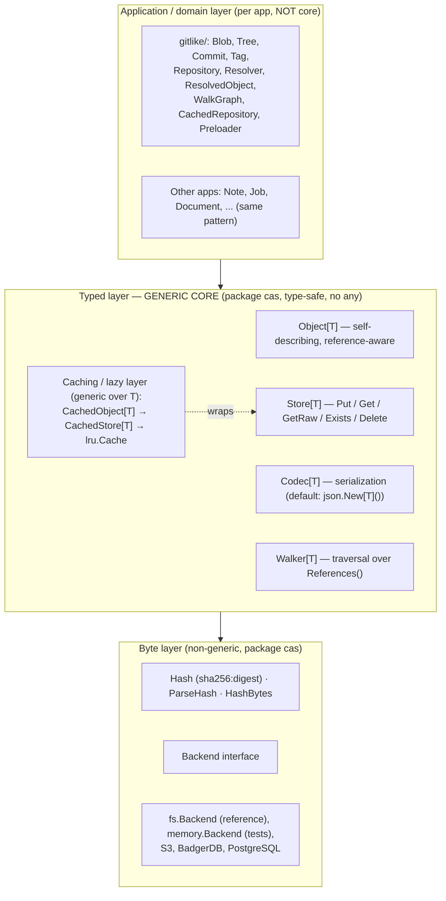
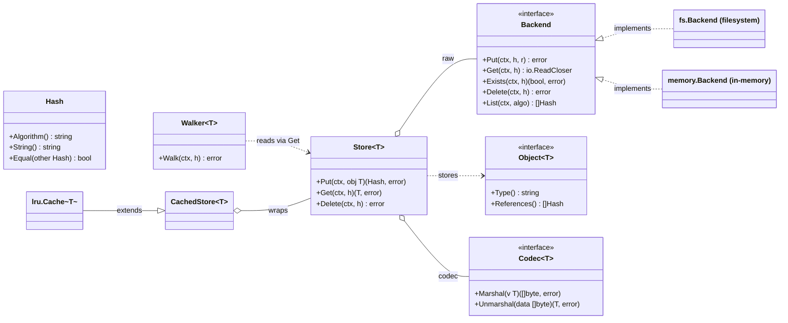
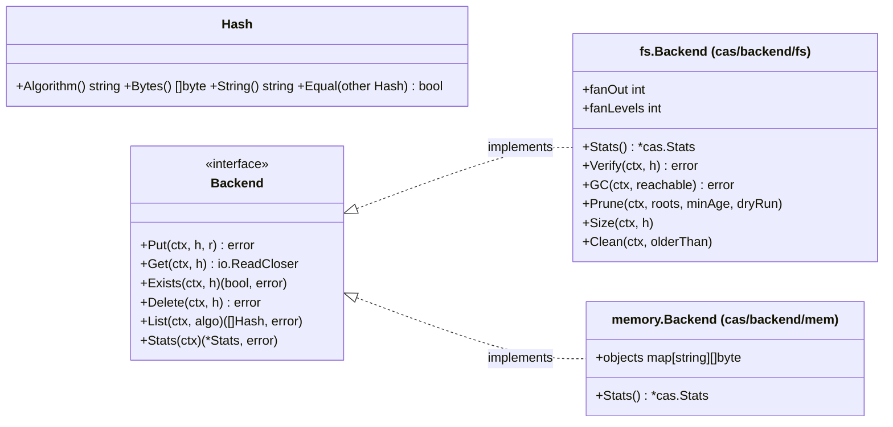
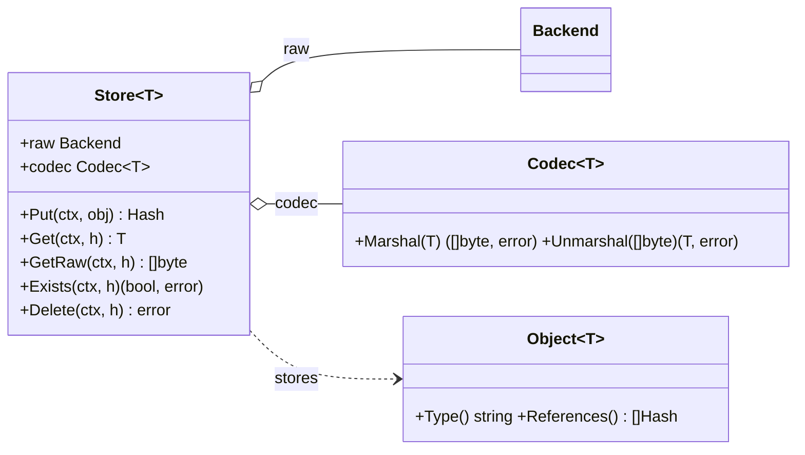
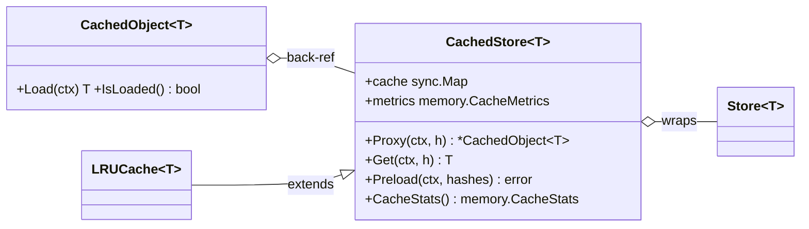
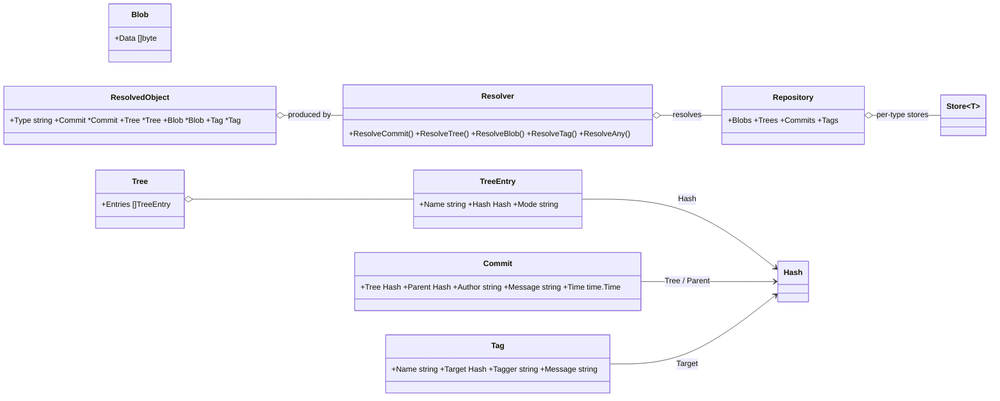

# CAS Core — go-cask

The authoritative specification of the **`cas` core library** — the foundation every extension, client, example, and HTTP/API layer builds on. Origin: the DeepSeek design conversation (final converged state); the repo-root `AGENTS.md` points here. Related: `library-design.md` (lean-core, errors, compatibility), `performance.md`, `testing-strategy.md`, `examples.md`, `backend-architecture.md`.

## 1. Purpose & scope

CASK is a reusable Go **content-addressable store**: blobs stored once under the hash of their content, as immutable objects referencing each other by hash. Git-like (blob/tree/commit/tag) but **generic across apps and domains** — the storage core knows nothing about application object types; apps layer typed objects on top and may share one physical store. Scope: layered architecture, every component's contract, data flows, concurrency model, extension contract. The `cas` package is **generic only**; application models (e.g. `gitlike`) live outside it (§4.12).

## 2. Core concepts & invariants

1. **Hash-addressed.** The storage key is the content hash; no mutable addressing — to "change" an object, store a new one (new hash).
2. **Immutability.** Stored objects are never mutated in place.
3. **Automatic deduplication.** Identical content ⇒ identical hash ⇒ stored once.
4. **Self-describing hashes — the hash type is part of every reference.** A `Hash` is `"algo:hexdigest"`. Every reference (object field, `References()` result, root/pin) holds a FULL `Hash` (algorithm AND digest), never a bare digest. Consequences: the algorithm travels with every reference (one graph may mix algorithms); a store can read any registered algorithm — the store's configured algorithm is only the default for NEW writes; **changing the hash type never breaks the system** — old objects stay addressable under their own algorithm and migration is optional (§4.2, operations.md §5).
5. **Layering.** The byte layer is **non-generic** (`Hash` + `io.Reader` only); all generics live in the typed layer.
6. **No `any` in the public API.** Each object type gets its own `Store[T]`; mixing types is a compile-time error. `Store[T].Get` returns the concrete `T`, never an `Object[T]` interface (§4.8).
7. **Streaming I/O.** The byte layer moves `io.Reader`/`io.ReadCloser`; large objects are never fully buffered by the backend.
8. **Thread safety by default.** Backends have lock-free reads (atomic rename), one `sync.Mutex` for `Put`/`Delete`; caches use `sync.Map`/`atomic`; writes are atomic (temp file + `Sync()` + rename).

Testable via the CAS laws (testing-strategy.md §1).

## 3. Architecture overview

### 3.1 Layers



Dependency rule: byte depends on nothing; typed depends on byte; application depends on typed. Caching wraps the typed layer without changing either. `cas` contains only generic primitives; the git-like object model is a shared reference library in `gitlike/` (§4.12) — apps build their own types/repositories and MUST NOT add them to the core.

### 3.2 How the core fits together

**Storing an object.** An app defines `Note` implementing `Object[Note]` (knows its versioned type name and referenced hashes), then a `Store[Note]` over a `Backend` with a `Codec[Note]`. `Store.Put(ctx, note)`: (1) serializes via `Codec.Marshal` and wraps in the TLV envelope built by `Store.Put` itself — the codec is the single serialization authority (objects never serialize themselves); (2) hashes with `cas.HashBytes` → content address; (3) streams via `Backend.Put(ctx, h, r)`; (4) returns the `Hash` (stored inside other objects to build a graph). Identical bytes ⇒ identical hash ⇒ dedup.

**Reading an object.** `Store.Get(ctx, h)`: `Backend.Get` streams bytes, `Codec.Unmarshal` reconstructs the value, and the decoded `Type()` MUST match the envelope's type name (`ErrUnknownType` otherwise). Result is the concrete `T` — no casts.

**Why three layers.** The non-generic byte layer lets any backend swap in without touching app code; the generic typed layer lets any app type work without touching the core; the application layer owns the domain model. Extensions/clients interact mostly with the typed layer and the stable surface (§7.1).

**References & graphs.** Objects reference each other by plain `Hash` (`Commit.Tree`, `TreeEntry.Hash`, …). The core never interprets them; `Object[T].References()` is the single source of which hashes an object points to — powering `Walker[T]`, cache preloading, and GC reachability.

### 3.3 Aspect diagrams

Core overview (interfaces and dependencies):



Byte layer — addressing and storage:



Typed layer — the generic store:



Cache layer — lazy loading wrappers:



Shared reference layer — gitlike (application code, not core):



## 4. Component specifications

### 4.1 `Hash` — content address

```go
type Hash struct{ /* algo string; bytes []byte — unexported */ }

func (h Hash) Algorithm() string   // "sha1", "sha256", "blake3", ...
func (h Hash) Bytes() []byte       // raw digest bytes
func (h Hash) String() string      // "algo:hexdigest"; "" when absent
func (h Hash) IsZero() bool        // the one "no hash"
func (h Hash) Equal(other Hash) bool
```

- `Hash` is a **concrete, closed value type** (unexported fields): `NewHash`, `ParseHash` and `HashBytes` are the only ways to obtain a present address, so an unvalidated address (e.g. a hostile algorithm name) can never reach a store or a backend path.
- The **zero value IS the absent address** — one spelling of "no hash" for the byte layer and for object fields alike (§4.2); equality is algorithm AND digest.
- `String()` = `"<algo>:<lowercase-hex digest>"`, and `""` when absent (never a bare `":"`).
- `ParseHash("algo:hex")` reconstructs a present `Hash`; MUST reject unknown algorithms (`ErrUnknownAlgorithm`) and malformed hex (`ErrInvalidHash`).
- The byte layer carries **no serialization**: `Hash` has no `MarshalJSON`/`UnmarshalJSON`, and `cas` does not import `encoding/json`. Rendering a hash as text and parsing it back belongs to whichever codec defines a wire format — the JSON codec's `jsoncodec.Hash` field type (§4.6) is the one for JSON.
- Hashes are immutable value carriers AND the **universal reference type**: any field pointing to another object holds a full `Hash` (`algo:digest`); a bare digest is never a valid reference.

### 4.2 Hashing — one algorithm, fixed at compile time

```go
func ParseHash(s string) (Hash, error)     // "sha256:hexdigest"
func NewHash(digest []byte) (Hash, error)  // exactly sha256.Size bytes
func HashBytes(data []byte) Hash           // one-shot
func NewHasher() hash.Hash                 // streaming
```

- **One algorithm: `sha256`** (`cas.SHA256`). There is no registry and no `RegisterHash`: the set of algorithms is a property of this package's build, not of a process's initialization order. Adding an algorithm is a change to `cas`, never a runtime registration — which removes the registry's failure modes outright: no mutex, no init-order coupling, no one-shot-vs-streaming duality (each path has exactly one hasher), and no runtime-chosen string that must double as a path element.
- The **name stays in the address** (`"sha256:hexdigest"`) and in the backend layout (`<base>/sha256/…`), so the stored format stays self-describing and byte-for-byte unchanged. A store written by a build with another algorithm is *recognized* (`ErrUnknownAlgorithm`) rather than misread; the cost is a redundant prefix on each reference.
- `HashBytes(data)` cannot fail and wraps the sha256 digest as a `Hash`. `NewHasher()` returns a streaming `hash.Hash` for the same algorithm — `Store.Put` hashes the envelope in one pass and the backend `Verify` streams through it, so a large object is never buffered.
- `NewHash(digest)` returns `ErrInvalidHash` unless digest is exactly `sha256.Size` bytes: with one algorithm the digest width is fixed, so an address of any other width cannot name a stored object. `ParseHash` applies the same rule to the 64-hex-digit form and returns `ErrUnknownAlgorithm` for a well-formed address naming another algorithm (e.g. `sha1:…`).
- **JSON form lives in the JSON codec, not in `Hash`** (§4.6): the field type `jsoncodec.Hash` renders a present address as its canonical `"algo:hexdigest"` string, the zero value as `""`, and decoding `""`/`null` yields the zero value while every other value must parse (`ErrInvalidHash` / `ErrUnknownAlgorithm`). A decoded object can therefore never hold an unparsable reference that would later vanish from `References()`, and an object type declares `jsoncodec.Hash` fields with **no** JSON code of its own.
- **One spelling of "no hash".** The zero value IS the absent address: `IsZero()` reports it, `String()` renders it as `""` rather than a bare `":"`, `Equal` treats it as equal to nothing, and the JSON codec's field type renders it as `""`. Object fields use that field type — an optional reference is tagged **`omitzero`** (Go 1.24+), which omits the field when `IsZero()` reports absent, while a field that is always present keeps its historical `""`. The module declares `go 1.24` for `omitzero`: an older standard library ignores the unknown tag option, which would silently change the stored bytes and the object's address.
- **An absent address is not a store key.** The byte layer must receive a present address: `Store` and both backends reject the zero value with `ErrInvalidHash` (via `CheckHash`) instead of addressing an object that cannot exist.
- **Validation belongs to the codec's field type.** Because decoding is its job, a reference whose absence is illegal *and* must fail at decode time needs only a small per-type guard on presence — never a hand-written `UnmarshalJSON` for rendering (gitlike's `Commit`, §4.12, is the reference implementation).

**Algorithm change & legacy stores:**
- Objects in this build's store are all written under sha256. A tree written under another algorithm (a legacy or foreign store) is still *enumerable* per algorithm — `List(algo)` filters, `Stats` reports per-algorithm counts from the layout — but its objects cannot be read or verified here: their addresses fail `ParseHash` (`ErrUnknownAlgorithm`), so `List` skips those paths.
- Changing the algorithm is therefore a **format transition, not a configuration change**: every object is rewritten under new addresses, exactly as Git's object-format transition works. `operations.md` §5 records the procedure (list → read → re-hash → write → VERIFY each → delete the source only after verification).

> **Decision (2026-09, revised): one algorithm, no registry.** The earlier decision kept runtime-pluggable algorithms "not for current need, but because the migration path distinguishes this store from fixed-algorithm systems". On review the migration path that matters — *reading* what a differently-configured build wrote — is carried by the address itself (the algorithm name stays in the string and the layout), while the registry only ever added process-global mutable state: a mutexed map, init-order coupling, a one-shot/streaming split inside `Verify`, and a runtime-chosen name used as a filesystem path element. Git's model — one object format per repository, with an explicit translation/migration if it ever changes — is the model here. Adding an algorithm later is format-additive (the name is already in the address) but is a code change in `cas` plus one in each codec that renders an address.

### 4.3 `Backend` — the byte storage contract (non-generic)

```go
type Backend interface {
    Put(ctx context.Context, h Hash, r io.Reader) error
    Get(ctx context.Context, h Hash) (io.ReadCloser, error)
    Exists(ctx context.Context, h Hash) (bool, error)
    Delete(ctx context.Context, h Hash) error
    List(ctx context.Context, algo string) ([]Hash, error)
    Stats(ctx context.Context) (*Stats, error)
}
```

Per-method contracts (every backend MUST honor):

| Method | Contract |
|---|---|
| `Put` | Idempotent: same hash ⇒ same bytes; may overwrite with identical bytes |
| `Get` | Returns a stream the caller MUST close; missing → `ErrNotFound` |
| `Exists` | Boolean presence check |
| `Delete` | Missing object ⇒ no-op, no error |
| `List` | All stored hashes; `algo != ""` filters by algorithm |
| `Stats` | Per-algorithm counts, total stored bytes, object count (§4.11) |

This interface is the **backend extension point** — any storage system (S3, BadgerDB, PostgreSQL, IPFS blockstore) plugs in by implementing these six methods (recipe §7.2).

### 4.4 `fs.Backend` — the filesystem backend (`cas/backend/fs`)

**On-disk layout (fan-out, Git-like by default):** objects live at `<base>/<algorithm>/<fan-out directories>/<full-hex-digest>`; the file name is always the **full hex digest**; fan-out dirs are successive digest chunks, controlled by:

| Parameter | Meaning | Default |
|---|---|---|
| `FanOut` | hex chars per directory level | 2 |
| `FanLevels` | number of directory levels | 1 |

Examples (sha256 digest `a1b2c3d4…`): flat `(0,0)` `<base>/sha256/a1b2c3d4...`; Git-like `(2,1)` `<base>/sha256/a1/a1b2c3d4...`; deep `(2,2)` `<base>/sha256/a1/b2/...`; wide `(4,1)` `<base>/sha256/a1b2/...`.
- The default (2,1) is Git-like in directories only (`objects/<algo>/aa/<full-hex>`); the file name is always the **complete digest**, never the Git-style remainder.
- Any n-way/n-level allowed: `fs.New(basePath, opts ...backend.Option)` with `fs.WithFanOut(n)`/`fs.WithFanLevels(n)`, as long as `FanLevels × FanOut` ≤ the hex digest length (64 for SHA-256); over-deep configs rejected at construction.
- `hashPath(h)` builds the path from the configured layout; `pathToHash(path)` rebuilds the `Hash` from the relative path (first part = algorithm, last = full hex digest; middle fan-out dirs not needed); unrecognized files skipped.

> Decision (2026-09): file-name style is **not configurable** — full-hash names are the only layout (a Git-remainder option was rejected: no interop, a second mode everywhere, loses the self-describing full-hash name `List`/`Stats`/`Verify` rely on). Revisit only if a real consumer requires remainder names.

**Write path (atomic):**
```text
MkdirAll(dir) → open <path>.tmp (O_CREATE|O_EXCL) → io.Copy(f, r) → f.Sync() → os.Rename(tmp, path)
```
- Directory fsync is optional via `WithDirSync()` (fsync the parent after rename so the publish is crash-durable). Best-effort — platforms that can't sync dirs (Windows) make it a no-op (operations §1); default off.
- Temp name is **unique per writer**: base `<path>.tmp`; if `O_EXCL` fails (only possible across processes, since the in-process mutex serializes Puts) append a numeric suffix `<path>.tmp.<n>`. No two writers share a temp inode, so concurrent same-hash writers across processes cannot corrupt each other's write or the stored object.
- Rename is atomic: on POSIX the last writer wins with identical bytes; on Windows a concurrent rename-over-existing can transiently fail (no cross-process last-wins). Because the address is the content, an existing **regular file** at the destination already holds those bytes, so such a `Put` reports success (idempotent); anything else at the path is a real error. A concurrent `Get` retries briefly while the file exists but cannot be opened (Windows sharing violation), so readers still see the old or the new file.
- On any failure the temp is removed; readers never observe partial files. `.tmp` files (`<hex>.tmp` and the `<hex>.tmp.<n>` collision fallbacks) are ignored by `List`/`Stats` and reclaimed by `Clean`.
- `Put` checks `ctx` before each read from the source, so a canceled `Put` (HTTP upload, CLI pipe) stops streaming and publishes nothing.

**Concurrency (lock-free reads):** writes are atomic, so `Get`/`Exists`/`List`/`Stats` take **no lock** — a reader sees the old or the new file, never partial (performance §2). `Put` is idempotent, so concurrent same-hash writers never corrupt — in-process via the mutex, across processes via unique temp names (with the POSIX/Windows rename caveat). At most one `sync.Mutex` coordinates `Put`/`Delete` in-process; reads are wait-free. **Cross-process guarantees stop at object writes**: no inter-process locking, so a maintenance sweep (`Delete`/`GC`/`Prune`/`Clean`) racing another process's writes is NOT safe. The **grace model** applies: sweeps that MAY race live writers MUST reclaim only objects older than a grace `--min-age` (the `cask` CLI `gc`/`prune` default 1h; forced `--min-age 0` is the dangerous variant).

**Maintenance methods** (§4.11): `Stats`, `Verify`, `GC`, `Clean`; `Size(h)` returns an object's size (`ErrNotFound` when missing); `Clean(ctx, olderThan)` sweeps leftover temp files (`<hex>.tmp` and `<hex>.tmp.<n>`) older than the threshold — always safe (a temp file is never a valid object). It tolerates a missing store directory (nothing to sweep) and returns walk/removal errors instead of swallowing them.
- **Listing scope:** `List`/`Stats` rebuild each hash from its path, which requires the algorithm to be registered in the calling process (§4.2). Object files written under an algorithm this process has not registered are skipped — register the algorithm before listing such a store.

### 4.5 `memory.Backend` — in-memory backend (`cas/backend/mem`)

Keeps objects in `map[string][]byte` (keyed by `h.String()`) under a `sync.RWMutex`.
- **Purpose:** fast, dependency-free, deterministic storage for unit/property/fuzz tests and benchmarks; **not persistent**.
- **Contracts:** same `Backend` semantics as fs — idempotent `Put`; `Get` returns a reader the caller MUST close (missing → `ErrNotFound`); `Delete` no-op on missing; `List(algo)` filters.
- **Buffering:** `Put` buffers the whole stream (`io.ReadAll`); `Get` returns `io.NopCloser(bytes.NewReader)` over the stored slice (never mutated after `Put`). With `WithMaxSize` the read is bounded to the remaining budget first, so an oversized `Put` is rejected without allocating past the cap.
- **Concurrency:** `RWMutex` (the lock-free rename trick doesn't apply; still far faster than disk).
- **Stats:** implements `Backend.Stats` (`*cas.Stats`), recomputing per-algorithm counts/total bytes/object count from the map each call — no desynchronized counter. No `Verify`/`GC`/`Prune` (fs-only, §4.11).
- **Construction:** `memory.New(...)` (`cas/backend/mem`; optional `memory.WithMaxSize(n)` cap; 0 = unbounded); swap-in compatible with any `Store[T]`, `gitlike` repo, or HTTP handler taking a `Backend`.

### 4.6 `Codec[T]` — serialization contract

```go
type Codec[T any] interface {
    Marshal(v T) ([]byte, error)
    Unmarshal(data []byte) (T, error)
}
```

- Default: the JSON codec `json.New[T]()` (`cas/codec/json`), wrapping std-lib `encoding/json`.
- Compression/encryption/protobuf are additional `Codec[T]` impls; they never change the byte layer.
- Contract: `Unmarshal(Marshal(v)) == v` (round-trip) for all storable values.
- **The codec owns the hash wire shape.** `cas/codec/json` also exports the hash *field type* object types declare for reference fields — the one place a hash is rendered as text and validated on the way back in:

  ```go
  type Hash struct{ /* wraps cas.Hash */ }        // jsoncodec.Hash

  func NewHash(h cas.Hash) Hash                   // wrap for a field or literal
  func (x Hash) Hash() cas.Hash                   // unwrap for the byte layer
  func (x Hash) IsZero() bool                     // consults `omitzero`
  func (x Hash) MarshalJSON() ([]byte, error)     // present → "algo:hexdigest", absent → ""
  func (x *Hash) UnmarshalJSON([]byte) error      // ""/null → absent, else ParseHash
  ```

  Rationale: `cas.Hash` is the byte layer's address and knows nothing about any wire format — the byte layer importing `encoding/json` would make one codec's concern universal. An object type therefore writes `Hash jsoncodec.Hash \`json:"…,omitzero"\``, wraps literals with `jsoncodec.NewHash(...)`, and unwraps with `.Hash()` where the byte-layer type is needed (a `Store`/`Resolver` call, `.Equal`). A non-JSON codec carries no hash type at all: `gob` encodes `cas.Hash`'s fields directly, so its stored form is naturally unchanged. See §4.2 for the rules this type implements and §4.12 for a working object model.

### 4.7 `Object[T]` — self-describing typed object

```go
type Object[T any] interface {
    Type() string        // versioned "<type>@<major>", e.g. "commit@1"
    References() []Hash  // hashes this object points to (may be nil)
}
```

- `Type()` returns a **versioned type name** `<type>@<major>` — the object model is semantically versioned; several majors coexist in one store (object-versioning.md).
- `References()` is the single source of truth for traversal, preloading, and GC reachability.
- Serialization is NOT an object concern: `Store.Put` encodes with the store's `Codec[T]` and builds the envelope (§8 d1) — the codec is the single serialization authority on write AND read.

### 4.8 `Store[T]` — the generic typed store

```go
type Store[T Object[T]] struct {
    raw   Backend
    codec Codec[T]
}

func New[T Object[T]](raw Backend, codec Codec[T]) *Store[T]
```

| Method | Behavior |
|---|---|
| `Put` | `codec.Marshal(obj)` → TLV envelope → `HashBytes(data)` → `raw.Put` → h |
| `PutDedup` | `raw.Exists` first; returns `(h, alreadyStored, err)` |
| `Get` | `raw.Get` → `codec.Unmarshal` → concrete `T`; decoded `Type()` MUST match the stored type name (else `ErrUnknownType`) |
| `GetRaw` | returns the serialized bytes for inspection/tooling |
| `Exists` | delegates to `raw` |
| `Delete` | delegates to `raw` |

- Type safety from one store per type: `Store[Blob]` vs `Store[Commit]` distinct — passing a commit hash to a blob store is a **compile-time error**.
- `Get` returns the **concrete `T`** (type name verified); `GetRaw` returns bytes. The constraint `Store[T Object[T]]` keeps the typed layer free of `any`/type assertions.
- `Store[T]` is safe for concurrent use if its `Backend` is.

### 4.9 `Walker[T]` — generic graph traversal

```go
func NewWalker[T Object[T]](store *Store[T], visit func(T) error) *Walker[T]
func (w *Walker[T]) Walk(ctx context.Context, h Hash) error
```

- `visit` receives every reached object as the concrete `T`; reads via `Store[T].Get`.
- Traversal is **iterative with an explicit stack and a visited set** keyed by `h.String()`: each hash is visited at most once, a shared subgraph is visited once rather than once per path, and a very deep graph terminates instead of exhausting the goroutine stack. A cycle is not constructible through the public API — the core has one strong hash, so an object's address depends on the bytes that would have to contain it.
- Mixed-type traversal is the app's job (`gitlike` resolver, §4.12).

### 4.10 Caching & lazy loading

**`memory.CachedObject[T]`** — lazy proxy for one hash (`cas/cache/mem`): fields `hash`, back-pointer to its `CachedStore[T]`, `sync.RWMutex`, `obj`, `loaded`, `err`. `Load(ctx)` uses **double-checked locking**, loads exactly once, memoizes object AND error. `IsLoaded()` reports state without loading.

**`memory.CachedStore[T]`** — wraps `Store[T]`, built with `memory.New(store)`. Cache: `sync.Map` keyed by `h.String()` → `*CachedObject[T]`. Metrics: `memory.CacheMetrics{Hits, Misses, Loads, Evicts}` (atomic): `Hits`/`Misses` count `Proxy` lookups, `Loads` counts store fetches performed by `CachedObject.Load` (at most one per cached object, including a fetch that returns an error), `Evicts` counts removals by a policy or `Evict`. `OnNew` is a construction-time hook (set it before the cache is used concurrently). `Proxy(ctx, h)` returns a not-yet-loaded `*CachedObject[T]` (verifies existence first); `Get` = `Proxy` + `Load`. `Preload(ctx, hashes)` loads in parallel (worker goroutines + error channel); `PreloadRecursive(ctx, h, depth)` preloads the graph. `CacheStats()`/`Evict(h)`/`Clear()`/`Warmup(ctx, hashes)`.

**`lru.Cache[T]`** — size-bounded LRU (`cas/cache/lru`): wraps/embeds `CachedStore[T]`, adds LRU with `maxSize` (in-tree std-lib, §8 d3), overrides `Proxy`/`Get` to track/promote. `lru.New(store, maxSize)` returns `(*lru.Cache[T], error)`; rejects `maxSize <= 0`.

Prefetch-on-access (`prefetch.SmartCache[T]`, `prefetch.NewSmartCache(store, depth)`) and `CacheMonitor` are **example recipes, not part of `cas`** — demonstrated by `examples/notes` and `examples/artifacts`.

### 4.11 Maintenance

- **`Backend.Stats(ctx)`** → `*cas.Stats` (`AlgorithmCounts`, `TotalSize`, `ObjectCount`) with a `String()` summary; part of the `Backend` interface so **every backend** reports it (fs walks the tree ignoring `.tmp`; mem recomputes from its map). `Verify`, `GC`, `Prune`, and the tree walk are fs-specific.
- **`fs.Backend.Verify(ctx, h)`** — re-reads, recomputes the hash with the address's algorithm; mismatch → `ErrHashMismatch`.
- **`fs.Backend.GC(ctx, reachable map[string]bool)`** — mark-and-sweep: deletes every object whose `h.String()` is not in `reachable`; the caller computes the reachable set.
- **`fs.Backend.Prune(ctx, roots []Hash, minAge time.Duration, dryRun bool)`** — deletes objects unreachable from `roots` AND older than `minAge` (age = file mtime ≈ first-`Put`); `dryRun` returns the would-be-deleted set. Detection/consistency in `consistency.md`.

### 4.12 Shared reference layer: `gitlike` (NOT generic core)

A shared **reference object-model library** at `gitlike/`, `package gitlike` — not part of `cas`. Apps define their own `Object[T]` types; this is the reference set:

| Type | Fields | References() |
|---|---|---|
| `Blob` | `Data []byte` | nil (leaf) |
| `Tree` | `Entries []TreeEntry` | hashes of all entries |
| `TreeEntry` | `Name string`, `Hash Hash`, `Mode string` | (entry, not an object) |
| `Commit` | `Tree Hash`, `Parent Hash`, `Author`, `Message`, `Time` | tree + parent (if any) |
| `Tag` | `Name`, `Target Hash`, `Tagger`, `Message` | target |

- All four versioned from the start (`blob@1`, `tree@1`, `commit@1`, `tag@1`); a future incompatible change becomes `type@2` with the old deserializer registered.
- `Parent`/`Target` may be absent — an absent reference marks root/leaf. Cross-type references are plain `Hash`; target type discovered at resolution, not baked in.
- **Serialization:** every reference field uses the JSON codec's field type, `jsoncodec.Hash` (§4.6) — `omitzero` where absence is legal (`TreeEntry.Hash`, `Commit.Parent`), a plain field where the value is always present (`Commit.Tree`, `Tag.Target`; a tag target may still be absent and keeps its historical `""`). `Tree`, `TreeEntry` and `Tag` therefore carry **no** JSON code at all, and every reference is rendered and validated by `jsoncodec.Hash` itself. `Commit` keeps two small methods for its one mandatory-field invariant: `MarshalJSON` refuses a tree-less commit on write, and `UnmarshalJSON` turns a missing, empty, or null tree into a decode error. Stored bytes — and therefore every object address — are unchanged (`TestStoredAddressesPinned`).
- **`Validate() error`** on `TreeEntry`/`Tree`/`Commit`/`Tag` is advisory for objects built in code: a `TreeEntry` needs a name, a `Commit` needs a tree (checked with `Tree.IsZero()`), a `Tag` needs a name, and an absent `Hash` is valid wherever absence is legal. `Store.Put` marshals but does not validate, so callers constructing objects by hand SHOULD call `Validate` before `Put`; the nil-tree commit is the one case still rejected at `Put` time.

**`Repository` and `Resolver` — cross-type access without `any`:**

```go
type Repository struct {
    Blobs   *Store[Blob]
    Trees   *Store[Tree]
    Commits *Store[Commit]
    Tags    *Store[Tag]
}

type Resolver struct{ repo *Repository }
```

- `Repository` bundles per-type stores over one `Backend` + one algorithm; `NewRepository(raw, algo)`.
- `Resolver` exposes dedicated `ResolveCommit`/`ResolveTree`/`ResolveBlob`/`ResolveTag` (each calls the matching `Get`); calling the wrong one is a compile-time error.
- **Resolve anything** (unknown type): `ResolveAny(ctx, h)` returns a typed union, not `any`:

```go
type ResolvedObject struct {
    Type   string
    Commit *Commit
    Tree   *Tree
    Blob   *Blob
    Tag    *Tag
}
```

- `ResolveAny` determines the type from the bytes via `parseType` on the TLV envelope (§8 d1), then dispatches to the matching `Resolve*`.
- `PrintObject(*ResolvedObject) string` renders any resolved object via a type switch — no reflection.
- **`WalkGraph`** — whole-graph traversal over unknown types: `WalkGraph(ctx, resolver, h, visit func(*ResolvedObject) error)`; its type-switch makes it example-specific (generic alternative: `Walker[T]`, §4.9).
- **`CachedRepository`** — per-type `lru.Cache` wrappers + an internal `Resolver`; convenience `GetCommit`/`GetTree`/`GetBlob`.
- **`Preloader`** — background worker pool on a `chan Hash`, running `Commits.PreloadRecursive(ctx, h, 2)`; non-blocking `Preload`, `Stop()` cancels and drains.

## 5. Data flows

- **Write path:** `codec.Marshal(obj)` → TLV envelope (built by `Store.Put`) → `hash := HashBytes(data)` → `raw.Put(ctx, hash, reader)` (atomic fs, idempotent) → return hash. Optional `PutDedup`: check `raw.Exists(hash)` first, skip the write.
- **Typed read path:** `raw.Get(ctx, h)` → `io.ReadAll` → `codec.Unmarshal(data)` → `T`; decoded `Type()` matches stored type.
- **Lazy/cached read path:** `CachedStore.Proxy(ctx, h)` → not-yet-loaded `*CachedObject[T]`; on first access `Load(ctx)` → `store.Get` → memoize `(obj, err)`; later access returns the memoized value (double-checked locking).
- **Cross-type resolution path (gitlike):** `ResolveAny(ctx, h)` → raw bytes → `parseType(data)` → dispatch to `ResolveBlob`/`ResolveTree`/`ResolveCommit`/`ResolveTag` → `ResolvedObject{...}`. The generic core has no equivalent.

## 6. Concurrency model

| Concern | Mechanism |
|---|---|
| Backend file access | lock-free reads (atomic rename); one `sync.Mutex` for `Put`/`Delete` |
| Atomic visibility | temp file → `f.Sync()` → `os.Rename` |
| Object lazy load | `sync.RWMutex` + double-checked locking in `CachedObject` |
| Cache index | `sync.Map` keyed by `h.String()` |
| Metrics | `atomic.Uint64` counters |
| Parallel preload | worker goroutines + buffered error channel + `WaitGroup` |
| Background preloader | worker pool with `context.WithCancel`; non-blocking enqueue |
| Hashing | none — one algorithm (`sha256`), no registry, no global state |
| Smart prefetch | detached goroutine with 5 s `context.WithTimeout` |

- `Store[T]` is safe for concurrent use if its `Backend` is. **Concurrency safety is per-process** (mutexes/`sync.Map`/double-checked locking coordinate one process); the core has no inter-process locking. Serve many clients from one process.
- **Cross-process model (grace, Git-style):** concurrent readers and concurrent same-hash `Put`s are safe by construction (atomic rename, unique temps) — writers and the viewer may run in several processes on one store. What needs coordination is a maintenance sweep racing another process's writes: the `cask` CLI takes the store's exclusive `.cask.lock` (one sweep at a time) and reclaims only objects older than a grace `--min-age` (default 1h); a forced `--min-age 0` sweep is the dangerous variant (prints a warning). Embedding apps MUST provide equivalent coordination if they sweep from >1 process per store dir.
- Callers must close every `io.ReadCloser` from `Backend.Get`. Prefetchers must never block the hot path (queue full → skip; prefetch in a goroutine with a timeout).

## 7. Consuming & extending the core

Contract for adjacent extensions (backends, codecs, caches) and clients.

### 7.1 Stable public surface

| Area | Exported identifiers |
|---|---|
| Addressing | `Hash`, `CheckHash`, `ParseHash`, `NewHash`, `NewHasher`, `HashBytes`, `SHA256` |
| Storage | `Backend`; `fs.Backend` (`fs.New`, `fs.WithFanOut`, `fs.WithFanLevels`, `fs.WithDirSync`); `memory.Backend` (`memory.New`, `memory.WithMaxSize`); shared `cas.Stats` |
| Typed layer | `Object[T]`, `Codec[T]`, `Store[T]`, `Walker[T]`; codecs `json.New[T]()` (`cas/codec/json`), `gob.New[T]()` (`cas/codec/gob`); JSON hash field type `jsoncodec.Hash` (`jsoncodec.NewHash`, `.Hash()`, `.IsZero()`) |
| Caching | `memory.CachedObject[T]`, `CachedStore[T]`, `CacheMetrics`, `CacheStats` (`cas/cache/mem`); `lru.Cache[T]`, `lru.New` (`cas/cache/lru`) |
| Errors | `ErrNotFound`, `ErrHashMismatch`, `ErrUnknownAlgorithm`, `ErrInvalidHash`, `ErrUnknownType`, `ErrCorrupt` |

Everything else is internal and MUST NOT be relied upon. The surface stays additive-compatible (library-design §5).

### 7.2 Extension recipes

**Add a storage backend:** implement the six `Backend` methods (`Put`/`Get`/`Exists`/`Delete`/`List`/`Stats`) — idempotent `Put`, no-op `Delete` on missing, `List(algo)` filter, `Get`→`ErrNotFound` on missing, a `Stats` summary (§4.11). Keep the byte layer non-generic; the `memory` backend is the minimal reference; add durability per operations.md §1 where persistent.

**Add an object type:** implement `Object[Document]` (`Type()`/`References()`); create your own `*Store[Document]` with `json.New[Document]()`. Declare reference fields as `jsoncodec.Hash` — the JSON codec's field type (§4.6) — with `json:"…,omitzero"` when the reference may be absent, so the type needs no JSON code for hashes; wrap literals with `jsoncodec.NewHash(h)`, unwrap with `.Hash()` where a `Hash` is expected, and skip `IsZero()` entries in `References()`. For a repository/resolver, copy the `gitlike` pattern into your own package — do NOT extend `cas`/`gitlike`. Never add `any`/reflection — add explicit typed methods.

**Change the hash algorithm:** there is no registry — the algorithm is `sha256` and the set of algorithms is fixed at compile time. Adding one means (1) implementing it in `cas` alongside sha256, with its digest width validated in `NewHash`/`ParseHash`, and (2) updating every codec that renders an address. Existing objects stay readable because the algorithm name travels in the address and the layout; objects written under an algorithm a build does not implement are refused with `ErrUnknownAlgorithm` rather than misread.

**Add a codec:** implement `Codec[T]` (e.g. wrap `json.New[T]` with compression/encryption) and pass it to `cas.New`; do not change the byte layer.

**Add a cache policy:** wrap or extend `memory.CachedStore[T]`; keep the `CachedObject[T]` lazy-load contract and metrics counters.

**Add maintenance ops:** add methods on `fs.Backend`; keep `Stats`/`Verify`/`GC` semantics from §4.11.

### 7.3 Compatibility & contracts

- Never break the stable surface within a major (library-design §5); HTTP API versioning is independent.
- Sentinel errors are the wire between core and clients: map to HTTP statuses in the API layer (api-design §6), never string-compare.
- Performance contracts (lock-free reads, one-pass hashing, bounded allocations) per performance.md; the CAS laws are the correctness contract (testing-strategy §1).

## 8. Decisions & follow-ups

Resolved decisions (so implementation never re-litigates them):
1. **Serialization — RESOLVED: TLV envelope** (`cas/envelope.go`):
   ```text
   +--------+-----------+------------+-----------+---------+
   | Version| TypeLen   | Type       | PayloadLen| Payload |
   | 1 byte | uvarint   | N bytes    | uvarint   | M bytes |
   +--------+-----------+------------+-----------+---------+
   ```
   Version = format version (currently `1`; leading byte makes it versionable). TypeLen = length of the versioned type name (`commit@1`) as `uvarint`. Type = the name bytes (absent major reads as `@1`). PayloadLen = payload length as `uvarint`. Payload = exactly PayloadLen bytes — the `Codec[T]` output. `PayloadLen` makes the frame self-delimiting (a reader locates the payload without scanning to EOF — streaming/range reads). Replaces the earlier JSON envelope: no JSON/base64 overhead, streamable, codec-agnostic, versionable. Makes `parseType`/`ResolveAny` work without a side registry and carries the object-model version with the bytes. Applies everywhere (gitlike, app objects, `parseType`, `ResolveAny`).
2. **`hashRegistry` synchronization — RESOLVED:** populated at init only; reads lock-free after startup; if runtime registration is required, guard with a `sync.RWMutex`.
3. **LRU dependency — RESOLVED: in-tree std-lib** (`container/list` + map or equivalent) — no vendored/golang-lru.
6. **GC reachability — RESOLVED:** mark-and-sweep from application roots with age-based pruning (consistency §4–§5; refcounting rejected).
7. **Large-file streaming — RESOLVED:** hash streams via `io.TeeReader` (performance contract for `Store.Put`).

Open follow-ups (future extensions, not blocking):
4. **Packfiles** — Git-style packing of small objects into `pack-<ts>.pack`; design/acceptance in performance §9.
5. **Compression layer** — `CompressedStore` wrapping `Backend` with gzip via `io.Pipe`; deferred until a real need.
8. **Encryption layer** — `EncryptedCodec[T]` wrapping `Codec[T]` with AES-256-GCM (std-lib); the app supplies the key (never generated/stored by the core); transparent to the byte layer (payload carries ciphertext unchanged); deferred until a real need.

## 9. Related documents

`AGENTS.md` (aggregator), `library-design.md`, `performance.md`, `testing-strategy.md`, `backend-architecture.md`, `examples.md`, `consistency.md` (maintenance model of §4.11), `docs/specs/AGENT.md` (meta-guide).
