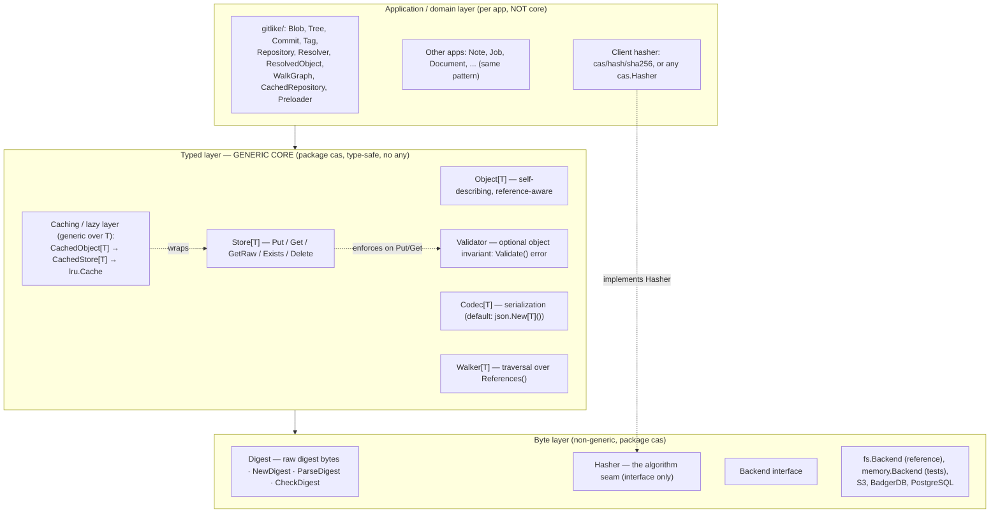
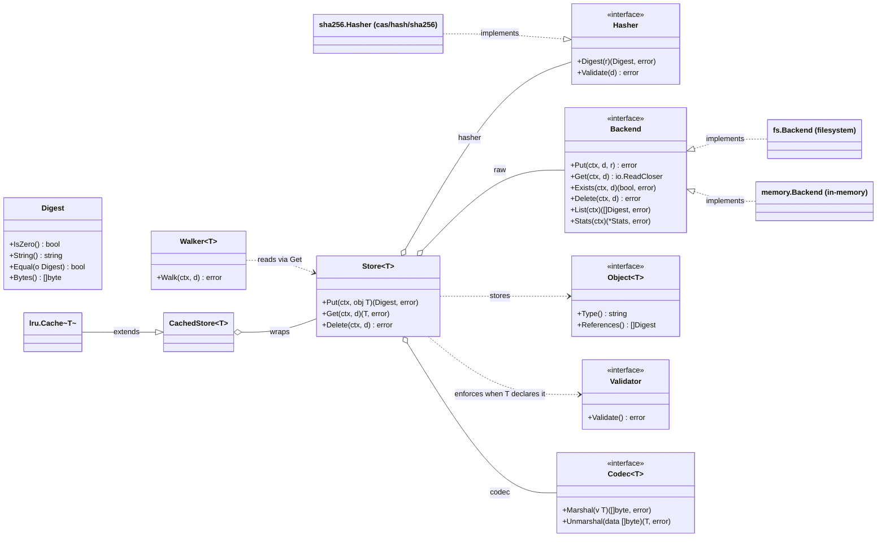
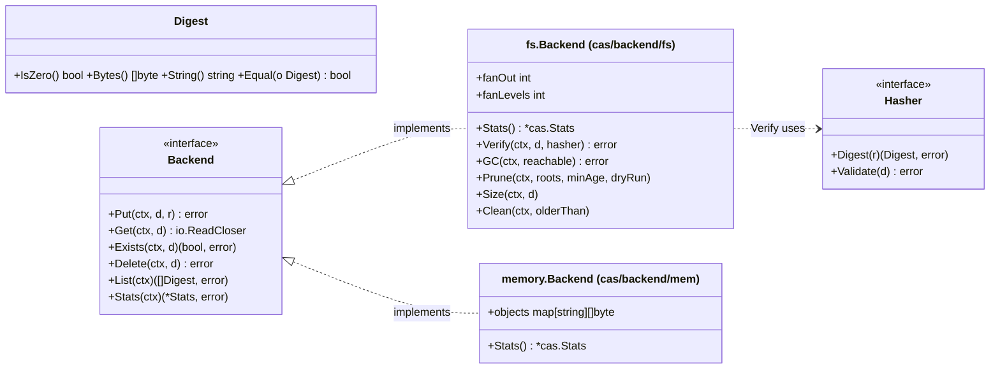
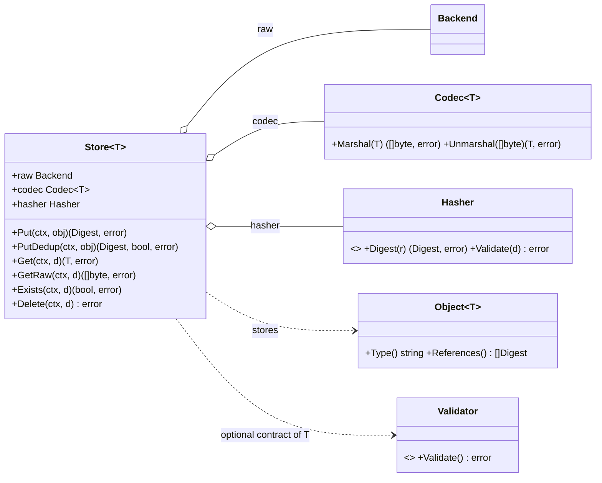
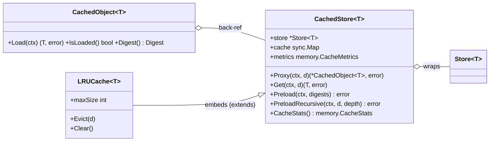

# CAS Core — go-cask

The authoritative specification of the **`cas` core library** — the foundation every extension, client, example, and HTTP/API layer builds on. Origin: the DeepSeek design conversation (final converged state); the repo-root `AGENTS.md` points here. Related: `library-design.md` (lean-core, errors, compatibility), `performance.md`, `testing-strategy.md`, `examples.md`, `backend-architecture.md`.

## 1. Purpose & scope

CASK is a reusable Go **content-addressable store**: blobs stored once under the digest of their content, as immutable objects referencing each other by digest. Git-like (blob/tree/commit/tag) but **generic across apps and domains** — the storage core knows nothing about application object types, and it **names no hash algorithm**: the client injects one as a `Hasher` (§4.2), so the storage layer keys blobs by an opaque digest (the OCI/Docker split) while the code that knows the algorithm stays outside it. Apps layer typed objects on top and may share one physical store. Scope: layered architecture, every component's contract, data flows, concurrency model, extension contract. The `cas` package is **generic only**; application models (e.g. `gitlike`) live outside it (§4.12).

## 2. Core concepts & invariants

1. **Digest-addressed.** The storage key is the digest of the content; no mutable addressing — to "change" an object, store a new one (new digest).
2. **Immutability.** Stored objects are never mutated in place.
3. **Automatic deduplication.** Identical content ⇒ identical digest ⇒ stored once.
4. **The core is hash-agnostic; the client owns the algorithm.** `Digest` is raw digest bytes (§4.1) and `cas` implements no hash function: a `Hasher` is injected into the `Store` and does the hashing and the digest-width check (§4.2). The consequences are deliberate and stated up front: a reference carries **no algorithm name**, so the core cannot recognize a store written by a build with another algorithm, cannot report per-algorithm statistics, and one store is effectively **single-format** — Git's model of one object format per repository. Changing the algorithm is therefore a **format transition, not a configuration change**: re-digest and rewrite every object under the new addresses, verify each, then delete the source only after verification (operations.md §5) — the client's job, since only the client knows the algorithm.
5. **Layering.** The byte layer is **non-generic** (`Digest` + `io.Reader` only); all generics live in the typed layer.
6. **No `any` in the public API.** Each object type gets its own `Store[T]`; mixing types is a compile-time error. `Store[T].Get` returns the concrete `T`, never an `Object[T]` interface (§4.8).
7. **Streaming I/O.** The byte layer moves `io.Reader`/`io.ReadCloser`; the fs backend copies an object to disk without buffering it in memory (the mem backend buffers by design), and `Verify` streams through the injected `Hasher`.
8. **Thread safety by default.** Backends have lock-free reads (atomic rename), one `sync.Mutex` for `Put`/`Delete`; caches use `sync.Map`/`atomic`; writes are atomic (temp file + `Sync()` + rename).

Testable via the CAS laws (testing-strategy.md §1).

## 3. Architecture overview

### 3.1 Layers



Dependency rule: byte depends on nothing; typed depends on byte; application depends on typed. Caching wraps the typed layer without changing either. The algorithm is one more seam a client fills without forking the core: `Store` holds a `Hasher` (§4.2), and nothing in `cas` imports a concrete one. `cas` contains only generic primitives; the git-like object model is a shared reference library in `gitlike/` (§4.12) — apps build their own types/repositories and MUST NOT add them to the core.

### 3.2 How the core fits together

**Storing an object.** An app defines `Note` implementing `Object[Note]` (knows its versioned type name and referenced digests), then a `Store[Note]` over a `Backend`, with a `Codec[Note]` and the client's `Hasher`. `Store.Put(ctx, note)`: (1) serializes via `Codec.Marshal` and wraps in the TLV envelope built by `Store.Put` itself — the codec is the single serialization authority (objects never serialize themselves); (2) hashes with the injected `Hasher` → content address `d`; (3) streams via `Backend.Put(ctx, d, r)`; (4) returns the `Digest` (stored inside other objects to build a graph). Identical bytes ⇒ identical digest ⇒ dedup. The core never hashes anything itself — it only asks the `Hasher`.

**Reading an object.** `Store.Get(ctx, d)`: `Backend.Get` streams bytes, `Codec.Unmarshal` reconstructs the value, and the decoded `Type()` MUST match the envelope's type name (`ErrUnknownType` otherwise). Result is the concrete `T` — no casts.

**Why three layers.** The non-generic byte layer lets any backend swap in without touching app code; the generic typed layer lets any app type work without touching the core; the injection seam lets any hash algorithm work without touching either; the application layer owns the domain model. Extensions/clients interact mostly with the typed layer and the stable surface (§7.1).

**References & graphs.** Objects reference each other by plain `Digest` (`Commit.Tree`, `TreeEntry.Hash`, …). The core never interprets them; `Object[T].References()` is the single source of which digests an object points to — powering `Walker[T]`, cache preloading, and GC reachability. A reference is a bare digest with no algorithm, so it is meaningful only to a client using the algorithm that produced it (§4.2).

### 3.3 Aspect diagrams

Core overview (interfaces and dependencies):



Byte layer — addressing and storage:



Typed layer — the generic store:



Cache layer — lazy loading wrappers:



Shared reference layer — gitlike (application code, not core):


## 4. Component specifications

### 4.1 `Digest` — content address

```go
type Digest []byte // raw digest bytes; the zero value (nil) is the ABSENT digest

func NewDigest(b []byte) Digest                // copies; empty/nil → the absent digest
func (d Digest) IsZero() bool                  // absent?
func (d Digest) Equal(o Digest) bool           // absent equals nothing
func (d Digest) Bytes() []byte                 // copy; nil when absent
func (d Digest) String() string                // lowercase hex, NO algorithm prefix; "" when absent
func (d Digest) MarshalText() ([]byte, error)  // hex (encoding.TextMarshaler)
func (d *Digest) UnmarshalText(b []byte) error // strict lowercase hex; "" → absent; else ErrInvalidDigest
func ParseDigest(hex string) (Digest, error)   // shape only: non-empty lowercase hex
func CheckDigest(d Digest, what string) error  // absent → ErrInvalidDigest
```

- `Digest` is a **concrete byte slice**, deliberately not a struct carrying an algorithm: `cas` names no algorithm and cannot tell one digest width from another (§4.2). It is immutable to callers — `NewDigest` and `Bytes` copy, so a caller's slice can never alias stored state.
- The **zero value IS the absent digest** — one spelling of "no reference" for the byte layer and for object fields alike. `IsZero()` reports it, `String()` renders it as `""`, `Bytes()` returns nil, and `Equal` returns false against everything, **including another absent digest** (two unknown references are not the same object).
- `String()` is the **lowercase-hex form only** — never an algorithm prefix. `MarshalText` renders the same string (absent → `[]byte{}`), so `encoding/json` and every other codec that honors `encoding.TextMarshaler` store a reference as exactly one hex string.
- `UnmarshalText` is **strict**: the empty string means absent, and every other value must be even-length lowercase hex — anything else returns `ErrInvalidDigest`. A legacy `"sha256:hexdigest"` reference is therefore **rejected rather than reinterpreted** (the deliberate break, §4.12).
- `ParseDigest` validates the **shape only** (non-empty lowercase hex; `AB`, `a`, `0xab`, `sha256:ab` are all refused). Whether the width matches an algorithm is the injected `Hasher`'s job (`Hasher.Validate`, §4.2). `CheckDigest(d, what)` is the "must be present" guard the store and every backend apply to their key arguments; `what` names the operation in the error.
- **The core renders bytes; it does not own a wire format.** `MarshalText`/`UnmarshalText` live on `Digest` because a digest is generic bytes and hex is a generic rendering — no algorithm is involved and `cas` still does not import `encoding/json`.

### 4.2 `Hasher` — the client owns the algorithm

```go
type Hasher interface {
    Digest(r io.Reader) (Digest, error) // streaming, one pass
    Validate(d Digest) error            // width check, e.g. exactly 32 bytes
}
```

- The core names no algorithm and implements none. `Store` asks its `Hasher` for the digest of the bytes it is about to store and asks it to validate every digest a caller hands in (§4.8); `fs.Backend.Verify` recomputes through the same interface (§4.11). Implementations MUST be deterministic (identical bytes, identical digest), pure, and **safe for concurrent use** — one instance serves every operation of a `Store`.
- **The shipped default is the client-side package `cas/hash/sha256`** — nothing in `cas` imports it:

  ```go
  const (
      Name = "sha256" // the printable algorithm name
      Size = 32       // digest width in bytes
  )

  func New() Hasher                        // sha256.New() cas.Hasher — wire it into cas.New
  func NewHasher() hash.Hash               // streaming stdlib hash, for hash-on-write callers
  func Of(data []byte) cas.Digest          // one-shot digest of a byte slice
  func Parse(s string) (cas.Digest, error) // "sha256:hexdigest" or bare hex; else ErrInvalidDigest
  func Format(d cas.Digest) string         // "sha256:hexdigest"; "" when absent
  func Short(d cas.Digest) string          // first 8 hex chars; "<absent>" when absent
  ```

  `Hasher.Digest` streams `io.Copy` into sha256 and never buffers; `Hasher.Validate` requires a present digest of exactly `Size` bytes. `Parse` accepts the prefixed and the bare form and rejects anything else — including another algorithm's prefix — with `ErrInvalidDigest`. `Format`/`Short` are display helpers; the digest itself never carries the name. `cmd/cask`, `internal/web`, `gitlike` and the examples all construct this hasher (`sha256.New()`) and pass it to `cas.New`.
- **There is no registry.** No `RegisterHash`, no mutexed algorithm map, no init-order coupling, no one-shot/streaming duality, and no runtime-chosen name that must double as a path element — the failure modes the registry had cannot exist, because there is nothing to register and nothing to name. Replacing "recognize the address's algorithm" is the client's own knowledge: a `Hasher` validates the width it expects, so reading a store with the wrong algorithm fails loudly — a wrong-width key is `ErrInvalidDigest`, and a right-width key from another algorithm does not name the stored objects at all (`Get` → `ErrNotFound`; only the client can know the addresses are foreign).

**Algorithm change & single-format stores:**
- Because no algorithm travels with a digest, the core cannot enumerate "another algorithm's objects" and `Stats` has no per-algorithm breakdown (§4.11): a store's contents are interpretable only by a client that knows which algorithm wrote them. Mixing algorithms in one store is therefore not a supported configuration — the model is Git's: one object format per repository.
- Changing the algorithm is a **format transition, not a configuration change**: every object is re-digested and rewritten under its new address, exactly as Git's object-format transition works. `operations.md` §5 records the procedure (list → read → re-hash → write → VERIFY each → delete the source only after verification). Keeping `cas/hash/sha256` for go-cask's own clients is the default, not a core rule.

> **Decision (2026-09, revised): the core is hash-agnostic; the client injects a `Hasher`.** An earlier revision fixed `sha256` at compile time and put the algorithm name in the address (`"sha256:hexdigest"`, `<base>/sha256/…`) so a foreign store could be *recognized* (`ErrUnknownAlgorithm`). That bought recognition at the cost of making one algorithm a property of the core: an address could not be a plain digest, the backend layout had an algorithm directory, `Stats` had to group by a name it inferred from a path, and every codec that rendered a reference had to know the name. The address is now raw bytes and the algorithm is a client seam (§4.1, §4.2), which is the OCI/Docker split with one addition: the injected `Hasher` also validates width, so a key that cannot name an object is still rejected at the store boundary. The accepted cost is explicit — no algorithm in a reference, no cross-algorithm recognition in the core, no per-algorithm stats, one format per store — and it is the Git model. Removed with the old model: `ErrUnknownAlgorithm`, `ErrInvalidHash`, `ErrHashMismatch` (now `ErrInvalidDigest`, `ErrDigestMismatch`) and the JSON codec's hash field type (§4.6).

### 4.3 `Backend` — the byte storage contract (non-generic)

```go
type Backend interface {
    Put(ctx context.Context, d Digest, r io.Reader) error
    Get(ctx context.Context, d Digest) (io.ReadCloser, error)
    Exists(ctx context.Context, d Digest) (bool, error)
    Delete(ctx context.Context, d Digest) error
    List(ctx context.Context) ([]Digest, error)
    Stats(ctx context.Context) (*Stats, error)
}
```

Per-method contracts (every backend MUST honor):

| Method | Contract |
|---|---|
| `Put` | Idempotent: same digest ⇒ same bytes; may overwrite with identical bytes |
| `Get` | Returns a stream the caller MUST close; missing → `ErrNotFound` |
| `Exists` | Boolean presence check |
| `Delete` | Missing object ⇒ no-op, no error |
| `List` | Every stored digest — **no algorithm filter**: the backend cannot know which algorithm produced a key (§4.2). The shipped backends return them sorted |
| `Stats` | Total stored bytes and object count (§4.11) |

Every implementation rejects an absent digest with `ErrInvalidDigest` instead of addressing an object that cannot exist, and none of them recomputes a digest: content addressing makes a conflict impossible by construction, so an explicit integrity check is the caller's job (`fs.Backend.Verify`, §4.11). **`Verify` is deliberately NOT part of this interface** — it is a maintenance operation of the filesystem backend, which owns the bytes on disk and takes the client's `Hasher` explicitly.

This interface is the **backend extension point** — any storage system (S3, BadgerDB, PostgreSQL, IPFS blockstore) plugs in by implementing these six methods (recipe §7.2).

### 4.4 `fs.Backend` — the filesystem backend (`cas/backend/fs`)

**On-disk layout (fan-out, Git-like by default):** objects live at `<base>/<fan-out directories>/<full-lowercase-hex-digest>`. There is **no algorithm directory** — the backend does not know which algorithm produced a key (§4.2) — and a digest is hex by construction (`Digest.UnmarshalText`), so no path element needs sanitizing (the old algorithm-name sanitizer is gone). The file name is always the **full hex digest**; fan-out dirs are successive digest chunks, controlled by:

| Parameter | Meaning | Default |
|---|---|---|
| `FanOut` | hex chars per directory level | 2 |
| `FanLevels` | number of directory levels | 1 |

Examples (sha256 digest `a1b2c3d4…`): flat `(0,0)` `<base>/a1b2c3d4...`; Git-like `(2,1)` `<base>/a1/a1b2c3d4...`; deep `(2,2)` `<base>/a1/b2/...`; wide `(4,1)` `<base>/a1b2/...`.
- The default (2,1) is Git-like in directories only; the file name is always the **complete digest**, never the Git-style remainder.
- Any n-way/n-level allowed: `fs.New(basePath, opts ...backend.Option)` with `fs.WithFanOut(n)`/`fs.WithFanLevels(n)`, as long as `FanOut × FanLevels` ≤ `MaxFanDepth` (64 hex chars). Negative parameters and over-deep configs are rejected at construction.
- **Key width is checked, not assumed.** `digestPath` slices the digest's hex form into `FanLevels` chunks of `FanOut` characters, so a key shorter than `FanOut × FanLevels` hex chars cannot name an object of the layout. Every key-taking method (`Put`/`Get`/`Exists`/`Delete`/`Size`/`Verify`) runs `checkKey` = `CheckDigest` (present) + `addressable` (long enough) and reports `ErrInvalidDigest` — **never a slice-bounds panic**, which v1.2.0's clamp used to hide and an unguarded slice would reintroduce. The rule is a property of the *layout*, not of an algorithm, so the backend applies it without knowing which hasher produced the key (a client hasher may legitimately emit a shorter digest). Going through `Store` is safe two ways: `Store.check` runs the injected `hasher.Validate` before any key reaches a backend, and the backend re-checks.
- `digestPath(d)` builds the path from the configured layout and requires an already-admitted key (`checkKey`, or `addressable` inside a sweep — its only unexported callers); `pathToDigest(rel)` rebuilds a `Digest` from the relative path (the **last** element is the hex digest, leading elements are fan-out chunks) through `cas.ParseDigest`; a file whose name is not lowercase hex is skipped rather than reported.

> Decision (2026-09): file-name style is **not configurable** — full-hash names are the only layout (a Git-remainder option was rejected: no interop, a second mode everywhere, loses the self-describing full-hash name `List`/`Stats`/`Verify` rely on). Revisit only if a real consumer requires remainder names.

**Write path (atomic):**
```text
MkdirAll(dir) → open <path>.tmp (O_CREATE|O_EXCL) → io.Copy(f, r) → f.Sync() → os.Rename(tmp, path)
```
- Directory fsync is optional via `WithDirSync()` (fsync the parent after rename so the publish is crash-durable). Best-effort — platforms that can't sync dirs (Windows) make it a no-op (operations §1); default off.
- Temp name is **unique per writer**: base `<path>.tmp`; if `O_EXCL` fails (only possible across processes, since the in-process mutex serializes Puts) append a numeric suffix `<path>.tmp.<n>`. No two writers share a temp inode, so concurrent same-digest writers across processes cannot corrupt each other's write or the stored object.
- Rename is atomic: on POSIX the last writer wins with identical bytes; on Windows a concurrent rename-over-existing can transiently fail (no cross-process last-wins). Because the address is the content, an existing **regular file** at the destination already holds those bytes, so such a `Put` reports success (idempotent); anything else at the path is a real error. A concurrent `Get` retries briefly while the file exists but cannot be opened (Windows sharing violation), so readers still see the old or the new file.
- On any failure the temp is removed; readers never observe partial files. `.tmp` files (`<hex>.tmp` and the `<hex>.tmp.<n>` collision fallbacks) are ignored by `List`/`Stats` and reclaimed by `Clean`.
- `Put` checks `ctx` before each read from the source, so a canceled `Put` (HTTP upload, CLI pipe) stops streaming and publishes nothing.

**Concurrency (lock-free reads):** writes are atomic, so `Get`/`Exists`/`List`/`Stats` take **no lock** — a reader sees the old or the new file, never partial (performance §2). `Put` is idempotent, so concurrent same-digest writers never corrupt — in-process via the mutex, across processes via unique temp names (with the POSIX/Windows rename caveat). At most one `sync.Mutex` coordinates `Put`/`Delete` in-process; reads are wait-free. **Cross-process guarantees stop at object writes**: no inter-process locking, so a maintenance sweep (`Delete`/`GC`/`Prune`/`Clean`) racing another process's writes is NOT safe. The **grace model** applies: sweeps that MAY race live writers MUST reclaim only objects older than a grace `--min-age` (the `cask` CLI `gc`/`prune` default 1h; forced `--min-age 0` is the dangerous variant).

**Maintenance methods** (§4.11): `Stats`, `Verify`, `GC`, `Prune`, `Clean`; `Size(d)` returns an object's size (`ErrNotFound` when missing); `Clean(ctx, olderThan)` sweeps leftover temp files (`<hex>.tmp` and `<hex>.tmp.<n>`) older than the threshold — always safe within an exclusively-owned base (a temp file is never a valid object; see the one-base rule below). It tolerates a missing store directory (nothing to sweep) and returns walk/removal errors instead of swallowing them.
- **Listing scope:** `List`/`Stats` rebuild each digest from its file name, so a foreign file whose *name* is not lowercase hex (a temp leftover, an app's `HEAD`/`INDEX` ref file) is skipped. The check is the file name at **any depth**, not the path shape: a digest-named file that is not at its canonical fan-out path is still reported. No algorithm needs to be registered in the calling process — the backend stores no algorithm name at all.
- **One base = one store (exclusivity).** `base` is treated as exclusively this backend's own directory: `List`/`Stats` report every digest-named file anywhere beneath it, and `Clean` reclaims any `*.tmp`/`*.tmp.<n>` anywhere beneath it as its own crash leftover. An app MUST therefore keep scratch `*.tmp` files out of the store directory (an atomic ref write there is deleted by the next `Clean`), and MUST NOT point a backend at a directory containing another store — or an older build's `<base>/<algo>/…` tree. Objects below such a base are **phantom**: `List`/`Stats` report them (even duplicating a digest that also exists at its canonical path) while `Get`/`Verify` return `ErrNotFound`, and `GC`/`Prune` skip anything the layout cannot address (`addressable`) instead of building a path for it, so a stray short digest-named file makes neither sweep fail nor panic.
- **Sweeps never panic on a foreign name.** `GC`/`Prune` iterate what `List` reported; a name too short for the layout is filtered out before any path is built, and `Delete` on it would be `ErrInvalidDigest` anyway. `cmd/cask list` likewise skips an entry whose size cannot be read (`ErrNotFound`/`ErrInvalidDigest`) and warns on stderr, so one stray file cannot break the listing.
- **Several stores under one root:** give each its own directory and pass it as the base — `fs.New(filepath.Join(root, name))`, then `cask -store root/name`. There is deliberately **no** `WithNamespace` option: it would be exactly that `filepath.Join` plus a validator for a client-supplied path element (separators, `..`, absolute paths, Windows reserved names, case/NFC folding) — reintroducing the runtime-chosen path name §4.2 removed — and it isolates nothing a separate base does not already isolate, because isolation comes from the exclusivity rule above, not from the option (extensions §3).

### 4.5 `memory.Backend` — in-memory backend (`cas/backend/mem`)

Keeps objects in `map[string][]byte` keyed by the **raw digest bytes** (`string(d)`) — no hex form and no algorithm — under a `sync.RWMutex`.
- **Purpose:** fast, dependency-free, deterministic storage for unit/property/fuzz tests and benchmarks; **not persistent**.
- **Contracts:** same `Backend` semantics as fs — idempotent `Put`; `Get` returns a reader the caller MUST close (missing → `ErrNotFound`); `Delete` no-op on missing; an absent digest rejected with `ErrInvalidDigest`; `List()` returns every stored digest.
- **Buffering:** `Put` buffers the whole stream (`io.ReadAll`) through a context-checking reader, so a `Put` canceled mid-read stops and stores nothing (the same guarantee fs gets from its streaming copy); `Get` returns `io.NopCloser(bytes.NewReader)` over the stored slice (never mutated after `Put`). With `WithMaxSize` the read is bounded to the remaining budget first, so an oversized `Put` is rejected without allocating past the cap.
- **Concurrency:** `RWMutex` (the lock-free rename trick doesn't apply; still far faster than disk).
- **Stats/listing:** implements `Backend.Stats` (`*cas.Stats`) and `List`, rebuilding digests from the map keys with `cas.NewDigest` (the empty key is skipped — `CheckDigest` makes it unreachable) and recomputing total bytes/object count each call — no desynchronized counter. No `Verify`/`GC`/`Prune` (fs-only, §4.11).
- **Construction:** `memory.New(...)` (package `memory`, directory `cas/backend/mem`; optional `memory.WithMaxSize(n)` cap; 0 = unbounded); swap-in compatible with any `Store[T]`, `gitlike` repo, or HTTP handler taking a `Backend`.

### 4.6 `Codec[T]` — serialization contract

```go
type Codec[T any] interface {
    Marshal(v T) ([]byte, error)
    Unmarshal(data []byte) (T, error)
}
```

- Default: the JSON codec `json.New[T]()` (`cas/codec/json`), wrapping std-lib `encoding/json`.
- Compression/encryption/protobuf are additional `Codec[T]` impls; they never change the byte layer.
- Contract: `Unmarshal(Marshal(v)) == v` (round-trip) for all storable values.
- **A reference field is a plain `cas.Digest` — there is no codec-side hash type.** `Digest` implements `encoding.TextMarshaler`/`TextUnmarshaler` (§4.1), so `encoding/json` renders a present reference as **one lowercase-hex JSON string** and decodes one back; an absent field renders as `""` unless it is tagged **`omitzero`** (Go 1.24 floor, still required: an older standard library ignores the unknown tag option and would emit `""` instead of omitting, silently changing the stored bytes and the object's address). An object type therefore writes `Ref cas.Digest \`json:"…,omitzero"\`` and nothing else — no wrapper to construct, no unwrapping call, no hand-written `MarshalJSON` for rendering. See §4.12 for a working object model.
- **Rationale:** rendering a digest as hex is generic (no algorithm, no JSON), so it belongs to the type in the core rather than to one codec; the core still imports no `encoding/json`. A non-JSON codec carries no hash handling at all — `gob` encodes the `Digest` byte slice directly.

### 4.7 `Object[T]` — self-describing typed object

```go
type Object[T any] interface {
    Type() string         // versioned "<type>@<major>", e.g. "commit@1"
    References() []Digest // digests this object points to (may be nil)
}
```

- `Type()` returns a **versioned type name** `<type>@<major>` — the object model is semantically versioned; several majors coexist in one store (object-versioning.md).
- `References()` is the single source of truth for traversal, preloading, and GC reachability. Its elements are bare digests with no algorithm, so they are meaningful only to a client using the algorithm that produced them (§4.2).
- Serialization is NOT an object concern: `Store.Put` encodes with the store's `Codec[T]` and builds the envelope (§8 d1) — the codec is the single serialization authority on write AND read.
- **Invariants ARE an object concern.** A type MAY declare `Validate() error`; `cas` names that contract `Validator` and the store enforces it (§4.8). An invariant is a property of the object model, not of a wire format, so it must not live in a codec: the same rule has to hold for JSON, gob or any other `Codec[T]`. `Validate` MUST be deterministic and pure, and SHOULD be cheap — it runs on every `Put` and every `Get`.
- The core calls `Validate` on a value; a nil object is rejected before it is encoded or returned (§4.8), so an implementation only ever sees a real value and may dereference its receiver.

### 4.8 `Store[T]` — the generic typed store

```go
type Store[T Object[T]] struct {
    raw    Backend
    codec  Codec[T]
    hasher Hasher
}

func New[T Object[T]](raw Backend, codec Codec[T], hasher Hasher) *Store[T]
```

`New` **cannot fail**: the core resolves nothing, registers nothing and knows no algorithm (§4.2). It has no error to report, so the three collaborators MUST be non-nil — `raw`, `codec` and `hasher` are the caller-supplied seams, and a nil one panics at the first use rather than being detected here (v1.2.0's `New` returned an error; the seams are now plain values).

| Method | Behavior |
|---|---|
| `Put` | reject a nil object (including a nil interface value) → reject a `Type()` that is empty or unversioned (`<type>@<major>` is the contract; an unversioned name would be stored as `@1` and never read back) → `obj.Validate()` when T declares it → `codec.Marshal(obj)` → TLV envelope → `hasher.Digest` → `raw.Put` → `d` |
| `PutDedup` | as `Put`, then `raw.Exists` first; returns `(d, alreadyStored, err)` |
| `Get` | `raw.Get` → envelope parse → `codec.Unmarshal` → concrete `T`; decoded `Type()` MUST match the stored type name (else `ErrUnknownType`); a payload the codec cannot decode, that decodes to nil, or whose object fails `Validate` → `ErrCorrupt` |
| `GetRaw` | returns the serialized bytes (the TLV envelope) for inspection/tooling; never decodes, so it never validates |
| `Exists` | delegates to `raw` |
| `Delete` | delegates to `raw` |

- **Every key argument is guarded.** `Store.check` applies `CheckDigest` (present) and `hasher.Validate` (well formed for the client's algorithm) to every digest a caller supplies — `Get`, `GetRaw`, `Exists`, `Delete` — and `Put`/`PutDedup` apply it to the digest the hasher just computed. A key that cannot name an object is rejected with `ErrInvalidDigest` (wrapped with the operation name) instead of silently missing.
- **Object invariants are enforced on both paths** (`Validator`, §4.7). `Put`/`PutDedup` run `Validate` before encoding, so an invalid object is never written and the object's own error is preserved in the chain (`cas: put: <err>`); `Get` runs it after decoding and reports a violation as `ErrCorrupt` (wrapping the object's error), so a hand-crafted or foreign payload cannot come back in an impossible state. `GetRaw` cannot validate what it does not decode — an inspector must be able to read a broken object.
- **A nil object is rejected**: `Put`/`PutDedup` refuse one (`cas: put: nil object`) instead of encoding a payload that decodes back to nil, and `Get` reports a payload that decodes to nil as `ErrCorrupt` — checked **before** the decoded type is compared and before `Validate` runs, so no method is ever invoked on a nil receiver. The core decides "there is no value here" with an internal nil check (the only use of reflection in `cas`), so an implementation never has to tolerate a nil receiver.
- Type safety from one store per type: `Store[Blob]` vs `Store[Commit]` distinct — passing a commit digest to a blob store is a **compile-time error**.
- `Get` returns the **concrete `T`** (type name verified); `GetRaw` returns bytes. The constraint `Store[T Object[T]]` keeps the typed layer free of `any`/type assertions; the `Validator` check is a structural interface assertion on the stored value, applied uniformly to every type rather than dispatch on a concrete type.
- `Store[T]` is safe for concurrent use if its `Backend` and `Hasher` are.

### 4.9 `Walker[T]` — generic graph traversal

```go
func NewWalker[T Object[T]](store *Store[T], visit func(T) error) *Walker[T]
func (w *Walker[T]) Walk(ctx context.Context, d Digest) error
```

- `visit` receives every reached object as the concrete `T`; reads via `Store[T].Get`.
- Traversal is **iterative with an explicit stack and a visited set** keyed by `d.String()`: each digest is visited at most once, a shared subgraph is visited once rather than once per path, and a very deep graph terminates instead of exhausting the goroutine stack. A cycle is not constructible through the public API — an object's address is derived from the bytes that would have to contain it.
- Mixed-type traversal is the app's job (`gitlike` resolver, §4.12).

### 4.10 Caching & lazy loading

**`memory.CachedObject[T]`** — lazy proxy for one digest (`cas/cache/mem`): fields `digest`, a pointer to the underlying `Store[T]`, a metrics pointer, `sync.RWMutex`, `obj`, `loaded`, `err`. `Load(ctx)` uses **double-checked locking**, loads exactly once, memoizes object AND error. `IsLoaded()` reports state without loading; `Digest()` returns the address it is memoized for.

**`memory.CachedStore[T]`** — wraps `Store[T]`, built with `memory.New(store)`. Cache: `sync.Map` keyed by `d.String()` → `*CachedObject[T]`. Metrics: `memory.CacheMetrics{Hits, Misses, Loads, Evicts}` (atomic): `Hits`/`Misses` count `Proxy` lookups, `Loads` counts store fetches performed by `CachedObject.Load` (at most one per cached object, including a fetch that returns an error), `Evicts` counts removals by a policy or `Evict`. `OnNew` is a construction-time hook (set it before the cache is used concurrently). `Proxy(ctx, d)` returns a not-yet-loaded `*CachedObject[T]` (verifies existence first); `Get` = `Proxy` + `Load`. `Preload(ctx, digests)` loads in parallel (worker goroutines + error channel); `PreloadRecursive(ctx, d, depth)` preloads the graph, **skipping** references this store cannot decode (a commit pointing at a tree, another store's type) and dangling ones so a per-type cache is not blocked by them; `Warmup(ctx, digests)` tolerates missing objects but reports any other failure, including a canceled context (it used to swallow every error). `CacheStats()`/`Evict(d)`/`Clear()`/`Warmup(ctx, digests)`.

**`lru.Cache[T]`** — size-bounded LRU (`cas/cache/lru`): wraps/embeds `CachedStore[T]`, adds LRU with `maxSize` (in-tree std-lib, §8 d3), overrides `Proxy`/`Get` to track/promote. `lru.New(store, maxSize)` returns `(*lru.Cache[T], error)`; rejects `maxSize <= 0`.

Prefetch-on-access (`prefetch.SmartCache[T]`, `prefetch.NewSmartCache(store, depth)`) and `CacheMonitor` are **example recipes, not part of `cas`** — demonstrated by `examples/notes` and `examples/artifacts`.

### 4.11 Maintenance

- **`Backend.Stats(ctx)`** → `*cas.Stats` (`TotalSize`, `ObjectCount`) with `String()` rendering `"N objects, M bytes"`; part of the `Backend` interface so **every backend** reports it (fs walks the tree; mem recomputes from its map). **There is no per-algorithm breakdown** — the core does not know which algorithm produced a digest (§4.2), so it cannot group objects by one; a client that needs that groups its own digests. `Verify`, `GC`, `Prune`, `Clean`, `Size` and the tree walk are fs-specific.
- **`fs.Backend.Verify(ctx, d Digest, hasher Hasher) error`** — re-reads the object and recomputes its digest with the injected hasher, streaming so a large object is never buffered; it checks `d` (`CheckDigest` + `hasher.Validate`) first and reports `ErrDigestMismatch` when the stored bytes no longer digest to `d`.
- **`fs.Backend.GC(ctx, reachable map[string]bool) error`** — mark-and-sweep: deletes every object whose `d.String()` is not in `reachable`; the caller computes the reachable set.
- **`fs.Backend.Prune(ctx, roots []Digest, minAge time.Duration, dryRun bool) ([]Digest, error)`** — deletes objects unreachable from `roots` AND older than `minAge` (age = file mtime ≈ first-`Put`); returns the doomed digests, or the would-be-deleted set when `dryRun` is set. Detection/consistency in `consistency.md`.
- **`fs.Backend.Clean(ctx, olderThan time.Duration) (int, error)`** — sweeps orphan temp files older than the threshold and returns the count.

### 4.12 Shared reference layer: `gitlike` (NOT generic core)

A shared **reference object-model library** at `gitlike/`, `package gitlike` — not part of `cas`. Apps define their own `Object[T]` types; this is the reference set:

| Type | Fields | References() |
|---|---|---|
| `Blob` | `Data []byte` | nil (leaf) |
| `Tree` | `Entries []TreeEntry` | digests of all present entries |
| `TreeEntry` | `Name string`, `Hash cas.Digest`, `Mode string` | (entry, not an object) |
| `Commit` | `Tree cas.Digest`, `Parent cas.Digest`, `Author`, `Message`, `Time` | tree + parent (if present) |
| `Tag` | `Name`, `Target cas.Digest`, `Tagger`, `Message` | target (if present) |

- All four versioned from the start (`blob@1`, `tree@1`, `commit@1`, `tag@1`); a future incompatible change becomes `type@2` with the old deserializer registered.
- **The type names are deliberately NOT bumped** even though the reference payload shape changed from `"sha256:hexdigest"` to bare hex. Consequence, stated plainly: an object stored before this change whose payload contains a reference (i.e. every tree, every commit and every tag; an object with no reference fields, such as a blob, still decodes) **FAILS to decode** — the strict hex parser rejects the `sha256:` prefix with `ErrInvalidDigest`, which `Store.Get` surfaces as `ErrCorrupt`. That is a loud, deliberate break: there is no migration tool and no `@2` type. **Alternative considered:** publish `tree@2`/`commit@2`/`tag@2` with the old deserializer still registered (object-versioning.md), which would keep pre-change objects readable at the cost of two live model versions and a real migration story; rejected for now because the break is loud rather than silent and no store in the wild needs it — revisit if one does (§8 d9).
- `Parent`/`Target` may be absent — an absent reference marks root/leaf. Cross-type references are plain `Digest`; target type discovered at resolution, not baked in.
- **Serialization:** every reference field is a plain `cas.Digest` (§4.6) — `omitzero` where absence is legal (`TreeEntry.Hash`, `Commit.Parent`), a plain field where the value is always present (`Commit.Tree`, `Tag.Target`; a tag target may still be absent and keeps its historical `""`). All four types therefore carry **no** codec code at all: every reference renders and validates itself through `Digest`'s text methods, and `Commit`'s one mandatory-field invariant is `Commit.Validate()` (§4.7) rather than a hand-written `MarshalJSON`/`UnmarshalJSON`. That is what makes the model codec-agnostic: the same repository works over JSON, gob or any other `Codec[T]`, and the tree rule holds in all of them.
- **`Validate() error`** on `TreeEntry`/`Tree`/`Commit`/`Tag` states the invariants — a `TreeEntry` needs a name, a `Commit` needs a tree (checked with `Tree.IsZero()`), a `Tag` needs a name, and an absent `Digest` is valid wherever absence is legal. The store enforces them on every `Put` and `Get` (`Validator`, §4.7/§4.8): a tree-less commit cannot be written, and one found in a store (a foreign payload, a hand-crafted one) is `ErrCorrupt`. Calling `Validate` directly still lets a caller check a hand-built object and get the offending entry's index.

**`Repository` and `Resolver` — cross-type access without `any`:**

```go
// Codecs is the serialization set a Repository is built with: one Codec[T] per
// object type. gitlike names no codec — the caller supplies all four.
type Codecs struct {
    Blob   cas.Codec[*Blob]
    Tree   cas.Codec[*Tree]
    Commit cas.Codec[*Commit]
    Tag    cas.Codec[*Tag]
}

type Repository struct {
    raw     cas.Backend
    Blobs   *cas.Store[*Blob]
    Trees   *cas.Store[*Tree]
    Commits *cas.Store[*Commit]
    Tags    *cas.Store[*Tag]
}

func NewRepository(raw cas.Backend, hasher cas.Hasher, codecs Codecs) *Repository
func NewResolver(repo *Repository) *Resolver
```

- `Repository` bundles per-type stores over one `Backend`, all sharing the caller's `Hasher` and `Codecs`; the repository names neither the algorithm (§4.2) nor the wire format (§4.6). `gitlike` imports no codec package, and the JSON codec is simply the usual choice at the call site:
  `NewRepository(raw, sha256.New(), Codecs{Blob: json.New[*Blob](), Tree: json.New[*Tree](), Commit: json.New[*Commit](), Tag: json.New[*Tag]()})`.
- **Codec-agnostic by construction (enforced).** No file in `gitlike/` outside `_test.go` imports a codec package, and `go list -deps ./gitlike` contains none — a CI gate fails the build if one appears, so "codec-agnostic" is a check rather than a convention. The `_test.go` files DO name one (the shipped JSON codec) exactly as a client does, because a runnable test must inject *some* codec and the documented wire bytes are JSON — which is what the address pins (`TestStoredAddressesPinned`) and the field-shape tests assert. `TestRepositoryWithAnotherCodec` runs the whole model — typed reads, `ResolveAny`, `WalkGraph`, the tree invariant — over **gob**, with no JSON involved, which is what that injection buys.
- **What the `json:"…"` tags on the object types are.** They are hints for whichever codec honors them, not a dependency: gob round-trips every object while ignoring them. They carry two facts, and only the first is JSON-specific: (1) the wire **field names** (`name`, `hash`, `mode`, …), and (2) the **optionality** of a reference — `omitzero` on `TreeEntry.Hash`/`Commit.Parent` means "absent ⇒ omitted", while `Commit.Tree` (required; `Validate` rejects absence) and `Tag.Target` (may be absent but keeps the historical `""`) are declared as always present. Optionality is a *model* fact with no codec-neutral spelling in Go, which is why the tags stay: a tag-free model would have to re-decide those three cases in each codec, and inferring omission would change `Tag.Target`'s absent shape — new bytes, new addresses, i.e. a MAJOR (`versioning` §1).
- **Migration (breaking, ratified — versioning §1).** `NewRepository(raw, hasher)` became `NewRepository(raw, hasher, Codecs{…})`: pass one `Codec[T]` per type (the JSON codecs above are the drop-in equivalent of the previous hardcoded choice, and stored payloads are byte-for-byte unchanged). `Commit.MarshalJSON`/`UnmarshalJSON` are gone — their required-tree rule is now `Commit.Validate()`, enforced by the core on `Put` and `Get` (`Validator`), so a tree-less commit still cannot be written and one found in a store is `ErrCorrupt` under any codec.
- `Resolver` exposes dedicated `ResolveCommit`/`ResolveTree`/`ResolveBlob`/`ResolveTag` (each calls the matching `Get`). The type safety is in the **result**: `ResolveBlob` returns `*Blob`, so using it as a commit is a compile-time error. The **argument** is a plain `Digest`, so picking the wrong resolver for a digest is a *runtime* failure, not a compile-time one: `ErrUnknownType` when the stored type name and the decoded type disagree (`tag@1` != `commit@1`), `ErrNotFound` when nothing is stored at that digest. A caller walking a graph therefore follows the references (`ResolveTag` → `Target` → `ResolveCommit` → `Tree` → entry `Hash`) instead of guessing, and an unchecked error leaves a nil object (`ExampleWalkGraph` pins the working chain).
- **Resolve anything** (unknown type): `ResolveAny(ctx, d)` returns a typed union, not `any`:

```go
type ResolvedObject struct {
    Type   string
    Commit *Commit
    Tree   *Tree
    Blob   *Blob
    Tag    *Tag
}
```

- `ResolveAny` reads the raw bytes, determines the type via its `parseType` on the TLV envelope (§8 d1), then dispatches to the matching `Resolve*`; an unknown type returns `ErrUnknownType`.
- `PrintObject(*ResolvedObject) string` renders any resolved object via a type switch — no reflection. `shortDigest(d)` renders the first 8 hex chars of a digest (or `<absent>`); a digest shorter than that is rendered whole, since a client hasher may produce one (the core names no algorithm).
- **`WalkGraph`** — whole-graph traversal over unknown types: `WalkGraph(ctx, resolver, d, visit func(*ResolvedObject) error)`; its type-switch makes it example-specific (generic alternative: `Walker[T]`, §4.9). It visits each digest **at most once** and uses an explicit stack, exactly like `Walker[T]`: a diamond-shaped history costs one visit per object instead of one per path (a 12-level diamond is 13 visits, not 2¹³−1), and a store this library did not write — the `Backend` stores bytes without re-verifying their digest — cannot make the walk loop.
- **`CachedRepository`** — per-type `lru.Cache` wrappers + an internal `Resolver`; convenience `GetCommit`/`GetTree`/`GetBlob` serve from the caches, while `ResolveAny` reads through the shared resolver (raw bytes + per-type stores) and is therefore *not* cache-served.
- **`Preloader`** — background worker pool on a `chan cas.Digest`, running `Commits.PreloadRecursive(ctx, d, 2)`; non-blocking `Preload`, `Stop()` cancels and drains.

## 5. Data flows

- **Write path:** `codec.Marshal(obj)` → TLV envelope (built by `Store.Put`) → `d, err := hasher.Digest(reader)` (the injected client hasher) → `raw.Put(ctx, d, reader)` (atomic fs, idempotent) → return `d`. Optional `PutDedup`: check `raw.Exists(d)` first, skip the write.
- **Typed read path:** `raw.Get(ctx, d)` → `io.ReadAll` → envelope parse → `codec.Unmarshal(payload)` → `T`; decoded `Type()` matches stored type. A key that is absent or the wrong width for the hasher never reaches the backend (`ErrInvalidDigest`).
- **Lazy/cached read path:** `CachedStore.Proxy(ctx, d)` → not-yet-loaded `*CachedObject[T]`; on first access `Load(ctx)` → `store.Get` → memoize `(obj, err)`; later access returns the memoized value (double-checked locking).
- **Cross-type resolution path (gitlike):** `ResolveAny(ctx, d)` → raw bytes → `parseType(data)` → dispatch to `ResolveBlob`/`ResolveTree`/`ResolveCommit`/`ResolveTag` → `ResolvedObject{...}`. The generic core has no equivalent.

## 6. Concurrency model

| Concern | Mechanism |
|---|---|
| Backend file access | lock-free reads (atomic rename); one `sync.Mutex` for `Put`/`Delete` |
| Atomic visibility | temp file → `f.Sync()` → `os.Rename` |
| Object lazy load | `sync.RWMutex` + double-checked locking in `CachedObject` |
| Cache index | `sync.Map` keyed by `d.String()` |
| Metrics | `atomic.Uint64` counters |
| Parallel preload | worker goroutines + buffered error channel + `WaitGroup` |
| Background preloader | worker pool with `context.WithCancel`; non-blocking enqueue |
| Hashing | the injected `Hasher` — `cas` keeps no registry and no global state; a `Hasher` MUST itself be safe for concurrent use (§4.2) |
| Smart prefetch | detached goroutine with 5 s `context.WithTimeout` |

- `Store[T]` is safe for concurrent use if its `Backend` and `Hasher` are. **Concurrency safety is per-process** (mutexes/`sync.Map`/double-checked locking coordinate one process); the core has no inter-process locking. Serve many clients from one process.
- **Cross-process model (grace, Git-style):** concurrent readers and concurrent same-digest `Put`s are safe by construction (atomic rename, unique temps) — writers and the viewer may run in several processes on one store. What needs coordination is a maintenance sweep racing another process's writes: the `cask` CLI takes the store's exclusive `.cask.lock` (one sweep at a time) and reclaims only objects older than a grace `--min-age` (default 1h); a forced `--min-age 0` sweep is the dangerous variant (prints a warning). Embedding apps MUST provide equivalent coordination if they sweep from >1 process per store dir.
- Callers must close every `io.ReadCloser` from `Backend.Get`. Prefetchers must never block the hot path (queue full → skip; prefetch in a goroutine with a timeout).

## 7. Consuming & extending the core

Contract for adjacent extensions (backends, codecs, caches) and clients.

### 7.1 Stable public surface

| Area | Exported identifiers |
|---|---|
| Addressing | `Digest`, `NewDigest`, `ParseDigest`, `CheckDigest`, `Hasher` |
| Storage | `Backend`; `fs.Backend` (`fs.New`, `fs.WithFanOut`, `fs.WithFanLevels`, `fs.WithDirSync`, and the fs-only `Verify`/`GC`/`Prune`/`Clean`/`Size`); `memory.Backend` (`memory.New`, `memory.WithMaxSize`); shared `cas.Stats` |
| Typed layer | `Object[T]`, `Validator`, `Codec[T]`, `Store[T]`, `New[T]`, `Walker[T]`, `NewWalker[T]`, `Envelope`, `EnvelopeFromBytes`; codecs `json.New[T]()` (`cas/codec/json`), `gob.New[T]()` (`cas/codec/gob`) |
| Client hasher (not core) | `cas/hash/sha256`: `sha256.New`, `NewHasher`, `Of`, `Parse`, `Format`, `Short`, `Name`, `Size` |
| Caching | `memory.CachedObject[T]`, `CachedStore[T]`, `CacheMetrics`, `CacheStats` (`cas/cache/mem`); `lru.Cache[T]`, `lru.New` (`cas/cache/lru`) |
| Errors | `ErrNotFound`, `ErrDigestMismatch`, `ErrInvalidDigest`, `ErrUnknownType`, `ErrCorrupt` |

Everything else is internal and MUST NOT be relied upon. The surface stays additive-compatible (library-design §5).

### 7.2 Extension recipes

**Add a storage backend:** implement the six `Backend` methods (`Put`/`Get`/`Exists`/`Delete`/`List`/`Stats`) — idempotent `Put`, no-op `Delete` on missing, `List(ctx)` returning every stored digest (there is no algorithm to filter by, §4.2), an absent key rejected with `ErrInvalidDigest`, `Get`→`ErrNotFound` on missing, a `Stats` summary (§4.11). Keep the byte layer non-generic; the `memory` backend is the minimal reference; add durability per operations.md §1 where persistent.

**Add an object type:** implement `Object[Document]` (`Type()`/`References()`); create your own `*Store[Document]` with `cas.New(raw, json.New[Document](), hasher)`. Declare reference fields as plain `cas.Digest` (§4.6) with `json:"…,omitzero"` when the reference may be absent, so the type needs no JSON code for references; skip `IsZero()` entries in `References()`. If the type has an invariant (a required field, a consistent pair of fields), declare `Validate() error` — the store enforces it on every `Put` and `Get` (`Validator`, §4.7/§4.8), so it holds under any codec; never express an invariant as a codec-specific `MarshalJSON`/`UnmarshalJSON`. Never hand-roll those methods for references either: `Digest` renders and validates itself through `encoding.TextMarshaler`. For a repository/resolver, copy the `gitlike` pattern into your own package — do NOT extend `cas`/`gitlike`. Never add `any`/reflection — add explicit typed methods.

**Change the hash algorithm:** the core names no algorithm — it stores whatever `Digest` the injected `Hasher` returns. Implement `cas.Hasher` (`Digest(io.Reader) (cas.Digest, error)` + `Validate(cas.Digest) error`), pass it to `cas.New`, and use it for `Verify`. Because a digest carries no algorithm name, a store is single-format (Git's model: one object format per repository): switching algorithms means re-digesting and rewriting every object under the new addresses — list → read → re-hash → write → verify each → delete the source only after verification (operations.md §5). Keeping `cas/hash/sha256` for go-cask's own clients is the default, not a core rule.

**Add a codec:** implement `Codec[T]` (e.g. wrap `json.New[T]` with compression/encryption) and pass it to `cas.New`; do not change the byte layer.

**Add a cache policy:** wrap or extend `memory.CachedStore[T]`; keep the `CachedObject[T]` lazy-load contract and metrics counters.

**Add maintenance ops:** add methods on `fs.Backend`; keep `Stats`/`Verify`/`GC` semantics from §4.11.

### 7.3 Compatibility & contracts

- Never break the stable surface within a major (library-design §5); HTTP API versioning is independent.
- Sentinel errors are the wire between core and clients: map to HTTP statuses in the API layer (api-design §6), never string-compare.
- Performance contracts (lock-free reads, one-pass hashing, bounded allocations) per performance.md; the CAS laws are the correctness contract (testing-strategy §1).

## 8. Decisions & follow-ups

Resolved decisions (so implementation never re-litigates them):
1. **Serialization — RESOLVED: TLV envelope** (`cas/envelope.go`):
   ```text
   +--------+-----------+------------+-----------+---------+
   | Version| TypeLen   | Type       | PayloadLen| Payload |
   | 1 byte | uvarint   | N bytes    | uvarint   | M bytes |
   +--------+-----------+------------+-----------+---------+
   ```
   Version = format version (currently `1`; leading byte makes it versionable). TypeLen = length of the versioned type name (`commit@1`) as `uvarint`. Type = the name bytes (absent major reads as `@1`). PayloadLen = payload length as `uvarint`. Payload = exactly PayloadLen bytes — the `Codec[T]` output. `PayloadLen` makes the frame self-delimiting (a reader locates the payload without scanning to EOF — streaming/range reads). Replaces the earlier JSON envelope: no JSON/base64 overhead, streamable, codec-agnostic, versionable. Makes `parseType`/`ResolveAny` work without a side registry and carries the object-model version with the bytes. Applies everywhere (gitlike, app objects, `parseType`, `ResolveAny`).
2. **Algorithm ownership — RESOLVED: the core is hash-agnostic; the client injects a `Hasher`.** The earlier revision fixed `sha256` at compile time with the algorithm name inside the address; now the address is raw bytes (`Digest`) and `cas` implements no algorithm (§4.1, §4.2). The injected `Hasher` hashes and validates width, so a key that cannot name an object is still rejected at the store boundary, and there is no registry, no init-order coupling, and no algorithm name used as a filesystem path element. Accepted, documented consequences: no algorithm in a reference, no cross-algorithm recognition in the core, no per-algorithm stats, and one format per store (`operations.md` §5 for the transition). Removed with the old model: `ErrUnknownAlgorithm`, `ErrInvalidHash`, `ErrHashMismatch`, `cas.SHA256`, and the JSON codec's `Hash` field type.
3. **LRU dependency — RESOLVED: in-tree std-lib** (`container/list` + map or equivalent) — no vendored/golang-lru.
6. **GC reachability — RESOLVED:** mark-and-sweep from application roots with age-based pruning (consistency §4–§5; refcounting rejected).
7. **Large-file streaming — RESOLVED:** the byte layer streams (`fs.Backend.Put` copies the reader to disk without buffering it in memory, `fs.Verify` hashes the file through the injected `Hasher`; the `mem` backend buffers by design); `Store.Put` builds the envelope in one pre-sized allocation and hashes that buffer in a single pass — the payload is never grown twice or read twice (performance contract for `Store.Put`).
9. **Reference wire shape — RESOLVED: bare lowercase hex; type majors NOT bumped.** A `cas.Digest` field serializes as one hex string through `encoding.TextMarshaler`; the old `"sha256:hexdigest"` payload shape is not reinterpreted, so a pre-change tree/commit/tag fails to decode as `ErrCorrupt` (§4.12). A `@2` major with the old deserializer registered was considered and rejected for now (two live model versions, a migration story, no store that needs it); the break is loud and additive-compatible otherwise.
10. **Object invariants — RESOLVED: a core contract (`Validator`), not codec code.** An object type declares `Validate() error` and the store calls it: before encoding on `Put`/`PutDedup` (an invalid object is never written; the object's own error is preserved) and after decoding on `Get` (a violation is `ErrCorrupt`). The alternative — leaving the check in per-codec methods, as `gitlike.Commit` did with `MarshalJSON`/`UnmarshalJSON` — was rejected because it silently stops applying the moment a client picks another codec: a gob-backed repository would have accepted a tree-less commit and returned a rootless one. The store therefore decides nil-ness itself (an internal nil check, the only reflection in `cas`) and then asserts the structural interface, so `Validate` never sees a nil receiver. `GetRaw` does not decode, so it does not validate: an inspector must be able to read a broken object.
11. **Repository codecs — RESOLVED: injected (`gitlike.Codecs`), so the reference model names no wire format.** `NewRepository(raw, hasher, codecs)` takes one `Codec[T]` per object type; `package gitlike` imports no codec package and the JSON codec is just the usual choice at the call site. `TestRepositoryWithAnotherCodec` runs the whole model (typed reads, `ResolveAny`, `WalkGraph`, and the tree invariant) over gob, which is the point of decisions 10 and 11 together: the object model is codec-independent end to end.

Open follow-ups (future extensions, not blocking):
4. **Packfiles** — Git-style packing of small objects into `pack-<ts>.pack`; design/acceptance in performance §9.
5. **Compression layer** — `CompressedStore` wrapping `Backend` with gzip via `io.Pipe`; deferred until a real need.
8. **Encryption layer** — `EncryptedCodec[T]` wrapping `Codec[T]` with AES-256-GCM (std-lib); the app supplies the key (never generated/stored by the core); transparent to the byte layer (payload carries ciphertext unchanged); deferred until a real need.

## 9. Related documents

`AGENTS.md` (aggregator), `library-design.md`, `performance.md`, `testing-strategy.md`, `backend-architecture.md`, `examples.md`, `consistency.md` (maintenance model of §4.11), `operations.md` (durability, integrity cadence, and the hash/layout transition of §4.2), `object-versioning.md` (type majors and the alternative of §4.12), `docs/specs/AGENT.md` (meta-guide).
