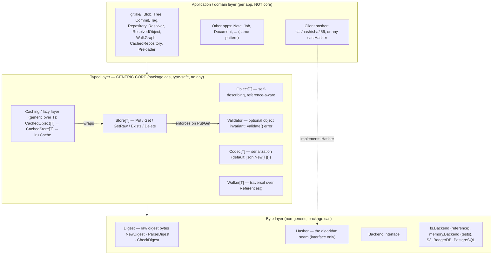
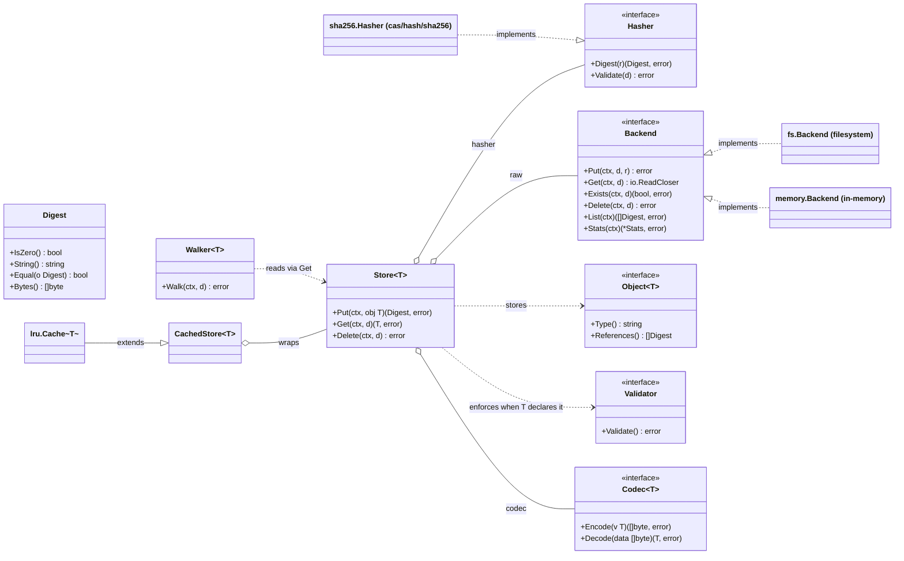
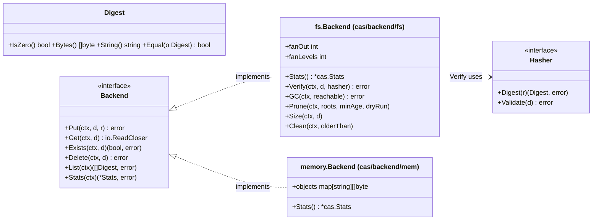
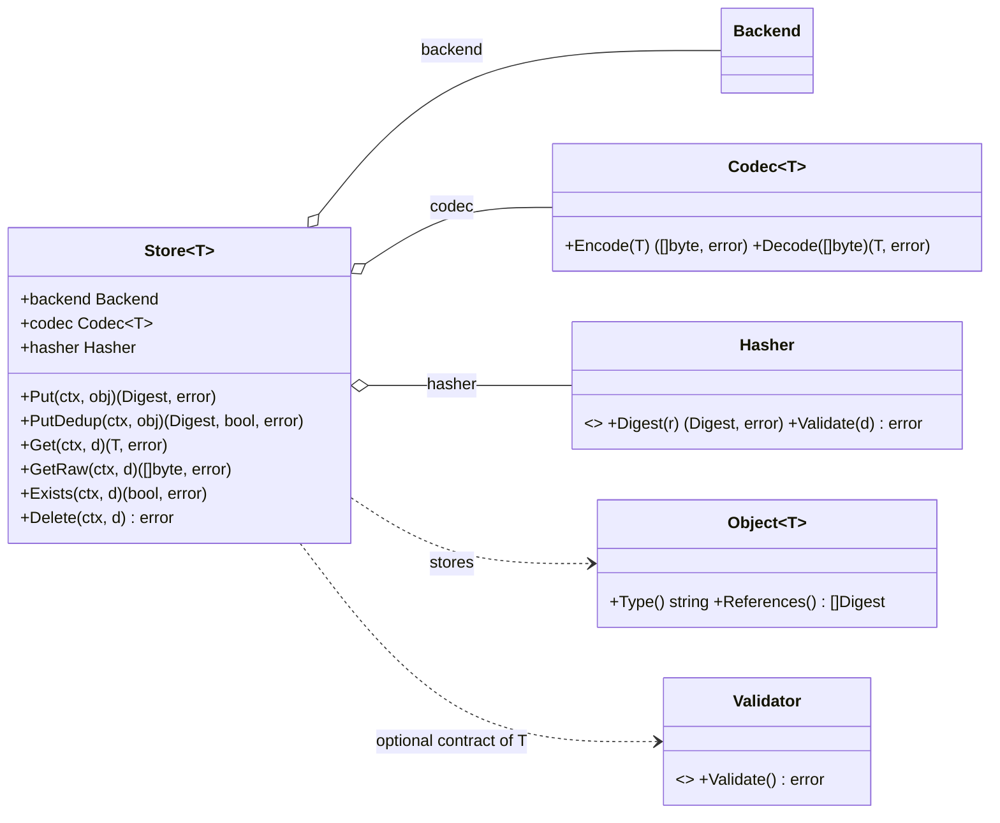
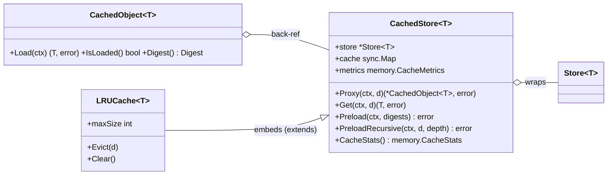
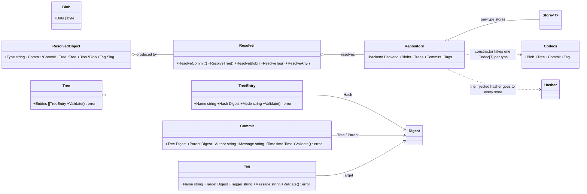

# CAS Core — go-cask

The authoritative specification of the **`cas` core library** — the foundation every extension, client, example, and HTTP/API layer builds on. Origin: the DeepSeek design conversation (final converged state); the repo-root `AGENTS.md` points here. Related: `library-design.md` (lean-core, errors, compatibility), `performance.md`, `testing-strategy.md`, `examples.md`, `backend-architecture.md`.

## 1. Purpose and scope

CASK is a reusable Go **content-addressable store**: blobs stored once under the digest of their content, as immutable objects referencing each other by digest. Git-like (blob/tree/commit/tag) but **generic across apps and domains** — the storage core knows nothing about application object types, and it **names no hash algorithm**: the client injects one as a `Hasher` (§4.2), so the storage layer keys blobs by an opaque digest (the OCI/Docker split) while the code that knows the algorithm stays outside it. Apps layer typed objects on top and may share one physical store. Scope: layered architecture, every component's contract, data flows, concurrency model, extension contract. The `cas` package is **generic only**; application models (e.g. `gitlike`) live outside it (§4.12).

## 2. Core concepts and invariants

1. **Digest-addressed.** The storage key is the digest of the content; no mutable addressing — to "change" an object, store a new one (new digest).
2. **Immutability.** Stored objects are never mutated in place.
3. **Automatic deduplication.** Identical content ⇒ identical digest ⇒ stored once.
4. **The core is hash-agnostic; the client owns the algorithm.** `Digest` is raw digest bytes (§4.1) and `cas` implements no hash function: a `Hasher` is injected into the `Store` and does the hashing and the digest-width check (§4.2). The consequences are deliberate and stated up front: a reference carries **no algorithm name**, so the core cannot recognize a store written by a build with another algorithm, cannot report per-algorithm statistics, and one store is effectively **single-format** — Git's model of one object format per repository. Changing the algorithm is therefore a **format transition, not a configuration change**: re-digest and rewrite every object under the new addresses, verify each, then delete the source only after verification (operations.md §5) — the client's job, since only the client knows the algorithm.
5. **Layering.** The byte layer is **non-generic** (`Digest` + `io.Reader` only); all generics live in the typed layer.
6. **No `any` in the public API.** Each object type gets its own `Store[T]`; mixing types is a compile-time error. `Store[T].Get` returns the concrete `T`, never an `Object[T]` interface (§4.8). An unconstrained type parameter (`Codec[T any]`, `Object[T any]`) is Go's constraint syntax, not a value type. The one recorded exception is the dynamic CBOR value codec (`cbor.NewValue() Codec[any]`, `cbor.NewMap() Codec[map[string]any]`, §4.6; library-design §4).
7. **Streaming I/O.** The byte layer moves `io.Reader`/`io.ReadCloser`; the fs backend copies an object to disk without buffering it in memory (the mem backend buffers by design), and `Verify` streams through the injected `Hasher`.
8. **Thread safety by default.** Backends with an immutable object layout have lock-free reads (atomic rename), one `sync.Mutex` for `Put`/`Delete`; the packfile backend serializes its in-memory index on that same mutex (§4.14); caches use `sync.Map`/`atomic`; writes are atomic (temp file + `Sync()` + rename).

Testable via the CAS laws (testing-strategy.md §1).

## 3. Architecture overview

### 3.1 Layers



Dependency rule: byte depends on nothing; typed depends on byte; application depends on typed. Caching wraps the typed layer without changing either. The algorithm is one more seam a client fills without forking the core: `Store` holds a `Hasher` (§4.2), and nothing in `cas` imports a concrete one. `cas` contains only generic primitives; the git-like object model is a shared reference library in `gitlike/` (§4.12) — apps build their own types/repositories and MUST NOT add them to the core.

### 3.2 How the core fits together

**Storing an object.** An app defines `Note` implementing `Object[Note]` (knows its versioned type name and referenced digests), then a `Store[Note]` over a `Backend`, with a `Codec[Note]` and the client's `Hasher`. `Store.Put(ctx, note)`: (1) serializes via `Codec.Encode` and wraps in the TLV envelope built by `Store.Put` itself — the codec is the single serialization authority (objects never serialize themselves); (2) hashes with the injected `Hasher` → content address `d`; (3) streams via `Backend.Put(ctx, d, r)`; (4) returns the `Digest` (stored inside other objects to build a graph). Identical bytes ⇒ identical digest ⇒ dedup. The core never hashes anything itself — it only asks the `Hasher`.

**Reading an object.** `Store.Get(ctx, d)`: `Backend.Get` streams bytes, `Codec.Decode` reconstructs the value, and the decoded `Type()` MUST match the envelope's type name (`ErrUnknownType` otherwise). Result is the concrete `T` — no casts.

**Why three layers.** The non-generic byte layer lets any backend swap in without touching app code; the generic typed layer lets any app type work without touching the core; the injection seam lets any hash algorithm work without touching either; the application layer owns the domain model. Extensions/clients interact mostly with the typed layer and the stable surface (§7.1).

**References and graphs.** Objects reference each other by plain `Digest` (`Commit.Tree`, `TreeEntry.Hash`, …). The core never interprets them; `Object[T].References()` is the single source of which digests an object points to — powering `Walker[T]`, cache preloading, and GC reachability. A reference is a bare digest with no algorithm, so it is meaningful only to a client using the algorithm that produced it (§4.2).

### 3.3 Aspect diagrams

Core overview (interfaces and dependencies):



Byte layer — addressing and storage:



Typed layer — the generic store:



Cache layer — lazy loading wrappers:



Shared reference layer — gitlike (application code, not core):



## 4. Component specifications

### 4.1 `Digest` — content address

```go
type Digest []byte // raw digest bytes; the zero value (nil) is the ABSENT digest

func NewDigest(b []byte) Digest                // copies; empty/nil → the absent digest
func (d Digest) IsZero() bool                  // absent?
func (d Digest) Equal(o Digest) bool           // absent equals nothing
func (d Digest) Bytes() []byte                 // copy; nil when absent
func (d Digest) String() string                // lowercase hex, NO algorithm prefix; "" when absent
func (d Digest) Prefix(n int) string           // first n HEX CHARS for display (viewer: Prefix(8)); total: absent/n<=0 → "", short digest whole
func (d Digest) MarshalText() ([]byte, error)  // hex (encoding.TextMarshaler)
func (d *Digest) UnmarshalText(b []byte) error // strict lowercase hex; "" → absent; else ErrInvalidDigest
func ParseDigest(hex string) (Digest, error)   // shape only: non-empty lowercase hex
func CheckDigest(d Digest, what string) error  // absent → ErrInvalidDigest
```

- `Digest` is a **concrete byte slice**, deliberately not a struct carrying an algorithm: `cas` names no algorithm and cannot tell one digest width from another (§4.2). It is immutable to callers — `NewDigest` and `Bytes` copy, so a caller's slice can never alias stored state.
- The **zero value IS the absent digest** — one spelling of "no reference" for the byte layer and for object fields alike. `IsZero()` reports it, `String()` renders it as `""`, `Bytes()` returns nil, and `Equal` returns false against everything, **including another absent digest** (two unknown references are not the same object).
- `String()` is the **lowercase-hex form only** — never an algorithm prefix. `MarshalText` renders the same string (absent → `[]byte{}`), so `encoding/json` and every other codec that honors `encoding.TextMarshaler` store a reference as exactly one hex string.
- `UnmarshalText` is **strict**: the empty string means absent, and every other value must be even-length lowercase hex — anything else returns `ErrInvalidDigest`. A legacy `"sha256:hexdigest"` reference is therefore **rejected rather than reinterpreted** (the deliberate break, §4.12).
- `ParseDigest` validates the **shape only** (non-empty lowercase hex; `AB`, `a`, `0xab`, `sha256:ab` are all refused). Whether the width matches an algorithm is the injected `Hasher`'s job (`Hasher.Validate`, §4.2). `CheckDigest(d, what)` is the "must be present" guard the store and every backend apply to their key arguments; `what` names the operation in the error.
- **The core renders bytes; it does not own a wire format.** `MarshalText`/`UnmarshalText` live on `Digest` because a digest is generic bytes and hex is a generic rendering — no algorithm is involved and `cas` still does not import `encoding/json`.

### 4.2 `Hasher` — the client owns the algorithm

```go
type Hasher interface {
    Digest(r io.Reader) (Digest, error) // streaming, one pass
    Validate(d Digest) error            // width check, e.g. exactly 32 bytes
}
```

- The core names no algorithm and implements none. `Store` asks its `Hasher` for the digest of the bytes it is about to store and asks it to validate every digest a caller hands in (§4.8); the public `cas.Verify` / `cas.NewVerifier` layer recomputes through the same interface (§4.11). Implementations MUST be deterministic (identical bytes, identical digest), pure, and **safe for concurrent use** — one instance serves every operation of a `Store`.
- **The shipped default is the client-side package `cas/hash/sha256`** — nothing in `cas` imports it:

  ```go
  const (
      Name = "sha256" // the printable algorithm name
      Size = 32       // digest width in bytes
  )

  func New() Hasher                        // sha256.New() cas.Hasher — wire it into cas.New
  func NewHasher() hash.Hash               // streaming stdlib hash, for hash-on-write callers
  func Of(data []byte) cas.Digest          // one-shot digest of a byte slice
  func Parse(s string) (cas.Digest, error) // "sha256:hexdigest" or bare hex; else ErrInvalidDigest
  func Format(d cas.Digest) string         // "sha256:hexdigest"; "" when absent
  ```

  `Hasher.Digest` streams `io.Copy` into sha256 and never buffers; `Hasher.Validate` requires a present digest of exactly `Size` bytes. `Parse` accepts the prefixed and the bare form and rejects anything else — including another algorithm's prefix — with `ErrInvalidDigest`. `Format` is the client's printable form; the digest itself never carries the name. Any short/preview rendering is the core's `Digest.Prefix(n)` (§4.1), not a per-algorithm helper. `cmd/cask`, `internal/web`, `gitlike` and the examples all construct this hasher (`sha256.New()`) and pass it to `cas.New`.
- **There is no registry.** No `RegisterHash`, no mutexed algorithm map, no init-order coupling, no one-shot/streaming duality, and no runtime-chosen name that must double as a path element — the failure modes the registry had cannot exist, because there is nothing to register and nothing to name. Replacing "recognize the address's algorithm" is the client's own knowledge: a `Hasher` validates the width it expects, so reading a store with the wrong algorithm fails loudly — a wrong-width key is `ErrInvalidDigest`, and a right-width key from another algorithm does not name the stored objects at all (`Get` → `ErrNotFound`; only the client can know the addresses are foreign).

**Algorithm change and single-format stores:**
- Because no algorithm travels with a digest, the core cannot enumerate "another algorithm's objects" and `Stats` has no per-algorithm breakdown (§4.11): a store's contents are interpretable only by a client that knows which algorithm wrote them. Mixing algorithms in one store is therefore not a supported configuration — the model is Git's: one object format per repository.
- Changing the algorithm is a **format transition, not a configuration change**: every object is re-digested and rewritten under its new address, exactly as Git's object-format transition works. `operations.md` §5 records the procedure (list → read → re-hash → write → VERIFY each → delete the source only after verification). Keeping `cas/hash/sha256` for go-cask's own clients is the default, not a core rule.

> **Decision (2026-09, revised): the core is hash-agnostic; the client injects a `Hasher`.** An earlier revision fixed `sha256` at compile time and put the algorithm name in the address (`"sha256:hexdigest"`, `<base>/sha256/…`) so a foreign store could be *recognized* (`ErrUnknownAlgorithm`). That bought recognition at the cost of making one algorithm a property of the core: an address could not be a plain digest, the backend layout had an algorithm directory, `Stats` had to group by a name it inferred from a path, and every codec that rendered a reference had to know the name. The address is now raw bytes and the algorithm is a client seam (§4.1, §4.2), which is the OCI/Docker split with one addition: the injected `Hasher` also validates width, so a key that cannot name an object is still rejected at the store boundary. The accepted cost is explicit — no algorithm in a reference, no cross-algorithm recognition in the core, no per-algorithm stats, one format per store — and it is the Git model. Removed with the old model: `ErrUnknownAlgorithm`, `ErrInvalidHash`, `ErrHashMismatch` (now `ErrInvalidDigest`, `ErrDigestMismatch`) and the JSON codec's hash field type (§4.6).

### 4.3 `Backend` — the byte storage contract (non-generic)

```go
type Backend interface {
    Put(ctx context.Context, d Digest, r io.Reader) error
    Get(ctx context.Context, d Digest) (io.ReadCloser, error)
    Exists(ctx context.Context, d Digest) (bool, error)
    Delete(ctx context.Context, d Digest) error
    List(ctx context.Context) ([]Digest, error)
    Stats(ctx context.Context) (*Stats, error)
}
```

Per-method contracts (every backend MUST honor):

| Method | Contract |
|---|---|
| `Put` | Idempotent: same digest ⇒ same bytes; may overwrite with identical bytes |
| `Get` | Returns a stream the caller MUST close; missing → `ErrNotFound` |
| `Exists` | Boolean presence check |
| `Delete` | Missing object ⇒ no-op, no error |
| `List` | Every stored digest — **no algorithm filter**: the backend cannot know which algorithm produced a key (§4.2). The shipped backends return them sorted |
| `Stats` | Total stored bytes and object count (§4.11) |

Every implementation rejects an absent digest with `ErrInvalidDigest` instead of addressing an object that cannot exist, and none of them recomputes a digest: content addressing makes a conflict impossible by construction, so an explicit integrity check is the caller's job (`cas.Verify(ctx, raw, d, hasher)` / `cas.NewVerifier(raw, hasher).Verify(ctx, d)`, §4.11). **`Verify` is deliberately NOT part of this interface** — it is a separate maintenance-layer concern that reads bytes from the backend and takes the client's `Hasher` explicitly.

This interface is the **backend extension point** — any storage system (S3, BadgerDB, PostgreSQL, IPFS blockstore) plugs in by implementing these six methods (recipe §7.2). The implementations this repo ships are `fs.Backend` (§4.4), `memory.Backend` (§4.5), and the opt-in `packfs.Backend` (§4.14).

Portable state transfer is intentionally a helper above this interface:
`cas/backend/snapshot.Export` writes a deterministic archive of raw digests and
payloads, and `snapshot.Import` loads that archive into any backend. These
helpers do not add methods to `Backend`, do not invoke a hasher or typed codec,
and cannot promise atomic replacement for arbitrary implementations.
Backend-specific APIs may provide stronger atomic restore guarantees; for
example, `mem.Backend.Restore` validates the complete archive before swapping
its map.

### 4.4 `fs.Backend` — the filesystem backend (`cas/backend/fs`)

**On-disk layout (fan-out, Git-like by default):** objects live at `<base>/<fan-out directories>/<full-lowercase-hex-digest>`. There is **no algorithm directory** — the backend does not know which algorithm produced a key (§4.2) — and a digest is hex by construction (`Digest.UnmarshalText`), so no path element needs sanitizing (the old algorithm-name sanitizer is gone). The file name is always the **full hex digest**; fan-out dirs are successive digest chunks, controlled by:

| Parameter | Meaning | Default |
|---|---|---|
| `FanOut` | hex chars per directory level | 2 |
| `FanLevels` | number of directory levels | 1 |

Examples (sha256 digest `a1b2c3d4…`): flat `(0,0)` `<base>/a1b2c3d4...`; Git-like `(2,1)` `<base>/a1/a1b2c3d4...`; deep `(2,2)` `<base>/a1/b2/...`; wide `(4,1)` `<base>/a1b2/...`.
- The default (2,1) is Git-like in directories only; the file name is always the **complete digest**, never the Git-style remainder.
- Any n-way/n-level allowed: `fs.New(basePath, opts ...fs.Option)` with `fs.WithFanOut(n)`/`fs.WithFanLevels(n)`, as long as `FanOut × FanLevels` ≤ `MaxFanDepth` (64 hex chars). Negative parameters and over-deep configs are rejected at construction.
- **The base is validated at construction.** `fs.New` (and `packfs.New`, whose base owns its loose tree, pack directory and index) runs `fs.ValidateBase` **before** it creates anything, and returns its error unchanged. The rejected shapes are the ones that make the backend own more than the caller named: empty or whitespace-only, `.`, the bare filesystem root, a parent-traversal path (`..`, `../x`, `a/../..`) and a volume root (`C:`, `C:\`). A nested relative or absolute directory below that root is accepted — the check is pure path arithmetic and performs **no I/O**, so it cannot tell whether that directory already belongs to another store; keeping one base to one store remains the caller's rule (see the exclusivity bullet below).
- **Key width is checked, not assumed.** `digestPath` slices the digest's hex form into `FanLevels` chunks of `FanOut` characters, so a key shorter than `FanOut × FanLevels` hex chars cannot name an object of the layout. Every key-taking method (`Put`/`Get`/`Exists`/`Delete`/`Size`/`Verify`) runs `checkKey` = `CheckDigest` (present) + `addressable` (long enough) and reports `ErrInvalidDigest` — **never a slice-bounds panic**, which v1.2.0's clamp used to hide and an unguarded slice would reintroduce. The rule is a property of the *layout*, not of an algorithm, so the backend applies it without knowing which hasher produced the key (a client hasher may legitimately emit a shorter digest). Going through `Store` is safe two ways: `Store.check` runs the injected `hasher.Validate` before any key reaches a backend, and the backend re-checks.
- `digestPath(d)` builds the path from the configured layout and requires an already-admitted key (`checkKey`, or `addressable` inside a sweep — its only unexported callers); `pathToDigest(rel)` rebuilds a `Digest` from the relative path (the **last** element is the hex digest, leading elements are fan-out chunks) through `cas.ParseDigest`; a file whose name is not lowercase hex is skipped rather than reported.

> Decision (2026-09): file-name style is **not configurable** — full-hash names are the only layout (a Git-remainder option was rejected: no interop, a second mode everywhere, loses the self-describing full-hash name `List`/`Stats`/`Verify` rely on). Revisit only if a real consumer requires remainder names.

**Write path (atomic):**
```text
MkdirAll(dir) → open <path>.tmp (O_CREATE|O_EXCL) → io.Copy(f, r) → f.Sync() → os.Rename(tmp, path)
```
- Directory fsync is optional via `WithDirSync()` (fsync the parent after rename so the publish is crash-durable). Best-effort — platforms that can't sync dirs (Windows) make it a no-op (operations §1); default off.
- Temp name is **unique per writer**: base `<path>.tmp`; if `O_EXCL` fails (only possible across processes, since the in-process mutex serializes Puts) append a numeric suffix `<path>.tmp.<n>`. No two writers share a temp inode, so concurrent same-digest writers across processes cannot corrupt each other's write or the stored object.
- Rename is atomic: on POSIX the last writer wins with identical bytes; on Windows a concurrent rename-over-existing can transiently fail (no cross-process last-wins). Because the address is the content, an existing **regular file** at the destination already holds those bytes, so such a `Put` reports success (idempotent); anything else at the path is a real error. A concurrent `Get` retries briefly while the file exists but cannot be opened (Windows sharing violation), so readers still see the old or the new file.
- On any failure the temp is removed; readers never observe partial files. `.tmp` files (`<hex>.tmp` and the `<hex>.tmp.<n>` collision fallbacks) are ignored by `List`/`Stats` and reclaimed by `Clean`.
- `Put` checks `ctx` before each read from the source, so a canceled `Put` (HTTP upload, CLI pipe) stops streaming and publishes nothing.

**Concurrency (lock-free reads):** writes are atomic, so `Get`/`Exists`/`List`/`Stats` take **no lock** — a reader sees the old or the new file, never partial (performance §2). `Put` is idempotent, so concurrent same-digest writers never corrupt — in-process via the mutex, across processes via unique temp names (with the POSIX/Windows rename caveat). At most one `sync.Mutex` coordinates `Put`/`Delete` in-process; reads are wait-free. **Cross-process guarantees stop at object writes**: no inter-process locking, so a maintenance sweep (`Delete`/`GC`/`Prune`/`Clean`) racing another process's writes is NOT safe. The **grace model** applies: sweeps that MAY race live writers MUST reclaim only objects older than a grace `--min-age` (the `cask` CLI `gc`/`prune` default 1h; forced `--min-age 0` is the dangerous variant).

**Maintenance methods** (§4.11): `Stats`, `Verify`, `GC`, `Prune`, `Clean`; `Size` returns an object's size and `ModTime` its modification time (both `ErrNotFound` when missing); `Clean(ctx, olderThan)` sweeps leftover temp files (`<hex>.tmp` and `<hex>.tmp.<n>`) older than the threshold — always safe within an exclusively-owned base (a temp file is never a valid object; see the one-base rule below). It tolerates a missing store directory (nothing to sweep) and returns walk/removal errors instead of swallowing them.
- **Listing scope:** `List`/`Stats` rebuild each digest from its file name, so a foreign file whose *name* is not lowercase hex (a temp leftover, an app's `HEAD`/`INDEX` ref file) is skipped. The check is the file name at **any depth**, not the path shape: a digest-named file that is not at its canonical fan-out path is still reported. No algorithm needs to be registered in the calling process — the backend stores no algorithm name at all.
- **One base = one store (exclusivity).** `base` is treated as exclusively this backend's own directory: `List`/`Stats` report every digest-named file anywhere beneath it, and `Clean` reclaims any `*.tmp`/`*.tmp.<n>` anywhere beneath it as its own crash leftover. An app MUST therefore keep scratch `*.tmp` files out of the store directory (an atomic ref write there is deleted by the next `Clean`), and MUST NOT point a backend at a directory containing another store — or an older build's `<base>/<algo>/…` tree. Objects below such a base are **phantom**: `List`/`Stats` report them (even duplicating a digest that also exists at its canonical path) while `Get`/`Verify` return `ErrNotFound`, and `GC`/`Prune` skip anything the layout cannot address (`addressable`) instead of building a path for it, so a stray short digest-named file makes neither sweep fail nor panic.
- **Sweeps never panic on a foreign name.** `GC`/`Prune` iterate what `List` reported; a name too short for the layout is filtered out before any path is built, and `Delete` on it would be `ErrInvalidDigest` anyway. `cmd/cask list` likewise skips an entry whose size cannot be read (`ErrNotFound`/`ErrInvalidDigest`) and warns on stderr, so one stray file cannot break the listing.
- **Several stores under one root:** give each its own directory and pass it as the base — `fs.New(filepath.Join(root, name))`, then `cask -store root/name`. There is deliberately **no** `WithNamespace` option: it would be exactly that `filepath.Join` plus a validator for a client-supplied path element (separators, `..`, absolute paths, Windows reserved names, case/NFC folding) — reintroducing the runtime-chosen path name §4.2 removed — and it isolates nothing a separate base does not already isolate, because isolation comes from the exclusivity rule above, not from the option (extensions §3).
- **The base pre-flight is public API for callers that own the path.** `fs.ValidateBase(base) error` is the check `fs.New` runs, exported for the caller holding a base before any backend exists — a CLI flag, a config value, a path assembled from user input — so an unusable path is reported before a directory is created; it does no I/O and needs no context. `fs.EnsureBase(ctx, base) error` validates and then creates the base directory, for a caller that must prepare the path before handing it to something other than the `fs` constructor. `fs.CleanupTemp(ctx, base) error` is the same sweep as `Backend.Clean(ctx, 0)`, for a caller that wants crash leftovers reclaimed on a base it has not opened yet; like `Clean` it removes **every** matching `*.tmp`/`*.tmp.<n>` beneath `base`, so `base` MUST be the caller's own store directory (both run `ValidateBase` first for that reason). A caller that only opens a store needs none of the three: `fs.New` validates, and `Backend.Clean` sweeps.

### 4.5 `memory.Backend` — in-memory backend (`cas/backend/mem`)

Keeps objects in `map[string][]byte` keyed by the **raw digest bytes** (`string(d)`) — no hex form and no algorithm — under a `sync.RWMutex`.
- **Purpose:** fast, dependency-free, deterministic storage for unit/property/fuzz tests and benchmarks; **not persistent**.
- **Contracts:** same `Backend` semantics as fs — idempotent `Put`; `Get` returns a reader the caller MUST close (missing → `ErrNotFound`); `Delete` no-op on missing; an absent digest rejected with `ErrInvalidDigest`; `List()` returns every stored digest.
- **Buffering:** `Put` buffers the whole stream (`io.ReadAll`) through a context-checking reader, so a `Put` canceled mid-read stops and stores nothing (the same guarantee fs gets from its streaming copy); `Get` returns `io.NopCloser(bytes.NewReader)` over the stored slice (never mutated after `Put`). With `WithMaxSize` the read is bounded to the remaining budget first, so an oversized `Put` is rejected without allocating past the cap.
- **Concurrency:** `RWMutex` (the lock-free rename trick doesn't apply; still far faster than disk).
- **Stats/listing:** implements `Backend.Stats` (`*cas.Stats`) and `List`, rebuilding digests from the map keys with `cas.NewDigest` (the empty key is skipped — `CheckDigest` makes it unreachable) and recomputing total bytes/object count each call — no desynchronized counter. No backend-native `Verify`/`GC`/`Prune`/`Clean`/`Size`/`ModTime` — but `cas.VerifyAll` and `cas.Sweep` (§4.11) work against it directly, since they need only the minimal `Backend` interface.
- **Construction:** `memory.New(...)` (package `memory`, directory `cas/backend/mem`; optional `memory.WithMaxSize(n)` cap; 0 = unbounded); swap-in compatible with any `Store[T]`, `gitlike` repo, or HTTP handler taking a `Backend`.

### 4.6 `Codec[T]` — serialization contract

```go
type Codec[T any] interface {
    Encode(v T) ([]byte, error)
    Decode(data []byte) (T, error)
}
```

- Default: the JSON codec `json.New[T]()` (`cas/codec/json`), wrapping std-lib `encoding/json`; a client MAY also opt into the compact binary codec `binary.NewRaw[T](encode, decode)` or the stacked wrapper form `binary.New[T](next, transform, restore)` (`cas/codec/binary`) when a stable, app-defined binary payload is preferable to JSON.
- Compression/encryption/protobuf are additional `Codec[T]` impls; they never change the byte layer.
- **A compression wrapper bounds what it expands.** `flate`, `gzip` and `zlib` decompress into memory — the `Codec[T]` contract is bytes in, value out — so each enforces `MaxDecodedBytes` (1 GiB) on the **decompressed** stream and returns `ErrDecodedTooLarge` past it. The stored bytes are untrusted and a small compressed payload can otherwise expand without limit. A caller whose legitimate payload exceeds the ceiling needs a codec that streams rather than these wrappers.
- Contract: `Decode(Encode(v)) == v` (round-trip) for all storable values.
- **A reference field is a plain `cas.Digest` — there is no codec-side hash type.** `Digest` implements `encoding.TextMarshaler`/`TextUnmarshaler` (§4.1), so `encoding/json` renders a present reference as **one lowercase-hex JSON string** and decodes one back; an absent field renders as `""` unless it is tagged **`omitzero`** (Go 1.24 floor, still required: an older standard library ignores the unknown tag option and would emit `""` instead of omitting, silently changing the stored bytes and the object's address). An object type therefore writes `Ref cas.Digest \`json:"…,omitzero"\`` and nothing else — no wrapper to construct, no unwrapping call, no hand-written `MarshalJSON` for rendering. See §4.12 for a working object model.
- **Rationale:** rendering a digest as hex is generic (no algorithm, no JSON), so it belongs to the type in the core rather than to one codec; the core still imports no `encoding/json`. A non-JSON codec carries no hash handling at all — `gob` encodes the `Digest` byte slice directly, and a custom binary codec encodes only the app-defined payload layout the caller supplies.
- **A codec MAY name the wire format it produces** — the optional `CodecNamer` interface, `CodecName() string`. The tag is written into the envelope (§8 d1) and compared on read, so swapping the codec behind a type is reported as `ErrCodecMismatch` instead of surfacing as a decode failure. It is deliberately **optional**, not a third method on `Codec[T]`: adding one would break every existing implementation, in this repo and in consumers, for a check that only applies when both sides opt in.
- **Tags are declared, never derived.** The shipped codecs report `json`, `gob`, `cbor` and `binary`, and a codec stacked over another composes the inner tag (`gzip+json` for `gzip.New(json.New[T]())`, `flate+gzip+json` for a deeper stack). A stack whose inner codec declares no tag reports `""`, because nesting an unnamed codec must not manufacture a tag that later reads as a mismatch. Nothing comes from `%T`, reflection or the payload bytes, so renaming a Go type or moving a package is never read as a format change. An empty tag means "unspecified": no comparison is made, which is the pre-existing behaviour and the compatibility rule.
- **The frame's version is readable on its own.** `EnvelopeVersion` is the format version this build writes, and `PeekVersion(r io.Reader)` reads only the envelope's leading version byte from a stream, returning it **verbatim whether or not this build knows it**: reporting an unknown version is the point, so unlike `PeekType` it never rejects one. A caller compares that byte against `EnvelopeVersion` and chooses which header layout to parse — the only way to tell "written by a newer format" from "damaged bytes", which is what makes two envelope layouts coexisting in one store navigable. Only an empty stream or a read failure is `ErrCorrupt`, naming the field, with a non-EOF cause kept on the chain (`peekError`, the same shape `PeekType` uses). One byte is consumed, so the cost is independent of the payload. `EnvelopeVersion` is not the type major version: `commit@1` names the object model, the version byte names the layout of the frame carrying it (§4.7).

### 4.7 `Object[T]` — self-describing typed object

```go
type Object[T any] interface {
    Type() string         // versioned "<type>@<major>", e.g. "commit@1"
    References() []Digest // digests this object points to (may be nil)
}
```

- `Type()` returns a **versioned type name** `<type>@<major>` — the object model is semantically versioned; several majors coexist in one store (object-versioning.md).
- `References()` is the single source of truth for traversal, preloading, and GC reachability. Its elements are bare digests with no algorithm, so they are meaningful only to a client using the algorithm that produced them (§4.2).
- Serialization is NOT an object concern: `Store.Put` encodes with the store's `Codec[T]` and builds the envelope (§8 d1) — the codec is the single serialization authority on write AND read.
- **Invariants ARE an object concern.** A type MAY declare `Validate() error`; `cas` names that contract `Validator` and the store enforces it (§4.8). An invariant is a property of the object model, not of a wire format, so it must not live in a codec: the same rule has to hold for JSON, gob or any other `Codec[T]`. `Validate` MUST be deterministic and pure, and SHOULD be cheap — it runs on every `Put` and every `Get`.
- The core calls `Validate` on a value; a nil object is rejected before it is encoded or returned (§4.8), so an implementation only ever sees a real value and may dereference its receiver.

### 4.8 `Store[T]` — the generic typed store

```go
type Store[T Object[T]] struct {
    backend   Backend
    codec     Codec[T]
    codecName string // resolved once from CodecNamer (or "" when the codec declares no tag)
    hasher    Hasher
}

func New[T Object[T]](backend Backend, codec Codec[T], hasher Hasher) *Store[T]
```

`New` **cannot fail**: the core resolves nothing, registers nothing and knows no algorithm (§4.2). It has no error to report, so the three collaborators MUST be non-nil — `backend`, `codec` and `hasher` are the caller-supplied seams, and a nil one panics at the first use rather than being detected here (v1.2.0's `New` returned an error; the seams are now plain values). The **codec identity tag is resolved once, here** — a plain type assertion on the codec value the caller already supplied (`CodecNamer`), never reflection and never `any` — so `Put` writes it and `Get` compares it without re-deriving it per operation.

| Method | Behavior |
|---|---|
| `Put` | reject a nil object (including a nil interface value) → reject a `Type()` that is empty or unversioned (`<type>@<major>` is the contract; an unversioned name would be stored as `@1` and never read back) → `obj.Validate()` when T declares it → `codec.Encode(obj)` → TLV envelope → `hasher.Digest` → `backend.Put` → `d` |
| `PutDedup` | as `Put`, then `backend.Exists` first; returns `(d, alreadyStored, err)` |
| `Get` | `backend.Get` → envelope parse (**a frame that does not parse → `ErrCorrupt`**, naming the offending field) → codec-tag comparison (both tags present and different → `ErrCodecMismatch`, checked **before** decoding) → `codec.Decode` → concrete `T`; decoded `Type()` MUST match the stored type name (else `ErrUnknownType`); a payload the codec cannot decode, that decodes to nil, or whose object fails `Validate` → `ErrCorrupt` |
| `GetRaw` | returns the serialized bytes (the TLV envelope) for inspection/tooling; never decodes, so it never validates — and never parses the frame, so it reports no envelope-level error: a damaged object comes back as its bytes, and `EnvelopeFromBytes` (or `Get`) is the reader that reports `ErrCorrupt` |
| `Type` | `backend.Get` → `PeekType` → close: reads the envelope header only, so the payload is never read or allocated. Reports the type as stored (which may be one this store cannot decode — `Get` is what rejects that), `ErrCorrupt` for an unusable header, and the backend's `ErrNotFound` for an absent object |
| `Version` | `backend.Get` → `PeekVersion` → close: reads the frame's leading version byte and nothing else, so the cost is one byte whatever the object's size. Reports the byte as stored — including a version this build does not know, which is the point: a caller compares it against `EnvelopeVersion` to tell "written by a newer format" from corrupt bytes without matching an error string. `ErrCorrupt` (naming the field) for a stream with no byte at all, and the backend's `ErrNotFound` for an absent object |
| `Exists` | delegates to `backend` |
| `Delete` | delegates to `backend` |
| `Close` | forwards to the backend when it implements `io.Closer`; idempotent — the backend close runs once, a second call is a no-op returning the first call's error |

- **Every key argument is guarded.** `Store.check` applies `CheckDigest` (present) and `hasher.Validate` (well formed for the client's algorithm) to every digest a caller supplies — `Get`, `GetRaw`, `Exists`, `Delete` — and `Put`/`PutDedup` apply it to the digest the hasher just computed. A key that cannot name an object is rejected with `ErrInvalidDigest` (wrapped with the operation name) instead of silently missing.
- **Object invariants are enforced on both paths** (`Validator`, §4.7). `Put`/`PutDedup` run `Validate` before encoding, so an invalid object is never written and the object's own error is preserved in the chain (`cas: put: <err>`); `Get` runs it after decoding and reports a violation as `ErrCorrupt` (wrapping the object's error), so a hand-crafted or foreign payload cannot come back in an impossible state. `GetRaw` cannot validate what it does not decode — an inspector must be able to read a broken object.
- **A nil object is rejected**: `Put`/`PutDedup` refuse one (`cas: put: nil object`) instead of encoding a payload that decodes back to nil, and `Get` reports a payload that decodes to nil as `ErrCorrupt` — checked **before** the decoded type is compared and before `Validate` runs, so no method is ever invoked on a nil receiver. The core decides "there is no value here" with an internal nil check (the only use of reflection in `cas`), so an implementation never has to tolerate a nil receiver.
- **A codec change is a format change, not damage** (`ErrCodecMismatch`). `Get` compares the codec identity tag stored in the envelope with the tag its own codec declares, after the header is parsed and before `Decode` is called, and reports a difference when both tags are present: never `ErrCorrupt` (the bytes are intact) and never `ErrUnknownType` (the type is known). Either side declaring no tag — a version 1 envelope, a codec without `CodecNamer` — means no check, which is the compatibility rule. The comparison necessarily precedes decoding, so an object that differs in *both* type and codec reports the codec difference; when the codecs agree, a foreign type still reports `ErrUnknownType`.
- **A tagless object is never guessed.** A version 1 envelope carries no codec identity, so a reader built on another codec cannot *prove* a mismatch — the bytes are indistinguishable from corruption. `ErrCorrupt` stays the answer there, with the message naming the absent identity so the diagnosis is one step from `ErrCodecMismatch`; detection applies to every object written under version 2 and later.
- **A malformed envelope is corruption, not an unknown type.** Every reader of the TLV frame agrees: `EnvelopeFromBytes`/`EnvelopeType` (byte slice), `PeekType`/`PeekVersion` (stream), `Store.Get` and `Store.Type` (store), and `cas/repo.Registry.Resolve` all report a structural failure — an absent or unreadable version byte, a truncated or oversized codec or type field, an empty type name, a payload length that does not fit the frame — as `ErrCorrupt`, naming the field, and `decodeEnvelopeHeader` is the one implementation they resolve the header through. `ErrUnknownType` answers the dispatch question only and never a parse: a type name with no registered decoder (`cas/repo.UnknownTypeError`), one outside a caller's fixed model (`gitlike`), or a value the store's own codec decoded under a different `Type()` than the envelope records. That split is what makes "skip it, it is not mine" safe — written as `errors.Is(err, cas.ErrUnknownType)` it can no longer skip an object whose bytes are damaged and, in a maintenance path, delete it (go-cask#202).
- Type safety from one store per type: `Store[Blob]` vs `Store[Commit]` distinct — passing a commit digest to a blob store is a **compile-time error**.
- **Enumerating a store by type is `List` plus `Type`**, not `List` plus `Get`: `Store.Type` reads only the envelope header (§4.6), so "which objects are snapshots" costs a header read per object rather than a decode, and a large object costs the same as a small one.
- **`Version` is the same peek one field earlier**, and it is the only way to choose a header layout before parsing one: `Store.Version` reads the frame's leading byte (`PeekVersion`, §4.6) and reports it as stored, so a store holding both a version 1 and a version 2 object answers for each without decoding either. It costs one byte per object, and it never reports an unknown version as damage — the caller compares the byte with `EnvelopeVersion` and decides. `Store` keeps no version census: a store-wide tally is a caller's loop over `List` plus `Version`, not a core API.
- `Get` returns the **concrete `T`** (type name verified); `GetRaw` returns bytes. The constraint `Store[T Object[T]]` keeps the typed layer free of `any`/type assertions; the `Validator` check is a structural interface assertion on the stored value, applied uniformly to every type rather than dispatch on a concrete type.
- `Store[T]` is safe for concurrent use if its `Backend` and `Hasher` are.
- **Lifecycle:** `Close` is the store's only lifecycle operation and it belongs to the backend: it forwards to the backend's `io.Closer` when there is one — a backend that flushes on close, such as `packfs`, must be closed once every store over it is finished, or its state is never written — it runs that close exactly once, and it is a no-op for a backend that needs no cleanup, so `defer store.Close()` is always safe. **Construction is the client's line, not the core's:** there is no `NewJSON`/`NewCompressedJSON` in `package cas` (the core must not import `cas/codec`, and a codec-taking helper saves nothing over `New`); a consumer writes `func newNoteStore(backend Backend, hasher Hasher) *Store[*Note]` in the package that owns the type, or registers each store with `cas/repo.RegisterStore` and reads it back typed with `cas/repo.LookupStore[T]` (§4.12).

### 4.9 `Walker[T]` — generic graph traversal

```go
func NewWalker[T Object[T]](store *Store[T], visit func(T) error) *Walker[T]
func (w *Walker[T]) Walk(ctx context.Context, d Digest) error
```

- `visit` receives every reached object as the concrete `T`; reads via `Store[T].Get`.
- Traversal is **iterative with an explicit stack and a visited set** keyed by `d.String()`: each digest is visited at most once, a shared subgraph is visited once rather than once per path, and a very deep graph terminates instead of exhausting the goroutine stack. A cycle is not constructible through the public API — an object's address is derived from the bytes that would have to contain it.
- Mixed-type traversal is a supported package now, not just the app's job: `cas/repo.Registry`/`Walk`/`Reachable` generalize the `gitlike` resolver pattern (§4.12) to any number of caller-defined types (go-cask#136).

### 4.10 Caching and lazy loading

**`memory.CachedObject[T]`** — lazy proxy for one digest (`cas/cache/mem`): fields `digest`, a pointer to the underlying `Store[T]`, a metrics pointer, `sync.RWMutex`, `obj`, `loaded`, `err`. `Load(ctx)` uses **double-checked locking**, loads exactly once, memoizes object AND error. `IsLoaded()` reports state without loading; `Digest()` returns the address it is memoized for.

**`memory.CachedStore[T]`** — wraps `Store[T]`, built with `memory.New(store)`. Cache: `sync.Map` keyed by `d.String()` → `*CachedObject[T]`. Metrics: `memory.CacheMetrics{Hits, Misses, Loads, Evicts}` (atomic): `Hits`/`Misses` count `Proxy` lookups, `Loads` counts store fetches performed by `CachedObject.Load` (at most one per cached object, including a fetch that returns an error), `Evicts` counts removals by a policy or `Evict`. `OnNew(fn)` installs the insert hook; it is stored atomically, so it may be set or cleared at any time, and it runs synchronously on the inserting goroutine — keep it cheap and do not re-enter `Proxy`. `Proxy(ctx, d)` returns a not-yet-loaded `*CachedObject[T]` (verifies existence first); `Get` = `Proxy` + `Load`. `Preload(ctx, digests)` loads in parallel through a bounded worker pool and returns `errors.Join` of every failure; `PreloadRecursive(ctx, d, depth)` preloads the graph, **skipping** references this store cannot decode (a commit pointing at a tree, another store's type) and dangling ones so a per-type cache is not blocked by them; `Warmup(ctx, digests)` tolerates missing objects but reports any other failure, including a canceled context. `CacheStats()`/`Evict(d)`/`Clear()`/`Warmup(ctx, digests)`.

**`lru.Cache[T]`** — size-bounded LRU (`cas/cache/lru`): owns a `CachedStore[T]` in an unexported field and adds LRU with `maxSize` (in-tree std-lib, §8 d3), re-declaring `Proxy`/`Get` to track/promote and exposing only the methods it means to own (`Get`, `Proxy`, `Lookup`, `CacheStats`, `Preload`, `PreloadRecursive`, `Warmup`, `Clear`, `Evict`, `EvictKey`) — no method promotion. The wrapped store stays reachable for observers through `CachedStore()`, which deliberately bypasses the recency bookkeeping. `lru.New(store, maxSize)` returns `(*lru.Cache[T], error)`; rejects `maxSize <= 0`.

Prefetch-on-access (`prefetch.SmartCache[T]`, `prefetch.NewSmartCache(store, depth)`) and `CacheMonitor` are **example recipes, not part of `cas`** — demonstrated by `examples/notes` and `examples/artifacts`.

### 4.11 Maintenance

- **`Backend.Stats(ctx)`** → `*cas.Stats` (`TotalSize`, `ObjectCount`) with `String()` rendering `"N objects, M bytes"`; part of the `Backend` interface so **every backend** reports it (fs walks the tree; mem recomputes from its map). **There is no per-algorithm breakdown** — the core does not know which algorithm produced a digest (§4.2), so it cannot group objects by one; a client that needs that groups its own digests.
- **`cas.Verify(ctx, backend Backend, d Digest, hasher Hasher) error`** and **`(*cas.Verifier).Verify(ctx, d Digest) error`** — re-read the object and recompute its digest with the injected hasher, streaming so a large object is never buffered; they check `d` (`CheckDigest` + `hasher.Validate`) first and report `ErrDigestMismatch` when the stored bytes no longer digest to `d`. The filesystem backend still exposes `Verify(ctx, d, hasher)` as a thin compatibility wrapper that delegates to this shared verifier layer.
- **`cas.VerifyAll(ctx, backend Backend, hasher Hasher) (*Report, error)`** — the generic, backend-agnostic form: lists every digest and re-verifies each, collecting mismatches in `Report.Bad` instead of aborting on the first one (any other read failure still aborts, wrapped). Works against any `Backend`, including one that implements no maintenance methods of its own — it needs only `List` and `Get` (go-cask#137).
- **`cas.Sweep(ctx, backend Backend, reachable map[string]bool, opts SweepOptions) ([]Digest, error)`** — the generic, backend-agnostic mark-and-sweep: deletes every listed digest absent from `reachable` (the caller computes the reachable set — `cas.Reachable` for one type, `cas/repo.Reachable` across several). `SweepOptions.MinAge > 0` restricts deletion to objects older than that age and requires the backend to implement `Statter` (`ErrUnsupported` otherwise); `SweepOptions.DryRun` reports the doomed set without deleting. Needs only `List` and `Delete`, so it works against any backend, including `packfs`, which has no backend-native GC/Prune of its own (go-cask#137).
- **`cas.Capabilities` / `cas.CapabilitiesOf(backend Backend) Capabilities`** — reports which optional maintenance operations a backend supports. `Verify` and `Sweep` are always `true` (the two functions above need nothing beyond the minimal `Backend` interface); `Clean`/`Stat` report whether `backend` implements the optional `cas.Cleaner`/`cas.Statter` interfaces.
- **`cas.Cleaner`** (`Clean(ctx, olderThan time.Duration) (int, error)`) and **`cas.Statter`** (`Size(ctx, d) (int64, error)`, `ModTime(ctx, d) (time.Time, error)`) — optional capability interfaces a backend opts into structurally; `fs.Backend` satisfies both, `packfs.Backend` satisfies both (`Clean`; `Size`/`ModTime`, §4.14), and `mem.Backend` satisfies neither.
- **`fs.Backend.GC(ctx, reachable map[string]bool) error`** — mark-and-sweep: deletes every object whose `d.String()` is not in `reachable`; the caller computes the reachable set. A faster, fs-native path than `cas.Sweep` for the common case; `cas.Sweep` is the documented cross-backend equivalent.
- **`fs.Backend.Prune(ctx, roots []Digest, minAge time.Duration, dryRun bool) ([]Digest, error)`** — deletes objects unreachable from `roots` AND older than `minAge` (age = file mtime ≈ first-`Put`); returns the doomed digests, or the would-be-deleted set when `dryRun` is set. Detection/consistency in `consistency.md`. A faster, fs-native path than `cas.Sweep(..., SweepOptions{MinAge: ...})`.
- **`fs.Backend.Clean(ctx, olderThan time.Duration) (int, error)`** — sweeps orphan temp files older than the threshold and returns the count. fs-specific: "orphan scratch state" is not a concept the minimal `Backend` interface exposes, so there is no generic equivalent.

### 4.12 Shared reference layer: `gitlike` (NOT generic core)

A shared **reference object-model library** at `gitlike/`, `package gitlike` — not part of `cas`. Apps define their own `Object[T]` types; this is the reference set:

| Type | Fields | References() |
|---|---|---|
| `Blob` | `Data []byte` | nil (leaf) |
| `Tree` | `Entries []TreeEntry` | digests of all present entries |
| `TreeEntry` | `Name string`, `Hash cas.Digest`, `Mode string` | (entry, not an object) |
| `Commit` | `Tree cas.Digest`, `Parent cas.Digest`, `Author`, `Message`, `Time` | tree + parent (if present) |
| `Tag` | `Name`, `Target cas.Digest`, `Tagger`, `Message` | target (if present) |

- All four versioned from the start (`blob@1`, `tree@1`, `commit@1`, `tag@1`); a future incompatible change becomes `type@2` with the old deserializer registered.
- **The type names are deliberately NOT bumped** even though the reference payload shape changed from `"sha256:hexdigest"` to bare hex. Consequence, stated plainly: an object stored before this change whose payload contains a reference (i.e. every tree, every commit and every tag; an object with no reference fields, such as a blob, still decodes) **FAILS to decode** — the strict hex parser rejects the `sha256:` prefix with `ErrInvalidDigest`, which `Store.Get` surfaces as `ErrCorrupt`. That is a loud, deliberate break: there is no migration tool and no `@2` type. **Alternative considered:** publish `tree@2`/`commit@2`/`tag@2` with the old deserializer still registered (object-versioning.md), which would keep pre-change objects readable at the cost of two live model versions and a real migration story; rejected for now because the break is loud rather than silent and no store in the wild needs it — revisit if one does (§8 d9).
- `Parent`/`Target` may be absent — an absent reference marks root/leaf. Cross-type references are plain `Digest`; target type discovered at resolution, not baked in.
- **Serialization:** every reference field is a plain `cas.Digest` (§4.6) — `omitzero` where absence is legal (`TreeEntry.Hash`, `Commit.Parent`), a plain field where the value is always present (`Commit.Tree`, `Tag.Target`; a tag target may still be absent and keeps its historical `""`). All four types therefore carry **no** codec code at all: every reference renders and validates itself through `Digest`'s text methods, and `Commit`'s one mandatory-field invariant is `Commit.Validate()` (§4.7) rather than a hand-written `MarshalJSON`/`UnmarshalJSON`. That is what makes the model codec-agnostic: the same repository works over JSON, gob or any other `Codec[T]`, and the tree rule holds in all of them.
- **`Validate() error`** on `TreeEntry`/`Tree`/`Commit`/`Tag` states the invariants — a `TreeEntry` needs a name, a `Commit` needs a tree (checked with `Tree.IsZero()`), a `Tag` needs a name, and an absent `Digest` is valid wherever absence is legal. The store enforces them on every `Put` and `Get` (`Validator`, §4.7/§4.8): a tree-less commit cannot be written, and one found in a store (a foreign payload, a hand-crafted one) is `ErrCorrupt`. Calling `Validate` directly still lets a caller check a hand-built object and get the offending entry's index.

**`Repository` and `Resolver` — cross-type access without `any`:**

```go
// Codecs is the serialization set a Repository is built with: one Codec[T] per
// object type. gitlike names no codec — the caller supplies all four.
type Codecs struct {
    Blob   cas.Codec[*Blob]
    Tree   cas.Codec[*Tree]
    Commit cas.Codec[*Commit]
    Tag    cas.Codec[*Tag]
}

type Repository struct {
    raw     cas.Backend
    Blobs   *cas.Store[*Blob]
    Trees   *cas.Store[*Tree]
    Commits *cas.Store[*Commit]
    Tags    *cas.Store[*Tag]
}

func NewRepository(raw cas.Backend, hasher cas.Hasher, codecs Codecs) *Repository
func NewResolver(repo *Repository) *Resolver
```

- `Repository` bundles per-type stores over one `Backend`, all sharing the caller's `Hasher` and `Codecs`; the repository names neither the algorithm (§4.2) nor the wire format (§4.6). `gitlike` imports no codec package, and the JSON codec is simply the usual choice at the call site:
  `NewRepository(raw, sha256.New(), Codecs{Blob: json.New[*Blob](), Tree: json.New[*Tree](), Commit: json.New[*Commit](), Tag: json.New[*Tag]()})`.
- **Codec-agnostic by construction (enforced).** No file in `gitlike/` outside `_test.go` imports a codec package, and `go list -deps ./gitlike` contains none — a CI gate fails the build if one appears, so "codec-agnostic" is a check rather than a convention. The `_test.go` files DO name one (the shipped JSON codec) exactly as a client does, because a runnable test must inject *some* codec and the documented wire bytes are JSON — which is what the address pins (`TestStoredAddressesPinned`) and the field-shape tests assert. `TestRepositoryWithAnotherCodec` runs the whole model — typed reads, `ResolveAny`, `WalkGraph`, the tree invariant — over **gob**, with no JSON involved, which is what that injection buys.
- **What the `json:"…"` tags on the object types are.** They are hints for whichever codec honors them, not a dependency: gob round-trips every object while ignoring them. They carry two facts, and only the first is JSON-specific: (1) the wire **field names** (`name`, `hash`, `mode`, …), and (2) the **optionality** of a reference — `omitzero` on `TreeEntry.Hash`/`Commit.Parent` means "absent ⇒ omitted", while `Commit.Tree` (required; `Validate` rejects absence) and `Tag.Target` (may be absent but keeps the historical `""`) are declared as always present. Optionality is a *model* fact with no codec-neutral spelling in Go, which is why the tags stay: a tag-free model would have to re-decide those three cases in each codec, and inferring omission would change `Tag.Target`'s absent shape — new bytes, new addresses, i.e. a MAJOR (`versioning` §1).
- **Migration (breaking, ratified — versioning §1).** `NewRepository(raw, hasher)` became `NewRepository(raw, hasher, Codecs{…})`: pass one `Codec[T]` per type (the JSON codecs above are the drop-in equivalent of the previous hardcoded choice, and stored payloads are byte-for-byte unchanged). `Commit.MarshalJSON`/`UnmarshalJSON` are gone — their required-tree rule is now `Commit.Validate()`, enforced by the core on `Put` and `Get` (`Validator`), so a tree-less commit still cannot be written and one found in a store is `ErrCorrupt` under any codec.
- `Resolver` exposes dedicated `ResolveCommit`/`ResolveTree`/`ResolveBlob`/`ResolveTag` (each calls the matching `Get`), plus `Resolve(ctx, d) (repo.Object, error)` — the method that makes a gitlike `Resolver` satisfy `cas/repo.Resolver`, so `cas/repo.Walk` and `cas/repo.Reachable` traverse a gitlike repository with the same rules as any registered object graph. The type safety is in the **result**: `ResolveBlob` returns `*Blob`, so using it as a commit is a compile-time error. The **argument** is a plain `Digest`, so picking the wrong resolver for a digest is a *runtime* failure, not a compile-time one: `ErrUnknownType` when the stored type name and the decoded type disagree (`tag@1` != `commit@1`), `ErrNotFound` when nothing is stored at that digest. A caller walking a graph therefore follows the references (`ResolveTag` → `Target` → `ResolveCommit` → `Tree` → entry `Hash`) instead of guessing, and an unchecked error leaves a nil object (`ExampleWalkGraph` pins the working chain).
- **Resolve anything** (unknown type): `ResolveAny(ctx, d)` returns a typed union, not `any`:

```go
type ResolvedObject struct {
    Type   string
    Commit *Commit
    Tree   *Tree
    Blob   *Blob
    Tag    *Tag
}
```

- `Resolve` reads a **bounded header prefix** of the raw bytes, reads the versioned type name with `cas.EnvelopeType` (§8 d1, §4.6), then dispatches to the matching `Resolve*` on that **versioned** name — so a `blob@2` is unknown to the `@1` model rather than decoded through it, and an absent `@major` still reads as `@1` (object-versioning §2). `ResolveAny` maps the resolved object onto the union below; an unknown type returns `ErrUnknownType`. `(*ResolvedObject).References()` returns the outgoing references of whichever union field is populated, so a caller walking the graph (or feeding `cas.RefListerFunc`) does not repeat the type switch.
- `PrintObject(*ResolvedObject) string` renders any resolved object via a type switch — no reflection. The tag branch renders `Tag.Target` with `cas.Digest.Prefix(8)` — the core's total display helper (`""` when absent, a short digest whole) — and shows `<absent>` for a target that does not exist yet.
- **`WalkGraph`** — whole-graph traversal: `WalkGraph(ctx, resolver, d, visit func(*ResolvedObject) error)` is a thin adapter over `cas/repo.Walk`, so gitlike does not carry a second traversal and both walks share one rule set (at-most-once, explicit stack, context checked per node). gitlike stays the stricter of the two: a digest whose stored type this repository does not know aborts the walk with `ErrUnknownType`, where `cas/repo.Walk` reports the unregistered type to `visit` and keeps going. Its type-switch presentation makes the union example-specific; the generic, several-type alternative is `cas/repo.Walk` over a caller-registered `Registry`. Each digest is visited **at most once** and the stack is explicit, exactly like `Walker[T]`: a diamond-shaped history costs one visit per object instead of one per path (a 12-level diamond is 13 visits, not 2¹³−1), and a store this library did not write — the `Backend` stores bytes without re-verifying their digest — cannot make the walk loop.
- **`CachedRepository`** — per-type `lru.Cache` wrappers + an internal `Resolver`; convenience `GetCommit`/`GetTree`/`GetBlob`/`GetTag` serve from the caches, while `ResolveAny` reads through the shared resolver (raw bytes + per-type stores) and is therefore *not* cache-served. `Repository.Close`/`CachedRepository.Close` release the shared backend (one `Store.Close`, which forwards to the backend's `io.Closer` — packfs releases its active pack handle there; it flushes no index at close, because every packed `Put` already persisted it, §4.14).
- **`Preloader`** — background worker pool on a `chan cas.Digest`, running `Commits.PreloadRecursive(ctx, d, 2)`; non-blocking `Preload`, `Stop()` cancels and drains.

### 4.13 Batching and prefetching — loading many objects

Loading a store is a loop of `Get`s, and the measured cost of the loop is per **open**, not per byte: a reported measurement put 217 opens at ≈ 7 ms, and the same 217 opens moving 15.3 MB also at ≈ 7 ms. The win is therefore fewer or overlapped opens.

**`cas.GetMany`** is the batch read at the byte layer:

```go
type BatchGetter interface {
    GetMany(ctx context.Context, digests []Digest, fn func(Digest, io.ReadCloser) error) error
}

func GetMany(ctx context.Context, raw Backend, digests []Digest, fn func(Digest, io.ReadCloser) error) error
```

- **`Backend` does not change.** `GetMany` is a package-level function plus the optional `BatchGetter` interface, exactly like `Cleaner`/`Statter` (§4.11): the interface is a structural opt-in, never a seventh `Backend` method. The default implementation is a sequential `Get` loop, so **every** backend already satisfies the contract without implementing anything.
- **Ownership is explicit.** `GetMany` closes each reader it hands to `fn`, after `fn` returns — a caller cannot leak a reader, and `fn` MUST consume everything it needs before returning, because the reader is closed as soon as it does.
- **Order and call count are unspecified.** Every requested digest the backend can serve is served, but a `BatchGetter` MAY serve a different order than requested and MAY coalesce a digest that appears more than once; the default loop keeps the requested order and makes one call per appearance. Callers must not assume the requested order.
- **Errors stop the batch.** The first error from a read or from `fn` is returned — `fn`'s own error unwrapped, a read error wrapped with `%w` and the digest it failed on. `ctx` is checked before each object, and a canceled `ctx` stops the loop and returns `ctx.Err()`. An absent digest fails the batch with `ErrInvalidDigest` (`CheckDigest`), a digest that is not stored fails it with the backend's `ErrNotFound`: `GetMany` does not skip missing objects.
- **No client-side concurrency is baked in.** `GetMany` sequences the batch, because the point is that a *backend* can batch opens, not that the core grows a worker pool. Parallel and typed loading is the caching layer's job (recipe below).

**`packfs.Backend` overrides it** as the reference batching backend: it groups the requested digests by the pack file that holds them, opens each pack **once** for the whole group, and serves every record in that group from the single open; a digest with no usable pack record still falls back to the loose backend, exactly as `Get` does. `TestPackfsGetManyOpensOnePackForAdjacentObjects` counts opens through the backend's own injected file-open seam (`ops.open`, not a global) and asserts one open for N adjacent packed objects, where the sequential `Get` baseline opens N times. `BenchmarkPackfsGetManyVersusSequentialGet` measures the same difference end to end over 4000 objects in one pack: ≈ 6.0 ms and one open per batch versus ≈ 13.7 ms and 4000 opens for the sequential `Get` loop on the reference machine (a local SSD, where an open costs a couple of microseconds — the gap grows with open latency).

**Client-side prefetch is not automatically a win, and the benchmark says so.** `BenchmarkPrefetchVersusSequentialLoad` loads the same 4000-object packed revision twice through a cache — sequentially, and with `Preload` — doing identical per-object work in both arms. On the reference machine the prefetched load was ≈ 20 % *slower* (≈ 26 ms versus ≈ 21 ms): a local filesystem has no open latency for a worker pool to hide, so the pool's contention is pure cost. Prefetching pays when the same objects are read repeatedly or when an open is expensive enough that overlapping it beats the contention (network storage, object storage); measure it for the backend at hand instead of assuming it. The reliable win measured here is the backend's own batching.

**Prefetch recipe — loading a whole revision:**

1. **Get the digest set.** `cas.Reachable` (§4.11) expands a revision's roots to the transitively-closed digest set — with `RefLister`/`RefListerFunc` for one type, or `cas/repo.Reachable` across several registered types. This is the set to prefetch.
2. **Warm a cache before the traversal.** `memory.CachedStore.Preload`/`PreloadRecursive` (`cas/cache/mem`), `lru.Cache` with its bounded recency policy (`cas/cache/lru`, `lru.New(store, maxSize)`), `prefetch.SmartCache` for prefetch-on-access (`cas/cache/prefetch`, `prefetch.NewSmartCache(store, depth)`), or `gitlike.Preloader` for a background worker pool over a `CachedRepository` (non-blocking `Preload`, `Stop`). A prefetch is best-effort and must never block or fail the hot read path.
3. **Size the cache from `Stats`.** `Backend.Stats` reports `ObjectCount` and `TotalSize` (§4.11); a cache smaller than the revision thrashes and re-opens objects the traversal already visited, while a vastly larger one only holds memory. Both cache packages take `maxSize` entries at construction.
4. **Read through the warm cache**, and let the typed layer decode. `GetMany` is the raw-byte batch path underneath for callers that do not need the typed layer, and a `BatchGetter` backend needs no cache to avoid the per-object open.

The batch and prefetch layers therefore compose rather than compete: `GetMany` removes the backend's per-object opens, and the caches remove the repeated reads a traversal would otherwise make.

### 4.14 `packfs.Backend` — the optional packfile backend (`cas/backend/packfs`)

`packfs.New(basePath, opts ...packfs.Option)` returns a backend that keeps every object **twice** inside one
base: the loose tree at `<base>/loose/` (a full `fs.Backend`, fan-out default) and an append-only pack file
plus a JSON index under `<base>/packs/`. Packing is **opt-in** — without `packfs.WithEnabled()` the backend
forwards to the loose tree and behaves exactly like `fs.Backend` — and `cmd/cask` selects the enabled form
with `-backend packfs` (cli §1, backend-architecture §5). It is an extension over the byte contract, not a new
core surface: it implements the same six methods and opts into the optional capability interfaces.

- **Capabilities (implemented).** `cas.Backend` (required), `cas.Cleaner` (`Clean`), `cas.Statter`
  (`Size`/`ModTime`), `cas.BatchGetter` (`GetMany`, §4.13) and `io.Closer` (`Close`). It implements **no**
  `GC`/`Prune`/`Verify` of its own: maintenance runs through the portable layer (§4.11) — `cas.Verify`/
  `cas.VerifyAll` for integrity, `cas.Sweep` for mark-and-sweep.
- **Pack format.** The active pack is `<base>/packs/current.pack`, opened `O_CREATE|O_RDWR|O_APPEND`; each
  record is the header `[uint32 BE digest length][digest][uint64 BE payload length]` followed by the payload.
  There is **no magic, no format version and no whole-pack checksum**: a pack is not self-describing, and the
  index is the only record of what it holds. Rotation (at `PackMaxBytes` or `PackMaxEntries`) closes the
  active file and opens `<base>/packs/pack-<unixnano>.pack`; the next `New` reopens `current.pack` — creating
  it when absent — and appends there, so a rotated pack is never written again while `current.pack` may be
  appended to across restarts.
- **Write policy (`Put`).** With packing enabled the reader is spooled to a scratch file under `packs/` (so a
  large object is never held in memory by the backend), copied into the loose tree through the fs backend's
  atomic `Sync`+rename path, then appended to the active pack and recorded in the index. **Nothing is filtered
  by size: every object is both loose and packed.** An idempotent re-`Put` of the same digest appends a second
  payload copy and replaces the index record. Durability comes from the loose copy; the pack append is not
  separately fsynced. The index is rewritten atomically (temp file + rename) after every packed `Put`.
- **Index.** `<base>/packs/index.json` holds an `entries` map from each packed digest's hex form to
  `{"pack": <path>, "offset": <n>, "size": <n>}`; it is loaded once at `New` and kept in memory. Keys are the
  **hex** form, not raw digest bytes: `encoding/json` replaces invalid UTF-8 in a map key, and a digest is
  arbitrary binary, so a raw-byte key would not survive the round trip. A record is validated on load and
  again on use — `offset` and `size` non-negative without overflow, the pack path inside `packs/`, a regular
  file at least `offset+size` bytes long. A record that fails is **stale**: it is dropped, the index is
  rewritten, and the object is served from the loose tree (`Get`, `Exists`, `Size`, `ModTime` and `GetMany`
  all do this). Nothing is recovered by scanning packs, and the index is a redundant location map rather than
  the only copy of anything: a **missing** `index.json` is tolerated (`New` starts with an empty packed view
  and the loose tree still holds every object), while a **malformed** one is refused — `New` fails decoding it
  instead of guessing — and deleting or repairing the file restores a working backend.
- **Reads.** `Get` looks the digest up in the index and returns an `io.SectionReader` over the pack
  (streaming, one open per object); a digest with no usable record goes to the loose backend, whose
  `ErrNotFound` is the answer for a missing object. `GetMany` groups a batch by pack file and serves each
  group from a single open (§4.13). Reads consult the in-memory index under the **same `sync.Mutex`** that
  serializes `Put`/`Delete`, so packfs reads are *not* lock-free the way `fs` reads are; `GetMany` plans under
  the mutex and serves the batch outside it.
- **`List`/`Stats`.** `List` merges the loose digests with the index keys (deduplicated, byte-sorted), so it
  still walks every loose file: with the loose mirror present this is not an O(packs) listing. `Stats` drops
  stale records, takes the loose backend's totals and adds the index payload sizes of digests not present
  loose, so it reports **logical object bytes, not the packs' physical size** — dead and duplicated payloads
  in a pack are invisible to it.
- **`Delete` reclaims nothing from a pack.** It removes the loose object and drops the index record
  (persisting the index); the payload bytes stay in the pack file. `packfs` therefore has **no native
  GC/Prune**: `internal/store.Store.Sweep` falls through to the portable `cas.Sweep` (§4.11), and an
  age-gated `--min-age` sweep works because packfs implements `Statter`. A sweep makes an object unreachable
  through the backend (`List` no longer reports it, `Get` is `ErrNotFound`), which is exactly what
  mark-and-sweep requires (consistency §4), but the disk space is **not** reclaimed: packs are append-only
  and are never rewritten or truncated, so a packed store grows with every `Put` — including a re-`Put` of
  identical content — until its pack files are removed. Compaction is a documented open follow-up, not an
  implemented guarantee (§8 d12); rebuilding through `cas/backend/snapshot.Export`/`Import` (§4.3) into a
  fresh base is the portable way to reclaim the space today.
- **`Clean`/`Size`/`ModTime`.** `Clean` sweeps orphan `*.tmp` scratch older than the threshold — the loose
  tree's leftovers (fs backend) plus the pack directory's spool and rename temporaries. `Size` returns the
  recorded payload length. `ModTime` returns the **pack file's** modification time: a pack object has no
  per-object timestamp, so age-based retention over a packed store ages objects by their pack, not by their
  first `Put` (consistency §5), and the loose copy's timestamp is not what is reported.
- **Construction.** `packfs.WithEnabled()` enables packing; `packfs.WithPackMaxBytes(n)` and
  `packfs.WithPackMaxEntries(n)` rotate the active pack once it reaches `n` (`0` = unlimited). The defaults
  are **64 MiB** and **10 000 entries**. Options are functions over the package's own config type, so an
  `fs.Option` does not compile against `packfs` (library-design §4).
- **What it does not do.** No size threshold, no inode reduction (the loose mirror keeps one file per object),
  no O(packs) `List`/`Stats`, and no space reclamation. Its measured, implemented win is the batched read
  (§4.13).

## 5. Data flows

- **Write path:** `codec.Encode(obj)` → TLV envelope (built by `Store.Put`) → `d, err := hasher.Digest(reader)` (the injected client hasher) → `raw.Put(ctx, d, reader)` (atomic fs, idempotent) → return `d`. Optional `PutDedup`: check `raw.Exists(d)` first, skip the write.
- **Typed read path:** `raw.Get(ctx, d)` → `io.ReadAll` → envelope parse → `codec.Decode(payload)` → `T`; decoded `Type()` matches stored type. A key that is absent or the wrong width for the hasher never reaches the backend (`ErrInvalidDigest`).
- **Lazy/cached read path:** `CachedStore.Proxy(ctx, d)` → not-yet-loaded `*CachedObject[T]`; on first access `Load(ctx)` → `store.Get` → memoize `(obj, err)`; later access returns the memoized value (double-checked locking).
- **Cross-type resolution path (gitlike):** `ResolveAny(ctx, d)` → `Resolve` → bounded header prefix → `cas.EnvelopeType` → dispatch on the versioned type name to `ResolveBlob`/`ResolveTree`/`ResolveCommit`/`ResolveTag` → `ResolvedObject{...}`. `cas/repo.Registry.Resolve` is the generalized, supported equivalent: `EnvelopeType` on a bounded header prefix → registered `Decoder` lookup by type name → the concrete `Object`, or an `*UnknownTypeError` for a type nothing registered. `cas/repo.LookupStore[T]` is the typed counterpart for a caller that needs the store itself back: it returns the `*cas.Store[T]` registered under a type name, an `*UnknownTypeError` (`Unwrap() == cas.ErrUnknownType`) for a name nothing registered, and an error naming both types for a name registered under a different `T` — never a `map[string]any` and never a caller-side type assertion.

## 6. Concurrency model

| Concern | Mechanism |
|---|---|
| Backend file access | lock-free reads (atomic rename); one `sync.Mutex` for `Put`/`Delete` — `fs.Backend` (§4.4). `packfs.Backend` reads its in-memory pack index under that same mutex (§4.14) |
| Atomic visibility | temp file → `f.Sync()` → `os.Rename` |
| Object lazy load | `sync.RWMutex` + double-checked locking in `CachedObject` |
| Cache index | `sync.Map` keyed by `d.String()` |
| Metrics | `atomic.Uint64` counters |
| Parallel preload | worker goroutines + buffered error channel + `WaitGroup` |
| Background preloader | worker pool with `context.WithCancel`; non-blocking enqueue |
| Hashing | the injected `Hasher` — `cas` keeps no registry and no global state; a `Hasher` MUST itself be safe for concurrent use (§4.2) |
| Smart prefetch | detached goroutine with 5 s `context.WithTimeout` |

- `Store[T]` is safe for concurrent use if its `Backend` and `Hasher` are. **Concurrency safety is per-process** (mutexes/`sync.Map`/double-checked locking coordinate one process); the core has no inter-process locking. Serve many clients from one process.
- **Cross-process model (grace, Git-style):** concurrent readers and concurrent same-digest `Put`s are safe by construction (atomic rename, unique temps) — writers and the viewer may run in several processes on one store. What needs coordination is a maintenance sweep racing another process's writes: the `cask` CLI takes the store's exclusive `.cask.lock` (one sweep at a time) and reclaims only objects older than a grace `--min-age` (default 1h); a forced `--min-age 0` sweep is the dangerous variant (prints a warning). Embedding apps MUST provide equivalent coordination if they sweep from >1 process per store dir.
- Callers must close every `io.ReadCloser` from `Backend.Get`. Prefetchers must never block the hot path (queue full → skip; prefetch in a goroutine with a timeout).

## 7. Consuming and extending the core

Contract for adjacent extensions (backends, codecs, caches) and clients.

### 7.1 Stable public surface

| Area | Exported identifiers |
|---|---|
| `cas` — addressing | `Digest`, `NewDigest`, `ParseDigest`, `CheckDigest`, `Hasher` |
| `cas` — typed layer | `Object[T]`, `Validator`, `Codec[T]`, `CodecNamer` (the optional codec-identity interface), `Store[T]`, `New[T]`, `Walker[T]`, `NewWalker[T]`, `Envelope`, `EnvelopeFromBytes`, `EnvelopeType`, `PeekType`, `PeekVersion`, `EnvelopeVersion` (the format version this build writes) |
| `cas` — maintenance layer | `Verify`, `Verifier`, `NewVerifier`, `VerifyAll`, `Report`, `Sweep`, `SweepOptions`, `Reachable`, `RefLister`, `RefListerFunc`, `Capabilities`, `CapabilitiesOf`, `Cleaner`, `Statter` (§4.11) |
| `cas` — batch layer | `BatchGetter`, `GetMany` (§4.13) |
| `cas` — byte layer | `Backend`, `Stats` |
| `cas/backend` | the stream helpers `WriteAll`, `ReadAll`, `ReadPayload` and the `ContextReader` adapter |
| `cas/backend/fs` | `Backend` (its `Backend` methods plus the fs-native `Verify`/`GC`/`Prune` and the `Cleaner`/`Statter` methods `Clean`/`Size`/`ModTime`), `Option`, `New`, `WithFanOut`, `WithFanLevels`, `WithDirSync`, `DefaultFanOut`, `DefaultFanLevels`, `MaxFanDepth`, and the base pre-flight `ValidateBase`/`EnsureBase`/`CleanupTemp` (§4.4) |
| `cas/backend/mem` (`package memory`) | `Backend` (its `Backend` methods plus `Snapshot`/`Restore`), `Option`, `New`, `WithMaxSize` (§4.5) |
| `cas/backend/packfs` | `Backend` (its `Backend` methods plus `GetMany`, `Close`, and the `Cleaner`/`Statter` methods `Clean`/`Size`/`ModTime`), `Option`, `New`, `WithEnabled`, `WithPackMaxBytes`, `WithPackMaxEntries` |
| `cas/backend/snapshot` | `Export`, `Import` (§4.3) |
| `cas/codec/*` | `json.New[T]`; `gob.New[T]`, `gob.NewRaw[T]`; `binary.New[T](next, transform, restore)`, `binary.NewRaw[T](encode, decode)`; `cbor.New[T]`, `cbor.NewRaw[T]`, `cbor.NewValue`, `cbor.NewMap`; `flate.New[T]`, `gzip.New[T]`, `zlib.New[T]` with `MaxDecodedBytes` and `ErrDecodedTooLarge`; each package exposes its `Codec[T]`, and there is no `JSONCodec`/`GobCodec`/`BinaryCodec` type (§4.6) |
| Client hashers (not core) | `cas/hash/sha256`, `cas/hash/sha512`, `cas/hash/sha512_256`, and the maintenance hashers `cas/verify/adler32`/`crc32`/`crc64`: `Hasher`, `New`, `NewHasher`, `Of`, `Parse`, `Format`, `Name`, `Size`, over the shared `cas/hash` helpers `FormatDigest`/`ParseDigest`/`ValidateDigestSize`; any short/display form is `cas.Digest.Prefix` (§4.2) |
| Caching | `cas/cache`: `ValidateMaxSize`; `cas/cache/mem` (`package memory`): `CachedObject[T]`, `CachedStore[T]`, `CacheMetrics`, `CacheStats`, `New`; `cas/cache/lru`: `Cache[T]`, `New`; `cas/cache/prefetch`: `SmartCache[T]`, `NewSmartCache` (§4.10) |
| Named refs | `cas/refs`: `Store` (`Get`/`Set`/`Delete`/`List`/`Resolve`/`Roots`/`Previous`/`Log`), `Ref`, `Entry`, `Option`, `Open`, `WithClock`, `ValidateName`, `ErrNotFound`/`ErrAmbiguous`/`ErrInvalidName` (library-design §1) |
| Typed registry | `cas/repo`: `Object`, `Decoder`, `Resolver`, `Registry` (`Register`/`Resolve`), `NewRegistry`, `RegisterStore[T]`, `LookupStore[T]`, `Walk`, `Reachable`, `UnknownObject`, `UnknownTypeError` (library-design §1) |
| `cas` — errors | `ErrNotFound`, `ErrDigestMismatch`, `ErrInvalidDigest`, `ErrUnknownType`, `ErrCorrupt`, `ErrCodecMismatch`, `ErrUnsupported` |

Together with the exported methods of the types named above, this table is the whole frozen surface: the 44 identifiers of `package cas` (16 functions, 20 types, the `EnvelopeVersion` constant and the seven sentinels — the same list as library-design §1, checked against `go doc ./cas`) plus every adjacent package the library ships. Everything not named here is internal and MUST NOT be relied upon; two groups sit outside it deliberately and are governed by their own specs — the reference layer `gitlike` (§4.12, a reference library rather than part of the core) and the optional `cas/bloom`/`cas/pack` helpers. The surface stays additive-compatible (library-design §5).

### 7.2 Extension recipes

**Add a storage backend:** implement the six `Backend` methods (`Put`/`Get`/`Exists`/`Delete`/`List`/`Stats`) — idempotent `Put`, no-op `Delete` on missing, `List(ctx)` returning every stored digest (there is no algorithm to filter by, §4.2), an absent key rejected with `ErrInvalidDigest`, `Get`→`ErrNotFound` on missing, a `Stats` summary (§4.11). Keep the byte layer non-generic; the `memory` backend is the minimal reference; add durability per operations.md §1 where persistent.

**Add an object type:** implement `Object[Document]` (`Type()`/`References()`); create your own `*Store[Document]` with `cas.New(raw, json.New[Document](), hasher)` — write that as a one-line constructor in the package that owns the type (`func newDocumentStore(raw cas.Backend, hasher cas.Hasher) *cas.Store[*Document]`) when several types repeat it, since `package cas` ships no `NewJSON` (it must not import `cas/codec`); with several types, register each store once with `cas/repo.RegisterStore` and read it back typed with `cas/repo.LookupStore[T]`. Declare reference fields as plain `cas.Digest` (§4.6) with `json:"…,omitzero"` when the reference may be absent, so the type needs no JSON code for references; skip `IsZero()` entries in `References()`. If the type has an invariant (a required field, a consistent pair of fields), declare `Validate() error` — the store enforces it on every `Put` and `Get` (`Validator`, §4.7/§4.8), so it holds under any codec; never express an invariant as a codec-specific `MarshalJSON`/`UnmarshalJSON`. Never hand-roll those methods for references either: `Digest` renders and validates itself through `encoding.TextMarshaler`. For a repository/resolver, copy the `gitlike` pattern into your own package — do NOT extend `cas`/`gitlike` (`cas/repo` is the supported registry). Never add `any`/reflection — add explicit typed methods.

**Change the hash algorithm:** the core names no algorithm — it stores whatever `Digest` the injected `Hasher` returns. Implement `cas.Hasher` (`Digest(io.Reader) (cas.Digest, error)` + `Validate(cas.Digest) error`), pass it to `cas.New`, and use it for `Verify`. Because a digest carries no algorithm name, a store is single-format (Git's model: one object format per repository): switching algorithms means re-digesting and rewriting every object under the new addresses — list → read → re-hash → write → verify each → delete the source only after verification (operations.md §5). Keeping `cas/hash/sha256` for go-cask's own clients is the default, not a core rule.

**Add a codec:** implement `Codec[T]` (e.g. wrap `json.New[T]` with compression/encryption) and pass it to `cas.New`; do not change the byte layer.

**Add a cache policy:** wrap or extend `memory.CachedStore[T]`; keep the `CachedObject[T]` lazy-load contract and metrics counters.

**Add maintenance ops:** add methods on `fs.Backend`; keep `Stats`/`Verify`/`GC` semantics from §4.11.

### 7.3 Compatibility and contracts

- Never break the stable surface within a major (library-design §5); HTTP API versioning is independent.
- Sentinel errors are the wire between core and clients: map to HTTP statuses in the API layer (api-design §6), never string-compare.
- Performance contracts (lock-free reads, one-pass hashing, bounded allocations) per performance.md; the CAS laws are the correctness contract (testing-strategy §1).

## 8. Decisions and follow-ups

Resolved decisions (so implementation never re-litigates them):
1. **Serialization — RESOLVED: TLV envelope** (`cas/envelope.go`):
   ```text
   +--------+----------+---------+----------+---------+------------+---------+
   | Version| CodecLen | Codec   | TypeLen  | Type    | PayloadLen | Payload |
   | 1 byte | uvarint  | N bytes | uvarint  | M bytes | uvarint    | K bytes |
   +--------+----------+---------+----------+---------+------------+---------+
   ```
   Version = format version (currently `2`; the leading byte makes it versionable). CodecLen/Codec = the codec identity tag (lowercase ASCII, no `@`) as a uvarint length and bytes; empty is legal and means "unspecified". TypeLen = length of the versioned type name (`commit@1`) as `uvarint`. Type = the name bytes (absent major reads as `@1`). PayloadLen = payload length as `uvarint`. Payload = exactly PayloadLen bytes — the `Codec[T]` output. `PayloadLen` stays **last** so the frame is self-delimiting (a reader locates the payload without scanning to EOF — streaming/range reads), and bytes after the declared payload stay tolerated (a frame extension that appends fields must not break existing objects; the writer emits no trailer). Replaces the earlier JSON envelope: no JSON/base64 overhead, streamable, codec-agnostic, versionable. Makes `parseType`/`ResolveAny` work without a side registry and carries the object-model version with the bytes. Applies everywhere (gitlike, app objects, `cas.EnvelopeType`, `cas/repo.Registry`).

   **Version 1 has no codec field and stays readable**: it decodes as "codec unspecified" (`Envelope.Codec == ""`), so it is never reported as a codec mismatch and pre-upgrade objects keep loading. `EnvelopeType`/`PeekType` are header-only and step over the codec field (both header strings are bounded by `maxPeekNameLen`), so a bounded prefix still yields the type. The codec tag also makes a codec change a *format* change: `Store.Get` reports `ErrCodecMismatch` instead of a decode failure (§4.6, §4.8), which is what removes the need to hand-bump every type major on a codec change. **Cost, accepted:** any change to stored bytes changes the digest, so a re-`Put` of identical content under version 2 writes a second object under a new address instead of deduplicating against the version 1 one (stores converge as objects are rewritten); v1 objects stay readable and `Verify` still re-hashes the stored bytes to their own key. A sidecar digest → tag table was rejected: it destroys the self-describing-object property (copy an object to another store and its codec identity is gone) and adds a second source of truth to keep consistent with `Put`.

   **The version byte is public, and it is reported, not judged.** Since two layouts coexist, `EnvelopeVersion` names the version this build writes and `PeekVersion`/`Store.Version` report the stored byte verbatim — an unknown version is an answer, not an error — so a reader picks its header layout from one byte instead of inferring it from `PeekType` failing. A dedicated `ErrUnknownVersion` sentinel was considered and rejected: with the byte in hand a caller compares it against `EnvelopeVersion`, which removes the conflated "newer format or damaged bytes?" question without spending an exported error on it (§4.6, §4.8). A reader that *must* parse the frame cannot proceed on a version it does not know: `Store.Get` reports that header as `ErrCorrupt` like any other it cannot read, and the verbatim byte from `PeekVersion`/`Store.Version` is how a caller tells the two apart — never an error string.

   **Structural damage is `ErrCorrupt` at every reader** (§4.8): a truncated or oversized header field, an empty type name, a payload length that does not fit the frame, or a frame version this build cannot read. `ErrUnknownType` answers only the dispatch question — an intact envelope naming a type nothing registered (`cas/repo.UnknownTypeError`) or one outside a caller's fixed model (`gitlike`) — so a consumer that skips unknown types can no longer skip damaged ones by accident (go-cask#202).
2. **Algorithm ownership — RESOLVED: the core is hash-agnostic; the client injects a `Hasher`.** The earlier revision fixed `sha256` at compile time with the algorithm name inside the address; now the address is raw bytes (`Digest`) and `cas` implements no algorithm (§4.1, §4.2). The injected `Hasher` hashes and validates width, so a key that cannot name an object is still rejected at the store boundary, and there is no registry, no init-order coupling, and no algorithm name used as a filesystem path element. Accepted, documented consequences: no algorithm in a reference, no cross-algorithm recognition in the core, no per-algorithm stats, and one format per store (`operations.md` §5 for the transition). Removed with the old model: `ErrUnknownAlgorithm`, `ErrInvalidHash`, `ErrHashMismatch`, `cas.SHA256`, and the JSON codec's `Hash` field type.
3. **LRU dependency — RESOLVED: in-tree std-lib** (`container/list` + map or equivalent) — no vendored/golang-lru.
6. **GC reachability — RESOLVED:** mark-and-sweep from application roots with age-based pruning (consistency §4–§5; refcounting rejected).
7. **Large-file streaming — RESOLVED:** the byte layer streams (`fs.Backend.Put` copies the reader to disk without buffering it in memory, `fs.Verify` hashes the file through the injected `Hasher`; the `mem` backend buffers by design); `Store.Put` builds the envelope in one pre-sized allocation and hashes that buffer in a single pass — the payload is never grown twice or read twice (performance contract for `Store.Put`).
9. **Reference wire shape — RESOLVED: bare lowercase hex; type majors NOT bumped.** A `cas.Digest` field serializes as one hex string through `encoding.TextMarshaler`; the old `"sha256:hexdigest"` payload shape is not reinterpreted, so a pre-change tree/commit/tag fails to decode as `ErrCorrupt` (§4.12). A `@2` major with the old deserializer registered was considered and rejected for now (two live model versions, a migration story, no store that needs it); the break is loud and additive-compatible otherwise.
10. **Object invariants — RESOLVED: a core contract (`Validator`), not codec code.** An object type declares `Validate() error` and the store calls it: before encoding on `Put`/`PutDedup` (an invalid object is never written; the object's own error is preserved) and after decoding on `Get` (a violation is `ErrCorrupt`). The alternative — leaving the check in per-codec methods, as `gitlike.Commit` did with `MarshalJSON`/`UnmarshalJSON` — was rejected because it silently stops applying the moment a client picks another codec: a gob-backed repository would have accepted a tree-less commit and returned a rootless one. The store therefore decides nil-ness itself (an internal nil check, the only reflection in `cas`) and then asserts the structural interface, so `Validate` never sees a nil receiver. `GetRaw` does not decode, so it does not validate: an inspector must be able to read a broken object.
11. **Repository codecs — RESOLVED: injected (`gitlike.Codecs`), so the reference model names no wire format.** `NewRepository(raw, hasher, codecs)` takes one `Codec[T]` per object type; `package gitlike` imports no codec package and the JSON codec is just the usual choice at the call site. `TestRepositoryWithAnotherCodec` runs the whole model (typed reads, `ResolveAny`, `WalkGraph`, and the tree invariant) over gob, which is the point of decisions 10 and 11 together: the object model is codec-independent end to end.

12. **Packfile backend — RESOLVED: shipped as an opt-in extension; the pack-rewrite GC is de-claimed (2026-09-23).** `cas/backend/packfs` ships (§4.14): a loose tree plus append-only packs and a JSON index, reachable as `-backend packfs` and wired through the CLI's store seam (`internal/store`). The earlier decision that "packfiles remain deferred — no new core surface before v1.0.0", and the performance §9 requirement that GC "rewrite packs dropping unreachable objects", no longer described the build; both are corrected. Decision on the unmet half, taken from the code and the existing consistency model: **no pack rewrite is implemented, and none is required for correctness.** Mark-and-sweep from roots (consistency §4, `cas.Sweep`) removes an object from the backend's view — loose file and index record — which is the guarantee GC makes; the packed payload stays because a pack is append-only. Space reclamation for a packed store is therefore an **accepted, documented trade-off**, not an unimplemented requirement, and no compaction guarantee is claimed anywhere in the spec set. A rewrite (read-modify-write of a pack, index rebuild, atomic swap, crash story) remains an open follow-up whose only added guarantee would be space; until it ships, `snapshot.Export`/`Import` (§4.3) into a fresh base is the supported way to reclaim.

Open follow-ups (future extensions, not blocking):
4. **Pack rewrite/compaction** — rewrite a pack dropping unreachable payloads (index rebuild + atomic swap), so a packed store reclaims space; the shipped GC is the portable sweep and never shrinks a pack (§4.14, §8 d12). Design/acceptance in performance §9.
5. **Compression layer** — `CompressedStore` wrapping `Backend` with gzip via `io.Pipe`; deferred until a real need.
8. **Encryption layer** — `EncryptedCodec[T]` wrapping `Codec[T]` with AES-256-GCM (std-lib); the app supplies the key (never generated/stored by the core); transparent to the byte layer (payload carries ciphertext unchanged); deferred until a real need.

## 9. Related documents

`AGENTS.md` (aggregator), `library-design.md`, `performance.md`, `testing-strategy.md`, `backend-architecture.md`, `examples.md`, `consistency.md` (maintenance model of §4.11), `operations.md` (durability, integrity cadence, and the hash/layout transition of §4.2), `object-versioning.md` (type majors and the alternative of §4.12), `docs/specs/AGENT.md` (meta-guide).
