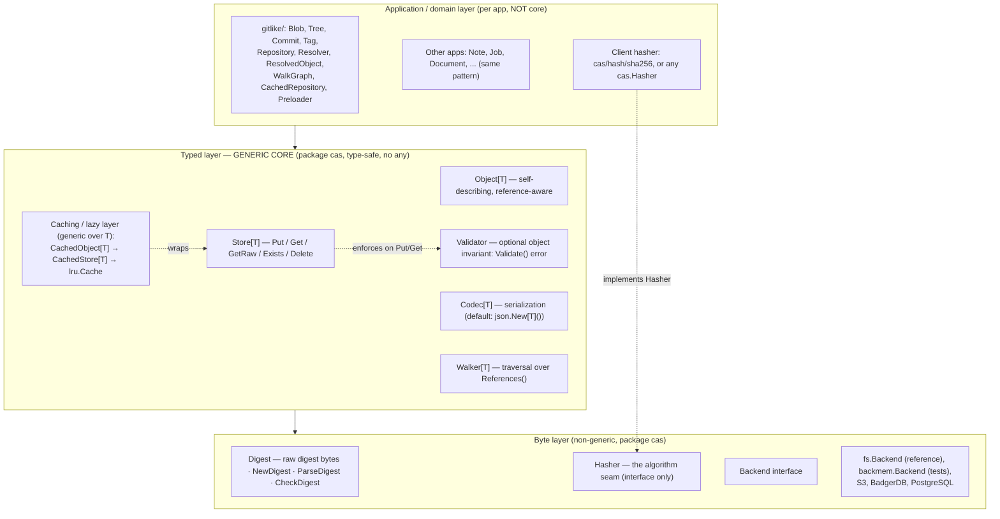
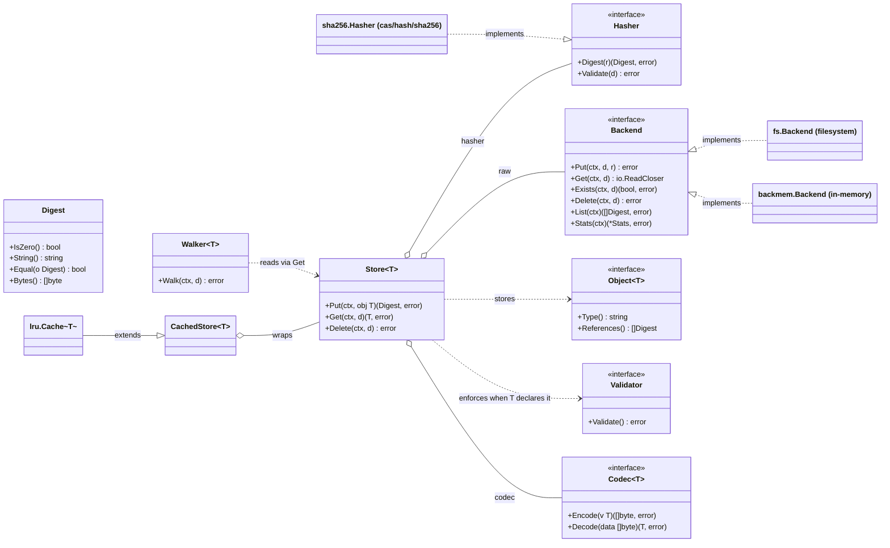
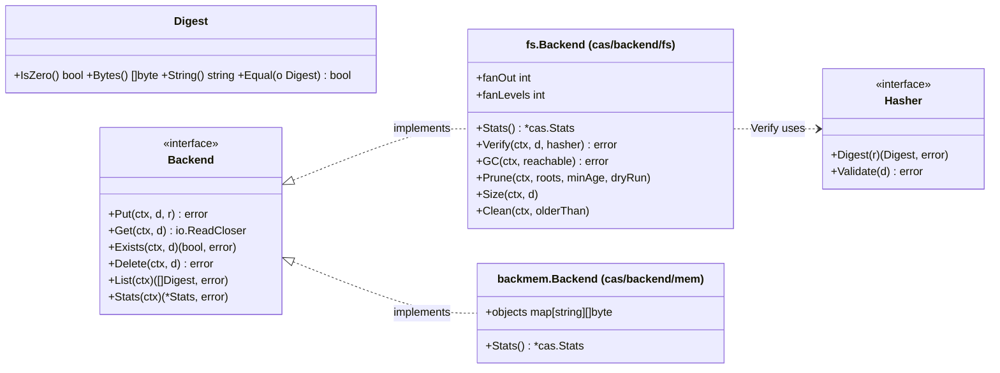
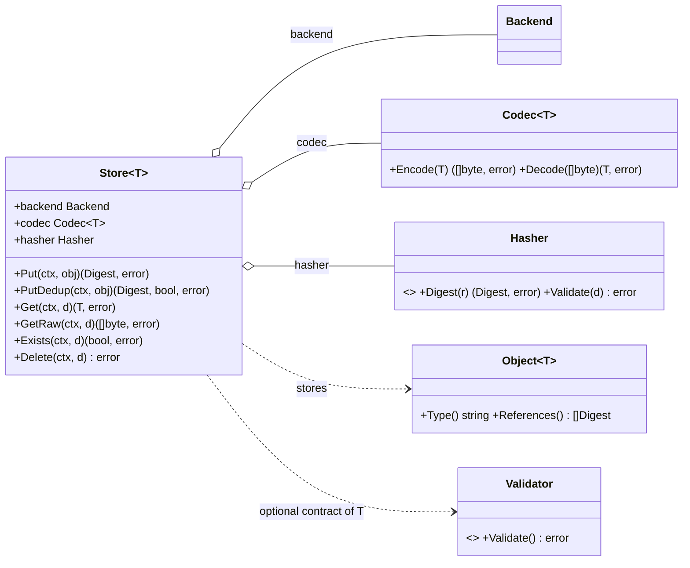
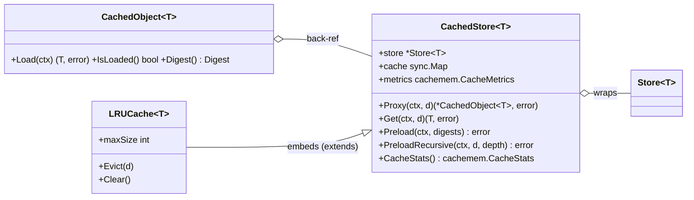
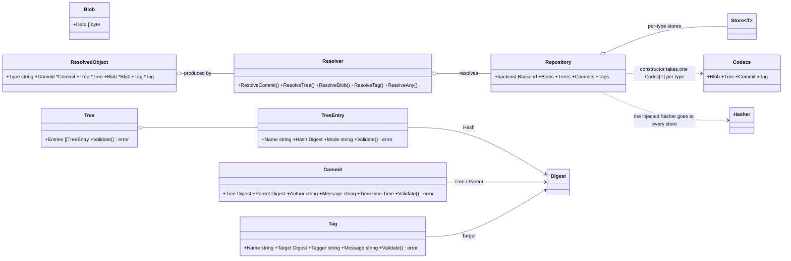

# CAS Core — go-cask

Authoritative spec of the **`cas` core library** — foundation for every extension, client, example and HTTP/API layer. Origin: DeepSeek design conversation (final converged state); share link and the ten design stages in [`../design/design-history.md`](../design/design-history.md). Related: `library-design.md` (lean-core, errors, compatibility), `performance.md`, `testing-strategy.md`, `examples.md`, `backend-architecture.md`.

## 1. Purpose and scope

CASK: reusable Go **content-addressable store**. Blobs stored once under their content digest, immutable, referencing each other by digest. Git-like (blob/tree/commit/tag), **generic across apps and domains**: storage core knows nothing about application object types and **names no hash algorithm**. Client injects one as a `Hasher` (§4.2): storage layer keys blobs by opaque digest (the OCI/Docker split), algorithm-aware code stays outside. Apps layer typed objects on top, may share one physical store. Scope: architecture, component contracts, data flows, concurrency, extension contract. `cas` **generic only**; application models (e.g. `gitlike`) live outside it (§4.12).

## 2. Core concepts and invariants

1. **Digest-addressed.** Key = content digest; no mutable addressing — to "change" an object, store a new one. The address covers the whole frame — envelope version, codec identity tag, type name, not just the payload (§8 decision 1) — so equal payloads differ when version, codec tag or type name differs.
2. **Immutability.** Stored objects are never mutated in place.
3. **Automatic deduplication.** Identical content ⇒ identical digest ⇒ stored once. Dedup is **per type and per codec**, deliberately: the same logical content under another codec, or a later envelope version, takes a different address and is stored twice (§8 decision 1).
4. **The core is hash-agnostic; the client owns the algorithm.** `Digest` is raw digest bytes (§4.1); `cas` implements no hash function — an injected `Hasher` hashes and checks digest width (§4.2). A reference carries **no algorithm name**, so the core cannot recognize another algorithm's store, cannot report per-algorithm statistics, and one store is effectively **single-format** (Git: one object format per repository). Changing the algorithm is a **format transition, not a configuration change**: re-digest and rewrite every object under the new addresses, verify each, then delete the source only after verification (operations.md §5) — the client's job, since only it knows the algorithm.
5. **Layering.** The byte layer is **non-generic** (`Digest` + `io.Reader` only); all generics live in the typed layer.
6. **No `any` in the public API.** Per-type `Store[T]`; mixing types is a compile-time error. `Store[T].Get` returns concrete `T`, never an `Object[T]` interface (§4.8). An unconstrained type parameter (`Codec[T any]`, `Object[T any]`) is Go constraint syntax, not a value type. Recorded exception: the dynamic CBOR value codec (`cbor.NewValue() Codec[any]`, `cbor.NewMap() Codec[map[string]any]`, §4.6; library-design §4).
7. **Streaming I/O.** The byte layer moves `io.Reader`/`io.ReadCloser`; the fs backend copies an object to disk without buffering in memory (mem buffers by design), `Verify` streams through the injected `Hasher`.
8. **Thread safety by default.** Backends with immutable object layout have lock-free reads (atomic rename) and one `sync.Mutex` for `Put`/`Delete`; the packfile backend serializes its in-memory index on that same mutex (§4.14); caches use `sync.Map`/`atomic`; writes are atomic (temp file + `Sync()` + rename).

Testable via the CAS laws (testing-strategy.md §1).

## 3. Architecture overview

### 3.1 Layers


```mermaid
flowchart TB
    subgraph APP["Application / domain layer (per app, NOT core)"]
        GITLIKE["gitlike/: Blob, Tree, Commit, Tag,\nRepository, Resolver, ResolvedObject,\nWalkGraph, CachedRepository, Preloader"]
        OTHER["Other apps: Note, Job, Document, ... (same pattern)"]
        CLIENTHASH["Client hasher: cas/hash/sha256, or any cas.Hasher"]
    end
    subgraph TYPED["Typed layer — GENERIC CORE (package cas, type-safe, no any)"]
        OBJECT["Object[T] — self-describing, reference-aware"]
        VALIDATOR["Validator — optional object invariant: Validate() error"]
        CODEC["Codec[T] — serialization (default: json.New[T]())"]
        STORE["Store[T] — Put / Get / GetRaw / Exists / Delete"]
        WALKER["Walker[T] — traversal over References()"]
        CACHE["Caching / lazy layer (generic over T):\nCachedObject[T] → CachedStore[T] → lru.Cache"]
        CACHE -. "wraps" .-> STORE
        STORE -. "enforces on Put/Get" .-> VALIDATOR
    end
    subgraph BYTE["Byte layer (non-generic, package cas)"]
        DIGEST["Digest — raw digest bytes · NewDigest · ParseDigest · CheckDigest"]
        SEAM["Hasher — the algorithm seam (interface only)"]
        RAW["Backend interface"]
        BACKENDS["fs.Backend (reference), backmem.Backend (tests),\nS3, BadgerDB, PostgreSQL"]
    end
    APP --> TYPED
    CLIENTHASH -. "implements Hasher" .-> SEAM
    TYPED --> BYTE
```

| Layer | Rule |
|---|---|
| Byte | depends on nothing |
| Typed | depends on byte |
| Application | depends on typed |
| Caching | wraps the typed layer without changing either |
| Algorithm | one more client-filled seam: `Store` holds a `Hasher` (§4.2); nothing in `cas` imports a concrete one |
| Generic core | holds only generic primitives; the git-like object model is a shared reference library in `gitlike/` (§4.12); apps build their own types/repositories and MUST NOT add them to the core |

- Boundary is deliberately boring and stable: core generic (`cas/`), backends under `cas/backend/*`, helper/manifest logic in `cas/pack`, object models such as `gitlike/` layered on top.
- A package that helps rather than stores — `cas/pack`, `cas/bloom`, `cas/verify/*`, `cas/verify/sidecar` — MUST NOT become an implicit backend and MUST NOT redefine the storage model; a backends-only concern (a `Backend` method, an on-disk layout, an address rule) belongs to a backend under `cas/backend/*`.
- A hard-to-classify boundary is a design defect, not a naming problem: clarify it in package names, docs and README text **before** touching behavior; never blur it and excuse the blur with a one-off exception.

### 3.2 How the core fits together

- **Store:** app defines `Note` implementing `Object[Note]` (versioned type name + referenced digests), then `Store[Note]` over a `Backend`, with a `Codec[Note]` and the client's `Hasher`. `Store.Put(ctx, note)`: `Codec.Encode` → TLV envelope built by `Store.Put` itself (the codec is the single serialization authority; objects never serialize themselves) → injected `Hasher` → content address `d` → `Backend.Put(ctx, d, r)` → return `Digest` (stored inside other objects to build a graph). Identical bytes ⇒ identical digest ⇒ dedup. Core never hashes — only asks the `Hasher`.
- **Get:** `Store.Get(ctx, d)` streams via `Backend.Get`, `Codec.Decode` reconstructs; decoded `Type()` MUST match the envelope's type name (`ErrUnknownType` otherwise); result is concrete `T`, no casts.
- **Why three layers:** non-generic byte layer — any backend swaps in without touching app code; generic typed layer — any app type works without touching the core; injection seam — any hash algorithm works without touching either; application layer owns the domain model. Extensions/clients touch the typed layer and the stable surface (§7.1).
- **References and graphs:** objects reference each other by plain `Digest` (`Commit.Tree`, `TreeEntry.Hash`, …); the core never interprets them. `Object[T].References()` is the single source of outgoing digests — powering `Walker[T]`, cache preloading, GC reachability. A reference carries no algorithm: meaningful only to a client using the algorithm that produced it (§4.2).

### 3.3 Aspect diagrams


```mermaid
classDiagram
    direction LR
    class Digest {
        +IsZero() bool
        +String() string
        +Equal(o Digest) bool
        +Bytes() []byte
    }
    class Hasher {
        <<interface>>
        +Digest(r) (Digest, error)
        +Validate(d) error
    }
    class Backend {
        <<interface>>
        +Put(ctx, d, r) error
        +Get(ctx, d) io.ReadCloser
        +Exists(ctx, d) (bool, error)
        +Delete(ctx, d) error
        +List(ctx) ([]Digest, error)
        +Stats(ctx) (*Stats, error)
    }
    class fsBackend["fs.Backend (filesystem)"]
    class memBackend["backmem.Backend (in-memory)"]
    Backend <|.. fsBackend : implements
    Backend <|.. memBackend : implements
    class sha256Hasher["sha256.Hasher (cas/hash/sha256)"]
    sha256Hasher ..|> Hasher : implements
    class Object~T~ {
        <<interface>>
        +Type() string
        +References() []Digest
    }
    class Validator {
        <<interface>>
        +Validate() error
    }
    class Codec~T~ {
        <<interface>>
        +Encode(v T) ([]byte, error)
        +Decode(data []byte) (T, error)
    }
    class Store~T~ {
        +Put(ctx, obj T) (Digest, error)
        +Get(ctx, d) (T, error)
        +Delete(ctx, d) error
    }
    class Walker~T~ { +Walk(ctx, d) error }
    Store~T~ o-- Backend : raw
    Store~T~ o-- Codec~T~ : codec
    Store~T~ o-- Hasher : hasher
    Store~T~ ..> Object~T~ : stores
    Store~T~ ..> Validator : enforces when T declares it
    Walker~T~ ..> Store~T~ : reads via Get
    class CachedStore~T~
    class lruCache["lru.Cache~T~"]
    CachedStore~T~ o-- Store~T~ : wraps
    lruCache --|> CachedStore~T~ : extends
```

Core overview: `Digest`, the byte interfaces `Hasher`/`Backend`, the typed `Object[T]`/`Validator`/`Codec[T]`/`Store[T]`/`Walker[T]` set, cache wrappers. `fs.Backend`/`backmem.Backend` implement `Backend`, `sha256.Hasher` implements `Hasher`; `Store[T]` owns `Backend`+`Codec[T]`+`Hasher` and enforces `Validator`; `Walker[T]` reads via `Store.Get`; `CachedStore[T]` wraps `Store[T]`, `lru.Cache[T]` extends it.

Byte layer — addressing and storage:


```mermaid
classDiagram
    direction LR
    class Digest { +IsZero() bool +Bytes() []byte +String() string +Equal(o Digest) bool }
    class Hasher {
        <<interface>>
        +Digest(r) (Digest, error)
        +Validate(d) error
    }
    class Backend {
        <<interface>>
        +Put(ctx, d, r) error
        +Get(ctx, d) io.ReadCloser
        +Exists(ctx, d) (bool, error)
        +Delete(ctx, d) error
        +List(ctx) ([]Digest, error)
        +Stats(ctx) (*Stats, error)
    }
    class fsBackend["fs.Backend (cas/backend/fs)"]
    fsBackend : +fanOut int
    fsBackend : +fanLevels int
    fsBackend : +Stats() *cas.Stats
    fsBackend : +Verify(ctx, d, hasher) error
    fsBackend : +GC(ctx, reachable) error
    fsBackend : +Prune(ctx, roots, minAge, dryRun)
    fsBackend : +Size(ctx, d)
    fsBackend : +Clean(ctx, olderThan)
    class memBackend["backmem.Backend (cas/backend/mem)"]
    memBackend : +objects map[string][]byte
    memBackend : +Stats() *cas.Stats
    Backend <|.. fsBackend : implements
    Backend <|.. memBackend : implements
    fsBackend ..> Hasher : Verify uses
```

Typed layer — the generic store:


```mermaid
classDiagram
    direction LR
    class Object~T~ { +Type() string +References() []Digest }
    class Codec~T~ { +Encode(T) ([]byte, error) +Decode([]byte) (T, error) }
    class Hasher { <<interface>> +Digest(r) (Digest, error) +Validate(d) error }
    class Validator { <<interface>> +Validate() error }
    class Store~T~ {
        +backend Backend
        +codec Codec~T~
        +hasher Hasher
        +Put(ctx, obj) (Digest, error)
        +PutDedup(ctx, obj) (Digest, bool, error)
        +Get(ctx, d) (T, error)
        +GetRaw(ctx, d) ([]byte, error)
        +Exists(ctx, d) (bool, error)
        +Delete(ctx, d) error
    }
    Store~T~ o-- Backend : backend
    Store~T~ o-- Codec~T~ : codec
    Store~T~ o-- Hasher : hasher
    Store~T~ ..> Object~T~ : stores
    Store~T~ ..> Validator : optional contract of T
```

Cache layer — lazy loading wrappers:


```mermaid
classDiagram
    direction LR
    class Store~T~
    class CachedObject~T~ { +Load(ctx) (T, error) +IsLoaded() bool +Digest() Digest }
    class CachedStore~T~ {
        +store *Store~T~
        +cache sync.Map
        +metrics cachemem.CacheMetrics
        +Proxy(ctx, d) (*CachedObject~T~, error)
        +Get(ctx, d) (T, error)
        +Preload(ctx, digests) error
        +PreloadRecursive(ctx, d, depth) error
        +CacheStats() cachemem.CacheStats
    }
    class LRUCache~T~ {
        +maxSize int
        +Evict(d)
        +Clear()
    }
    CachedStore~T~ o-- Store~T~ : wraps
    CachedObject~T~ o-- CachedStore~T~ : back-ref
    LRUCache~T~ --|> CachedStore~T~ : embeds (extends)
```

Shared reference layer — gitlike (application code, not core):


```mermaid
classDiagram
    direction LR
    class Blob { +Data []byte }
    class Tree { +Entries []TreeEntry +Validate() error }
    class TreeEntry { +Name string +Hash Digest +Mode string +Validate() error }
    class Commit { +Tree Digest +Parent Digest +Author string +Message string +Time time.Time +Validate() error }
    class Tag { +Name string +Target Digest +Tagger string +Message string +Validate() error }
    class Repository { +backend Backend +Blobs +Trees +Commits +Tags }
    class Codecs { +Blob +Tree +Commit +Tag }
    class Resolver { +ResolveCommit() +ResolveTree() +ResolveBlob() +ResolveTag() +ResolveAny() }
    class ResolvedObject { +Type string +Commit *Commit +Tree *Tree +Blob *Blob +Tag *Tag }
    Tree o-- TreeEntry
    TreeEntry --> Digest : Hash
    Commit --> Digest : Tree / Parent
    Tag --> Digest : Target
    Repository o-- Store~T~ : per-type stores
    Repository ..> Codecs : constructor takes one Codec[T] per type
    Repository ..> Hasher : the injected hasher goes to every store
    Resolver o-- Repository : resolves
    ResolvedObject o-- Resolver : produced by
```

Same structure per layer: byte (addressing, storage + fs maintenance), typed (the store's seams), cache (lazy proxies).

## 4. Component specifications

### 4.1 `Digest` — content address

```go
type Digest []byte // raw digest bytes; the zero value (nil) is the ABSENT digest

func NewDigest(b []byte) Digest                // copies; empty/nil → the absent digest
func (d Digest) IsZero() bool                  // absent?
func (d Digest) Equal(o Digest) bool           // absent equals nothing
func (d Digest) Bytes() []byte                 // copy; nil when absent
func (d Digest) String() string                // lowercase hex, NO algorithm prefix; "" when absent
func (d Digest) Prefix(n int) string           // first n HEX CHARS for display (viewer: Prefix(8)); total: absent/n<=0 → "", short digest whole
func (d Digest) MarshalText() ([]byte, error)  // hex (encoding.TextMarshaler)
func (d *Digest) UnmarshalText(b []byte) error // strict lowercase hex; "" → absent; else ErrInvalidDigest
func ParseDigest(hex string) (Digest, error)   // shape only: non-empty lowercase hex
func CheckDigest(d Digest, what string) error  // absent → ErrInvalidDigest
```

| Fact | Rule |
|---|---|
| Type | **concrete byte slice**, not a struct carrying an algorithm — `cas` names no algorithm, cannot tell one digest width from another (§4.2) |
| Immutability | `NewDigest` and `Bytes` copy, so a caller's slice never aliases stored state |
| Absent | the **zero value IS the absent digest** — the one spelling of "no reference"; `IsZero()` true, `String()` `""`, `Bytes()` nil, `Equal` false against everything **including another absent digest** (two unknown references aren't the same object) |
| `String()` | **lowercase hex only**, never an algorithm prefix; `MarshalText` renders the same string (absent → `[]byte{}`), so `encoding/json` and every codec honoring `encoding.TextMarshaler` store a reference as one hex string |
| `UnmarshalText` | **strict**: empty string = absent; else even-length lowercase hex — otherwise `ErrInvalidDigest`; a legacy `"sha256:hexdigest"` reference is **rejected rather than reinterpreted** (the deliberate break, §4.12) |
| `ParseDigest` | validates the **shape only** (non-empty lowercase hex; `AB`, `a`, `0xab`, `sha256:ab` all refused); width matching an algorithm is the injected `Hasher`'s job (`Hasher.Validate`, §4.2) |
| `CheckDigest(d, what)` | the "must be present" guard the store and every backend apply to their keys; `what` names the operation in the error |

**The core renders bytes; it does not own a wire format.** `MarshalText`/`UnmarshalText` live on `Digest` because a digest is generic bytes and hex a generic rendering: `cas` still does not import `encoding/json`.

### 4.2 `Hasher` — the client owns the algorithm

```go
type Hasher interface {
    Digest(r io.Reader) (Digest, error) // streaming, one pass
    Validate(d Digest) error            // width check, e.g. exactly 32 bytes
}
```

- Core names no algorithm, implements none. `Store` asks its `Hasher` for the digest of bytes about to be stored, and to validate every caller-supplied digest (§4.8); `cas.Verify` / `cas.NewVerifier` recompute through the same interface (§4.11). Implementations MUST be deterministic (identical bytes, identical digest), pure and **safe for concurrent use** — one instance serves every `Store` operation.
- **The shipped default is the client-side package `cas/hash/sha256`** — nothing in `cas` imports it:

  ```go
  const (
      Name = "sha256" // the printable algorithm name
      Size = 32       // digest width in bytes
  )

  func New() Hasher                        // sha256.New() cas.Hasher — wire it into cas.New
  func NewHasher() hash.Hash               // streaming stdlib hash, for hash-on-write callers
  func Of(data []byte) cas.Digest          // one-shot digest of a byte slice
  func Parse(s string) (cas.Digest, error) // "sha256:hexdigest" or bare hex; else ErrInvalidDigest
  func Format(d cas.Digest) string         // "sha256:hexdigest"; "" when absent
  ```

  `Hasher.Digest` streams `io.Copy` into sha256, never buffering; `Hasher.Validate` requires a present digest of exactly `Size` bytes. `Parse` accepts the prefixed and bare forms and rejects anything else — including another algorithm's prefix — with `ErrInvalidDigest`. `Format` is the client's printable form; the digest itself never carries the name. Any short/preview rendering is the core's `Digest.Prefix(n)` (§4.1), not a per-algorithm helper. `cmd/cask`, `internal/web`, `gitlike` and the examples all construct this hasher (`sha256.New()`) and pass it to `cas.New`.
- **There is no registry.** No `RegisterHash`, no mutexed algorithm map, no init-order coupling, no one-shot/streaming duality, no runtime-chosen path name — nothing to register, nothing to name. Recognizing the address's algorithm is client knowledge: a wrong-width key is `ErrInvalidDigest`; a right-width key from another algorithm names no stored object (`Get` → `ErrNotFound`, and only the client knows the addresses are foreign).

**Algorithm change and single-format stores:**

- No algorithm travels with a digest, so the core cannot enumerate "another algorithm's objects", and `Stats` has no per-algorithm breakdown (§4.11): a store's contents are interpretable only by a client knowing which algorithm wrote them. Mixing algorithms in one store is not a supported configuration — Git's model: one object format per repository.
- Changing the algorithm is a **format transition, not a configuration change**: every object is re-digested and rewritten under its new address, as in Git's object-format transition. `operations.md` §5 records the procedure (list → read → re-hash → write → VERIFY each → delete the source only after verification). Keeping `cas/hash/sha256` for go-cask's own clients is the default, not a core rule.

> **Decision (2026-09, revised): the core is hash-agnostic; the client injects a `Hasher`.** An earlier revision fixed `sha256` at compile time and named the algorithm in the address (`"sha256:hexdigest"`, `<base>/sha256/…`) so it could *recognize* a foreign store (`ErrUnknownAlgorithm`) — which made one algorithm a core property: no plain-digest address, an algorithm directory in the backend layout, `Stats` grouped by a path-inferred name, every reference-rendering codec knowing the name. Now: raw-bytes address, algorithm as client seam (§4.1, §4.2), the OCI/Docker split plus width validation, so a key that cannot name an object is still rejected at the store boundary. Accepted cost: no algorithm in a reference or per-algorithm stats, no cross-algorithm recognition, one format per store — the Git model. Removed: `ErrUnknownAlgorithm`, `ErrInvalidHash`, `ErrHashMismatch` (now `ErrInvalidDigest`, `ErrDigestMismatch`) and the JSON codec's hash field type (§4.6).

### 4.3 `Backend` — the byte storage contract (non-generic)

```go
type Backend interface {
    Put(ctx context.Context, d Digest, r io.Reader) error
    Get(ctx context.Context, d Digest) (io.ReadCloser, error)
    Exists(ctx context.Context, d Digest) (bool, error)
    Delete(ctx context.Context, d Digest) error
    List(ctx context.Context) ([]Digest, error)
    Stats(ctx context.Context) (*Stats, error)
}
```

Per-method contracts (every backend MUST honor):

| Method | Contract |
|---|---|
| `Put` | Idempotent: same digest ⇒ same bytes; may overwrite with identical bytes |
| `Get` | Returns a stream the caller MUST close; missing → `ErrNotFound` |
| `Exists` | Boolean presence check |
| `Delete` | Missing object ⇒ no-op, no error |
| `List` | Every stored digest — **no algorithm filter**: the backend cannot know which algorithm produced a key (§4.2). The shipped backends return them sorted |
| `Stats` | Total stored bytes and object count (§4.11) |

- Every implementation rejects an absent digest with `ErrInvalidDigest`; none recomputes a digest — content addressing makes conflict impossible, so the integrity check is the caller's job (`cas.Verify(ctx, raw, d, hasher)` / `cas.NewVerifier(raw, hasher).Verify(ctx, d)`, §4.11). **`Verify` is deliberately NOT part of this interface** — a separate maintenance-layer concern reading backend bytes and taking the client's `Hasher` explicitly.
- This interface is the **backend extension point**: any storage system (S3, BadgerDB, PostgreSQL, IPFS blockstore) plugs in by implementing these six methods (recipe §7.2). Shipped: `fs.Backend` (§4.4), `backmem.Backend` (§4.5), opt-in `packfs.Backend` (§4.14).
- Portable state transfer is a helper above this interface: `cas/backend/snapshot.Export` writes a deterministic archive of raw digests and payloads, `snapshot.Import` loads it into any backend. Both add no `Backend` methods, invoke no hasher or typed codec, and promise no atomic replacement for arbitrary implementations (`mem.Backend.Restore` validates the complete archive before swapping its map). A **library** remedy — the CLI ships no export/import subcommand (cli.md §2) — so reclaiming a packed store's space is a few lines of Go (performance §9).

### 4.4 `fs.Backend` — the filesystem backend (`cas/backend/fs`)

Objects at `<base>/<fan-out directories>/<full-lowercase-hex-digest>`. **No algorithm directory** — the backend does not know which algorithm produced a key (§4.2); a digest is hex by construction (`Digest.UnmarshalText`), so no path element needs sanitizing (old algorithm-name sanitizer gone). File name always the **full hex digest**; fan-out dirs are successive digest chunks:

| Parameter | Meaning | Default |
|---|---|---|
| `FanOut` | hex chars per directory level | 2 |
| `FanLevels` | number of directory levels | 1 |

- Examples (sha256 digest `a1b2c3d4…`): flat `(0,0)` `<base>/a1b2c3d4...`; Git-like `(2,1)` `<base>/a1/a1b2c3d4...`; deep `(2,2)` `<base>/a1/b2/...`; wide `(4,1)` `<base>/a1b2/...`. Default (2,1) Git-like in directories only; the file name is always the **complete digest**, never the Git-style remainder.
- Any n-way/n-level: `fs.New(basePath, opts ...fs.Option)` with `fs.WithFanOut(n)`/`fs.WithFanLevels(n)`, provided `FanOut × FanLevels` ≤ `MaxFanDepth` (64 hex chars). Negative parameters and over-deep configs are rejected at construction.
- **Base validated at construction.** `fs.New` (and `packfs.New`, whose base owns its loose tree, pack directory and index) runs `fs.ValidateBase` **before** creating anything, returning its error unchanged. Rejected: empty or whitespace-only, `.`, the bare filesystem root, a parent-traversal path (`..`, `../x`, `a/../..`), a volume root (`C:`, `C:\`). A nested directory below that root is accepted: pure path arithmetic, **no I/O**, so it cannot tell whether the directory belongs to another store — one base to one store stays the caller's rule (see the exclusivity bullet below).
- **Key width checked, not assumed.** `digestPath` slices the hex form into `FanLevels` chunks of `FanOut` characters, so a key shorter than `FanOut × FanLevels` hex chars names no object of the layout. Every key-taking method (`Put`/`Get`/`Exists`/`Delete`/`Size`/`Verify`) runs `checkKey` = `CheckDigest` (present) + `addressable` (long enough) and reports `ErrInvalidDigest` — **never a slice-bounds panic** (v1.2.0's clamp hid one). The rule belongs to the *layout*, so the backend needs no hasher knowledge. Two gates: `Store.check` runs `hasher.Validate` before a key reaches a backend, and the backend re-checks.
- `digestPath(d)` builds the path from the configured layout, requiring an already-admitted key (`checkKey`, or `addressable` in a sweep — its only unexported callers); `pathToDigest(rel)` rebuilds a `Digest` via `cas.ParseDigest` (the **last** element is the hex digest, leading elements are fan-out chunks); a name that is not lowercase hex is skipped, not reported.

> Decision (2026-09): file-name style **not configurable** — full-hash names are the only layout (a Git-remainder option rejected: no interop, a second mode everywhere, loses the self-describing full-hash name `List`/`Stats`/`Verify` rely on). Revisit only if a real consumer requires remainder names.

**Write path (atomic):**

```text
MkdirAll(dir) → open <path>.tmp (O_CREATE|O_EXCL) → io.Copy(f, r) → f.Sync() → os.Rename(tmp, path)
```

| Aspect | Rule |
|---|---|
| Directory fsync | optional `WithDirSync()` (fsync the parent after rename, making the publish crash-durable); best-effort — platforms that can't sync dirs (Windows) no-op it (operations §1); default off |
| Temp name | unique per writer: base `<path>.tmp`; an `O_EXCL` failure (across processes only, since the in-process mutex serializes Puts) appends a numeric suffix `<path>.tmp.<n>`; no two writers share a temp inode, so concurrent same-digest writers across processes cannot corrupt each other's write or the stored object |
| Rename | atomic: POSIX last writer wins with identical bytes; Windows a concurrent rename-over-existing can transiently fail (no cross-process last-wins). Because the address is the content, an existing **regular file** at the destination already holds those bytes, so such a `Put` reports success (idempotent); anything else at the path is a real error. A concurrent `Get` retries briefly while the file exists but cannot be opened (Windows sharing violation), so readers still see the old or new file |
| Failure | temp removed; readers never observe partial files; `.tmp` files (`<hex>.tmp` and the `<hex>.tmp.<n>` collision fallbacks) are ignored by `List`/`Stats` and reclaimed by `Clean` |
| Cancellation | `Put` checks `ctx` before each read from the source, so a canceled `Put` (HTTP upload, CLI pipe) stops streaming, publishing nothing |

**Concurrency (lock-free reads):** writes are atomic, so `Get`/`Exists`/`List`/`Stats` take **no lock** — old or new file, never partial (performance §2). `Put` is idempotent, so concurrent same-digest writers never corrupt (mutex in-process, unique temp names across processes; POSIX/Windows rename caveat); one `sync.Mutex` coordinates `Put`/`Delete`, reads are wait-free. **Cross-process guarantees stop at object writes**: with no inter-process locking, a sweep (`Delete`/`GC`/`Prune`/`Clean`) racing another process's writes is NOT safe — the **grace model** applies: such sweeps MUST reclaim only objects older than a grace `--min-age` (`cask` CLI `gc`/`prune` default 1h; forced `--min-age 0` is the dangerous variant).

**Maintenance methods** (§4.11): `Stats`, `Verify`, `GC`, `Prune`, `Clean`; `Size` returns an object's size, `ModTime` its modification time (both `ErrNotFound` when missing); `Clean(ctx, olderThan)` sweeps leftover temp files (`<hex>.tmp` and `<hex>.tmp.<n>`) older than the threshold — always safe within an exclusively-owned base (a temp file is never a valid object; see the one-base rule below). Tolerates a missing store directory (nothing to sweep) and returns walk/removal errors instead of swallowing them.

- **Listing scope:** `List`/`Stats` rebuild each digest from its file name, skipping a foreign name that is not lowercase hex (a temp leftover, an app's `HEAD`/`INDEX` ref file) — the check is the name at **any depth**, not the path shape, so a digest-named file off its canonical fan-out path is still reported. No algorithm registration is needed: the backend stores no algorithm name.
- **One base = one store (exclusivity).** `base` is exclusively this backend's own directory: `List`/`Stats` report every digest-named file beneath it, and `Clean` reclaims any `*.tmp`/`*.tmp.<n>` beneath it as its own crash leftover. An app MUST keep scratch `*.tmp` files out of the store directory (an atomic ref write there dies at the next `Clean`) and MUST NOT point a backend at a directory containing another store — or an older build's `<base>/<algo>/…` tree. Objects below such a base are **phantom**: `List`/`Stats` report them (even duplicating a canonical digest) while `Get`/`Verify` return `ErrNotFound`; `GC`/`Prune` skip what the layout cannot address (`addressable`) instead of building a path, so a stray short digest-named file makes neither sweep fail. `cas.Sweep` reaches the same answer by asking `Exists` first (§4.11).
- **App refs live outside the base.** `cas/refs` publishes a ref by writing `<name>.tmp` beside it, so a refs directory **inside** a store's base loses that temp file to the backend's next `Clean`, and a ref whose name happened to be lowercase hex is listed and swept as an object. Keep refs beside the base, never under it: the examples use `<root>/objects` as the `fs.Backend` base and `<root>/refs` as the refs directory.
- **The one sanctioned resident under a base is `cas/verify/sidecar`'s record directory**, `<base>/.meta/<hex>.json` with the `<hex>.<n>.tmp` scratch its atomic writes leave behind (operations §6): such a file is neither digest-named nor a free `*.tmp`, the layer is a maintenance view of the store's own bytes rather than another store's state, and the backend's `Clean` reclaims its scratch. That residency is a **recorded exception, not a precedent** — a package wanting files under a base needs that decision written here first.
- **Sweeps never panic on a foreign name.** `GC`/`Prune` filter a too-short name out before building a path (`Delete` on it would be `ErrInvalidDigest` anyway), and portable `cas.Sweep` asks `Exists` first (§4.11), so a stray short digest-named file never fails a sweep, aborts it halfway or appears in a dry-run report. `cmd/cask list` skips an entry whose size cannot be read (`ErrNotFound`/`ErrInvalidDigest`), warning on stderr.
- **Several stores under one root:** give each its own directory and pass it as the base — `fs.New(filepath.Join(root, name))`, then `cask -store root/name`. Deliberately **no** `WithNamespace` option: that `filepath.Join` plus a validator for a client-supplied path element (separators, `..`, absolute paths, Windows reserved names, case/NFC folding) reintroduces the runtime-chosen path name §4.2 removed, and isolates nothing the exclusivity rule does not (extensions §3).
- **Base pre-flight is public API for callers owning the path.** `fs.ValidateBase(base) error` is the check `fs.New` runs, exported for a caller holding a base before any backend exists (CLI flag, config value, user-built path), so an unusable path is reported before a directory is created (no I/O, no context). `fs.EnsureBase(ctx, base) error` validates then creates the base directory, for a caller handing the path to something other than the `fs` constructor. `fs.CleanupTemp(ctx, base) error` is `Backend.Clean(ctx, 0)`, for a caller reclaiming crash leftovers on a base it has not opened; like `Clean` it removes **every** matching `*.tmp`/`*.tmp.<n>` beneath `base`, so `base` MUST be the caller's own store directory. `fs.CleanTemp(ctx, root, olderThan) (int, error)` is that sweep with `Backend.Clean`'s age threshold and count, for a caller owning a second tree under the same convention: `packfs.Clean` sweeps `<base>/packs` with it, so one implementation and one temp-file convention serve both trees. A caller that only opens a store needs none of them: `fs.New` validates, `Backend.Clean` sweeps.

### 4.5 `memory.Backend` — in-memory backend (`cas/backend/mem`, imported as `backmem`)

| Aspect | Rule |
|---|---|
| Storage | `map[string][]byte` keyed by **raw digest bytes** (`string(d)`) — no hex form, no algorithm — under a `sync.RWMutex` |
| Purpose | fast, dependency-free, deterministic storage for unit/property/fuzz tests and benchmarks; **not persistent** |
| Contracts | same `Backend` semantics as fs — idempotent `Put`; `Get` returns a reader the caller MUST close (missing → `ErrNotFound`); `Delete` no-op on missing; absent digest → `ErrInvalidDigest`; `List()` returns every stored digest |
| Buffering | `Put` buffers the whole stream (`io.ReadAll`) through a context-checking reader, so a `Put` canceled mid-read stops and stores nothing (the guarantee fs gets from its streaming copy); `Get` returns `io.NopCloser(bytes.NewReader)` over the stored slice (never mutated after `Put`) |
| Cap | with `WithMaxSize` the read is bounded to the remaining budget first, so an oversized `Put` is rejected without allocating past the cap — at the `math.MaxInt64` ceiling the budget exceeds what any stream can deliver and `budget+1` would wrap, so the read is left unbounded there and `store`'s cap check rejects an overrun (go-cask#355) |
| Concurrency | `RWMutex` (the lock-free rename trick doesn't apply; still far faster than disk) |
| Stats/listing | implements `Backend.Stats` (`*cas.Stats`) and `List`, rebuilding digests from map keys with `cas.NewDigest` (empty key skipped — `CheckDigest` makes it unreachable) and recomputing total bytes/object count per call — no desynchronized counter. No backend-native `Verify`/`GC`/`Prune`/`Clean`/`Size`/`ModTime`, but `cas.VerifyAll` and `cas.Sweep` (§4.11) work against it directly, needing only the minimal `Backend` interface |
| Construction | `backmem.New(...)` (package `memory`, directory `cas/backend/mem`, imported as `backmem` because `cas/cache/mem` declares the same clause — go-cask#269; optional `backmem.WithMaxSize(n)` cap; 0 = unbounded); swap-in compatible with any `Store[T]`, `gitlike` repo, or HTTP handler taking a `Backend` |

### 4.6 `Codec[T]` — serialization contract

```go
type Codec[T any] interface {
    Encode(v T) ([]byte, error)
    Decode(data []byte) (T, error)
}
```

- Default: `json.New[T]()` (`cas/codec/json`) over std-lib `encoding/json`. A client MAY opt into the compact binary codec `binary.NewRaw[T](encode, decode)` or the stacked wrapper `binary.New[T](next, transform, restore)` (`cas/codec/binary`) when a stable app-defined binary payload beats JSON. Compression/encryption/protobuf are further `Codec[T]` impls; never change the byte layer.
- Contract: `Decode(Encode(v)) == v` (round-trip) for all storable values.
- **A decoder bounds how deep it descends.** `cbor.NewValue`/`cbor.NewMap` recurse into nested arrays and maps, so `cbor.MaxDepth` (128 levels) bounds nesting: past it, `cbor.ErrTooDeep` instead of descending until the goroutine stack is exhausted — a `fatal error: stack overflow` is a runtime abort no `recover()` can catch. The bytes need not be damaged for the bound to fire (hence a sentinel of its own, not a truncation error), and a payload at or below the limit decodes unchanged. Only the decoder is bounded: the encoder serializes a value the caller's process built.
- **A compression wrapper bounds what it expands.** `flate`, `gzip` and `zlib` decompress into memory (`Codec[T]` is bytes in, value out), so each enforces `MaxDecodedBytes` (1 GiB) on the **decompressed** stream, returning `ErrDecodedTooLarge` past it — stored bytes are untrusted and a small payload can expand without limit; a legitimate payload above the ceiling needs a streaming codec. One implementation behind three packages: the bounded read lives in `cas/codec/internal/bounded`, and all three export the **same** `ErrDecodedTooLarge` and ceiling, so `errors.Is(err, gzip.ErrDecodedTooLarge)` also holds through `flate`/`zlib` (go-cask#271).
- **A reference field is a plain `cas.Digest` — no codec-side hash type.** `Digest` implements `encoding.TextMarshaler`/`TextUnmarshaler` (§4.1), so `encoding/json` renders a present reference as **one lowercase-hex JSON string**; an absent field renders `""` unless tagged **`omitzero`** (Go 1.24 floor, still required — an older library ignores the unknown tag and emits `""`, changing stored bytes and the address). An object type therefore writes `Ref cas.Digest` `json:"…,omitzero"` and nothing else — no wrapper to construct, no unwrapping call, no hand-written `MarshalJSON` for rendering. See §4.12 for a working object model. Digest-as-hex is generic (no algorithm, no JSON), so it belongs to the core type, not one codec; the core still imports no `encoding/json`. A non-JSON codec carries no hash handling — `gob` encodes the `Digest` byte slice directly, a custom binary codec only the app-defined payload layout.
- **A codec MAY name the wire format it produces** — optional `CodecNamer` interface, `CodecName() string`. The tag is written into the envelope (§8 d1) and compared on read, so swapping the codec behind a type reports `ErrCodecMismatch` instead of surfacing as a decode failure. Deliberately **optional**, not a third method on `Codec[T]`: adding one would break every existing implementation, in this repo and in consumers, for an opt-in check.
- **A decoder's integer range is the value model's; an argument outside it is an error.** `cbor.NewValue`/`cbor.NewMap` decode every CBOR integer to `int64`, so major type 0's unsigned argument is representable only to `MaxInt64` and type 1's negated argument only to the same bound (value is `-1 - argument`, so `MaxInt64` is `MinInt64` exactly). Past it — and the encoder writes such an argument, encoding a `uint64` as major type 0 — `cbor.ErrIntegerRange` replaces the wrapping `int64` conversion: `Encode(uint64(1<<63))` used to return a negative `int64`, and `uint64` max and `-1` both decoded to `int64(-1)`, letting the decoder decide a stored manifest field's sign. Again a sentinel of its own, not a truncation error, and every representable value — `MaxInt64`/`MinInt64` included — decodes unchanged.
- **Tags declared, never derived.** Shipped codecs report `json`, `gob`, `cbor` and `binary`; a codec stacked over another composes the inner tag (`gzip+json` for `gzip.New(json.New[T]())`, `flate+gzip+json` for a deeper stack). A stack whose inner codec declares no tag reports `""`: nesting an unnamed codec must not manufacture a tag that later reads as a mismatch. Nothing comes from `%T`, reflection or the payload bytes, so renaming a Go type or moving a package is never read as a format change. An empty tag means "unspecified": no comparison is made — the pre-existing behaviour and the compatibility rule.
- **The frame's version is readable on its own.** `EnvelopeVersion` is the format version this build writes; `PeekVersion(r io.Reader)` reads only the envelope's leading version byte from a stream, returning it **verbatim whether or not this build knows it**: reporting an unknown version is the point, so unlike `PeekType` it never rejects one. A caller compares that byte against `EnvelopeVersion` and chooses the header layout to parse — the only way to tell "written by a newer format" from "damaged bytes", and what makes two coexisting envelope layouts navigable. Only an empty stream or a read failure is `ErrCorrupt`, naming the field, a non-EOF cause on the chain (`peekError`, `PeekType`'s shape). One byte consumed: cost is independent of the payload. `EnvelopeVersion` is not the type major version: `commit@1` names the object model, the version byte names the layout of the frame carrying it (§4.7).

### 4.7 `Object[T]` — self-describing typed object

```go
type Object[T any] interface {
    Type() string         // versioned "<type>@<major>", e.g. "commit@1"
    References() []Digest // digests this object points to (may be nil)
}
```

- `Type()` returns a **versioned type name** `<type>@<major>` — the object model is semantically versioned; several majors coexist in one store (object-versioning.md). `References()` is the single source of truth for traversal, preloading and GC reachability; its elements are bare digests with no algorithm, so they are meaningful only to a client using the algorithm that produced them (§4.2).
- Serialization is NOT an object concern: `Store.Put` encodes with the store's `Codec[T]` and builds the envelope (§8 d1) — the codec is the single serialization authority on write and read.
- **Invariants ARE an object concern.** A type MAY declare `Validate() error`; `cas` names that contract `Validator`, and the store enforces it (§4.8). An invariant is a property of the object model, not a wire format, so it must not live in a codec: the rule must hold for JSON, gob or any other `Codec[T]`. `Validate` MUST be deterministic and pure, SHOULD be cheap — it runs on every `Put` and every `Get`. The core calls `Validate` on a value; a nil object is rejected before it is encoded or returned (§4.8), so an implementation only ever sees a real value and may dereference its receiver.

### 4.8 `Store[T]` — the generic typed store

```go
type Store[T Object[T]] struct {
    backend   Backend
    codec     Codec[T]
    codecName string // resolved once from CodecNamer (or "" when the codec declares no tag)
    hasher    Hasher
}

func New[T Object[T]](backend Backend, codec Codec[T], hasher Hasher) *Store[T]
```

- `New` **cannot fail**: the core resolves nothing, registers nothing, knows no algorithm (§4.2) — so the three collaborators MUST be non-nil — `backend`, `codec` and `hasher` are the caller-supplied seams, and a nil one panics at first use (v1.2.0's `New` returned an error; the seams are now plain values). The **codec identity tag is resolved once, here** — a plain type assertion on the codec value the caller already supplied (`CodecNamer`), never reflection, never `any` — so `Put` writes it and `Get` compares it without re-deriving it per operation.

| Method | Behavior |
|---|---|
| `Put` | reject nil object (including a nil interface value) → reject a `Type()` that is empty or unversioned (`<type>@<major>` is the contract; an unversioned name would be stored as `@1` and never read back) → `obj.Validate()` when T declares it → `codec.Encode(obj)` → TLV envelope → `hasher.Digest` → `backend.Put` → `d` |
| `PutDedup` | as `Put`, then `backend.Exists` first; returns `(d, alreadyStored, err)` |
| `Get` | `backend.Get` → envelope parse (**a frame that does not parse → `ErrCorrupt`**, naming the offending field) → codec-tag comparison (both tags present and different → `ErrCodecMismatch`, checked **before** decoding) → `codec.Decode` → concrete `T`; decoded `Type()` MUST match the stored type name (else `ErrUnknownType`); a payload the codec cannot decode, that decodes to nil, or whose object fails `Validate` → `ErrCorrupt` |
| `GetRaw` | returns the serialized bytes (the TLV envelope) for inspection/tooling; never decodes, so never validates — and never parses the frame, so reports no envelope-level error: a damaged object comes back as its bytes; `EnvelopeFromBytes` (or `Get`) is the reader that reports `ErrCorrupt` |
| `Type` | `backend.Get` → `PeekType` → close: reads the envelope header only, so the payload is never read or allocated. Reports the type as stored (which may be one this store cannot decode — `Get` rejects that), `ErrCorrupt` for an unusable header, and the backend's `ErrNotFound` for an absent object |
| `Version` | `backend.Get` → `PeekVersion` → close: reads the frame's leading version byte and nothing else, so cost is one byte whatever the object's size. Reports the byte as stored — including a version this build does not know, which is the point: a caller compares it against `EnvelopeVersion` to tell "written by a newer format" from corrupt bytes without matching an error string. `ErrCorrupt` (naming the field) for a stream with no byte at all, and the backend's `ErrNotFound` for an absent object |
| `PeekHeader` | the streaming census read: `[version][codecLen][codec][typeLen][type]` in one pass, returning **all three** fields — the frame version, the codec identity tag (empty = unspecified) and the versioned type name. Three fields, one walk, so a caller reporting layout and codec avoids re-reading the same bytes; `PeekType`/`PeekVersion` remain for one field, and all three resolve the layout through one helper. Reads no payload byte; `ErrCorrupt` naming the field for anything that is not a usable version 1 or 2 header — a caller that must see an unknown version byte verbatim uses `PeekVersion` (§4.6) |
| `Exists` | delegates to `backend` |
| `Delete` | delegates to `backend` |
| `Close` | forwards to the backend when it implements `io.Closer`; idempotent — the backend close runs once, a second call is a no-op returning the first call's error |

- **Every key argument guarded.** `Store.check` applies `CheckDigest` (present) and `hasher.Validate` (well formed for the client's algorithm) to every digest a caller supplies — `Get`, `GetRaw`, `Exists`, `Delete` — and `Put`/`PutDedup` apply it to the digest the hasher just computed. A key that cannot name an object is rejected with `ErrInvalidDigest` (wrapped with the operation name), not silently missed.
- **Object invariants enforced on both paths** (`Validator`, §4.7). `Put`/`PutDedup` run `Validate` before encoding, so an invalid object is never written and its own error stays in the chain (`cas: put: <err>`); `Get` runs it after decoding and reports a violation as `ErrCorrupt` (wrapping the object's error), so a hand-crafted or foreign payload cannot return in an impossible state. `GetRaw` cannot validate what it does not decode — an inspector must read a broken object.
- **A nil object is rejected**: `Put`/`PutDedup` refuse one (`cas: put: nil object`) instead of encoding a payload that decodes back to nil; `Get` reports a payload that decodes to nil as `ErrCorrupt` — checked **before** the decoded type is compared and before `Validate` runs, so no method is ever invoked on a nil receiver. The core decides "there is no value here" with an internal nil check (the only use of reflection in `cas`), so an implementation never has to tolerate a nil receiver.
- **A codec change is a format change, not damage** (`ErrCodecMismatch`). `Get` compares the envelope's codec identity tag with its own codec's, after the header is parsed and before `Decode`, reporting a difference when both tags are present: never `ErrCorrupt` (bytes intact), never `ErrUnknownType` (type known). Either side declaring no tag — a version 1 envelope, a codec without `CodecNamer` — means no check. The comparison precedes decoding, so an object differing in *both* type and codec reports the codec difference; when codecs agree, a foreign type reports `ErrUnknownType`. **A tagless object is never guessed.** A version 1 envelope carries no codec identity, so a reader built on another codec cannot *prove* a mismatch — the bytes are indistinguishable from corruption. `ErrCorrupt` stays the answer there, the message naming the absent identity so the diagnosis is one step from `ErrCodecMismatch`; detection applies to every object written under version 2 and later.
- **A malformed envelope is corruption, not an unknown type.** Every TLV reader agrees — `EnvelopeFromBytes`/`EnvelopeType` (byte slice), `HeaderType` (bounded backend read), `PeekType`/`PeekVersion` (stream), `Store.Get`/`Store.Type` (store), `cas/repo.Registry.Resolve` — reporting a structural failure (absent/unreadable version byte, truncated or oversized codec/type field, empty type name, payload length that does not fit the frame) as `ErrCorrupt`, naming the field; `decodeEnvelopeHeader` is the one header implementation they share. `ErrUnknownType` answers the dispatch question only: a type with no registered decoder (`cas/repo.UnknownTypeError`), one outside a caller's fixed model (`gitlike`), or a value decoded under a different `Type()`. That split makes "skip it, it is not mine" safe: `errors.Is(err, cas.ErrUnknownType)` can no longer skip damaged bytes and, in a maintenance path, delete the object (go-cask#202).
- **Reading an object's type is one function, and it never buffers the payload.** `HeaderType(ctx, backend, digest)` reads a bounded prefix of the object (`headerPrefixLimit`, expressed as twice `maxPeekNameLen`) and parses it through `EnvelopeType`, so learning what an object is costs a bounded read whatever its size. It is the one header read in the library: `cas/repo.Registry.Resolve`, the `gitlike` resolver, `cmd/cask` and the viewer all go through it (three private copies at two limits plus a fourth inline one before go-cask#319). Error: `ErrCorrupt` for bytes not beginning with a usable header, the backend's own error (with `ErrNotFound`) for an unreadable object. A caller reading a store that legitimately holds raw, un-enveloped objects translates the first into "untyped" itself — what `internal/index.HeaderType` does.
- **The writer is exported, and it is the only one.** `EncodeEnvelope(codec, typeName, payload)` frames a payload exactly as `Store.Put` does — the version byte this build writes, the field order, and the versioned-type-name rule (`ErrUnknownType` for an empty or unversioned name) — so a tool producing stored bytes **without** a store lands on the same bytes and digest instead of copying the layout. `cask seed-preview` is that tool: it derives each preview object's digest from the frame it writes, so a local layout copy froze it at envelope version 1 and mixed its store with everything `cask put` writes (go-cask#187). It is pure (no I/O, context or hasher) because the caller owns payload and tag; an empty tag is legal and reads back as "codec unspecified".
- Type safety from one store per type: `Store[Blob]` vs `Store[Commit]` distinct — passing a commit digest to a blob store is a **compile-time error**. **Enumerating a store by type is `List` plus `Type`**, not `List` plus `Get`: `Store.Type` reads only the envelope header (§4.6), so "which objects are snapshots" costs a header read per object rather than a decode, and a large object costs the same as a small one.
- **`Version` is the same peek one field earlier**, and the only way to choose a header layout before parsing one: `Store.Version` reads the frame's leading byte (`PeekVersion`, §4.6) and reports it as stored, so a store holding both a version 1 and a version 2 object answers for each without decoding either. It costs one byte per object, never reporting an unknown version as damage — the caller compares the byte with `EnvelopeVersion` and decides. `Store` keeps no version census: a store-wide tally is a caller's loop over `List` plus `Version`, not a core API.
- `Get` returns the **concrete `T`** (type name verified), `GetRaw` bytes. `Store[T Object[T]]` keeps the typed layer free of `any`/type assertions; the `Validator` check is a structural interface assertion applied to every type. `Store[T]` is safe for concurrent use if its `Backend` and `Hasher` are.
- **Lifecycle:** `Close` is the store's only lifecycle operation: it forwards to the backend's `io.Closer` when there is one — a flushing backend such as `packfs` must be closed once every store over it is finished, or its state is never written — runs that close exactly once, and is a no-op for a backend needing no cleanup, so `defer store.Close()` is always safe. **Construction is the client's line:** no `NewJSON`/`NewCompressedJSON` in `package cas` (the core must not import `cas/codec`); a consumer writes `func newNoteStore(backend Backend, hasher Hasher) *Store[*Note]` in the package owning the type, or registers the store with `cas/repo.RegisterStore` and reads it back with `cas/repo.LookupStore[T]` (§4.12).

### 4.9 `Walker[T]` and `WalkDigests` — generic graph traversal

```go
func NewWalker[T Object[T]](store *Store[T], visit func(T) error) *Walker[T]
func (w *Walker[T]) Walk(ctx context.Context, d Digest) error

type Node interface{ References() []Digest }
type NodeResolver func(ctx context.Context, d Digest) (node Node, refs []Digest, err error)
func WalkDigests(ctx context.Context, resolve NodeResolver, roots []Digest,
    visit func(d Digest, node Node, refs []Digest) error) error
```

- `visit` receives every reached object as the concrete `T`; reads via `Store[T].Get`. Traversal is **iterative with an explicit stack and a visited set** keyed by `d.String()`: each digest visited at most once, a shared subgraph once rather than once per path, and a very deep graph terminates instead of exhausting the stack. A cycle is not constructible: an address derives from the bytes that would contain it.
- **There is one traversal, not one per entry point.** `WalkDigests` owns the stack, the visited set, the zero-`Digest` skip, the reference-order push and the per-node context check; `Walker[T]` (typed) and `cas/repo.Walk` (cross-type, via a `Resolver`) adapt it — one rule set (go-cask#319). `cas.WalkDigests` adds no context itself; a `NodeResolver` returns the node plus, optionally, its references: nil `refs` means "ask the node" (what an `Object[T]` adapter returns), while a node type that is not a `cas.Object` (cas/repo's `Object`) supplies the list explicitly. A resolver or visitor error is returned unwrapped for the calling package to name, and `cas/repo.Walk` keeps its registry classification (an unknown type goes to `visit` as an `*UnknownObject` without aborting; any other resolution failure aborts).
- `Reachable` is `WalkDigests` with a set-building visitor, so the reachable set and a typed walk cannot drift apart. Mixed-type traversal is a supported package: `cas/repo.Registry`/`Walk`/`Reachable` generalize the `gitlike` resolver pattern (§4.12) to any number of caller-defined types (go-cask#136).

### 4.10 Caching and lazy loading

**`cachemem.CachedObject[T]`** — lazy proxy for one digest (`cas/cache/mem`, imported as `cachemem` because `cas/backend/mem` declares the same clause — go-cask#269): fields `digest`, a pointer to the underlying `Store[T]`, a metrics pointer, `sync.RWMutex`, `obj`, `loaded`, `err`. `Load(ctx)` uses **double-checked locking**, loading once and memoizing object AND error; `IsLoaded()` reports state without loading; `Digest()` returns the memoized address.

**`cachemem.CachedStore[T]`** — wraps `Store[T]`, built with `cachemem.New(store)`. Cache: `sync.Map` keyed by `d.String()` → `*CachedObject[T]`. Metrics: `cachemem.CacheMetrics{Hits, Misses, Loads, Evicts}` (atomic) — `Hits`/`Misses` count `Proxy` lookups, `Loads` counts store fetches by `CachedObject.Load` (at most one per cached object, error fetches included), `Evicts` counts policy/`Evict` removals. `OnNew(fn)` installs the insert hook — stored atomically (settable/clearable at any time), running synchronously on the inserting goroutine: keep it cheap, do not re-enter `Proxy`. `Proxy(ctx, d)` returns a not-yet-loaded `*CachedObject[T]` (existence verified first); `Get` = `Proxy` + `Load`. `Preload(ctx, digests)` loads in parallel through a bounded worker pool, returning `errors.Join` of every failure; `PreloadRecursive(ctx, d, depth)` preloads the graph, **skipping** references this store cannot decode (a commit pointing at a tree, another store's type) and dangling ones so a per-type cache is not blocked by them, warming each digest **at most once per call** — depth 0 warms `d` alone, and a diamond-shaped graph is not re-read per path (the visited rule every walk follows, go-cask#319); `Warmup(ctx, digests)` tolerates missing objects but reports any other failure, including a canceled context. `CacheStats()`/`Evict(d)`/`Clear()`/`Warmup(ctx, digests)`.

**`lru.Cache[T]`** — size-bounded LRU (`cas/cache/lru`): owns a `CachedStore[T]` in an unexported field, adds LRU with `maxSize` (in-tree std-lib, §8 d3), re-declares `Proxy`/`Get` to track/promote, exposing only the methods it owns (`Get`, `Proxy`, `Lookup`, `CacheStats`, `Preload`, `PreloadRecursive`, `Warmup`, `Clear`, `Evict`, `EvictKey`) — no method promotion. The wrapped store stays reachable through `CachedStore()`, which bypasses the recency bookkeeping. `lru.New(store, maxSize)` returns `(*lru.Cache[T], error)`; rejects `maxSize <= 0`.

Prefetch-on-access (`prefetch.SmartCache[T]`, `prefetch.NewSmartCache(store, depth)`) and `CacheMonitor` are **example recipes, not part of `cas`** — demonstrated by `examples/notes` and `examples/artifacts`.

### 4.11 Maintenance

- **`Backend.Stats(ctx)`** → `*cas.Stats` (`TotalSize`, `ObjectCount`) with `String()` rendering `"N objects, M bytes"`; part of the `Backend` interface, so **every backend** reports it (fs walks the tree; mem recomputes from its map). **No per-algorithm breakdown** — the core does not know which algorithm produced a digest (§4.2), so it cannot group objects by one; a client needing that groups its own digests.
- **`cas.Verify(ctx, backend Backend, d Digest, hasher Hasher) error`** and **`(*cas.Verifier).Verify(ctx, d Digest) error`** — re-read the object and recompute its digest through the injected hasher, streaming so a large object is never buffered; both check `d` (`CheckDigest` + `hasher.Validate`) first and report `ErrDigestMismatch` when the stored bytes no longer digest to `d`. `fs.Backend.Verify(ctx, d, hasher)` is a thin compatibility wrapper over this layer. **The verifying hasher must be the one that produced the address.** `Verify` compares the recomputed digest to `d`, so the checksum hashers in `cas/verify/{adler32,crc32,crc64}` validate only a store deliberately addressed by that checksum — `hasher.Validate(d)` rejects another width as `ErrInvalidDigest` before a byte is read. A cheap check over a strongly-addressed store is a different layer: `cas/verify/sidecar` records a per-object checksum and compares the recomputed checksum with the record instead of the address (operations §6, cas/verify/README.md). The hasher packages and their READMEs point here rather than restating it.
- **`cas.VerifyAll(ctx, backend Backend, hasher Hasher) (*Report, error)`** — the generic form: lists every digest and re-verifies each, collecting mismatches in `Report.Bad` instead of aborting on the first (any other read failure aborts, wrapped). Works against any `Backend`, needing only `List` and `Get` (go-cask#137).
- **`cas.Sweep(ctx, backend Backend, reachable map[string]bool, opts SweepOptions) ([]Digest, error)`** — the generic, backend-agnostic mark-and-sweep: deletes every listed digest absent from `reachable` (the caller computes the reachable set — `cas.Reachable` for one type, `cas/repo.Reachable` across several). `SweepOptions.MinAge > 0` restricts deletion to objects older than that age and requires the backend to implement `Statter` (`ErrUnsupported` otherwise); `SweepOptions.DryRun` reports the doomed set without deleting. Needs only `List`, `Exists` and `Delete`, so it works against any backend — including `packfs`, which has no backend-native GC/Prune (go-cask#137). It asks `Exists` before deleting, so the portable path skips exactly what `fs.GC`/`fs.Prune` skip (a digest-named entry only the backend's layout can address, §4.4) and a dry run reports the set a real run reclaims (go-cask#258).
- **`cas.Capabilities` / `cas.CapabilitiesOf(backend Backend) Capabilities`** — reports which optional maintenance operations a backend supports. `Verify` and `Sweep` are always `true` (the two functions above need nothing beyond the minimal `Backend` interface); `Clean`/`Stat` report whether `backend` implements the optional `cas.Cleaner`/`cas.Statter` interfaces.
- **`cas.Cleaner`** (`Clean(ctx, olderThan time.Duration) (int, error)`) and **`cas.Statter`** (`Size(ctx, d) (int64, error)`, `ModTime(ctx, d) (time.Time, error)`) — optional capability interfaces a backend opts into structurally; `fs.Backend` satisfies both, `packfs.Backend` both (`Clean`; `Size`/`ModTime`, §4.14), `mem.Backend` neither.
- **`fs.Backend.GC(ctx, reachable map[string]bool) error`** — mark-and-sweep: deletes every object whose `d.String()` is not in `reachable`; the caller computes the reachable set. A faster, fs-native path than `cas.Sweep` for the common case; `cas.Sweep` is the documented cross-backend equivalent.
- **`fs.Backend.Prune(ctx, roots []Digest, minAge time.Duration, dryRun bool) ([]Digest, error)`** — deletes objects unreachable from `roots` AND older than `minAge` (age = file mtime ≈ first-`Put`); returns the doomed digests, or the would-be-deleted set when `dryRun` is set. Detection/consistency in `consistency.md`. A faster, fs-native path than `cas.Sweep(..., SweepOptions{MinAge: ...})`.
- **`fs.Backend.Clean(ctx, olderThan time.Duration) (int, error)`** — sweeps orphan temp files older than the threshold, returns the count. fs-specific: "orphan scratch state" is not a concept the minimal `Backend` interface exposes, so there is no generic equivalent.

### 4.12 Shared reference layer: `gitlike` (NOT generic core)

Shared **reference object-model library** at `gitlike/`, `package gitlike` — not part of `cas`. Apps define their own `Object[T]` types; the reference set:

| Type | Fields | References() |
|---|---|---|
| `Blob` | `Data []byte` | nil (leaf) |
| `Tree` | `Entries []TreeEntry` | digests of all present entries |
| `TreeEntry` | `Name string`, `Hash cas.Digest`, `Mode string` | (entry, not an object) |
| `Commit` | `Tree cas.Digest`, `Parent cas.Digest`, `Author`, `Message`, `Time` | tree + parent (if present) |
| `Tag` | `Name`, `Target cas.Digest`, `Tagger`, `Message` | target (if present) |

- All four versioned from the start (`blob@1`, `tree@1`, `commit@1`, `tag@1`); a future incompatible change becomes `type@2` with the old deserializer registered.
- **Type names deliberately NOT bumped**, although the reference payload shape changed from `"sha256:hexdigest"` to bare hex. Consequence: an object stored before the change whose payload holds a reference (every tree, commit and tag; a blob still decodes) **FAILS to decode** — the strict hex parser rejects the `sha256:` prefix with `ErrInvalidDigest`, surfaced by `Store.Get` as `ErrCorrupt`. A loud, deliberate break: no migration tool, no `@2` type. **Alternative considered:** publish `tree@2`/`commit@2`/`tag@2` with the old deserializer still registered (object-versioning.md) — keeps pre-change objects readable, at the cost of two live model versions and a migration story; rejected because the break is loud, not silent, and no known store needs it (§8 d9).
- `Parent`/`Target` may be absent — an absent reference marks root/leaf. Cross-type references are plain `Digest`; target type discovered at resolution, not baked in.
- **Serialization:** every reference field is a plain `cas.Digest` (§4.6) — `omitzero` where absence is legal (`TreeEntry.Hash`, `Commit.Parent`), a plain field where the value is always present (`Commit.Tree`, `Tag.Target`; a tag target may still be absent and keeps its historical `""`). No type carries codec code: every reference renders and validates itself through `Digest`'s text methods, and `Commit`'s one mandatory-field invariant is `Commit.Validate()` (§4.7), not a hand-written `MarshalJSON`/`UnmarshalJSON`. That makes the model codec-agnostic: the same repository works over JSON, gob or any other `Codec[T]`, and the tree rule holds in all of them.
- **`Validate() error`** on `TreeEntry`/`Tree`/`Commit`/`Tag` states the invariants: a `TreeEntry` needs a name, a `Commit` needs a tree (checked with `Tree.IsZero()`), a `Tag` needs a name, and an absent `Digest` is valid wherever absence is legal. The store enforces them on every `Put` and `Get` (`Validator`, §4.7/§4.8): a tree-less commit cannot be written, and one found in a store (a foreign payload, a hand-crafted one) is `ErrCorrupt`. A direct `Validate` call still lets a caller check a hand-built object and get the offending entry's index.

**`Repository` and `Resolver` — cross-type access without `any`:**

```go
// Codecs is the serialization set a Repository is built with: one Codec[T] per
// object type. gitlike names no codec — the caller supplies all four.
type Codecs struct {
    Blob   cas.Codec[*Blob]
    Tree   cas.Codec[*Tree]
    Commit cas.Codec[*Commit]
    Tag    cas.Codec[*Tag]
}

type Repository struct {
    raw     cas.Backend
    Blobs   *cas.Store[*Blob]
    Trees   *cas.Store[*Tree]
    Commits *cas.Store[*Commit]
    Tags    *cas.Store[*Tag]
}

func NewRepository(raw cas.Backend, hasher cas.Hasher, codecs Codecs) *Repository
func NewResolver(repo *Repository) *Resolver
```

- `Repository` bundles per-type stores over one `Backend`, sharing the caller's `Hasher` and `Codecs`; it names neither the algorithm (§4.2) nor the wire format (§4.6). `gitlike` imports no codec package — the JSON codec is just the usual call-site choice:
  `NewRepository(raw, sha256.New(), Codecs{Blob: json.New[*Blob](), Tree: json.New[*Tree](), Commit: json.New[*Commit](), Tag: json.New[*Tag]()})`.
- **Codec-agnostic by construction (enforced).** No file in `gitlike/` outside `_test.go` imports a codec package, and `go list -deps ./gitlike` contains none — a CI gate fails the build if one appears, so "codec-agnostic" is a check, not a convention. The `_test.go` files DO name one (the shipped JSON codec), as a client does: a runnable test must inject *some* codec, and the documented wire bytes are JSON — what the address pins (`TestStoredAddressesPinned`) and the field-shape tests assert. `TestRepositoryWithAnotherCodec` runs the whole model (typed reads, `ResolveAny`, `WalkGraph`, the tree invariant) over **gob** — that injection buys codec-independence.
- **The `json:"…"` tags on the object types.** Hints for whichever codec honors them, not a dependency: gob round-trips every object while ignoring them. Only the first is JSON-specific: (1) the wire **field names** (`name`, `hash`, `mode`, …); (2) the **optionality** of a reference — `omitzero` on `TreeEntry.Hash`/`Commit.Parent` means "absent ⇒ omitted", while `Commit.Tree` (required; `Validate` rejects absence) and `Tag.Target` (may be absent but keeps the historical `""`) are declared always present. Optionality is a *model* fact with no codec-neutral Go spelling, so the tags stay: a tag-free model would re-decide those cases in every codec, and inferring omission would change `Tag.Target`'s absent shape — new bytes, new addresses, a MAJOR (`versioning` §1).
- **Migration (breaking, ratified — versioning §1).** `NewRepository(raw, hasher)` became `NewRepository(raw, hasher, Codecs{…})`: pass one `Codec[T]` per type (the JSON codecs above are the drop-in equivalent of the previous hardcoded choice; stored payloads stay byte-for-byte unchanged). `Commit.MarshalJSON`/`UnmarshalJSON` are gone — their required-tree rule is now `Commit.Validate()`, enforced by the core on `Put` and `Get` (`Validator`), so a tree-less commit cannot be written and one found in a store is `ErrCorrupt` under any codec.
- `Resolver` exposes dedicated `ResolveCommit`/`ResolveTree`/`ResolveBlob`/`ResolveTag` (each calls the matching `Get`), plus `Resolve(ctx, d) (repo.Object, error)`, which makes a gitlike `Resolver` satisfy `cas/repo.Resolver` — so `cas/repo.Walk` and `cas/repo.Reachable` traverse a gitlike repository by the same rules as any registered object graph. Type safety is in the **result**: `ResolveBlob` returns `*Blob`, so using it as a commit is a compile-time error; the **argument** is a plain `Digest`, so the wrong resolver is a *runtime* failure: `ErrUnknownType` when stored type name and decoded type disagree (`tag@1` != `commit@1`), `ErrNotFound` when nothing is stored at that digest. The caller follows the references (`ResolveTag` → `Target` → `ResolveCommit` → `Tree` → entry `Hash`) rather than guessing; an unchecked error leaves a nil object (`ExampleWalkGraph` pins the working chain).
- **Resolve anything** (unknown type): `ResolveAny(ctx, d)` returns a typed union, not `any`:

```go
type ResolvedObject struct {
    Type   string
    Commit *Commit
    Tree   *Tree
    Blob   *Blob
    Tag    *Tag
}
```

- `Resolve` reads the versioned type name with `cas.HeaderType` (§4.6 — the one bounded header read; gitlike carries no reader of its own), then dispatches on that **versioned** name to the matching `Resolve*` — a `blob@2` is unknown to the `@1` model rather than decoded through it, and an absent `@major` still reads as `@1` (object-versioning §2). `ResolveAny` maps the resolved object onto the union below; an unknown type returns `ErrUnknownType`. `(*ResolvedObject).References()` returns the outgoing references of whichever union field is populated, so a graph walker does not repeat the type switch.
- `PrintObject(*ResolvedObject) string` renders any resolved object via a type switch — no reflection. Its tag branch renders `Tag.Target` with `cas.Digest.Prefix(8)`, the core's total display helper (`""` when absent, a short digest whole), showing `<absent>` for a target that does not exist yet.
- **`WalkGraph`** — whole-graph traversal: `WalkGraph(ctx, resolver, d, visit func(*ResolvedObject) error)` is a thin adapter over `cas/repo.Walk`, so gitlike carries no second traversal (one rule set, §4.9). gitlike stays the stricter: a digest whose stored type this repository does not know aborts with `ErrUnknownType`, where `cas/repo.Walk` reports the unregistered type to `visit` and keeps going; `cas/repo.Walk` over a caller-registered `Registry` is the generic several-type alternative. A diamond costs one visit per object, not per path (a 12-level diamond is 13 visits, not 2¹³−1), and a store this library did not write cannot make the walk loop.
- **`CachedRepository`** — per-type `lru.Cache` wrappers + an internal `Resolver`; `GetCommit`/`GetTree`/`GetBlob`/`GetTag` serve from the caches, while `ResolveAny` reads through the shared resolver (raw bytes + per-type stores) and is *not* cache-served. `Repository.Close`/`CachedRepository.Close` release the shared backend (one `Store.Close`, forwarding to the backend's `io.Closer` — packfs releases its active pack handle there, flushing no index because every packed `Put` already persisted it, §4.14).
- **`Preloader`** — background worker pool on a `chan cas.Digest` running `Commits.PreloadRecursive(ctx, d, 2)`; non-blocking `Preload`, `Stop()` cancels and drains.

### 4.13 Batching and prefetching — loading many objects

Loading a store is a loop of `Get`s; the measured cost is per **open**, not per byte: 217 opens measured ≈ 7 ms, and the same 217 opens moving 15.3 MB also ≈ 7 ms. The win is fewer or overlapped opens.

**`cas.GetMany`** is the batch read at the byte layer:

```go
type BatchGetter interface {
    GetMany(ctx context.Context, digests []Digest, fn func(Digest, io.ReadCloser) error) error
}

func GetMany(ctx context.Context, raw Backend, digests []Digest, fn func(Digest, io.ReadCloser) error) error
```

- **`Backend` does not change.** `GetMany` is a package-level function plus the optional `BatchGetter` interface, exactly like `Cleaner`/`Statter` (§4.11): a structural opt-in, never a seventh `Backend` method. The default implementation is a sequential `Get` loop, so **every** backend already satisfies the contract without implementing anything.
- **Ownership is explicit.** `GetMany` closes each reader it hands to `fn` after `fn` returns — a caller cannot leak a reader, and `fn` MUST consume everything it needs before returning, because the reader closes as soon as it does.
- **Order and call count are unspecified.** Every requested digest the backend can serve is served, but a `BatchGetter` MAY serve a different order than requested and MAY coalesce a repeated digest; the default loop keeps the requested order and makes one call per appearance. Callers must not assume the requested order.
- **Errors stop the batch.** The first error from a read or from `fn` is returned — `fn`'s own error unwrapped, a read error wrapped with `%w` and the digest it failed on. `ctx` is checked before each object; a canceled `ctx` stops the loop and returns `ctx.Err()`. An absent digest fails the batch with `ErrInvalidDigest` (`CheckDigest`), a digest that is not stored with the backend's `ErrNotFound`: `GetMany` does not skip missing objects.
- **No client-side concurrency baked in.** `GetMany` sequences the batch: a *backend* batches opens, the core grows no worker pool. Parallel and typed loading is the caching layer's job (recipe below).

**`packfs.Backend` overrides it** as the reference batching backend: it groups requested digests by pack file, opens each pack **once** for the whole group, and serves every record from that open; a digest with no usable pack record falls back to the loose backend, as `Get` does. `TestPackfsGetManyOpensOnePackForAdjacentObjects` counts opens through the backend's own injected file-open seam (`ops.open`, not a global) and asserts one open for N adjacent packed objects, where the sequential `Get` baseline opens N times. `BenchmarkPackfsGetManyVersusSequentialGet` measures the same difference end to end over 4000 objects in one pack: ≈ 6.0 ms and one open per batch versus ≈ 13.7 ms and 4000 opens for the sequential `Get` loop on the reference machine (a local SSD, where an open costs a couple of microseconds — the gap grows with open latency).

**Client-side prefetch is not automatically a win; the benchmark says so.** `BenchmarkPrefetchVersusSequentialLoad` loads the same 4000-object packed revision twice through a cache — sequentially, and with `Preload` — with identical per-object work. On the reference machine the prefetched load was ≈ 20 % *slower* (≈ 26 ms versus ≈ 21 ms): a local filesystem has no open latency for a worker pool to hide, so the pool's contention is pure cost. Prefetching pays when objects are re-read, or when overlapping an expensive open beats the contention (network/object storage); measure it for the backend at hand.

**Prefetch recipe — loading a whole revision:**

1. **Get the digest set.** `cas.Reachable` (§4.11) expands a revision's roots to the transitively-closed digest set — `cas.RefLister`/`cas.RefListerFunc` for one type, or `cas/repo.Reachable` across several registered types. The set to prefetch.
2. **Warm a cache before the traversal.** `cachemem.CachedStore.Preload`/`PreloadRecursive` (`cas/cache/mem`), `lru.Cache` with bounded recency policy (`cas/cache/lru`, `lru.New(store, maxSize)`), `prefetch.SmartCache` for prefetch-on-access (`cas/cache/prefetch`, `prefetch.NewSmartCache(store, depth)`), or `gitlike.Preloader` for a background worker pool over a `CachedRepository` (non-blocking `Preload`, `Stop`). A prefetch is best-effort: never block or fail the hot read path.
3. **Size the cache from `Stats`.** `Backend.Stats` reports `ObjectCount` and `TotalSize` (§4.11); a cache below the revision size thrashes, a vastly larger one only holds memory; both cache packages take `maxSize` entries.
4. **Read through the warm cache**, letting the typed layer decode. `GetMany` is the raw-byte batch path for callers not needing the typed layer; a `BatchGetter` backend needs no cache to avoid the per-object open.

The layers compose: `GetMany` removes the backend's per-object opens; the caches remove the repeated reads a traversal would otherwise make.

### 4.14 `packfs.Backend` — the optional packfile backend (`cas/backend/packfs`)

`packfs.New(basePath, opts ...packfs.Option)` returns a backend that keeps every object **twice** inside one base: the loose tree at `<base>/loose/` (a full `fs.Backend`, fan-out default), plus an append-only pack file and a JSON index under `<base>/packs/`. Packing is **opt-in**: without `packfs.WithEnabled()` the backend forwards to the loose tree and behaves exactly like `fs.Backend` — and `cmd/cask` selects the enabled form with `-backend packfs` (cli §1, backend-architecture §5). An extension over the byte contract, not a new core surface.

- **Capabilities (implemented).** `cas.Backend` (required), `cas.Cleaner` (`Clean`), `cas.Statter` (`Size`/`ModTime`), `cas.BatchGetter` (`GetMany`, §4.13), `io.Closer` (`Close`). Implements **no** `GC`/`Prune`/`Verify` of its own: maintenance runs through the portable layer (§4.11) — `cas.Verify`/`cas.VerifyAll` for integrity, `cas.Sweep` for mark-and-sweep.
- **Pack format.** The active pack is `<base>/packs/current.pack`, opened `O_CREATE|O_RDWR|O_APPEND`; each record is the header `[uint32 BE digest length][digest][uint64 BE payload length]` followed by the payload. **No magic, no format version, no whole-pack checksum**: a pack is not self-describing — the index is the only record of what it holds. Rotation (at `PackMaxBytes` or `PackMaxEntries`) closes the active file and opens `<base>/packs/pack-<unixnano>.pack`; the next `New` reopens `current.pack` — creating it when absent — and appends there, so a rotated pack is never written again while `current.pack` may be appended to across restarts.
- **Write policy (`Put`).** With packing enabled the reader is spooled to a `packs/` scratch file (a large object never held in backend memory), copied through the fs backend's atomic `Sync`+rename path into the loose tree, then appended to the active pack and recorded in the index. **Nothing is filtered by size: every object is both loose and packed.** An idempotent re-`Put` appends a second payload copy and replaces the index record. Durability comes from the loose copy; the pack append is not fsynced. The index is rewritten atomically (temp file + rename) after every packed `Put`.
- **Index.** `<base>/packs/index.json` holds an `entries` map from each packed digest's hex form to `{"pack": <path>, "offset": <n>, "size": <n>}`; loaded once at `New`, kept in memory. Keys are the **hex** form: `encoding/json` replaces invalid UTF-8 in a map key, and a digest is arbitrary binary, so a raw-byte key would not survive the round trip. A record is validated on load and again on use — `offset` and `size` non-negative without overflow, the pack path inside `packs/`, a regular file at least `offset+size` bytes long. A record that fails is **stale**: dropped, the index rewritten, and the object served from the loose tree (`Get`, `Exists`, `Size`, `ModTime` and `GetMany` all do this). Nothing is recovered by scanning packs: the index is a redundant location map. A **missing** `index.json` is tolerated (`New` starts empty, and the loose tree still holds every object); a **malformed** one is refused (`New` fails decoding instead of guessing), and deleting or repairing it restores a working backend.
- **Reads.** `Get` looks the digest up in the index and returns an `io.SectionReader` over the pack (streaming, one open per object); a digest with no usable record goes to the loose backend, whose `ErrNotFound` answers a missing object. `GetMany` groups a batch by pack file and serves each group from a single open (§4.13). Reads consult the in-memory index under the **same `sync.Mutex`** that serializes `Put`/`Delete`, so packfs reads are *not* lock-free the way `fs` reads are; `GetMany` plans under the mutex and serves the batch outside it.
- **`List`/`Stats`.** `List` merges the loose digests with the index keys (deduplicated, byte-sorted), so it still walks every loose file: with the loose mirror present this is not an O(packs) listing. `Stats` drops stale records, takes the loose backend's totals plus the index payload sizes of digests not present loose, so it reports **logical object bytes, not the packs' physical size** — dead and duplicated payloads in a pack are invisible to it.
- **`Delete` reclaims nothing from a pack.** It removes the loose object and drops the index record (persisting the index); payload bytes stay in the pack file. `packfs` therefore has **no native GC/Prune**: `internal/store.Store.Sweep` falls through to portable `cas.Sweep` (§4.11), and an age-gated `--min-age` sweep works because packfs implements `Statter`. A sweep makes an object unreachable (`List` no longer reports it, `Get` is `ErrNotFound`) — what mark-and-sweep requires (consistency §4) — but disk space is **not** reclaimed: packs are append-only, never rewritten or truncated, so a packed store grows with every `Put` (a re-`Put` of identical content included) until its pack files are removed. Compaction is a documented open follow-up, not an implemented guarantee (§8 d12); rebuilding through `cas/backend/snapshot.Export`/`Import` (§4.3) into a fresh base is the portable way to reclaim the space today.
- **`Clean`/`Size`/`ModTime`.** `Clean` sweeps orphan `*.tmp` scratch older than the threshold — the loose tree's leftovers (fs backend) plus the pack directory's spool and rename temporaries. One implementation and one convention: the loose tree by its own `Backend.Clean`, the pack directory by `fs.CleanTemp` (§4.4) — the same walk, the same `<name>.tmp`/`<name>.tmp.<n>` predicate. A name outside that convention (`notes.tmp.old`) is left alone in either tree. `Size` returns the recorded payload length. `ModTime` returns the **pack file's** modification time: a pack object has no per-object timestamp, so age-based retention over a packed store ages objects by their pack, not by their first `Put` (consistency §5); the loose copy's timestamp is not reported.
- **Construction.** `packfs.WithEnabled()` enables packing; `packfs.WithPackMaxBytes(n)` and `packfs.WithPackMaxEntries(n)` rotate the active pack once it reaches `n` (`0` = unlimited). Defaults: **64 MiB** and **10 000 entries**. Options are functions over the package's own config type, so an `fs.Option` does not compile against `packfs` (library-design §4).
- **What it does not do.** No size threshold, no inode reduction (the loose mirror keeps one file per object), no O(packs) `List`/`Stats`, no space reclamation. Its measured, implemented win is the batched read (§4.13).

## 5. Data flows

- **Write path:** `codec.Encode(obj)` → TLV envelope (built by `Store.Put`) → `d, err := hasher.Digest(reader)` (the injected client hasher) → `raw.Put(ctx, d, reader)` (atomic fs, idempotent) → return `d`. Optional `PutDedup`: check `raw.Exists(d)` first, skip the write.
- **Typed read path:** `raw.Get(ctx, d)` → `io.ReadAll` → envelope parse → `codec.Decode(payload)` → `T`; decoded `Type()` matches stored type. A key that is absent or the wrong width for the hasher never reaches the backend (`ErrInvalidDigest`).
- **Lazy/cached read path:** `CachedStore.Proxy(ctx, d)` → not-yet-loaded `*CachedObject[T]`; on first access `Load(ctx)` → `store.Get` → memoize `(obj, err)`; later access returns the memoized value (double-checked locking).
- **Cross-type resolution path (gitlike):** `ResolveAny(ctx, d)` → `Resolve` → bounded header prefix → `cas.EnvelopeType` → dispatch on the versioned type name to `ResolveBlob`/`ResolveTree`/`ResolveCommit`/`ResolveTag` → `ResolvedObject{...}`. `cas/repo.Registry.Resolve` is the generalized equivalent: `EnvelopeType` on a bounded header prefix → registered `Decoder` lookup by type name → the concrete `Object`, or an `*UnknownTypeError`. `cas/repo.LookupStore[T]` returns the `*cas.Store[T]` registered under a type name, an `*UnknownTypeError` (`Unwrap() == cas.ErrUnknownType`) for an unregistered name, and an error naming both types for a name registered under a different `T` — never a `map[string]any`, never a caller-side type assertion.

## 6. Concurrency model

| Concern | Mechanism |
|---|---|
| Backend file access | lock-free reads (atomic rename); one `sync.Mutex` for `Put`/`Delete` — `fs.Backend` (§4.4). `packfs.Backend` reads its in-memory pack index under that same mutex (§4.14) |
| Atomic visibility | temp file → `f.Sync()` → `os.Rename` |
| Object lazy load | `sync.RWMutex` + double-checked locking in `CachedObject` |
| Cache index | `sync.Map` keyed by `d.String()` |
| Metrics | `atomic.Uint64` counters |
| Parallel preload | worker goroutines + buffered error channel + `WaitGroup` |
| Background preloader | worker pool with `context.WithCancel`; non-blocking enqueue |
| Hashing | the injected `Hasher` — `cas` keeps no registry and no global state; a `Hasher` MUST itself be safe for concurrent use (§4.2) |
| Smart prefetch | detached goroutine with 5 s `context.WithTimeout` |

- `Store[T]` is safe for concurrent use if its `Backend` and `Hasher` are. **Concurrency safety is per-process** (mutexes/`sync.Map`/double-checked locking coordinate one process); the core has no inter-process locking. Serve many clients from one process.
- **Cross-process model (grace, Git-style):** concurrent readers and concurrent same-digest `Put`s are safe by construction (atomic rename, unique temps) — writers and the viewer may run in several processes on one store. Coordination is needed only for a maintenance sweep racing another process's writes: the `cask` CLI takes the store's exclusive `.cask.lock` (one sweep at a time) and reclaims only objects older than a grace `--min-age` (default 1h); a forced `--min-age 0` sweep is the dangerous variant (prints a warning). Embedding apps MUST provide equivalent coordination if they sweep from >1 process per store dir.
- Callers must close every `io.ReadCloser` from `Backend.Get`. Prefetchers must never block the hot path (queue full → skip; prefetch in a goroutine with a timeout).

## 7. Consuming and extending the core

Contract for adjacent extensions (backends, codecs, caches) and clients.

### 7.1 Stable public surface

| Area | Exported identifiers |
|---|---|
| `cas` — addressing | `Digest`, `NewDigest`, `ParseDigest`, `CheckDigest`, `Hasher` |
| `cas` — typed layer | `Object[T]`, `Validator`, `Codec[T]`, `CodecNamer` (the optional codec-identity interface), `Store[T]`, `New[T]`, `Walker[T]`, `NewWalker[T]`, `Envelope`, `EnvelopeFromBytes`, `EncodeEnvelope` (the writer `Store.Put` frames through, for a tool without a store), `EnvelopeType`, `PeekHeader` (version, codec and type in one pass, for a store census), `Header` (the one bounded header read: `(ctx, backend, digest)`, shared by `cas/repo.Registry.Resolve`, the gitlike resolver, `internal/index` and the viewer), `HeaderType` (its type-only form), `PeekType`, `PeekVersion`, `EnvelopeVersion` (the format version this build writes) |
| `cas` — maintenance layer | `Verify`, `Verifier`, `NewVerifier`, `VerifyAll`, `Report`, `Sweep`, `SweepOptions`, `Reachable`, `RefLister`, `RefListerFunc`, `Node`, `NodeResolver`, `WalkDigests` (§4.9/§4.11), `Capabilities`, `CapabilitiesOf`, `Cleaner`, `Statter` (§4.11) |
| `cas` — batch layer | `BatchGetter`, `GetMany` (§4.13) |
| `cas` — byte layer | `Backend`, `Stats` |
| `cas/backend` | the stream helpers `WriteAll`, `ReadAll`, `ReadPayload` and the `ContextReader` adapter |
| `cas/backend/fs` | `Backend` (its `Backend` methods plus the fs-native `Verify`/`GC`/`Prune`, the `Cleaner`/`Statter` methods `Clean`/`Size`/`ModTime`, and `BasePath` — the directory its objects live under, which a maintenance layer above it needs), `Option`, `New`, `WithFanOut`, `WithFanLevels`, `WithDirSync`, `DefaultFanOut`, `DefaultFanLevels`, `MaxFanDepth`, and the base pre-flight `ValidateBase`/`EnsureBase`/`CleanupTemp` plus the age-and-count form of the same sweep, `CleanTemp` (§4.4) |
| `cas/backend/mem` (`package memory`, imported as `backmem`) | `Backend` (its `Backend` methods plus `Snapshot`/`Restore`), `Option`, `New`, `WithMaxSize` (§4.5) |
| `cas/backend/packfs` | `Backend` (its `Backend` methods plus `GetMany`, `Close`, `BasePath` — the loose tree its objects live under — and the `Cleaner`/`Statter` methods `Clean`/`Size`/`ModTime`), `Option`, `New`, `WithEnabled`, `WithPackMaxBytes`, `WithPackMaxEntries` |
| `cas/backend/snapshot` | `Export`, `Import` (§4.3) |
| `cas/codec/*` | `json.New[T]`; `gob.New[T]`, `gob.NewRaw[T]`; `binary.New[T](next, transform, restore)`, `binary.NewRaw[T](encode, decode)`; `cbor.New[T]`, `cbor.NewRaw[T]`, `cbor.NewValue`, `cbor.NewMap` with `MaxDepth`, `ErrTooDeep` and `ErrIntegerRange`; `flate.New[T]`, `gzip.New[T]`, `zlib.New[T]` with `MaxDecodedBytes` and `ErrDecodedTooLarge` (one value shared by the three, defined in the internal `cas/codec/internal/bounded`); each package exposes its `Codec[T]`, and there is no `JSONCodec`/`GobCodec`/`BinaryCodec` type (§4.6) |
| Client hashers (not core) | `cas/hash/sha256`, `cas/hash/sha512`, `cas/hash/sha512_256`, and the maintenance hashers `cas/verify/adler32`/`crc32`/`crc64`: `Hasher`, `New`, `NewHasher`, `Of`, `Parse`, `Format`, `Name`, `Size`, over the shared `cas/hash` helpers `FormatDigest`/`ParseDigest`/`ValidateDigestSize`; any short/display form is `cas.Digest.Prefix` (§4.2) |
| Sidecar checksums (not core) | `cas/verify/sidecar`: `Backend` (a `cas.Backend` decorator that records a per-object checksum), `New`, `WithBase`, `WithChecksum`, `WithDirSync`, `WithMaxRecordBytes`, `Record`, `RecordVersion`, `DefaultMaxRecordBytes`, `Verifier` (via `Backend.Verifier`), `VerifyReport`, `ReconcileReport`, `ErrChecksumAlgorithm`, `ErrUnrecorded`, `ErrRecordTooLarge` (operations §6). The write path is bounded by the same read cap the reader applies, so `Put` never publishes a record its own reader would refuse |
| Caching | `cas/cache`: `ValidateMaxSize`; `cas/cache/mem` (`package memory`, imported as `cachemem`): `CachedObject[T]`, `CachedStore[T]`, `CacheMetrics`, `CacheStats`, `New`; `cas/cache/lru`: `Cache[T]`, `New`; `cas/cache/prefetch`: `SmartCache[T]`, `NewSmartCache` (§4.10) |
| Named refs | `cas/refs`: `Store` (`Get`/`Set`/`Delete`/`List`/`Resolve`/`Roots`/`Previous`/`Log`), `Ref`, `Entry`, `Option`, `Open`, `WithClock`, `ValidateName`, `ErrNotFound`/`ErrAmbiguous`/`ErrInvalidName` (library-design §1) |
| Typed registry | `cas/repo`: `Object`, `Decoder`, `Resolver`, `Registry` (`Register`/`Resolve`), `NewRegistry`, `RegisterStore[T]`, `LookupStore[T]`, `Walk`, `Reachable`, `UnknownObject`, `UnknownTypeError` (library-design §1) |
| `cas` — errors | `ErrNotFound`, `ErrDigestMismatch`, `ErrInvalidDigest`, `ErrUnknownType`, `ErrCorrupt`, `ErrCodecMismatch`, `ErrUnsupported` |

With the exported methods of the types named above, this table is the whole frozen surface: the 51 identifiers of `package cas` (21 functions, 22 types, the `EnvelopeVersion` constant, the seven sentinels — the same list as library-design §1, checked against `go doc ./cas`) plus every adjacent package the library ships. Everything not named here is internal and MUST NOT be relied upon; two groups sit outside it deliberately, each governed by its own spec — the reference layer `gitlike` (§4.12, a reference library, not part of the core) and the optional `cas/bloom`/`cas/pack` helpers. The surface stays additive-compatible (library-design §5).

### 7.2 Extension recipes

**Add a storage backend:** implement the six `Backend` methods (`Put`/`Get`/`Exists`/`Delete`/`List`/`Stats`) — idempotent `Put`, no-op `Delete` on missing, `List(ctx)` returning every stored digest (no algorithm to filter by, §4.2), an absent key rejected with `ErrInvalidDigest`, `Get`→`ErrNotFound` on missing, a `Stats` summary (§4.11). Keep the byte layer non-generic; the `memory` backend is the minimal reference; add durability per operations.md §1 where persistent.

**Add an object type:** implement `Object[Document]` (`Type()`/`References()`); create your own `*Store[Document]` with `cas.New(raw, json.New[Document](), hasher)` — a one-line constructor in the package that owns the type (`func newDocumentStore(raw cas.Backend, hasher cas.Hasher) *cas.Store[*Document]`) when several types repeat it, since `package cas` ships no `NewJSON` (it must not import `cas/codec`); register each store once with `cas/repo.RegisterStore`, read it back typed with `cas/repo.LookupStore[T]`. Declare reference fields as plain `cas.Digest` (§4.6), `json:"…,omitzero"` when the reference may be absent, so the type needs no JSON code for references; skip `IsZero()` entries in `References()`. For an invariant, declare `Validate() error` — the store enforces it on every `Put`/`Get` (`Validator`, §4.7/§4.8), so it holds under any codec; never express one as codec-specific `MarshalJSON`/`UnmarshalJSON`, nor hand-roll those for references: `Digest` validates itself through `encoding.TextMarshaler`. For a repository/resolver, copy the `gitlike` pattern into your package — do NOT extend `cas`/`gitlike` (`cas/repo` is the supported registry). Never add `any`/reflection.

**Change the hash algorithm:** the core names no algorithm — it stores whatever `Digest` the injected `Hasher` returns. Implement `cas.Hasher` (`Digest(io.Reader) (cas.Digest, error)` + `Validate(cas.Digest) error`), pass it to `cas.New`, and use it for `Verify`. Because a digest carries no algorithm name, a store is single-format (Git's model: one object format per repository): switching algorithms means re-digesting and rewriting every object under the new addresses — list → read → re-hash → write → verify each → delete the source only after verification (operations.md §5). Keeping `cas/hash/sha256` for go-cask's own clients is the default, not a core rule.

**Add a codec:** implement `Codec[T]` (e.g. wrap `json.New[T]` with compression/encryption) and pass it to `cas.New`; do not change the byte layer.

**Add a cache policy:** wrap or extend `cachemem.CachedStore[T]`; keep the `CachedObject[T]` lazy-load contract and metrics counters.

**Add maintenance ops:** add methods on `fs.Backend`; keep `Stats`/`Verify`/`GC` semantics from §4.11.

### 7.3 Compatibility and contracts

- Never break the stable surface within a major (library-design §5); HTTP API versioning is independent.
- Sentinel errors are the wire between core and clients: map to HTTP statuses in the API layer (api-design §6), never string-compare.
- Performance contracts (lock-free reads, one-pass hashing, bounded allocations) per performance.md; the CAS laws are the correctness contract (testing-strategy §1).

## 8. Decisions and follow-ups

Resolved decisions (so implementation never re-litigates them):
1. **Serialization — RESOLVED: TLV envelope** (`cas/envelope.go`):
   ```text
   +--------+----------+---------+----------+---------+------------+---------+
   | Version| CodecLen | Codec   | TypeLen  | Type    | PayloadLen | Payload |
   | 1 byte | uvarint  | N bytes | uvarint  | M bytes | uvarint    | K bytes |
   +--------+----------+---------+----------+---------+------------+---------+
   ```
   Version = format version (currently `2`; the leading byte makes it versionable). CodecLen/Codec = codec identity tag (lowercase ASCII, no `@`) as uvarint length + bytes; empty is legal, meaning "unspecified". TypeLen = length of the versioned type name (`commit@1`) as `uvarint`. Type = the name bytes (absent major reads as `@1`). PayloadLen = payload length as `uvarint`. Payload = exactly PayloadLen bytes, the `Codec[T]` output. `PayloadLen` stays **last** so the frame is self-delimiting (a reader locates the payload without scanning to EOF — streaming/range reads); bytes after the declared payload stay tolerated (a frame extension appending fields must not break existing objects; the writer emits no trailer). Replaces the earlier JSON envelope: no JSON/base64 overhead, streamable, codec-agnostic, versionable. Makes `parseType`/`ResolveAny` work without a side registry and carries the object-model version with the bytes. Applies everywhere (gitlike, app objects, `cas.EnvelopeType`, `cas/repo.Registry`).

   **Version 1 has no codec field and stays readable**: it decodes as "codec unspecified" (`Envelope.Codec == ""`), so it is never a codec mismatch and pre-upgrade objects keep loading. `EnvelopeType`/`PeekType` are header-only and step over the codec field (both strings bounded by `maxPeekNameLen`), so a bounded prefix still yields the type. The tag also makes a codec change a *format* change: `Store.Get` reports `ErrCodecMismatch`, not a decode failure (§4.6, §4.8), removing the need to hand-bump every type major. **Cost, accepted:** any change to stored bytes changes the digest, so a re-`Put` of identical content under version 2 writes a second object under a new address instead of deduplicating against the version 1 one (stores converge as objects are rewritten); v1 objects stay readable and `Verify` still re-hashes the stored bytes to their own key. A sidecar digest → tag table was rejected: it destroys the self-describing-object property (copy an object to another store and its codec identity is gone) and adds a second source of truth to keep consistent with `Put`.

   **The version byte is public, and it is reported, not judged.**** Two layouts coexist, so `EnvelopeVersion` names the version this build writes and `PeekVersion`/`Store.Version` report the stored byte verbatim — an unknown version is an answer, not an error — so a reader picks its header layout from one byte instead of inferring it from `PeekType` failing. A dedicated `ErrUnknownVersion` sentinel was considered and rejected: with the byte in hand a caller compares it against `EnvelopeVersion`, removing the conflated "newer format or damaged bytes?" question without spending an exported error on it (§4.6, §4.8). A reader that *must* parse the frame cannot proceed on a version it does not know: `Store.Get` reports that header as `ErrCorrupt`, like any other it cannot read, and the verbatim byte from `PeekVersion`/`Store.Version` is how a caller tells the two apart — never an error string.

   **Structural damage is `ErrCorrupt` at every reader** (§4.8): a truncated or oversized header field, an empty type name, a payload length that does not fit the frame, or a frame version this build cannot read. `ErrUnknownType` answers only the dispatch question — an intact envelope naming a type nothing registered (`cas/repo.UnknownTypeError`) or one outside a caller's fixed model (`gitlike`) — so a consumer that skips unknown types can no longer skip damaged ones by accident (go-cask#202).
2. **Algorithm ownership — RESOLVED: the core is hash-agnostic; the client injects a `Hasher`.** The earlier revision fixed `sha256` at compile time with the algorithm name inside the address; now the address is raw bytes (`Digest`) and `cas` implements no algorithm (§4.1, §4.2). The injected `Hasher` hashes and validates width, so a key that cannot name an object is still rejected at the store boundary; no registry, no init-order coupling, no algorithm name used as a filesystem path element. Accepted, documented consequences: no algorithm in a reference, no cross-algorithm recognition in the core, no per-algorithm stats, one format per store (`operations.md` §5 for the transition). Removed with the old model: `ErrUnknownAlgorithm`, `ErrInvalidHash`, `ErrHashMismatch`, `cas.SHA256`, and the JSON codec's `Hash` field type.
3. **LRU dependency — RESOLVED: in-tree std-lib** (`container/list` + map or equivalent) — no vendored/golang-lru.
6. **GC reachability — RESOLVED:** mark-and-sweep from application roots with age-based pruning (consistency §4–§5; refcounting rejected).
7. **Large-file streaming — RESOLVED:** the byte layer streams (`fs.Backend.Put` copies the reader to disk without buffering it in memory, `fs.Verify` hashes the file through the injected `Hasher`; the `mem` backend buffers by design); `Store.Put` builds the envelope in one pre-sized allocation and hashes that buffer in a single pass — the payload is never grown twice or read twice (performance contract for `Store.Put`).
9. **Reference wire shape — RESOLVED: bare lowercase hex; type majors NOT bumped.** A `cas.Digest` field serializes as one hex string through `encoding.TextMarshaler`; the old `"sha256:hexdigest"` payload shape is not reinterpreted, so a pre-change tree/commit/tag fails to decode as `ErrCorrupt` (§4.12). A `@2` major with the old deserializer registered was considered and rejected for now (two live model versions, a migration story, no store that needs it); the break is loud and additive-compatible otherwise.
10. **Object invariants — RESOLVED: a core contract (`Validator`), not codec code.** An object type declares `Validate() error`; the store calls it before encoding on `Put`/`PutDedup` (an invalid object is never written; the object's own error is preserved) and after decoding on `Get` (a violation is `ErrCorrupt`). The alternative — leaving the check in per-codec methods, as `gitlike.Commit` did with `MarshalJSON`/`UnmarshalJSON` — was rejected because it silently stops applying the moment a client picks another codec: a gob-backed repository would have accepted a tree-less commit and returned a rootless one. The store therefore decides nil-ness itself (an internal nil check, the only reflection in `cas`) and then asserts the structural interface, so `Validate` never sees a nil receiver. `GetRaw` does not decode, so it does not validate: an inspector must be able to read a broken object.
11. **Repository codecs — RESOLVED: injected (`gitlike.Codecs`), so the reference model names no wire format.** `NewRepository(raw, hasher, codecs)` takes one `Codec[T]` per object type; `package gitlike` imports no codec package, and the JSON codec is just the usual choice at the call site. `TestRepositoryWithAnotherCodec` runs the whole model (typed reads, `ResolveAny`, `WalkGraph`, the tree invariant) over gob — the point of decisions 10 and 11 together: the object model is codec-independent end to end.

12. **Packfile backend — RESOLVED: shipped as an opt-in extension; the pack-rewrite GC is de-claimed (2026-09-23).** `cas/backend/packfs` ships (§4.14): a loose tree plus append-only packs and a JSON index, reachable as `-backend packfs` and wired through the CLI's store seam (`internal/store`). The earlier decision that "packfiles remain deferred — no new core surface before v1.0.0" and the performance §9 requirement that GC "rewrite packs dropping unreachable objects" no longer described the build; both are corrected. On the unmet half: **no pack rewrite is implemented, and none is required for correctness.** Mark-and-sweep from roots (consistency §4, `cas.Sweep`) removes an object from the backend's view — loose file and index record, the guarantee GC makes — while the packed payload stays, a pack being append-only. Space reclamation is therefore an **accepted, documented trade-off**, not an unimplemented requirement, and no compaction guarantee is claimed in the spec set. A rewrite (read-modify-write of a pack, index rebuild, atomic swap, crash story) remains an open follow-up whose only added guarantee would be space; until it ships, `snapshot.Export`/`Import` (§4.3) into a fresh base is the supported way to reclaim.

Open follow-ups (future extensions, not blocking):
4. **Pack rewrite/compaction** — rewrite a pack dropping unreachable payloads (index rebuild + atomic swap), so a packed store reclaims space; the shipped GC is the portable sweep, never shrinks a pack (§4.14, §8 d12). Design/acceptance in performance §9.
5. **Compression layer** — `CompressedStore` wrapping `Backend` with gzip via `io.Pipe`; deferred until a real need.
8. **Encryption layer** — `EncryptedCodec[T]` wrapping `Codec[T]` with AES-256-GCM (std-lib); the app supplies the key (never generated/stored by the core); transparent to the byte layer (payload carries ciphertext unchanged); deferred until a real need.

## 9. Related documents

`AGENTS.md` (aggregator), `library-design.md`, `performance.md`, `testing-strategy.md`, `backend-architecture.md`, `examples.md`, `consistency.md` (maintenance model of §4.11), `operations.md` (durability, integrity cadence, and the hash/layout transition of §4.2), `object-versioning.md` (type majors and the alternative of §4.12), `docs/specs/AGENT.md` (meta-guide).
