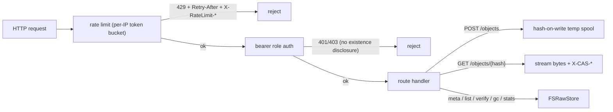

# api — HTTP-exposure pattern: a store server over `cas`

**What it demonstrates.** How an app author exposes a `cas` store to other
processes over HTTP: a versioned prefix (`/api/cas/v1`), bearer-token roles,
per-IP rate limiting, streaming upload/download, dedup, JSON errors, and an
OpenAPI self-doc. go-cask the **product** ships no network JSON API and no
SDK (backend-architecture §1) — this example is the pattern to copy when
*your* app needs a network surface. Everything here uses only the public
`cas` library and std-lib `net/http`; there is no SDK and no `internal/`
(examples §2 rule 4).
Acceptance: the demo round-trips a file (identical bytes); a viewer-role
token gets 403 on `DELETE`; large payloads stream without buffering; the
OpenAPI document is served and matches the routes.

## `cas` core parts used

| Component | Where |
| --------- | ----- |
| `FSRawStore` (`Put`/`Get`/`Exists`/`Delete`/`List`/`GC`/`Stats`) | all routes |
| `Hash` / `ParseHash` | `{hash}` validation (→ 400), addresses |
| `RegisterHash` built-ins (sha256/sha1) | `hash.go` — `newHasher` |
| `StoreStats` | `/stats` |

## What it extends

- **The HTTP surface** — routes, bearer-token role middleware (401/403
  without existence disclosure), and a std-lib per-IP token-bucket rate
  limiter (`ratelimit.go`: 429 + `Retry-After` + `X-RateLimit-*`, loopback
  exempt, trusted-proxy `X-Forwarded-For` only, lazy per-IP expiry + size
  guard).
- **Hash-on-write streaming upload** — the request body is Tee'd into a temp
  spool while hashing (`io.MultiWriter`), so large uploads never buffer in
  memory.
- **Dedup at the byte layer** — `Exists` before `Put`: identical bytes ⇒
  identical hash ⇒ stored once, reported as `deduplicated`.
- **`envelopeType`** — best-effort type sniffing from the self-describing
  envelope for `/meta`.
- **`cas` is untouched**; the server holds the raw store directly (typed
  serialization is an app-layer concern).

## Relationship to the product

The go-cask product ships no HTTP data API and no SDK; this example is the
**pattern** for apps that need one (backend-architecture §1, §5). Use the
library in-process by default; copy this server only when another process
must reach the store, and treat the server as your app's own (auth, TLS, and
deployment are app concerns).

## Code walkthrough

- `server/server.go` — the `server` type + `Handler()`: routes wrapped by
  `requireRole` (auth) and the whole mux by `rateLimit`. Each handler maps
  one operation: `postObject` (store, dedup, streaming), `listObjects`,
  `getObject` (streams bytes + `X-CAS-*` headers), `deleteObject`,
  `objectMeta`, `verifyObject`, `gc`, `stats`, `openapi`. A `sizes` map
  (maintained at Put, pruned on delete/GC) supplies per-object sizes for
  list/meta/headers.
- `server/ratelimit.go` — `rateLimiter`: per-IP token buckets with lazy
  refill, idle expiry and a max-entries guard.
- `server/hash.go` — `newHasher`/`hashBytes` (sha256/sha1), `spoolAndHash`,
  `envelopeType`.
- `server/openapi.yaml` — the surface's OpenAPI document as a separate file,
  embedded via `//go:embed` and served at `/api/cas/v1/openapi.yaml`
  (api-design §13: OpenAPI never lives in an inline Go string).
- `server/main.go` — flags (`-store`, `-bind`, `-tokens`, rate-limit
  knobs), graceful shutdown.
- `demo/main.go` — a plain `net/http` client (no SDK): PUTs a file, GETs it
  back, prints meta and stats.
- `server_test.go` — raw-HTTP tests against the server: round-trip + dedup,
  4 MiB streaming, role matrix, 429 burst, meta/verify/list/stats, gc,
  openapi, 400 malformed hash.



## How to run

```text
# terminal 1 — server (tokens: viewer=viewer, operator=operator, admin=admin)
go run ./examples/api/server -store ./objects -bind 127.0.0.1:8080

# terminal 2 — demo round-trip over plain HTTP
go run ./examples/api/demo -api http://127.0.0.1:8080 -token operator -file ./README.md

# explore
curl -H "Authorization: Bearer operator" http://127.0.0.1:8080/api/cas/v1/stats
curl -H "Authorization: Bearer viewer" http://127.0.0.1:8080/api/cas/v1/openapi.yaml

go test ./examples/api/...
```

The demo prints `stored <hash> deduplicated=…`, `fetched N bytes`, meta and
stats lines.
