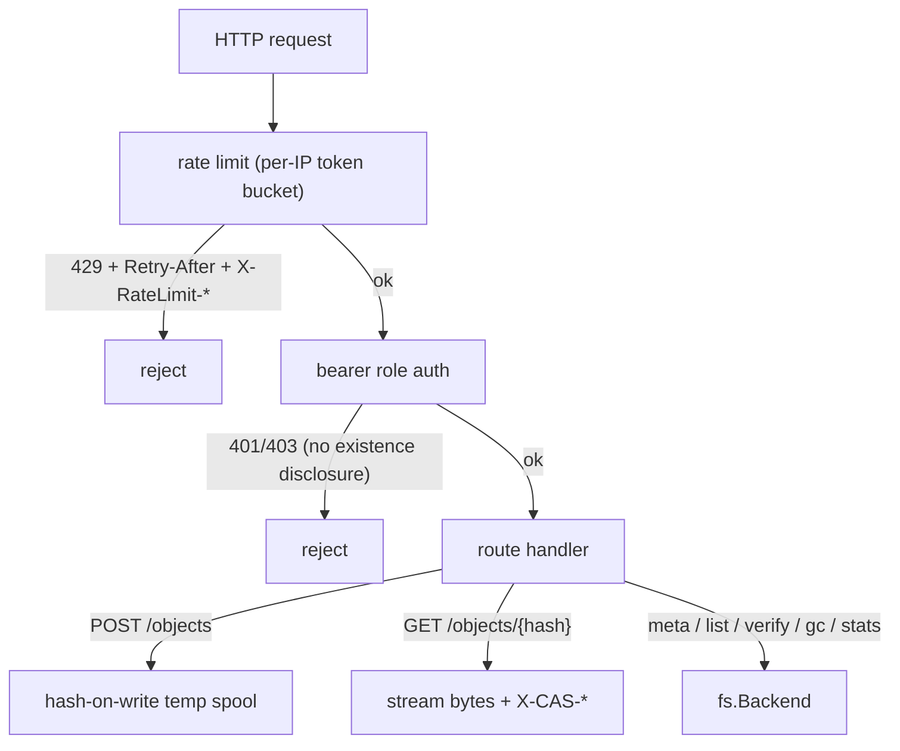

# api — HTTP-exposure pattern: a store server over `cas`

**What it demonstrates.** How an app author exposes a `cas` store over HTTP: a versioned prefix (`/api/cas/v1`), bearer-token roles, per-IP rate limiting, streaming upload/download, dedup, JSON errors, and OpenAPI self-doc. The go-cask **product** ships no network JSON API or SDK (backend-architecture §1); this is the pattern to copy when *your* app needs a network surface. Everything uses only the public `cas` library + std-lib `net/http` — no SDK, no `internal/` (examples §2 rule 4). Acceptance: the demo round-trips a file (identical bytes); a viewer-role token gets 403 on `DELETE`; large payloads stream unbuffered; the OpenAPI document is served and matches the routes.

## `cas` core parts used

| Component | Where |
|---|---|
| `fs.Backend` (`Put`/`Get`/`Exists`/`Delete`/`List`/`GC`/`Stats`) | all routes |
| `cas.Digest` / `sha256.Parse` | `{hash}` validation (→ 400), addresses |
| `sha256.NewHasher()` / `sha256.Name` (client-side; no registry) | `hash.go` — hash-on-write streaming, and the `"algorithm"` constant |
| `cas.Stats` | `/stats` (`object_count`, `total_size`, plus the constant `algorithm`) |

## What it extends

- **The HTTP surface** — routes, bearer-token role middleware (401/403 without existence disclosure), and a std-lib per-IP token-bucket rate limiter (`ratelimit.go`: 429 + `Retry-After` + `X-RateLimit-*`, loopback exempt, trusted-proxy `X-Forwarded-For` only, lazy per-IP expiry + size guard).
- **Hash-on-write streaming upload** — the request body is Tee'd into a temp spool while hashing (`io.MultiWriter`), so large uploads never buffer in memory.
- **Dedup at the byte layer** — `Exists` before `Put`: identical bytes ⇒ identical digest ⇒ stored once, reported as `deduplicated`.
- **A single-format surface** — there is no `algo` parameter. The store keys raw hex digests (the core names no algorithm), so list/meta/stats responses report `"algorithm": "sha256"` as the client's constant, and `GET /objects/{hash}` returns `X-CAS-Algorithm: sha256`.
- **`envelopeType`** — best-effort type sniffing from the self-describing envelope for `/meta`.
- **`cas` is untouched**; the server holds the store directly (typed serialization is an app-layer concern).

## Relationship to the product

The product ships no HTTP data API or SDK; this is the **pattern** for apps that need one (backend-architecture §1, §5). Use the library in-process by default; copy this server only when another process must reach the store, and treat it as your app's own (auth, TLS, deployment are app concerns).

## Code walkthrough

- `server/server.go` — the `server` type + `Handler()`: routes wrapped by `requireRole` (auth) and the whole mux by `rateLimit`. Handlers map one operation each: `postObject` (store, dedup, streaming), `listObjects`, `getObject` (streams bytes + `X-CAS-*` headers), `deleteObject`, `objectMeta`, `verifyObject`, `gc`, `stats`, `openapi`. A `sizes` map (maintained at Put, pruned on delete/GC) supplies per-object sizes for list/meta/headers.
- `server/ratelimit.go` — `rateLimiter`: per-IP token buckets with lazy refill, idle expiry, and a max-entries guard.
- `server/hash.go` — `spoolAndHash` (hash-on-write through `sha256.NewHasher()` + `io.MultiWriter`) and `envelopeType` (best-effort TLV header sniffing).
- `server/openapi.yaml` — the surface's OpenAPI document as a separate file, `//go:embed`-ed and served at `/api/cas/v1/openapi.yaml` (api-design §13: never an inline Go string).
- `server/main.go` — flags (`-store`, `-bind`, `-tokens`, rate-limit knobs), graceful shutdown.
- `demo/main.go` — a plain `net/http` client (no SDK): PUTs a file, GETs it back, prints meta and stats.
- `server_test.go` — raw-HTTP tests: round-trip + dedup, 4 MiB streaming, role matrix, 429 burst, meta/verify/list/stats, gc, openapi, 400 malformed hash.



## How to run

```text
# terminal 1 — server (tokens: viewer=viewer, operator=operator, admin=admin)
go run ./examples/api/server -store ./objects -bind 127.0.0.1:8080

# terminal 2 — demo round-trip over plain HTTP
go run ./examples/api/demo -api http://127.0.0.1:8080 -token operator -file ./README.md

# explore
curl -H "Authorization: Bearer operator" http://127.0.0.1:8080/api/cas/v1/stats
curl -H "Authorization: Bearer viewer" http://127.0.0.1:8080/api/cas/v1/openapi.yaml

go test ./examples/api/...
```

The demo prints `stored <hex digest> deduplicated=…`, `fetched N bytes`, and meta/stats lines.
