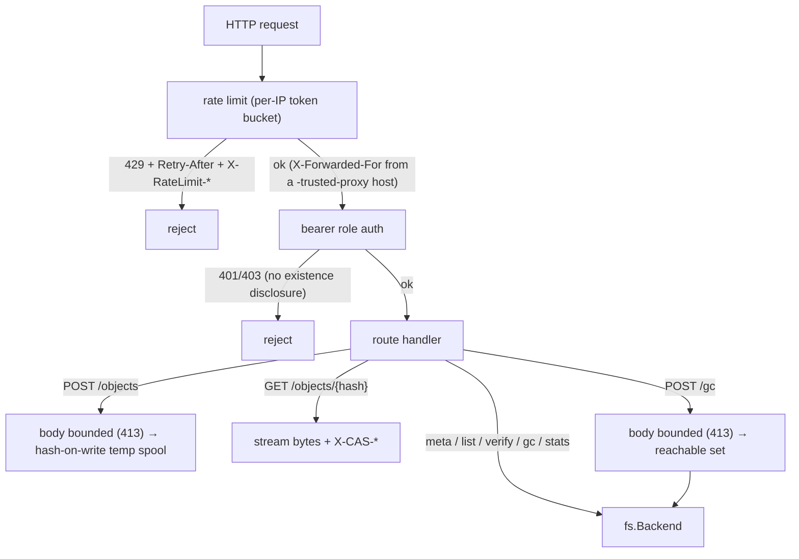

# api — HTTP-exposure pattern: a store server over `cas`

**What it demonstrates.** A `cas` store exposed over HTTP: versioned prefix `/api/cas/v1`,
bearer-token roles, per-IP rate limiting, bounded request bodies, streaming upload/download,
dedup, JSON errors, OpenAPI self-doc. Public `cas` library + std-lib `net/http` only — no SDK,
no `internal/` (examples §2 rule 4). Acceptance: round-trip returns identical bytes; a
viewer-role token gets 403 on `DELETE`; large payloads stream unbuffered; an oversized body is
`413`; the OpenAPI document is served and matches the routes.

## `cas` core parts used

| Component | Where |
|---|---|
| `fs.Backend` (`Put`/`Get`/`Exists`/`Delete`/`List`/`GC`/`Stats`) | all routes |
| `cas.Digest` / `sha256.Parse` | `{hash}` validation (→ 400), addresses |
| `sha256.NewHasher()` / `sha256.Name` (client-side; no registry) | `hash.go` — hash-on-write streaming, and the `"algorithm"` constant |
| `cas.Stats` | `/stats` (`object_count`, `total_size`, plus the constant `algorithm`) |

## What it extends

- **HTTP surface** — routes, bearer-token role middleware (401/403, no existence disclosure),
  std-lib per-IP token-bucket limiter (`ratelimit.go`: 429 + `Retry-After` + `X-RateLimit-*`,
  loopback exempt, `X-Forwarded-For` honoured for a `-trusted-proxy` host only, lazy per-IP
  expiry + size guard).
- **Bounded bodies** — `http.MaxBytesReader` in front of every request body: an upload over
  `-max-size` (default 64 MiB) and a `/gc` reachable set over 8 MiB are refused with `413`
  before they are read, so an oversized body is never spooled, stored or decoded.
- **Connection lifetimes** — `ReadHeaderTimeout` 10 s, `ReadTimeout` 60 s, `WriteTimeout` 5 min,
  `IdleTimeout` 2 min: a trickled body or a stalled reader cannot hold a goroutine open.
- **No shipped credential** — `-tokens` has no default; the server refuses to start without it
  and no role name is ever an accepted token. Each token maps to one role (`viewer`, `operator`,
  `admin`).
- **Hash-on-write upload** — body Tee'd into a temp spool while hashing (`io.MultiWriter`); no
  in-memory buffering.
- **Dedup** — `Exists` before `Put`: identical bytes ⇒ identical digest ⇒ stored once,
  reported as `deduplicated`.
- **Single format** — no `algo` parameter: the store keys raw hex digests (the core names no
  algorithm), so list/meta/stats report `"algorithm": "sha256"` as the client's constant and
  `GET /objects/{hash}` returns `X-CAS-Algorithm: sha256`.
- **`envelopeType`** — best-effort type sniffing from the self-describing envelope for
  `/meta`.
- **`cas` untouched**; the server holds the store directly (typed serialization is app-layer).

## Relationship to the product

No HTTP data API or SDK ships (backend-architecture §1, §5): use the library in-process by
default, copy this server only when another process must reach the store, and treat it as your
app's own (auth, TLS, deployment are app concerns).

## Code walkthrough

- `server/server.go` — `server` + `Handler()`: routes wrapped by `requireRole` (auth), the mux
  by `rateLimit`. One handler per operation: `postObject` (store, dedup, streaming),
  `listObjects`, `getObject` (streams bytes + `X-CAS-*` headers), `deleteObject`, `objectMeta`,
  `verifyObject`, `gc`, `stats`, `openapi`. Both body-consuming handlers (`postObject`, `gc`)
  wrap `r.Body` in `http.MaxBytesReader` first and answer `413` on the bound. Per-object sizes
  come from the backend's own metadata (`backend.Size`), never a process-local map.
- `server/ratelimit.go` — `rateLimiter`: per-IP token buckets, lazy refill, idle expiry,
  max-entries guard; `server.go`'s `callerIP` keys them, using `X-Forwarded-For` only when the
  peer is a `-trusted-proxy` host.
- `server/hash.go` — `spoolAndHash` (hash-on-write via `sha256.NewHasher()` +
  `io.MultiWriter`), `envelopeType` (best-effort TLV header sniffing).
- `server/openapi.yaml` — the OpenAPI document, `//go:embed`-ed, served at
  `/api/cas/v1/openapi.yaml` (api-design §13: never an inline Go string).
- `server/main.go` — flags (`-store`, `-bind`, `-tokens` (required), `-trusted-proxy`
  (repeatable), `-max-size`, rate-limit knobs), connection timeouts, graceful shutdown.
- `demo/main.go` — plain `net/http` client (no SDK): PUTs a file, streams the download back
  (counted, never buffered), prints meta and stats; `-token` is required.
- `server_test.go` — raw-HTTP tests: round-trip + dedup, 4 MiB streaming, role matrix, 429
  burst, meta/verify/list/stats, gc, openapi, 400 malformed hash.
- `server/hardening_test.go` — the body bounds (413 + nothing stored + no spool left), the
  connection timeouts, `-tokens` refusal, per-caller limiting behind a `-trusted-proxy`.


```mermaid
flowchart TB
    REQ["HTTP request"] --> IP["rate limit (per-IP token bucket)"]
    IP -->|"429 + Retry-After + X-RateLimit-*"| R1["reject"]
    IP -->|"ok (X-Forwarded-For from a -trusted-proxy host)"| AUTH["bearer role auth"]
    AUTH -->|"401/403 (no existence disclosure)"| R2["reject"]
    AUTH -->|"ok"| RT["route handler"]
    RT -->|"POST /objects"| SP["body bounded (413) → hash-on-write temp spool"]
    RT -->|"GET /objects/{hash}"| ST["stream bytes + X-CAS-*"]
    RT -->|"meta / list / verify / gc / stats"| FS["fs.Backend"]
    RT -->|"POST /gc"| GC["body bounded (413) → reachable set"]
    GC --> FS
```

## How to run

```text
# terminal 1 — server: -tokens is required, one role=token pair per role.
# Tokens are yours to choose; do not reuse the role names.
go run ./examples/api/server -store ./objects -bind 127.0.0.1:8080 \
    -tokens "viewer=v_tok,operator=o_tok,admin=a_tok"

# terminal 2 — demo round-trip over plain HTTP (-token is required)
go run ./examples/api/demo -api http://127.0.0.1:8080 -token o_tok -file ./README.md

# explore
curl -H "Authorization: Bearer v_tok" http://127.0.0.1:8080/api/cas/v1/stats
curl -H "Authorization: Bearer v_tok" http://127.0.0.1:8080/api/cas/v1/openapi.yaml

# behind a reverse proxy: name it so per-IP limiting sees the real caller
go run ./examples/api/server -store ./objects -tokens "operator=o_tok,admin=a_tok" \
    -trusted-proxy 10.0.0.1

go test ./examples/api/...
```

Limits: an upload over `-max-size` (default 64 MiB) and a `/gc` body over 8 MiB answer `413`
before they are read; connection lifetimes are 60 s read / 5 min write / 2 min idle. Prints
`stored <hex digest> deduplicated=…`, `fetched N bytes`, and meta/stats lines.
