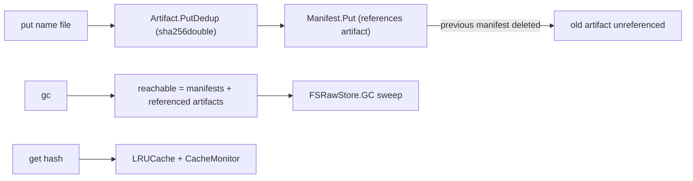

# artifacts — content-addressed build artifact cache

**What it demonstrates.** A build-artifact cache that stores outputs under
the hash of their content with a custom gzip codec, a custom registered hash
algorithm, bounded LRU caching with a monitor, and mark-and-sweep GC from
manifests — exercising the maintenance and caching machinery of the core
(examples spec §3.2). Acceptance: same bytes → same hash →
`deduplicated: true`; the second `get` hits the cache; `gc` deletes only
unreferenced artifacts.

## Cas core parts used

| Component | Where |
| --------- | ----- |
| `Codec[T]` / `JSONCodec[T]` | wrapped by the custom `gzipCodec` |
| `RegisterHash` + `NewHash` | the custom `sha256double` algorithm |
| `Store[T]` / `PutDedup` | artifact + manifest storage, dedup reporting |
| `Object[T]` (self-describing envelope) | `Artifact`, `Manifest` |
| `LRUCache[T]` | the bounded artifact cache (`get`) |
| periodic cache snapshots (own `CacheMonitor` recipe) | emits `CacheStats` |
| `FSRawStore.GC` / `Stats` | mark-and-sweep / store totals |
| `Hash` / `ParseHash` | manifest references and `get` args |

## What it extends

- **`gzipCodec[T]`** — wraps `JSONCodec[T]` with gzip (deterministic output:
  the gzip header mtime is pinned, so identical values encode to identical
  bytes → identical hashes, preserving dedup).
- **`RegisterHash("sha256double", …)`** — a std-lib-only custom algorithm
  (sha256 of sha256). Note: the name obeys the hash-string validation
  pattern (lowercase alnum, defaults §2) — the illustrative
  `sha256-double` from the spec is not a valid algorithm name.
- **`Artifact` / `Manifest`** — the example's own `Object[T]` types, with a
  copied envelope implementation (`envelope.go`).
- **`cas` and `gitlike` are untouched.**

## Code walkthrough

- `hasher.go` — registers `sha256double` at init.
- `codec.go` — `gzipCodec[T]`: `Encode` = gzip(JSON), `Decode` = gunzip + JSON.
- `envelope.go` — the self-describing envelope `{type, data(base64)}`.
- `manifest.go` — `Artifact` (leaf) and `Manifest` (references artifact
  hashes; custom JSON for the hash slices). Both serialize via the gzip codec.
- `main.go` — the CLI:
  - `put <name> <file>` — `PutDedup` the artifact, then **replace the name's
    manifest** (delete the previous one), so the replaced artifact becomes
    garbage;
  - `get <hash>` — through the `LRUCache`, with a `CacheMonitor` printing
    snapshots;
  - `gc` — reachable = all manifests + referenced artifacts → `FSRawStore.GC`;
  - `stats` / `monitor`.



## How to run

```text
go run ./examples/artifacts -store ./objects put app v1.bin
go run ./examples/artifacts -store ./objects put app v2.bin   # v1 becomes garbage
go run ./examples/artifacts -store ./objects gc               # deletes v1
go run ./examples/artifacts -store ./objects stats
go test ./examples/artifacts/...
```

`put` prints `sha256double:… deduplicated: true/false`; `gc` prints the
number of deleted objects.
