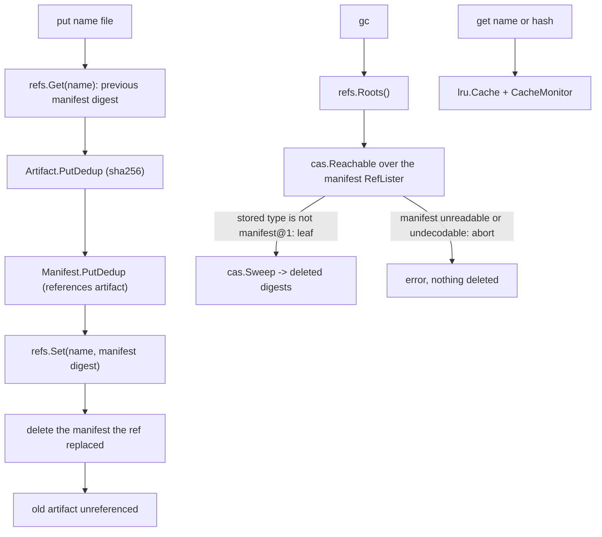

# artifacts — content-addressable build artifact cache

**What it demonstrates.** A build-artifact cache storing outputs under their content digest with the shipped gzip codec wrapper, bounded LRU caching with a monitor, named manifest refs, and mark-and-sweep GC from those refs — exercising the core's maintenance, pointer and caching machinery (examples spec §3.2). Acceptance: same bytes → same digest → `deduplicated: true`; the second `get` hits the cache; `gc` deletes only unreferenced artifacts; a manifest that cannot be decoded aborts `gc` without deleting the artifacts it references; the count `gc` prints is the sweep's own.

## Store layout

`-store` is the **example root**, and it owns two independent trees:

```text
<root>/
  objects/          the fs.Backend base — every artifact and manifest object
  refs/             one pointer file per manifest name, plus its reflog
    app             the current manifest digest of target "app" (bare lowercase hex)
    .log/app        the ref's append-only reflog
```

Refs MUST live outside the objects base (cas-core §4.4: one base belongs to exactly one store). `cas/refs` writes `<name>.tmp` temp files next to each ref, and `fs.Backend.Clean` reclaims every `*.tmp` file beneath its base — refs written inside `objects/` would lose their in-flight temp files to a cleanup. In the other direction, `List`/`Stats` report any digest-named file beneath the base, so a ref file that happened to look like a digest would be counted as an object and swept as garbage. Keeping `objects/` and `refs/` siblings makes both trees unambiguous.

## `cas` core parts used

| Component | Where |
|---|---|
| `Codec[T]` — the JSON codec (`json.New[T]()`) | wrapped by `cas/codec/gzip` (`gzipcodec.New(jsoncodec.New[T]())`) |
| `cas.Digest` + `sha256.New()` (the injected `cas.Hasher`) | artifact + manifest stores, `get`/`monitor` args |
| `Store[T]` / `PutDedup` | artifact + manifest storage, dedup reporting |
| `Object[T]` (self-describing envelope) | `Artifact`, `Manifest` |
| `cas/refs` (`Open`/`Get`/`Set`/`Roots`) | `put` moves the name's pointer; `gc` reads its roots; `get <name>` resolves one |
| `cas.Reachable` + `cas.RefListerFunc` | expands the ref roots through the manifest store |
| `cas.Sweep` | deletes the unreachable objects and reports the digests it removed |
| `Store.Type` (`PeekType`) | decides "leaf vs manifest" from the stored type without decoding |
| `lru.Cache[T]` | the bounded artifact cache (`get`) |
| periodic cache snapshots (own `CacheMonitor` recipe) | emits `CacheStats` |
| `fs.Backend.Stats` | store totals (`stats`) |
| `sha256.Parse` | manifest references and CLI digest args |

## What it extends

- **`cas/codec/gzip`** — the codec-composition seam is the call site (`gzipcodec.New(jsoncodec.New[T]())`, cas-core §7.2, §4.6), not a bespoke wrapper: the shipped wrapper names itself (`gzip+json`), so the envelope records the wire format and a codec change reads as `ErrCodecMismatch` instead of a decode failure, and it bounds decompression (`cas/codec/gzip.MaxDecodedBytes`). Output stays deterministic — the same value encodes to the same bytes, hence the same digest (dedup preserved). The hash algorithm is the client's (`sha256.New()` at `cas.New`), injected rather than registered — the core names no algorithm and has no registry (cas-core §4.2).
- **`Artifact` / `Manifest`** — the example's own `Object[T]` types (`Manifest.Artifacts` is a `[]cas.Digest`), serialized via the gzip codec into the core's self-describing TLV envelope.
- **Named refs (`cas/refs`)** — the example used to find a manifest by listing and decoding *every* object in the store. Names are now pointers in the core's refs store: `put` reads the name's previous digest and moves the ref, `get <name>` follows it, and `gc` roots its mark phase at `refs.Roots()`. The refs store also keeps each name's reflog (`refs.Log`/`Previous`), so the previous manifest of a target is recoverable, not just garbage.
- **The GC contract (`cas.Reachable` + `cas.Sweep`)** — the reachable set is expanded by the core walk from the ref roots and deleted by the core sweep, which returns the digests actually removed. The example's own contribution is the resolve policy: a stored type that is not `manifest@1` is a leaf (an artifact), and anything else — an unreadable header, an undecodable `manifest@1`, a missing digest — aborts before the sweep starts. A manifest that exists but cannot be decoded still references its artifacts, so guessing "not a manifest" would delete them.
- **`cas` and `gitlike` are untouched.**

## Code walkthrough

- `main.go` — the `Object[T]` types `Artifact` (leaf) and `Manifest` (references artifact digests as `[]cas.Digest`, which render as one lowercase-hex string each and validate on decode, with no JSON code here), serialized via the shipped gzip codec into the core TLV envelope (`Store.Put`); plus the CLI:
  - `newApp <root>` — `fs.New(<root>/objects)` for the objects base, `refs.Open(<root>/refs)` for the name pointers; the layout rationale above lives in its doc comment;
  - `put <name> <file>` — reads the name's ref first (one small file, no store-wide scan), `PutDedup`s the artifact and the manifest, `refs.Set(name, manifestDigest)`, then deletes the manifest it replaced — so the artifact that manifest referenced becomes garbage;
  - `get <name|hash>` — a stored ref name is read through the refs store and names the manifest whose single artifact is served; anything else must be a digest. Both go through the `lru.Cache`, with `CacheMonitor` printing snapshots;
  - `gc` — `refs.Roots()` → `cas.Reachable` over a `cas.RefListerFunc` (`manifests.Type` says leaf or manifest; a manifest is decoded, and any failure aborts) → `cas.Sweep`, whose deleted-digest count is printed;
  - `stats` / `monitor`.



## How to run

```text
go run ./examples/artifacts -store ./store put app v1.bin
go run ./examples/artifacts -store ./store get app        # v1 through the ref
go run ./examples/artifacts -store ./store put app v2.bin # v1 becomes garbage
go run ./examples/artifacts -store ./store gc             # deletes v1
go run ./examples/artifacts -store ./store stats
go test ./examples/artifacts/...
```

`put` prints the artifact digest in bare hex (`cas.Digest.String`, e.g. `9f86d081…`) plus `deduplicated: true/false`; `gc` prints the number of objects it deleted (`gc: deleted <n> unreachable objects`), and exits 1 with `error: …` — deleting nothing — if a manifest cannot be read.
