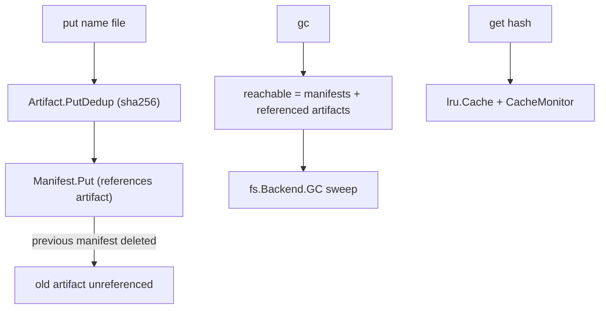

# artifacts — content-addressable build artifact cache

**What it demonstrates.** A build-artifact cache storing outputs under their content digest with a custom gzip codec, bounded LRU caching with a monitor, and mark-and-sweep GC from manifests — exercising the core's maintenance and caching machinery (examples spec §3.2). Acceptance: same bytes → same digest → `deduplicated: true`; the second `get` hits the cache; `gc` deletes only unreferenced artifacts.

## `cas` core parts used

| Component | Where |
|---|---|
| `Codec[T]` — the JSON codec (`json.New[T]()`) | wrapped by the custom `gzipCodec` |
| `cas.Digest` + `sha256.New()` (the injected `cas.Hasher`) | artifact + manifest stores, `get`/`monitor` args |
| `Store[T]` / `PutDedup` | artifact + manifest storage, dedup reporting |
| `Object[T]` (self-describing envelope) | `Artifact`, `Manifest` |
| `lru.Cache[T]` | the bounded artifact cache (`get`) |
| periodic cache snapshots (own `CacheMonitor` recipe) | emits `CacheStats` |
| `fs.Backend.GC` / `Stats` | mark-and-sweep / store totals |
| `sha256.Parse` | manifest references and CLI digest args |

## What it extends

- **`gzipCodec[T]`** — wraps the JSON codec (`json.New[T]()`) with gzip. Deterministic output: the gzip header mtime is pinned, so identical values → identical bytes → identical digests (dedup preserved). This is the example's one custom seam; the hash algorithm is the client's (`sha256.New()` at `cas.New`), injected rather than registered — the core names no algorithm and has no registry (cas-core §4.2).
- **`Artifact` / `Manifest`** — the example's own `Object[T]` types (`Manifest.Artifacts` is a `[]cas.Digest`), serialized via the gzip codec into the core's self-describing TLV envelope.
- **`cas` and `gitlike` are untouched.**

## Code walkthrough

- `codec.go` — `gzipCodec[T]`: `Marshal` = gzip of the inner JSON codec's output; `Unmarshal` = gunzip then inner decode (pinned gzip mtime).
- `main.go` — the `Object[T]` types `Artifact` (leaf) and `Manifest` (references artifact digests as `[]cas.Digest`, which render as one lowercase-hex string each and validate on decode, with no JSON code here), serialized via the gzip codec into the core TLV envelope (`Store.Put`); plus the CLI:
  - `put <name> <file>` — `PutDedup` the artifact, then **replace the name's manifest** (delete the previous), so the replaced artifact becomes garbage;
  - `get <hash>` — through the `lru.Cache`, `CacheMonitor` printing snapshots;
  - `gc` — reachable = all manifests + referenced artifacts → `fs.Backend.GC`;
  - `stats` / `monitor`.



## How to run

```text
go run ./examples/artifacts -store ./objects put app v1.bin
go run ./examples/artifacts -store ./objects put app v2.bin   # v1 becomes garbage
go run ./examples/artifacts -store ./objects gc               # deletes v1
go run ./examples/artifacts -store ./objects stats
go test ./examples/artifacts/...
```

`put` prints the artifact digest in bare hex (`cas.Digest.String`, e.g. `9f86d081…`) plus `deduplicated: true/false`; `gc` prints the number of deleted objects.
