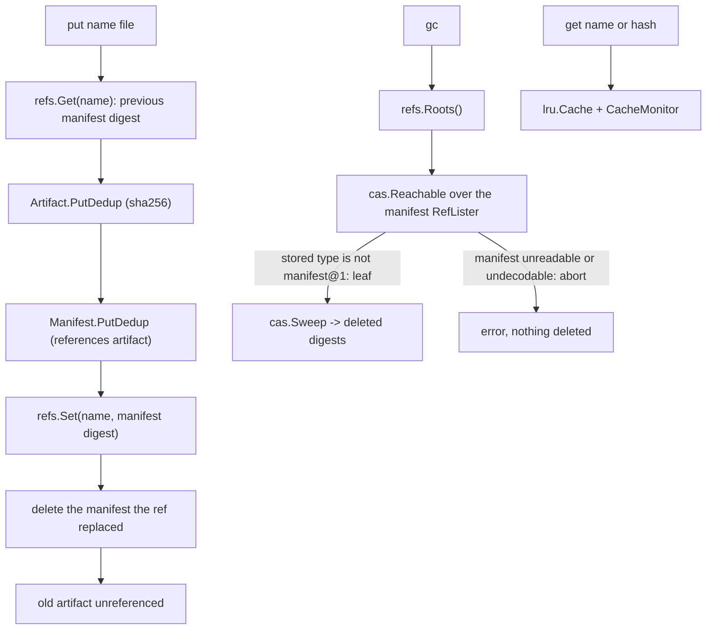

# artifacts — content-addressable build artifact cache

**What it demonstrates.** A build-artifact cache storing outputs under their content digest
with the shipped gzip codec wrapper, bounded LRU caching with a monitor, named manifest refs,
and mark-and-sweep GC from those refs — the core's maintenance, pointer, and caching machinery
(examples spec §3.2). Acceptance: same bytes → same digest → `deduplicated: true`; the second
`get` hits the cache; `gc` deletes only unreferenced artifacts; an undecodable manifest aborts
`gc` without deleting what it references; the count `gc` prints is the sweep's own.

## Store layout

`-store` is the **example root**, owning two independent trees:

```text
<root>/
  objects/          the fs.Backend base — every artifact and manifest object
  refs/             one pointer file per manifest name, plus its reflog
    app             the current manifest digest of target "app" (bare lowercase hex)
    .log/app        the ref's append-only reflog
```

Refs MUST live outside the objects base (cas-core §4.4: one base belongs to exactly one
store). `cas/refs` writes `<name>.tmp` temp files beside each ref and `fs.Backend.Clean`
reclaims every `*.tmp` beneath its base, so a ref inside `objects/` could lose an in-flight
temp file; conversely `List`/`Stats` count any digest-named file beneath the base, so a ref
that looked like a digest would be swept as garbage. Sibling `objects/` and `refs/` trees keep
both unambiguous.

## `cas` core parts used

| Component | Where |
|---|---|
| `Codec[T]` — the JSON codec (`json.New[T]()`) | wrapped by `cas/codec/gzip` (`gzipcodec.New(jsoncodec.New[T]())`) |
| `cas.Digest` + `sha256.New()` (the injected `cas.Hasher`) | artifact + manifest stores, `get`/`monitor` args |
| `Store[T]` / `PutDedup` | artifact + manifest storage, dedup reporting |
| `Object[T]` (self-describing envelope) | `Artifact`, `Manifest` |
| `cas/refs` (`Open`/`Get`/`Set`/`Roots`) | `put` moves the name's pointer; `gc` reads its roots; `get <name>` resolves one |
| `cas.Reachable` + `cas.RefListerFunc` | expands the ref roots through the manifest store |
| `cas.Sweep` | deletes the unreachable objects and reports the digests it removed |
| `Store.Type` (`PeekType`) | decides "leaf vs manifest" from the stored type without decoding |
| `lru.Cache[T]` | the bounded artifact cache (`get`) |
| periodic cache snapshots (own `CacheMonitor` recipe) | emits `CacheStats` |
| `fs.Backend.Stats` | store totals (`stats`) |
| `sha256.Parse` | manifest references and CLI digest args |

## What it extends

- **`cas/codec/gzip`** — composition at the call site
  (`gzipcodec.New(jsoncodec.New[T]())`, cas-core §7.2, §4.6), not in a bespoke wrapper: the
  wrapper names itself (`gzip+json`), so a codec change reads as `ErrCodecMismatch` rather than
  a decode failure, and decompression is bounded (`cas/codec/gzip.MaxDecodedBytes`). Output is
  deterministic — same value, same bytes, same digest (dedup preserved). The caller injects
  the hash (`sha256.New()` at `cas.New`); the core names no algorithm and has no registry
  (cas-core §4.2).
- **`Artifact` / `Manifest`** — the example's own `Object[T]` types (`Manifest.Artifacts` is a
  `[]cas.Digest`), serialized by the gzip codec into the core's self-describing TLV envelope.
- **Named refs (`cas/refs`)** — names are pointers in the core's refs store: `put` reads the
  name's previous digest and moves the ref, `get <name>` follows it, `gc` roots its mark phase
  at `refs.Roots()`; each name keeps a reflog (`refs.Log`/`Previous`), so a target's previous
  manifest is recoverable, not just garbage.
- **The GC contract (`cas.Reachable` + `cas.Sweep`)** — the core walk expands the reachable
  set from the ref roots, the core sweep deletes it and returns the digests actually removed.
  The example's own contribution is the resolve policy: a stored type that is not `manifest@1`
  is a leaf (an artifact); anything else — unreadable header, undecodable `manifest@1`, missing
  digest — aborts before the sweep starts, because an undecodable manifest still references its
  artifacts.
- **`cas` and `gitlike` are untouched.**

## Code walkthrough

- `main.go` — the `Object[T]` types `Artifact` (leaf) and `Manifest` (references artifact
  digests as `[]cas.Digest`, one lowercase-hex string each, validated on decode, no JSON here),
  serialized by the shipped gzip codec into the core TLV envelope (`Store.Put`); plus the CLI:
  - `newApp <root>` — `fs.New(<root>/objects)`, `refs.Open(<root>/refs)`; the layout rationale
    above lives in its doc comment;
  - `put <name> <file>` — reads the name's ref first (one small file, no store-wide scan),
    `PutDedup`s the artifact and the manifest, `refs.Set(name, manifestDigest)`, then deletes
    the manifest it replaced, so the artifact that manifest referenced becomes garbage;
  - `get <name|hash>` — a stored ref name resolves through the refs store to the manifest whose
    single artifact is served; anything else must be a digest. Both go through the `lru.Cache`,
    with `CacheMonitor` printing snapshots;
  - `gc` — `refs.Roots()` → `cas.Reachable` over a `cas.RefListerFunc` (`manifests.Type` says
    leaf or manifest; a manifest is decoded, any failure aborts) → `cas.Sweep`, whose
    deleted-digest count is printed;
  - `stats` / `monitor`.


```mermaid
flowchart TB
    P["put name file"] --> RG["refs.Get(name): previous manifest digest"]
    RG --> A["Artifact.PutDedup (sha256)"]
    A --> M["Manifest.PutDedup (references artifact)"]
    M --> RS["refs.Set(name, manifest digest)"]
    RS --> D["delete the manifest the ref replaced"]
    D --> G1["old artifact unreferenced"]
    G["gc"] --> RO["refs.Roots()"]
    RO --> RE["cas.Reachable over the manifest RefLister"]
    RE -->|"stored type is not manifest@1: leaf"| SW["cas.Sweep -> deleted digests"]
    RE -->|"manifest unreadable or undecodable: abort"| X["error, nothing deleted"]
    G2["get name or hash"] --> C["lru.Cache + CacheMonitor"]
```

## How to run

```text
go run ./examples/artifacts -store ./store put app v1.bin
go run ./examples/artifacts -store ./store get app        # v1 through the ref
go run ./examples/artifacts -store ./store put app v2.bin # v1 becomes garbage
go run ./examples/artifacts -store ./store gc             # deletes v1
go run ./examples/artifacts -store ./store stats
go test ./examples/artifacts/...
```

`put` prints the artifact digest in bare hex (`cas.Digest.String`, e.g. `9f86d081…`) plus
`deduplicated: true/false`; `gc` prints the objects it deleted
(`gc: deleted <n> unreachable objects`) and exits 1 with `error: …` — deleting nothing — if a
manifest cannot be read.
