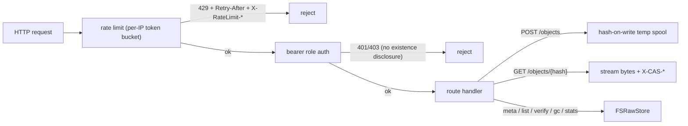

# cas-api — CAS HTTP API server + public client SDK

**What it demonstrates.** A standalone server exposing the CAS HTTP API
(`/api/cas/v1`) per `cas-api.instructions.md` (R-01…R-14), plus the **public
`client/` SDK** that other programs can import — demonstrating the API
contract, streaming, auth, and rate limiting (examples spec §3.4).
Acceptance: `client.Put` → `client.Get` returns identical bytes; a
viewer-role token gets 403 on `DELETE`; large payloads stream without
buffering; `GET /api/cas/v1/openapi.yaml` is served and matches the routes.

## Cas core parts used

| Component | Where |
| --------- | ----- |
| `FSRawStore` (`Put`/`Get`/`Exists`/`Delete`/`List`/`GC`/`Stats`) | all routes |
| `Hash` / `ParseHash` | `{hash}` validation (→ 400), addresses |
| `RegisterHash` built-ins (sha256/sha1) | `hash.go` — `newHasher` |
| `StoreStats` | `/stats` |
| `client` (the public SDK, new) | `demo/` and the server tests |

## What it extends

- **The HTTP surface** — routes, bearer-token role middleware (401/403
  without existence disclosure), and the std-lib token-bucket rate limiter
  (`ratelimit.go`: 429 + `Retry-After` + `X-RateLimit-*`, loopback exempt,
  trusted-proxy `X-Forwarded-For` only, lazy per-IP expiry + size guard).
- **Hash-on-write streaming upload** — the request body is Tee'd into a temp
  spool while hashing (`io.MultiWriter`), so large uploads never buffer in
  memory (R-04).
- **`envelopeType`** — best-effort type sniffing from the self-describing
  envelope for `/meta`.
- **`cas` and `gitlike` are untouched**; the server holds the raw store
  directly (typed serialization is a client-side concern per cas-api §1).

## Code walkthrough

- `server/server.go` — the `server` type + `Handler()`: routes are wrapped
  by `requireRole` (auth) and the whole mux by `rateLimit`. Each handler maps
  one requirement: `postObject` (R-01/R-02/R-04), `listObjects` (R-05),
  `getObject` (R-03/R-04), `deleteObject`, `objectMeta` (R-06),
  `verifyObject` (R-07), `gc` (R-08), `stats` (R-09), `openapi` (R-13).
  A `sizes` map (maintained at Put, pruned on delete/GC) supplies per-object
  sizes for list/meta/headers.
- `server/ratelimit.go` — `rateLimiter`: per-IP token buckets with lazy
  refill, idle expiry and a max-entries guard.
- `server/hash.go` — `newHasher`/`hashBytes` (sha256/sha1), `spoolAndHash`,
  `envelopeType`.
- `server/main.go` — flags (`-store`, `-bind`, `-tokens`, rate-limit
  knobs), graceful shutdown.
- `demo/main.go` — uses the SDK: `Put` a file, `GetBytes` it back, `Meta`,
  `Stats`.
- `server_test.go` — real client ↔ real server: round-trip + dedup, 4 MiB
  streaming, role matrix, 429 burst, meta/verify/list/stats, gc, openapi,
  400 malformed hash.



## How to run

```text
# terminal 1 — server (tokens: viewer=viewer, operator=operator, admin=admin)
go run ./examples/cas-api/server -store ./objects -bind 127.0.0.1:8080

# terminal 2 — demo round-trip via the SDK
go run ./examples/cas-api/demo -api http://127.0.0.1:8080 -token operator -file ./README.md

# explore
curl -H "Authorization: Bearer operator" http://127.0.0.1:8080/api/cas/v1/stats
curl -H "Authorization: Bearer viewer" http://127.0.0.1:8080/api/cas/v1/openapi.yaml

go test ./examples/cas-api/... ./client/...
```

The demo prints `stored <hash> deduplicated=…`, `fetched N bytes`, meta and
stats lines.
