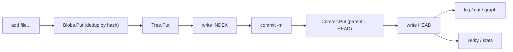

# files — a miniature Git on CASK

**What it demonstrates.** A runnable CLI that stores file trees as
content-addressed objects and commits them, using the `gitlike` example layer
end to end — the closest thing to a tiny Git built on the generic cas core
(examples spec §3.1). Acceptance: `add → commit → log → cat` round-trips,
identical content deduplicates across commits, and `verify` detects
corruption on disk.

## Cas core parts used

| Component | Where |
| --------- | ----- |
| `FSRawStore` (default fan-out 2/1) | `newApp` — the on-disk backend |
| `gitlike.Repository` (per-type `Store[T]` over one `RawStore`) | `app.repo` |
| `gitlike.Blob` / `Tree` / `Commit` — `Object[T]` with `JSONCodec[T]` | `add`, `commit` |
| `Repository.Blobs/Trees/Commits.Put`, `GetTyped` | storing and reading objects |
| `Resolver.ResolveAny` / `WalkGraph` | `cat`, `graph` |
| `FSRawStore.Verify` | `verify` — recompute every hash |
| `FSRawStore.Stats` (`StoreStats`) | `stats` |
| `Hash` / `ParseHash` | ref files (`HEAD`, `INDEX`) and hash args |

## What it extends

Nothing — it is a pure consumer: `cas` and `gitlike` are untouched. The only
app-level additions are the CLI itself and two small ref files (`HEAD` holds
the current commit hash, `INDEX` the current tree hash) stored at the store
root, which the store's `List`/`Stats` ignore.

## Code walkthrough

- `repo.go` — the `app` struct: `newApp` wires `FSRawStore` + `gitlike.Repository` and
  locates the ref files; `readRef`/`writeRef` persist hashes as text;
  `currentTree`/`headCommit` read `INDEX`/`HEAD`.
- `main.go` — the std-`flag` CLI dispatches to:
  - `add <file...>` — reads each file, `repo.Blobs.Put` (dedup by content
    hash), builds a `gitlike.Tree` of entries, `repo.Trees.Put`, writes
    `INDEX`;
  - `commit -m <msg>` — reads `INDEX`, creates a `Commit` (parent = old
    `HEAD`), `repo.Commits.Put`, advances `HEAD`;
  - `log` — walks the `Commit.Parent` chain;
  - `cat <hash>` — `ResolveAny` → prints `Blob.Data`;
  - `graph` — `WalkGraph` from `HEAD`, printing every resolved object;
  - `verify` / `stats` — `FSRawStore.Verify` per object / `Stats`.



## How to run

```text
go run ./examples/files -store ./objects add a.txt b.txt
go run ./examples/files -store ./objects commit -m "initial"
go run ./examples/files -store ./objects log
go run ./examples/files -store ./objects stats
go run ./examples/files -store ./objects verify
go test ./examples/files/...
```

`add` prints the tree hash, `commit` the commit hash, `stats` a
`N objects, N bytes [sha256=N]` summary.
