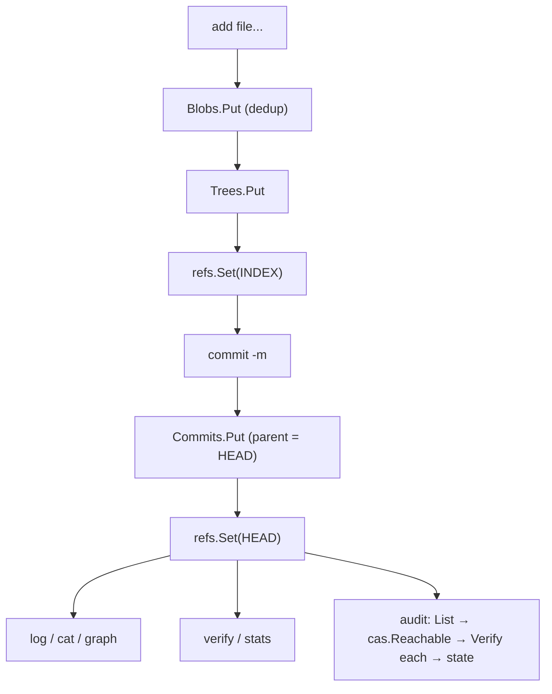

# files — a miniature Git on CASK

**What it demonstrates.** A runnable CLI storing file trees as content-addressable objects and committing them, using the `gitlike` layer end to end (examples spec §3.1). Acceptance: `add → commit → log → cat` round-trips; identical content deduplicates across commits; `verify` detects on-disk corruption; `audit` reports each object's derived state (verified/orphaned/corrupt/unverified) from `HEAD` + `Verify`. `HEAD`/`INDEX` are real refs, so the example also shows `cas/refs`: atomic ref writes, validated names, and a reflog per ref.

## Layout

```text
<root>/            the -store directory (default ./store)
  objects/         the fs.Backend base: every object under its fan-out path
  refs/            the cas/refs.Store: HEAD (current commit), INDEX (current tree)
```

Refs live **beside** the objects base, never inside it, and that separation is a correctness rule rather than a preference:

- `cas/refs` publishes each value through a `<name>.tmp` temp file, and `fs.Backend.Clean` reclaims every `*.tmp` beneath its base — a ref written inside `objects/` could be swept away mid-write;
- `fs.Backend.List`/`Stats` report every digest-named file beneath the base at any depth (cas-core §4.4, one base = one store), so an app must not keep anything else inside a store base.

This is also Git's shape, which the example imitates.

## `cas` core parts used

| Component | Where |
|---|---|
| `fs.Backend` (default fan-out 2/1) | `newApp` — the on-disk backend, rooted at `<root>/objects` |
| `cas/refs.Store` (`Open`, `Get`, `Set`, `Previous`, `Log`) | `<root>/refs` — `HEAD` and `INDEX` |
| `gitlike.Repository` (per-type `Store[T]` over one `cas.Backend`) | `app.repo` |
| `gitlike.Codecs` (the JSON codec per type: `json.New[gitlike.Blob]()` …) | `newApp` |
| `gitlike.Blob`/`Tree`/`Commit` — `Object[T]`; `Commit.Validate` (a commit must name a tree) | `add`, `commit` |
| `Repository.Blobs/Trees/Commits.Put`, `Get` | store/read objects |
| `Resolver.ResolveAny` / `WalkGraph` | `cat`, `graph`, `audit` reachability |
| `cas.NewVerifier(...).Verify` / `cas.Verify` / `cas.VerifyAll` (`cas.Report`) / `List` / `Stats` (`cas.Stats`) | `audit`, `verify`, `stats` |
| `cas.Reachable` + `cas.RefListerFunc` (root-seeded closure from `HEAD`) | `audit.go` |
| `cas.Digest` / `sha256.Parse` / `sha256.Format` | ref contents, digest args, `log` output |
| `sha256.New()` (the client's `cas.Hasher`) | object addresses and every integrity recompute |
| `cas.Validator` (`Commit.Validate`, enforced by `Store.Put`/`Get`) | writing and reading commits |

## What it extends

Nothing — a pure consumer; `cas`, `cas/refs` and `gitlike` are untouched. The only app additions are the CLI and the `-store` root layout it owns. Two things this example used to hand-roll are now core calls:

- **ref files → `cas/refs`.** `HEAD` and `INDEX` go through `refs.Get`/`refs.Set` (temp file + fsync + rename, name validation, and a reflog reachable via `Log`/`Previous`) and hold the bare-hex digest, the refs format. The old private `readRef`/`writeRef` wrote `os.WriteFile` in place and in the printable `sha256:hexdigest` form, so its refs were not interchangeable with `cas/refs`.
- **CRC32 sidecar → `cas.Verify`/`cas.VerifyAll`.** Integrity is the digest recomputed from the object's own bytes; nothing is persisted beside an object. The deleted sidecar had two bugs: it was invisible to `List` yet unreclaimable by `Clean` (so it accumulated in the objects base forever), and a *missing* sidecar made an intact object — one written by `cask put`, an import, or any other tool — report as `corrupt` in `audit`. The example no longer re-derives the backend's private fan-out path either (`objectPath`), so it works under any `fs.WithFanOut`/`fs.WithFanLevels` layout.

## Code walkthrough

- `main.go` — the `app` struct and the argument-parsing CLI. `newApp(root)` wires `fs.New(<root>/objects)` + `gitlike.Repository` over `sha256.New()` and a `gitlike.Codecs` set built from `json.New[*gitlike.…]()` per type, then `refs.Open(<root>/refs)`; `currentTree`/`headCommit` read `INDEX`/`HEAD` through `refs.Get`, `headCommitOrAbsent` maps `refs.ErrNotFound` to the first-commit case while any other ref error stays corruption:
  - `add <file...>` — `repo.Blobs.Put` (dedup by content digest), builds a `gitlike.Tree`, `Trees.Put`, `refs.Set(INDEX, …)`;
  - `commit -m <msg>` — reads `INDEX`, creates a `Commit` (parent = old `HEAD`), `Commits.Put`, `refs.Set(HEAD, …)`;
  - `log` — walks the `Commit.Parent` chain; `cat <hash>` — `ResolveAny` → `Blob.Data`; `graph` — `WalkGraph` from `HEAD`;
  - `verify` — `cas.VerifyAll` (one `cas.Report`: checked count + the bad digests); `stats` — `Stats`;
  - `audit [-no-verify]` — classifies every stored object (below).
- `audit.go` — the derived-state report: `List` → expand the reachable set from `HEAD` with `cas.Reachable` over the gitlike resolver's `References()` → `cas.Verifier.Verify` each (a SHA-256 recompute) → assign a state:

  | State | Meaning |
  |---|---|
  | `verified` | intact and reachable from `HEAD` |
  | `orphaned` | intact but unreachable — a GC candidate (consistency §4) |
  | `corrupt` | `Verify` failed — the recomputed digest or the read itself did not match |
  | `unverified` | reachable but not checked (`-no-verify`) |

  States are **derived, never stored** — the point-in-time result of `Verify` + reachability, not store metadata (consistency §8). `-no-verify` skips integrity for a fast orphan scan.



## How to run

```text
go run ./examples/files -store ./store add a.txt b.txt
go run ./examples/files -store ./store commit -m "initial"
go run ./examples/files -store ./store log
go run ./examples/files -store ./store stats
go run ./examples/files -store ./store audit
go run ./examples/files -store ./store audit -no-verify
go run ./examples/files -store ./store verify
go test ./examples/files/...
```

`-store` names the example **root**: `objects/` (the store base) and `refs/` (`HEAD`, `INDEX`) are created inside it, so `./store/objects/…` and `./store/refs/HEAD` are where the state lands. `add` prints the tree digest and `commit` the commit digest in bare hex (`cas.Digest.String`), `log` prints the printable `sha256:…` form, `stats` a `N objects, M bytes` summary, and `audit` one `state hash` line per object plus a `verified/orphaned/corrupt/unverified` count.

An older example store (objects at the root, `HEAD`/`INDEX` files beside them) is not read in place: move the fan-out directories under `objects/` and the two refs under `refs/`, or start a fresh root.
