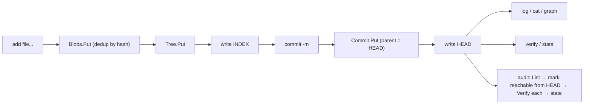

# files — a miniature Git on CASK

**What it demonstrates.** A runnable CLI that stores file trees as
content-addressable objects and commits them, using the `gitlike` example layer
end to end — the closest thing to a tiny Git built on the generic cas core
(examples spec §3.1). Acceptance: `add → commit → log → cat` round-trips,
identical content deduplicates across commits, `verify` detects corruption on
disk, and `audit` reports every object's derived state
(verified / orphaned / corrupt / unverified) from HEAD + `Verify`.

## `cas` core parts used

| Component | Where |
| --------- | ----- |
| `FSRawStore` (default fan-out 2/1) | `newApp` — the on-disk backend |
| `gitlike.Repository` (per-type `Store[T]` over one `RawStore`) | `app.repo` |
| `gitlike.Blob` / `Tree` / `Commit` — `Object[T]` with `JSONCodec[T]` | `add`, `commit` |
| `Repository.Blobs/Trees/Commits.Put`, `Get` | storing and reading objects |
| `Resolver.ResolveAny` / `WalkGraph` | `cat`, `graph`, `audit` reachability |
| `FSRawStore.Verify` | `verify`, `audit` — per-object integrity |
| `FSRawStore.List` | `audit` — enumerate every stored object |
| `FSRawStore.Stats` (`StoreStats`) | `stats` |
| `Hash` / `ParseHash` | ref files (`HEAD`, `INDEX`) and hash args |

## What it extends

Nothing — it is a pure consumer: `cas` and `gitlike` are untouched. The only
app-level additions are the CLI itself and two small ref files (`HEAD` holds
the current commit hash, `INDEX` the current tree hash) stored at the store
root, which the store's `List`/`Stats` ignore.

## Code walkthrough

- `repo.go` — the `app` struct: `newApp` wires `FSRawStore` + `gitlike.Repository` and
  locates the ref files; `readRef`/`writeRef` persist hashes as text;
  `currentTree`/`headCommit` read `INDEX`/`HEAD`.
- `main.go` — the std-`flag` CLI dispatches to:
  - `add <file...>` — reads each file, `repo.Blobs.Put` (dedup by content
    hash), builds a `gitlike.Tree` of entries, `repo.Trees.Put`, writes
    `INDEX`;
  - `commit -m <msg>` — reads `INDEX`, creates a `Commit` (parent = old
    `HEAD`), `repo.Commits.Put`, advances `HEAD`;
  - `log` — walks the `Commit.Parent` chain;
  - `cat <hash>` — `ResolveAny` → prints `Blob.Data`;
  - `graph` — `WalkGraph` from `HEAD`, printing every resolved object;
  - `audit [-no-verify]` — classifies every stored object (below);
  - `verify` / `stats` — `FSRawStore.Verify` per object / `Stats`.
- `audit.go` — the derived-state report: `audit` lists every object
  (`FSRawStore.List`), marks the reachable set from `HEAD` by following
  `References()` through the gitlike object model (`markReachable`), verifies
  each object (`FSRawStore.Verify`), and assigns one of four states:

  | State | Meaning |
  | ----- | ------- |
  | `verified` | intact (Verify passed) and reachable from `HEAD` |
  | `orphaned` | intact but unreachable — a GC candidate (consistency §4) |
  | `corrupt` | `Verify` failed (bit rot / tampering) — reported even if orphaned |
  | `unverified` | reachable but integrity not checked (`-no-verify`) |

  The states are **derived, never stored** — they are the point-in-time
  result of the existing operations (`Verify` + reachability from roots), not
  metadata the store keeps (consistency §8). `-no-verify` skips the integrity
  pass for a fast orphan scan.



## How to run

```text
go run ./examples/files -store ./objects add a.txt b.txt
go run ./examples/files -store ./objects commit -m "initial"
go run ./examples/files -store ./objects log
go run ./examples/files -store ./objects stats
go run ./examples/files -store ./objects audit
go run ./examples/files -store ./objects audit -no-verify
go run ./examples/files -store ./objects verify
go test ./examples/files/...
```

`add` prints the tree hash, `commit` the commit hash, `stats` a
`N objects, N bytes [sha256=N]` summary, and `audit` one `state hash` line
per object plus a `verified/orphaned/corrupt/unverified` count.
