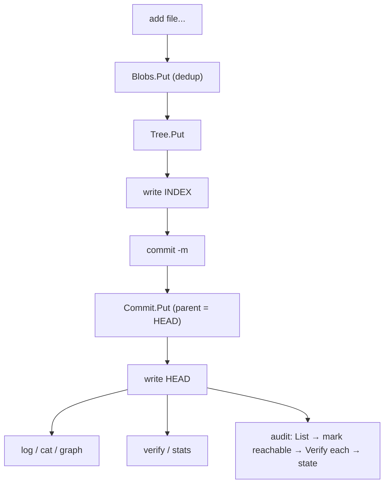

# files — a miniature Git on CASK

**What it demonstrates.** A runnable CLI storing file trees as content-addressable objects and committing them, using the `gitlike` layer end to end (examples spec §3.1). Acceptance: `add → commit → log → cat` round-trips; identical content deduplicates across commits; `verify` detects on-disk corruption; `audit` reports each object's derived state (verified/orphaned/corrupt/unverified) from `HEAD` + `Verify`.

## `cas` core parts used

| Component | Where |
|---|---|
| `fs.Backend` (default fan-out 2/1) | `newApp` — the on-disk backend |
| `gitlike.Repository` (per-type `Store[T]` over one `cas.Backend`) | `app.repo` |
| `gitlike.Blob`/`Tree`/`Commit` — `Object[T]` with the JSON codec (`json.New[T]()`) | `add`, `commit` |
| `Repository.Blobs/Trees/Commits.Put`, `Get` | store/read objects |
| `Resolver.ResolveAny` / `WalkGraph` | `cat`, `graph`, `audit` reachability |
| `fs.Backend.Verify` / `List` / `Stats` (`cas.Stats`) | `verify`, `audit`, `stats` |
| `Hash` / `ParseHash` | ref files (`HEAD`, `INDEX`) and hash args |

## What it extends

Nothing — a pure consumer; `cas` and `gitlike` are untouched. Only app additions: the CLI and two ref files (`HEAD` = current commit, `INDEX` = current tree) at the store root, which the store's `List`/`Stats` ignore.

## Code walkthrough

- `main.go` — the `app` struct (`newApp` wires `fs.Backend` + `gitlike.Repository`; `readRef`/`writeRef` persist hashes; `currentTree`/`headCommit` read `INDEX`/`HEAD`) and the argument-parsing CLI:
  - `add <file...>` — `repo.Blobs.Put` (dedup by content hash), builds a `gitlike.Tree`, `Trees.Put`, writes `INDEX`;
  - `commit -m <msg>` — reads `INDEX`, creates a `Commit` (parent = old `HEAD`), `Commits.Put`, advances `HEAD`;
  - `log` — walks the `Commit.Parent` chain; `cat <hash>` — `ResolveAny` → `Blob.Data`; `graph` — `WalkGraph` from `HEAD`;
  - `audit [-no-verify]` — classifies every stored object (below); `verify`/`stats` — `fs.Backend.Verify` per object / `Stats`.
- `audit.go` — the derived-state report: `List` → mark the reachable set from `HEAD` via `References()` (`markReachable`) → `Verify` each → assign a state:

  | State | Meaning |
  |---|---|
  | `verified` | intact and reachable from `HEAD` |
  | `orphaned` | intact but unreachable — a GC candidate (consistency §4) |
  | `corrupt` | `Verify` failed — reported even if orphaned |
  | `unverified` | reachable but not checked (`-no-verify`) |

  States are **derived, never stored** — the point-in-time result of `Verify` + reachability, not store metadata (consistency §8). `-no-verify` skips integrity for a fast orphan scan.



## How to run

```text
go run ./examples/files -store ./objects add a.txt b.txt
go run ./examples/files -store ./objects commit -m "initial"
go run ./examples/files -store ./objects log
go run ./examples/files -store ./objects stats
go run ./examples/files -store ./objects audit
go run ./examples/files -store ./objects audit -no-verify
go run ./examples/files -store ./objects verify
go test ./examples/files/...
```

`add` prints the tree hash, `commit` the commit hash, `stats` a `N objects, N bytes [sha256=N]` summary, `audit` one `state hash` line per object plus a `verified/orphaned/corrupt/unverified` count.
