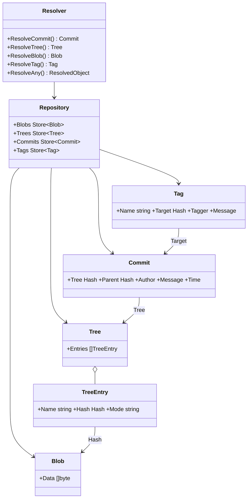

# gitlike — the reference object model example

**What it demonstrates.** The reference library-style example: a Git-like
`Blob`/`Tree`/`Commit`/`Tag` object model layered on the generic cas core
(`examples.instructions.md` §2.1, `cas-core` §4.12). It is an **importable
package** (not a runnable program) that other examples and apps copy as the
pattern for building their own typed layers on `Store[T]`.

## Cas core parts used

| Component | Where |
| --------- | ----- |
| `Store[T]` + `JSONCodec[T]` | the four per-type stores |
| `Object[T]` (versioned `blob@1`…`tag@1`) | `types.go` |
| `Hash` / `ParseHash` | all references (tree entries, commit tree/parent, tag target) |
| `RawStore` | the shared backend under `Repository` |
| `Store.GetTyped` (envelope type verification) | resolver reads |
| `LRUCache[T]` | `CachedRepository` |
| `CachedStore[T].PreloadRecursive` | `Preloader` |

## What it extends

- **Four `Object[T]` types** with the self-describing envelope
  (`types.go`) — including custom JSON methods that render `Hash` values as
  `algo:hex` strings (a `Hash` interface cannot be unmarshaled by
  `encoding/json` directly).
- **`Repository`** — per-type `Store[T]` over one `RawStore` (cross-type
  access without `any`; the wrong store is a compile-time error).
- **`Resolver` / `ResolvedObject` / `parseType` / `ResolveAny`** — typed
  resolution, with `ResolveAny` dispatching on the envelope's type name.
- **`WalkGraph`, `CachedRepository`, `Preloader`** — whole-graph traversal,
  per-type LRU caches, and a background commit preloader.
- **`cas` is untouched** — this package is the canonical *consumer* pattern.

## Code walkthrough

- `types.go` — `Blob` (leaf), `Tree`/`TreeEntry`, `Commit` (tree + optional
  parent), `Tag` (target); `Type()` returns the versioned names, so object
  majors can coexist. The envelope helpers (`marshalEnvelope`,
  `unmarshalEnvelope`, `parseType`) are copied by every app that builds its
  own object model.
- `repo.go` — `Repository` wires the four stores; `Resolver` resolves any
  hash via `parseType` → typed `Resolve*` → `ResolvedObject` union;
  `PrintObject` renders with a type switch (no reflection); `WalkGraph`
  traverses the whole graph.
- `cached.go` — `CachedRepository` (per-type `LRUCache` + convenience
  getters) and `Preloader` (worker pool running `Commits.PreloadRecursive`).
- `gitlike_test.go` — round-trips, references, `ResolveAny` for every type,
  legacy unversioned envelopes, `WalkGraph`, cached repository, preloader.



## How to run

```text
go test ./examples/gitlike/...
```

It is a library; there is no standalone program. Apps import it with
`github.com/dmundt/go-cask/examples/gitlike` and layer their own types the
same way.
