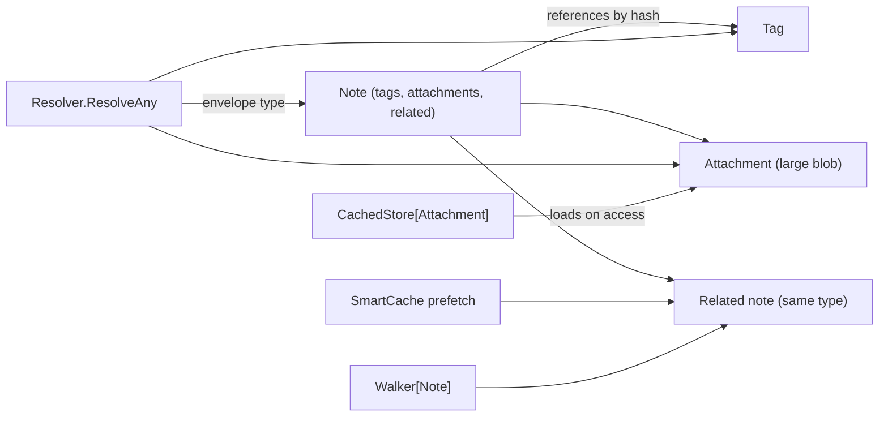

# notes — a document graph with its own object types

**What it demonstrates.** An application with its **own** object model
(`Note`, `Tag`, `Attachment`) built directly on the generic cas core —
proving the "apps build their own repository/resolver" pattern without using
gitlike (examples spec §3.3). It shows cross-type resolution, lazy loading of
large attachments, `SmartCache` prefetch, broken-reference detection, and the
generic `Walker[T]`.

## Cas core parts used

| Component | Where |
| --------- | ----- |
| `Object[T]` (versioned `note@1`/`tag@1`/`attachment@1`) | `types.go` |
| `Store[T]` + `JSONCodec[T]` | the three per-type stores in `Repository` |
| `Store.GetTyped` (envelope type verification) | resolver reads |
| `CachedObject[T]` / `CachedStore[T]` | lazy attachment loading |
| `SmartCache[T]` (`cas/extra`) | prefetch on access |
| `Walker[T]` | same-type related-note traversal |
| `Hash` / `ParseHash` | references and `parseType` |

## What it extends

- **Own object types** — `Note` (references tags, attachments, and related
  notes), `Tag`, `Attachment`; custom JSON methods round-trip `Hash` slices
  as `algo:hex` strings (copied from the gitlike pattern).
- **Own `Repository` / `Resolver` / `ResolvedObject` / `parseType`** — the
  copied pattern from gitlike §4.12, specific to this object set.
- **Own envelope helpers** (`types.go`) — the self-describing envelope is
  implemented by the app, exactly as apps are expected to copy it.
- **`cas` and `gitlike` are untouched.**

## Code walkthrough

- `types.go` — the three `Object[T]` types + envelope/`parseType` helpers.
  `Note.References()` = tags + attachments + related (the single source of
  truth for traversal and prefetch).
- `repo.go` — `Repository` bundles `Store[*Note]`/`*Tag`/`*Attachment`;
  `Resolver.ResolveAny` reads the envelope, dispatches on the type name to
  the matching typed `Resolve*`.
- `main.go` — the demo: creates tags/attachments/notes, resolves a note
  cross-type, shows the attachment is **not** loaded until accessed
  (`CachedObject.IsLoaded`), prefetches a related-only note via `SmartCache`,
  detects a dangling reference by resolving the note's refs, and walks a
  related chain with `Walker[T]`.
- `main_test.go` — cross-type resolution, lazy load, prefetch warms the
  cache, broken ref → `ErrNotFound`, walker chain.



## How to run

```text
go run ./examples/notes
go test ./examples/notes/...
```

The demo prints the resolved note (with its tags), the lazy-load transition
(`attachment loaded before/after access`), the cache size after prefetch,
the detected broken reference, and the walker's visited notes.
