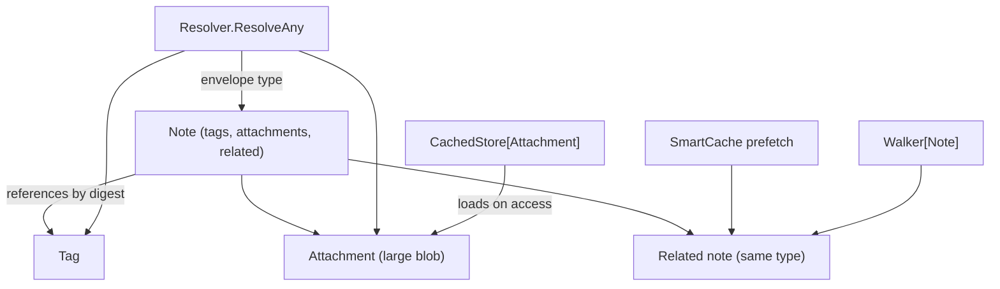

# notes — a document graph with its own object types

**What it demonstrates.** An application with its **own** object model (`Note`, `Tag`, `Attachment`) built directly on the generic cas core and resolved through the supported `cas/repo` registry — proving the "apps build their own object model on the core APIs" pattern without `gitlike` (examples spec §3.3). Shows cross-type resolution, the cross-type reachable set, lazy loading of large attachments, `SmartCache` prefetch, broken-reference detection, and the generic `Walker[T]`.

## `cas` core parts used

| Component | Where |
|---|---|
| `Object[T]` (versioned `note@1`/`tag@1`/`attachment@1`) | `types.go` |
| `Store[T]` + the JSON codec (`json.New[T]()`) | the three per-type stores in `Repository` |
| `cas/repo.Registry` / `RegisterStore` / `Resolve` | cross-type resolution in `repo.go` |
| `cas/repo.Reachable` | the cross-type root set in the demo |
| `CachedObject[T]` / `CachedStore[T]` | lazy attachment loading |
| prefetch-on-access (own `SmartCache` recipe) | warms references via `CachedStore` |
| `Walker[T]` | same-type related-note traversal |
| `cas.Digest` reference fields / `sha256.New()` / `sha256.Of` | references |

## What it extends

- **Own object types** — `Note` (references tags, attachments, and related notes), `Tag`, `Attachment`; reference fields are `[]cas.Digest`, which render as one lowercase-hex string each (and validate as they decode) with no JSON code here, and the example injects `sha256.New()` at `cas.New` (cas-core §4.2/§4.6).
- **Own `Repository` + typed `Resolver` over the core registry** — the app's three stores registered with `cas/repo.RegisterStore`, so `Resolve` discovers the type from the stored envelope and the app's `ResolvedObject` union is built from the result. No header parsing and no dispatch table live in the example: both are core APIs now (cas-core §4.12).
- **`cas` and `gitlike` are untouched.**

## Code walkthrough

- `types.go` — the three `Object[T]` types and `bareType` (versioned name → union name). `Note.References()` = tags + attachments + related (single source of truth for traversal and prefetch).
- `repo.go` — `Repository` bundles `Store[*Note]`/`*Tag`/`*Attachment` (each built with `sha256.New()`) and the `cas/repo.Registry` they are registered with; `Resolver.Resolve` delegates to `registry.Resolve`, and `ResolveAny` maps the resolved object onto the typed union.
- `main.go` — the demo: creates tags/attachments/notes, resolves a note cross-type, expands the cross-type reachable set with `cas/repo.Reachable`, shows the attachment is **not** loaded until accessed (`CachedObject.IsLoaded`), prefetches a related-only note via `SmartCache`, detects a dangling reference, and walks a related chain with `Walker[T]`.
- `main_test.go` — cross-type resolution, lazy load, prefetch warms the cache, broken ref → `ErrNotFound`, walker chain.



## How to run

```text
go run ./examples/notes
go test ./examples/notes/...
```

The demo prints the resolved note (with its tags), the lazy-load transition (`attachment loaded before/after access`), the cache size after prefetch, the detected broken reference, and the walker's visited notes.
