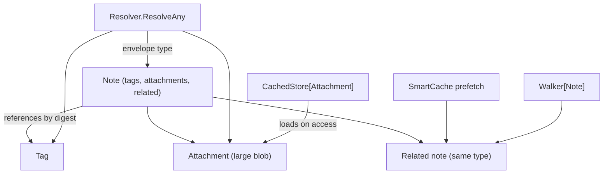

# notes — a document graph with its own object types

**What it demonstrates.** An app with its **own** object model (`Note`, `Tag`, `Attachment`)
on the generic cas core, resolved through the supported `cas/repo` registry — the "own object
model on the core APIs" pattern without `gitlike` (examples spec §3.3). Cross-type resolution,
the cross-type reachable set, lazy attachment loading, `SmartCache` prefetch, broken-reference
detection, `Walker[T]`.

## `cas` core parts used

| Component | Where |
|---|---|
| `Object[T]` (versioned `note@1`/`tag@1`/`attachment@1`) | `types.go` |
| `Store[T]` + the JSON codec (`json.New[T]()`) | the three per-type stores in `Repository` |
| `cas/repo.Registry` / `RegisterStore` / `Resolve` | cross-type resolution in `repo.go` |
| `cas/repo.Reachable` | the cross-type root set in the demo |
| `CachedObject[T]` / `CachedStore[T]` | lazy attachment loading |
| prefetch-on-access (own `SmartCache` recipe) | warms references via `CachedStore` |
| `Walker[T]` | same-type related-note traversal |
| `cas.Digest` reference fields / `sha256.New()` / `sha256.Of` | references |

## What it extends

- **Own types** — `Note` (references tags, attachments, related notes), `Tag`, `Attachment`;
  reference fields are `[]cas.Digest`, one lowercase-hex string each, validated as they decode,
  with no JSON here; `sha256.New()` injected at `cas.New` (cas-core §4.2/§4.6).
- **Own `Repository` + typed `Resolver` over the core registry** — the three stores registered
  with `cas/repo.RegisterStore`, so `Resolve` discovers the type from the stored envelope and
  `ResolveAny` builds the app's `ResolvedObject` union. No header parsing, no dispatch table:
  both are core APIs (cas-core §4.12).
- **`cas` and `gitlike` untouched.**

## Code walkthrough

- `types.go` — the three `Object[T]` types and `bareType` (versioned → union name);
  `Note.References()` = tags + attachments + related (one traversal source).
- `repo.go` — `Repository` bundles `Store[*Note]`/`*Tag`/`*Attachment` (each with
  `sha256.New()`) and their `cas/repo.Registry`; `Resolver.Resolve` delegates to
  `registry.Resolve`, `ResolveAny` maps onto the typed union.
- `main.go` — creates tags/attachments/notes, resolves a note cross-type, expands the
  cross-type reachable set with `cas/repo.Reachable`, shows the attachment is **not** loaded
  until accessed (`CachedObject.IsLoaded`), prefetches a related-only note via `SmartCache`,
  detects a dangling reference, walks a related chain with `Walker[T]`.
- `main_test.go` — cross-type resolution, lazy load, prefetch warms the cache, broken ref →
  `ErrNotFound`, walker chain.


```mermaid
flowchart TB
    N["Note (tags, attachments, related)"] -->|"references by digest"| T["Tag"]
    N --> A["Attachment (large blob)"]
    N --> R["Related note (same type)"]
    Res["Resolver.ResolveAny"] -->|"envelope type"| N
    Res --> T
    Res --> A
    C["CachedStore[Attachment]"] -->|"loads on access"| A
    S["SmartCache prefetch"] --> R
    W["Walker[Note]"] --> R
```

## How to run

```text
go run ./examples/notes
go test ./examples/notes/...
```

Prints the resolved note (with its tags), the lazy-load transition
(`attachment loaded before/after access`), the cache size after prefetch, the broken
reference, and the walker's visited notes.
