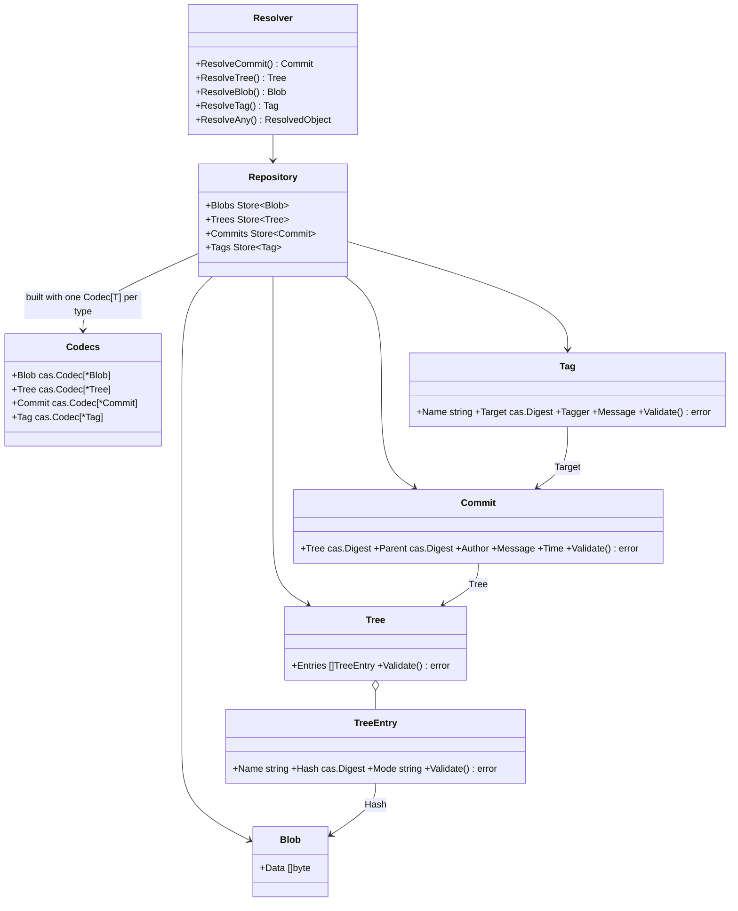

# gitlike — the shared reference object-model library

**Status: reference / copy-source.** Not part of the generic cas core and not part of its stable surface (cas-core §7.1). Importable at github.com/dmundt/go-cask/gitlike for convenience, but it carries **no supported-API guarantee** — if your object model isn't a Git-style content tree, copy this pattern into your own package and extend that copy, never this library.

**What it demonstrates.** The reference library-style example: a Git-like `Blob`/`Tree`/`Commit`/`Tag` object model layered on the generic cas core (`examples.md` §2.1, `cas-core` §4.12). It is an **importable package** (not a runnable program) that other examples and apps copy as the pattern for building their own typed layers on `Store[T]`.

## `cas` core parts used

| Component | Where |
|---|---|
| `Store[T]` + a caller-supplied `Codec[T]` per type | the four per-type stores |
| `Object[T]` (versioned `blob@1`…`tag@1`) | `types.go` |
| `cas.Digest` reference fields (rendered by the type's own `MarshalText`) | all references (tree entries, commit tree/parent, tag target) |
| `cas.Hasher` and `gitlike.Codecs` (both injected; the tests wire `sha256.New()` + `json.New[T]()`) | `NewRepository(raw, hasher, codecs)` → each per-type `cas.New` |
| `cas.Backend` | the shared backend under `Repository` |
| `Store.Get` (envelope type verification) | resolver reads |
| `LRUCache[T]` | `CachedRepository` |
| `CachedStore[T].PreloadRecursive` | `Preloader` |

## What it extends

- **Four `Object[T]` types** with the self-describing envelope (`types.go`). Reference fields are plain `cas.Digest`: the zero value is "absent", the tag `omitzero` leaves an absent reference out of the encoding (`TreeEntry.Hash`, `Commit.Parent`), and `Digest` renders itself as one lowercase-hex string through `encoding.TextMarshaler` and validates as it decodes — so the package contains **no** codec code at all (it imports no codec package; the caller passes the four codecs). Each reference is one bare hex string on the wire (the previous build wrote `"sha256:hexdigest"`) — see the migration note below.
- **`Validate() error`** on `TreeEntry`/`Tree`/`Commit`/`Tag` — the object invariants (`TreeEntry` needs a name, `Commit` needs a tree, `Tag` needs a name; an absent digest is valid where absence is legal). The store enforces them on every `Put` and `Get` (`cas.Validator`), so a tree-less commit cannot be written *and* a stored one is `ErrCorrupt` — under any codec, which is why the old `Commit.MarshalJSON`/`UnmarshalJSON` pair is gone.
- **`Repository`** — per-type `Store[T]` over one `cas.Backend`, the caller's `cas.Hasher` and the caller's `gitlike.Codecs` (`NewRepository(raw, hasher, codecs)`); cross-type access without `any`, and the wrong store is a compile-time error. The repository names neither the algorithm nor the wire format.
- **`Resolver` / `ResolvedObject` / `parseType` / `ResolveAny`** — typed resolution; `ResolveAny` reads the envelope type via `parseType` and dispatches to the typed `Resolve*`.
- **`WalkGraph`, `CachedRepository`, `Preloader`** — whole-graph traversal, per-type LRU caches, and a background commit preloader.
- **`cas` is untouched** — the canonical *consumer* pattern.

## Codec-agnostic by construction

No file in this package outside `_test.go` imports a codec package, and `go list -deps ./gitlike` contains none (a CI gate fails the build if one appears). The four codecs are injected at the call site (`NewRepository(raw, hasher, Codecs{...})`), and `TestRepositoryWithAnotherCodec` runs the whole model — typed reads, `ResolveAny`, `WalkGraph`, the tree invariant — over **gob**, with no JSON involved.

The `_test.go` files do name a codec (the shipped JSON one) exactly as a client does: a runnable test must inject *some* codec, and the documented wire bytes are JSON, so that is what the address pins in `gitlike_test.go` assert. The `json:"…"` struct tags on the object types are hints for whichever codec honors them — they carry the wire field names *and* which references are optional (`omitzero` on `TreeEntry.Hash`/`Commit.Parent`), and a codec that ignores them (gob) still round-trips every object.

## Code walkthrough

- `types.go` — `Blob` (leaf), `Tree`/`TreeEntry`, `Commit` (tree + optional parent), `Tag` (target); `Type()` returns the versioned names so object majors can coexist; `Validate()` carries the per-type rules, which the store enforces on every `Put` and `Get` (`cas.Validator`) rather than any codec. `parseType` reads the envelope type from stored bytes (wrapping `cas.EnvelopeFromBytes`) — the parser every app with its own model copies.
- `repo.go` — `Repository` wires the four stores over one backend, the caller's hasher and the caller's `Codecs` (one `Codec[T]` per type); `Resolver.ResolveAny` resolves any digest via `parseType` → typed `Resolve*` → `ResolvedObject` union; `PrintObject` renders via a type switch (no reflection); `WalkGraph` traverses the whole graph.
- `cached.go` — `CachedRepository` (per-type `LRUCache` + convenience getters) and `Preloader` (worker pool running `Commits.PreloadRecursive`).
- `gitlike_test.go` — round-trips, references, `ResolveAny` for every type, legacy unversioned envelopes, `WalkGraph`, cached repository, preloader.



## Migration: previously stored objects do not decode

The object type names stay `@1` (`blob@1` … `tag@1`) even though a reference payload changed from `"sha256:hexdigest"` to bare hex. `cas.Digest.UnmarshalText` is strict — it rejects the legacy `sha256:` prefix rather than reinterpreting it — so an object stored by the previous build fails to decode with `cas.ErrCorrupt` (surfaced by `Store.Get`) instead of resolving to a different address. This is a deliberate loud break: there is **no** migration tool and **no** `@2` type. Keep the previous build available to decode those objects, re-create the values with the current build, and treat the old store as read-only until then (`operations.md` §5).

## How to run

```text
go test ./gitlike/...
```

It is a library; there is no standalone program. Apps import it with `github.com/dmundt/go-cask/gitlike` and layer their own types the same way.
