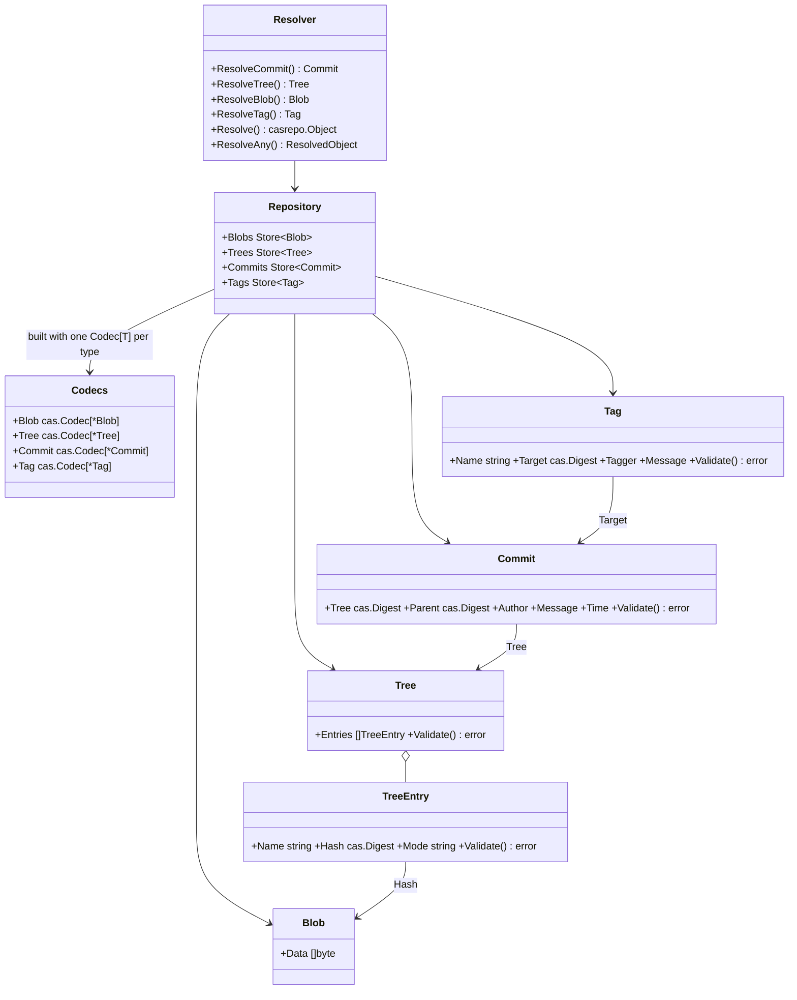

# gitlike — the shared reference object-model library

**Status: reference / copy-source.** 2nd-class reference library at the application layer
(library-design.md §1.1), outside the generic cas core and its stable surface (cas-core §7.1);
a breaking change may ride a MINOR with a changelog note. Importable at
github.com/dmundt/go-cask/gitlike, with **no supported-API guarantee**: a non-Git-style object
model means copying this pattern into your own package, not extending this library.

**What it demonstrates.** A Git-like `Blob`/`Tree`/`Commit`/`Tag` object model on the generic
cas core (`examples.md` §2.1, `cas-core` §4.12) — an **importable package**, not a runnable
program, and the pattern other examples and apps copy for typed layers on `Store[T]`.

## `cas` core parts used

| Component | Where |
|---|---|
| `Store[T]` + a caller-supplied `Codec[T]` per type | the four per-type stores |
| `Object[T]` (versioned `blob@1`…`tag@1`) | `types.go` |
| `cas.Digest` reference fields (rendered by the type's own `MarshalText`) | all references (tree entries, commit tree/parent, tag target) |
| `cas.Hasher` and `gitlike.Codecs` (both injected; the tests wire `sha256.New()` + `json.New[T]()`) | `NewRepository(backend, hasher, codecs)` → each per-type `cas.New` |
| `cas.Backend` | the shared backend under `Repository` |
| `Store.Get` (envelope type verification) | resolver reads |
| `cas.EnvelopeType` (bounded header read) | `Resolver.objectType` |
| `cas/repo.Walk` + the `cas/repo.Resolver` interface | `WalkGraph` (and `cas/repo.Reachable` over a gitlike repository) |
| `lru.Cache[T]` | `CachedRepository` |
| `CachedStore[T].PreloadRecursive` | `Preloader` |

## What it extends

- **Four `Object[T]` types** with the self-describing envelope (`types.go`). Reference fields
  are plain `cas.Digest`: zero value "absent"; `omitzero` drops an absent reference
  (`TreeEntry.Hash`, `Commit.Parent`); `Digest` renders one lowercase-hex string through
  `encoding.TextMarshaler` and validates as it decodes — so the package holds **no** codec code
  and imports no codec package; the caller passes the four codecs. One bare hex string per
  reference on the wire (the previous build wrote `"sha256:hexdigest"`) — see Migration.
- **`Validate() error`** on `TreeEntry`/`Tree`/`Commit`/`Tag`: a `TreeEntry` needs a name, a
  `Commit` a tree, a `Tag` a name; an absent digest is valid where absence is legal. The store
  enforces them on every `Put` and `Get` (`cas.Validator`) — a tree-less commit cannot be
  written and a stored one is `ErrCorrupt`, under any codec, which is why
  `Commit.MarshalJSON`/`UnmarshalJSON` are gone.
- **`Repository`** — per-type `Store[T]` over one `cas.Backend`, the caller's `cas.Hasher` and
  `gitlike.Codecs` (`NewRepository(backend, hasher, codecs)`); cross-type access without `any`;
  a wrong store is a compile-time error. It names neither algorithm nor wire format.
- **`Resolver` / `ResolvedObject` / `Resolve` / `ResolveAny`** — typed resolution: `Resolve`
  returns the concrete object as a `cas/repo.Object` (satisfying `cas/repo.Resolver`),
  `ResolveAny` the typed union, the four `Resolve*` methods the compile-time-typed reads.
- **`WalkGraph`** — delegated to `cas/repo.Walk`, so a gitlike repository and a
  `cas/repo.Registry` follow identical rules (at-most-once, explicit stack, context checked per
  node), and `cas/repo.Reachable` expands a gitlike root set without a second traversal.
- **`CachedRepository`, `Preloader`** — per-type LRU caches, background commit preloader;
  `Repository.Close`/`CachedRepository.Close` release the shared backend (packfs releases its
  active pack handle there; its index is persisted per `Put`).
- **`cas` untouched** — the canonical *consumer* pattern.

## Codec-agnostic by construction

No file here outside `_test.go` imports a codec package and `go list -deps ./gitlike` contains
none (a CI gate fails the build if one appears). The four codecs are injected at the call site
(`NewRepository(backend, hasher, Codecs{...})`); `TestRepositoryWithAnotherCodec` runs the
whole model — typed reads, `ResolveAny`, `WalkGraph`, the tree invariant — over **gob**, with
no JSON involved.

The `_test.go` files do name a codec (the shipped JSON one), as a client does: a runnable test
must inject *some* codec, and the documented wire bytes are JSON — what the address pins in
`gitlike_test.go` assert. The `json:"…"` struct tags are hints for whichever codec honors them:
the wire field names, plus which references are optional (`omitzero` on
`TreeEntry.Hash`/`Commit.Parent`); a codec that ignores them (gob) still round-trips every
object. Frozen wire tag: `gitlike.TreeEntry.Hash` keeps `json:"hash,omitzero"` (a rename
re-addresses every tree); the Go field waits for the v2 rename.

## Code walkthrough

- `types.go` — `Blob` (leaf), `Tree`/`TreeEntry`, `Commit` (tree + optional parent), `Tag`
  (target); `Type()` returns the versioned names so object majors coexist; `Validate()` carries
  the per-type rules, enforced by the store on `Put`/`Get` (`cas.Validator`), not by a codec.
  `bareType` maps a versioned name to the union's bare name (`"blob@1"` → `"blob"`).
- `repo.go` — `Repository` wires the four stores over one backend, the caller's hasher and
  `Codecs` (one `Codec[T]` per type); `Resolver.Resolve` reads the envelope type via
  `cas.EnvelopeType` on a bounded prefix and dispatches to the typed `Resolve*`; `ResolveAny`
  maps onto the `ResolvedObject` union; `PrintObject` renders via a type switch (no reflection);
  `WalkGraph` delegates to `cas/repo.Walk`.
- `cached.go` — `CachedRepository` (per-type `lru.Cache` + convenience getters), `Preloader`
  (worker pool over `Commits.PreloadRecursive`).
- `gitlike_test.go` — round-trips, references, `ResolveAny` per type, legacy unversioned
  envelopes, `WalkGraph`, cached repository, preloader.


```mermaid
classDiagram
    class Repository {
        +Blobs Store~Blob~
        +Trees Store~Tree~
        +Commits Store~Commit~
        +Tags Store~Tag~
    }
    class Codecs {
        +Blob cas.Codec[*Blob]
        +Tree cas.Codec[*Tree]
        +Commit cas.Codec[*Commit]
        +Tag cas.Codec[*Tag]
    }
    class Resolver {
        +ResolveCommit() Commit
        +ResolveTree() Tree
        +ResolveBlob() Blob
        +ResolveTag() Tag
        +Resolve() casrepo.Object
        +ResolveAny() ResolvedObject
    }
    class Blob { +Data []byte }
    class Tree { +Entries []TreeEntry +Validate() error }
    class TreeEntry { +Name string +Hash cas.Digest +Mode string +Validate() error }
    class Commit { +Tree cas.Digest +Parent cas.Digest +Author +Message +Time +Validate() error }
    class Tag { +Name string +Target cas.Digest +Tagger +Message +Validate() error }
    Repository --> Blob
    Repository --> Tree
    Repository --> Commit
    Repository --> Tag
    Repository --> Codecs : built with one Codec[T] per type
    Resolver --> Repository
    Tree o-- TreeEntry
    TreeEntry --> Blob : Hash
    Commit --> Tree : Tree
    Tag --> Commit : Target
```

## Migration: previously stored objects do not decode

Type names stay `@1` (`blob@1` … `tag@1`) although a reference payload changed from
`"sha256:hexdigest"` to bare hex. `cas.Digest.UnmarshalText` is strict — it rejects the legacy
`sha256:` prefix rather than reinterpreting it — so an object stored by the previous build
fails to decode with `cas.ErrCorrupt` (surfaced by `Store.Get`) instead of resolving to a
different address. A deliberate loud break: **no** migration tool, **no** `@2` type. Keep the
previous build to decode those objects, re-create the values with the current build, and treat
the old store as read-only until then (`operations.md` §5).

## How to run

```text
go test ./gitlike/...
```

A library, with no standalone program. Apps import `github.com/dmundt/go-cask/gitlike` and
layer their own types the same way.

## Usage tour

The whole model in one program: blob → tree → commit → tag on the filesystem backend, read back
through the `Resolver` and the per-type caches, then walked. `gitlike` names neither the
algorithm nor the wire format: the client supplies the `sha256` hasher and one JSON codec per
type.

```go
package main

import (
    "context"
    "fmt"
    "time"

    "github.com/dmundt/go-cask/cas/backend/fs"
    jsoncodec "github.com/dmundt/go-cask/cas/codec/json"
    sha256 "github.com/dmundt/go-cask/cas/hash/sha256"
    "github.com/dmundt/go-cask/gitlike"
)

func main() {
    ctx := context.Background()

    // 1. Filesystem backend + git-like example repository on top. gitlike names
    //    neither the algorithm nor the wire format, so the client supplies both:
    //    the sha256 hasher and one JSON codec per object type.
    backend, _ := fs.New("./repo")
    repo := gitlike.NewRepository(backend, sha256.New(), gitlike.Codecs{
        Blob:   jsoncodec.New[*gitlike.Blob](),
        Tree:   jsoncodec.New[*gitlike.Tree](),
        Commit: jsoncodec.New[*gitlike.Commit](),
        Tag:    jsoncodec.New[*gitlike.Tag](),
    })
    resolver := gitlike.NewResolver(repo)

    // 2. Build a Git-like object graph: blob → tree → commit → tag.
    //    A reference field is a plain cas.Digest: the zero value is "absent",
    //    it renders itself as one hex string, and a field tagged omitzero is
    //    left out of the encoding when absent.
    blobHash, _ := repo.Blobs.Put(ctx, &gitlike.Blob{Data: []byte("Hello, World!")})
    treeHash, _ := repo.Trees.Put(ctx, &gitlike.Tree{Entries: []gitlike.TreeEntry{
        {Name: "hello.txt", Hash: blobHash, Mode: "file"},
    }})
    commitHash, _ := repo.Commits.Put(ctx, &gitlike.Commit{
        Tree: treeHash, Author: "Alice",
        Message: "Initial commit", Time: time.Now(),
    })
    tagHash, _ := repo.Tags.Put(ctx, &gitlike.Tag{Name: "v1.0", Target: commitHash, Tagger: "Bob", Message: "Release"})

    // 3. Type-safe reads — no casts, no any: the fields ARE the addresses
    //    (IsZero reports an absent one). Each step uses the resolver method
    //    matching the digest's stored type: resolving a TAG digest through
    //    ResolveCommit fails (stored type "tag@1" != "commit@1"), so walk the
    //    chain — tag -> Target -> Tree -> entry Hash.
    tag, _ := resolver.ResolveTag(ctx, tagHash)
    commit, _ := resolver.ResolveCommit(ctx, tag.Target)
    tree, _ := resolver.ResolveTree(ctx, commit.Tree)
    blob, _ := resolver.ResolveBlob(ctx, tree.Entries[0].Hash)
    fmt.Println(string(blob.Data)) // "Hello, World!"

    // 4. Cached access (gitlike per-type LRU caches over the repository).
    cachedRepo, _ := gitlike.NewCachedRepository(repo, 1000)
    cachedCommit, _ := cachedRepo.GetCommit(ctx, commitHash)
    fmt.Println("message:", cachedCommit.Message)

    // 5. Traverse the whole graph.
    _ = gitlike.WalkGraph(ctx, resolver, tagHash, func(o *gitlike.ResolvedObject) error {
        fmt.Println("visited:", o.Type)
        return nil
    })
}
```

For tests and ephemeral use, swap the backend — everything above works unchanged:

```go
import backmem "github.com/dmundt/go-cask/cas/backend/mem" // package memory, aliased per cas/AGENT.md

backend := backmem.New() // in-memory: fast, deterministic, not persistent
```
