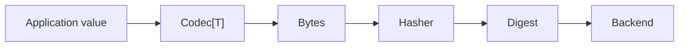

# Architecture

go-cask is intentionally layered. That separation keeps the core storage model generic while letting application code define its own object semantics.

## Core layers

1. `cas` — the generic, app-agnostic storage core
2. backends — raw byte stores such as filesystem and memory backends
3. codec layer — JSON, CBOR, MsgPack, or custom encodings
4. typed application layer — domain objects, `Store[T]`, and validation rules
5. examples and helpers — runnable examples, recipes, and extension patterns

## Design principles

The content digest defines identity. Data integrity is handled with a caller-supplied hash strategy, while the backend remains a raw `Digest -> bytes` storage layer.

This split keeps the core simple:

- hashing belongs to the client
- serialization belongs to the codec
- storage belongs to the backend
- validation stays explicit and opt-in

## Typical data flow

This makes the flow explicit: the caller chooses the hash strategy, the codec determines serialization, and the backend stores the bytes.

## Reference model

The `gitlike` package provides a reusable pattern for building typed graphs such as blobs, trees, commits, and tags without contaminating the generic `cas` core.

That is the project’s default pattern for teaching and reusing object-model semantics without forcing those decisions into the storage library itself.
