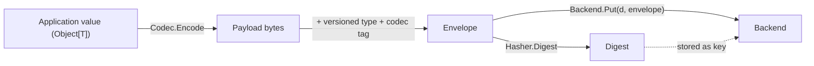

# Architecture

go-cask is deliberately layered: a small, non-generic byte layer at the
bottom, a generic typed layer on top of it, and application-defined object
models on top of that. The separation keeps the storage core stable while
letting every application define its own types.

## Layers

1. **Byte layer (non-generic)** — `Digest` (raw digest bytes, rendered as
   lowercase hex) and `Backend` (`Put`/`Get`/`Exists`/`Delete`/`List`/`Stats`).
   Backends know nothing about codecs, object types, or hash algorithms.
2. **Backends** — `cas/backend/fs` (filesystem, Git-like fan-out directories,
   atomic writes), `cas/backend/mem` (in-memory, for tests), and the opt-in
   `cas/backend/packfs` (the loose tree mirrored into append-only pack files
   for batched reads) ship today; any type that satisfies `Backend` works.
3. **Typed layer (generic)** — `Object[T]` (a versioned type name plus
   `References() []Digest`), `Codec[T]` (`Encode`/`Decode`), `Store[T]`
   (`Put`/`PutDedup`/`Get`/`GetRaw`/`Exists`/`Delete`), and `Walker[T]` for
   graph traversal. `Validator` is an optional `Validate() error` the store
   calls on `Put` and `Get`.
4. **Codecs** — JSON, gob, a compact binary codec, and a CBOR family under
   `cas/codec/*`; `gzip`, `zlib`, and `flate` wrap an inner codec as a
   compression layer.
5. **Application layer** — your own `Object[T]` types, or the `gitlike`
   reference model (`Blob`/`Tree`/`Commit`/`Tag`) that ships as a separate,
   copyable package.

## Design principles

- **The client owns the hash algorithm.** A `Digest` is just bytes; the core
  implements no algorithm. A `Store[T]` is built with a caller-supplied
  `Hasher` (`cas/hash/sha256` is the default; `sha512` and `sha512_256` also
  ship).
- **The codec owns serialization.** `Store.Put` encodes with the configured
  `Codec[T]`, wraps the result in a small self-describing envelope, then
  hashes and stores the envelope bytes.
- **The backend owns storage.** It stores and returns bytes for a digest; it
  never recomputes or checks the digest itself.
- **Verification is explicit and separate.** `cas.Verify` /
  `cas.NewVerifier` re-read an object and recompute its digest with the
  caller's `Hasher`, reporting `ErrDigestMismatch` on corruption. Nothing
  verifies automatically on every read.

## Object envelope

`Store.Put` does not write the codec payload alone. It wraps the payload in a
small TLV envelope so a stored object is self-describing:

```text
version            u8
codec length       uvarint
codec tag          bytes
type length        uvarint
type name          bytes
payload length     uvarint
payload            bytes
```

The type name is versioned (`"note@1"`, `"commit@1"`), the codec tag records
the format that produced the payload (`json`, `gzip+json`), and the digest
covers the whole envelope — so a type, version or codec change produces a
different digest. `Store.Get` reports `ErrCodecMismatch` when the stored tag
and its own codec's tag disagree, and refuses to hand back a value whose
decoded type does not match the stored one.

## Canonical data flow



Reading reverses this: `Backend.Get` returns the envelope bytes,
`Store.Get` decodes the type and payload, and the `Codec[T]` decodes the
payload back into `T`. `cas.Verify` re-reads the envelope and recomputes the
digest independently of this path.

## Reference model: `gitlike`

The `gitlike` package is a separate, reusable reference implementation of a
Git-like object graph (`Blob`, `Tree`, `Commit`, `Tag`) built entirely on
`Store[T]`. It is not part of the generic core: it exists so applications that
want a similar graph shape have a template to copy or import, without pulling
that object model into `cas` itself.
