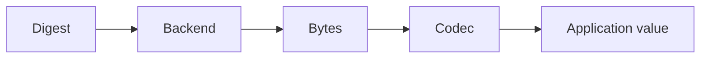

# Backends

A backend is the storage engine for raw bytes. It owns persistence and retrieval, but not object semantics.

## Common backends

- filesystem backend — durable and straightforward for local storage
- in-memory backend — fast, test-friendly, and easy to reason about
- custom backends — any storage engine that satisfies the byte contract

## Responsibilities

A backend should support:

- storing bytes under a digest
- retrieving bytes by digest
- checking whether an object exists
- listing stored digests
- reporting simple storage stats
- deleting objects when needed

## Design goal

The backend is intentionally small. It does not need to know about JSON, codec wrappers, or application invariants. That separation keeps the core library flexible and easy to extend.

