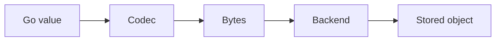

# Codecs

A codec defines how a Go value becomes bytes and back again.

## Typical usage

- JSON for readability and portability
- CBOR or MsgPack for compact binary representations
- custom formats for domain-specific payloads
- wrapper codecs for compression or encryption

## Why codecs are separate

The storage layer stores bytes. The application decides how to represent a domain object in those bytes. That keeps the storage core generic and leaves the object model in the hands of the caller.

## Flow



```text
Go value -> Encode() -> bytes -> backend
bytes -> Decode() -> Go value
```

The repository ships a few standard codec choices and keeps the interface lean enough for custom implementations without changing the storage contract.
