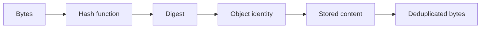

# Content addressing

Content-addressable storage means the value of the bytes determines the key.

```text
content -> hash -> digest -> object identity
```

A store can therefore answer questions like:

- is this object already present?
- what is the canonical byte sequence for this value?
- can I deduplicate data automatically?

## Why it is useful

- identical payloads deduplicate naturally
- data is immutable by default
- object identity is stable across copies
- the data model stays simple and auditable

## The model in one diagram



## In CASK

The core stores bytes behind a digest. The object identity is not a database row or filename; it is the content-derived key. The application can then layer typed JSON, binary, or custom representations on top without altering the storage model itself.

This is the same conceptual model behind Git object storage and similar CAS systems: the object is identified by its content, not by a mutable pointer.
