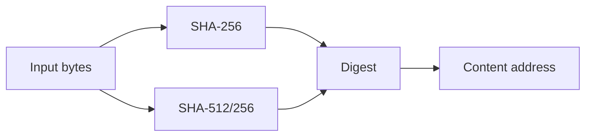

# Hashes

Hashes are the mechanism that turns bytes into an object ID.

## Practical choices

The project intentionally keeps the core hash-agnostic and lets the caller choose the algorithm. The default client choice in the repository is SHA-256.

Common choices include:

- `SHA-256` — default, widely used, strong and stable
- `SHA-512/256` — good balance for secure, fast content identity
- custom algorithms — supported by the pluggable `Hasher` seam

## Why the core does not hardcode one

The storage layer is a raw `Digest -> bytes` store. It does not need to care which algorithm produced the digest. This keeps the library reusable across different policies and migration paths.

## Integrity vs identity

A digest is identity. Verification is a separate concern. The project models that explicitly through `cas.Verify` and `cas.NewVerifier`, so validation can reuse the caller-supplied hasher without overwriting the address model.
