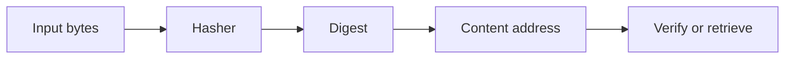

# Hashes

A hash is how bytes become a stable object identifier.

## Common choices

The project keeps the core hash-agnostic and lets the caller choose the algorithm. The repository defaults to SHA-256 for its own clients.

Common choices include:

- `SHA-256` — default, widely used, and easy to reason about
- `SHA-512/256` — a strong default for secure content identity
- custom algorithms — supported by the pluggable `Hasher` seam

## Why the core stays algorithm-agnostic

The storage layer is intentionally generic: it stores bytes under a digest and does not care which algorithm produced that digest. That keeps the library reusable and avoids baking one trust model into the core.

## Identity and verification

A digest answers, "What is this object?" Verification answers, "Does the content still match?" go-cask models these as adjacent but distinct concerns so the application can pick the right policy without mixing identity with validation.
