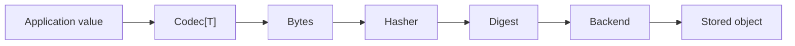

# Concepts

go-cask is a content-addressable storage library for Go. The central idea is simple: the digest of the bytes is the object's identity.

## Why the model matters

- identical content resolves to the same reference
- object identity stays stable even when names or paths change
- the byte layer stays independent from application types
- integrity checks are explicit and easy to validate

## The building blocks

- `Digest` — the content address
- `Hasher` — the algorithm used to derive a digest
- `Codec[T]` — serializes Go values to bytes and back
- `Backend` — the storage engine for bytes
- `Store[T]` — typed access on top of the storage layer

## Mental model

The model is intentionally thin: hash the bytes, keep the digest as identity, and let the application choose the codec and backend.
